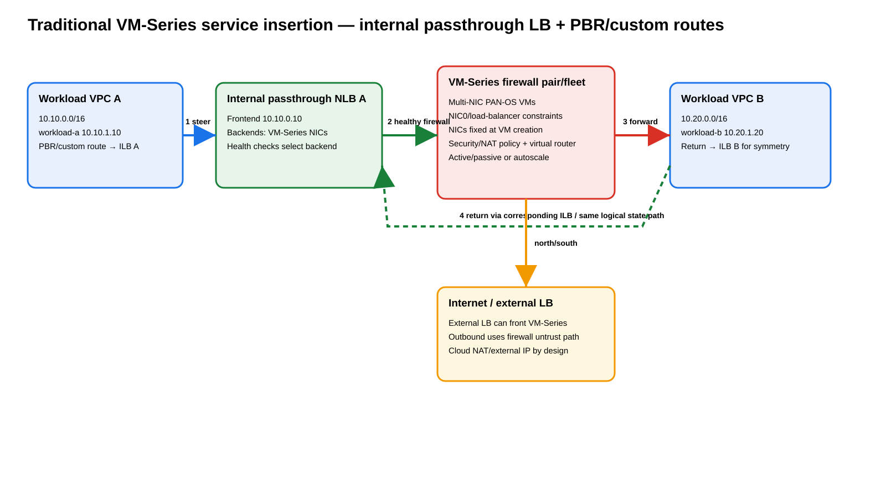

# Palo Alto Networks Firewalling in Google Cloud — Cloud NGFW Enterprise Integration vs VM-Series Service Insertion

## Purpose

This guide separates three concepts that are easy to conflate:

1. **Google Cloud NGFW Enterprise** — a Google-managed firewall service whose advanced threat prevention is powered by Palo Alto Networks technology.
2. **Palo Alto Networks VM-Series on Google Cloud** — PAN-OS firewalls that you deploy and operate as Compute Engine virtual machines.
3. **Google Cloud Network Security Integration (NSI) with VM-Series** — Google-managed packet interception that can transparently deliver selected packets to VM-Series over **GENEVE (Generic Network Virtualization Encapsulation)** without changing the consumer VPC's normal routes.

> **Important correction:** Palo Alto Networks currently documents its standalone managed **Cloud NGFW** product family for AWS and Azure. Do not model a separate product called “Palo Alto Cloud NGFW for Google Cloud.” In GCP, the Palo Alto paths are Google Cloud NGFW Enterprise using Palo Alto threat-prevention technology, or customer-deployed Palo Alto products such as VM-Series.

---

## Source URLs

### Palo Alto Networks
- https://docs.paloaltonetworks.com/ngfw
- https://docs.paloaltonetworks.com/vm-series
- https://docs.paloaltonetworks.com/vm-series/deployment/public-cloud/set-up-the-vm-series-firewall-on-google-cloud-platform/securing-vpc-with-vm-on-gcp
- https://docs.paloaltonetworks.com/vm-series/deployment/public-cloud/set-up-the-vm-series-firewall-on-google-cloud-platform/deployment-models-for-vm-series-on-gcp
- https://docs.paloaltonetworks.com/vm-series/deployment/public-cloud/set-up-the-vm-series-firewall-on-google-cloud-platform/configuring-gcp-load-balancer
- https://docs.paloaltonetworks.com/vm-series/deployment/public-cloud/set-up-the-vm-series-firewall-on-google-cloud-platform/google-cloud-network-security-integration-nsi-with-vm-series-firewall
- https://docs.paloaltonetworks.com/vm-series/deployment/public-cloud/set-up-the-vm-series-firewall-on-google-cloud-platform/deployment-models-for-vm-series-on-gcp/active-passive-model
- https://docs.paloaltonetworks.com/vm-series/getting-started/vm-series-on-google-performance-and-capacity/vm-series-on-google-cloud-platform-supported-gcp-instance-types

### Google Cloud
- https://cloud.google.com/security/products/firewall
- https://cloud.google.com/blog/products/identity-security/announcing-next-gen-firewall-enterprise-now-in-ga-next24
- https://docs.cloud.google.com/firewall/docs/about-intrusion-prevention
- https://docs.cloud.google.com/network-security-integration/docs/nsi-overview
- https://docs.cloud.google.com/network-security-integration/docs/understand-geneve
- https://docs.cloud.google.com/network-security-integration/docs/in-band/in-band-integration-tutorial
- https://docs.cloud.google.com/network-security-integration/docs/in-band/configure-intercept-deployments
- https://docs.cloud.google.com/network-security-integration/docs/in-band/configure-intercept-endpoint-groups
- https://docs.cloud.google.com/network-security-integration/docs/in-band/configure-endpoint-group-associations
- https://docs.cloud.google.com/network-security-integration/docs/in-band/configure-security-profiles
- https://docs.cloud.google.com/network-security-integration/docs/in-band/configure-security-profile-groups
- https://docs.cloud.google.com/network-security-integration/docs/in-band/configure-firewall-rules

---

# 1. Product boundary


[Editable draw.io](images/09-07-26-07-03_pan_gcp_product_boundary.drawio)

**What this image shows:** Google Cloud NGFW Enterprise, VM-Series, and NSI + VM-Series are related but distinct architectures.

**What matters:** Google owns the Cloud NGFW service; VM-Series is PAN-OS running on Compute Engine; NSI is the Google service-insertion fabric that can deliver traffic to VM-Series.

**What to verify:** Decide which control plane owns policy and where the firewall session state lives before designing routing.

## 1.1 Google Cloud NGFW Enterprise

**Source information:** Google describes Cloud NGFW as a distributed, stateful firewall embedded in the Google Cloud networking fabric. Its advanced intrusion-prevention capabilities are powered by Palo Alto Networks threat-prevention technology.

**Additional explanation:** This does not mean a PAN-OS VM is hidden in your project. You configure Google firewall policies, security profiles, firewall endpoints, and TLS inspection resources with Google APIs and IAM. Google operates the inspection data plane.

Use it when you want Google-managed lifecycle, native distributed L3/L4 enforcement, managed L7 threat prevention, and no customer-managed firewall fleet.

## 1.2 VM-Series on GCP

VM-Series is Palo Alto Networks' virtualized NGFW. It runs PAN-OS and exposes the familiar Palo Alto constructs: zones, virtual routers, Security policy, App-ID, NAT policy, logging, and licensed cloud-delivered security services. It can be centrally managed with Panorama and supported Strata management workflows.

Use VM-Series when you require PAN-OS policy semantics or operational consistency with Palo Alto firewalls elsewhere.

## 1.3 Correct product mapping

| Requirement | Correct design |
|---|---|
| Native Google distributed firewall with PAN threat prevention | Google Cloud NGFW Enterprise |
| PAN-OS firewall in GCP | VM-Series |
| Transparent interception into PAN-OS firewall VMs | VM-Series + NSI |
| Explicit routed service chain | VM-Series + internal passthrough NLB + PBR/custom routes |

---

# 2. VM-Series deployment models in GCP

Palo Alto documents multiple GCP architectures. Two are especially important for service insertion.

## 2.1 Modern model — VM-Series + Network Security Integration

NSI divides the design into a **producer** and a **consumer**.

The producer side contains the VM-Series inspection service: producer VPC, VM-Series instances, an internal passthrough Network Load Balancer (ILB), a global intercept deployment group, and one or more zonal intercept deployments that reference ILB forwarding rules.

The consumer side contains application workloads, an intercept endpoint group, endpoint-group association, custom-intercept security profile, security profile group, and a global network or hierarchical firewall policy rule using `apply_security_profile_group`.

## 2.2 Traditional model — internal passthrough LB + PBR/custom routes

Palo Alto's classic multi-interface architecture attaches VM-Series dataplane NICs to workload VPCs. Internal passthrough load balancers front the firewall interfaces, while custom routes or Policy-Based Routes (PBRs) steer traffic to the corresponding load balancer.

This is a true route-based service chain, so forward and return symmetry is your responsibility.

---

# 3. NSI architecture and packet flow


[Editable draw.io](images/09-07-26-07-03_pan_gcp_nsi_packet_flow.drawio)

**What this image shows:** A consumer firewall policy selects a flow and resolves it through a custom-intercept profile and endpoint group to a producer-side ILB and VM-Series service.

**What matters:** The consumer VPC's normal route does not point to the firewall. NSI is invoked by firewall-policy action, not by an ordinary route next hop.

**What to verify:** endpoint group association, security profile group reference, zonal intercept deployment state, ILB health, GENEVE enablement on VM-Series, and successful reinjection.

## 3.1 GENEVE packet model

NSI in-band interception encapsulates the original packet in GENEVE and adds Google-specific metadata. Conceptually:

```text
Outer inspection transport
+----------------------------------------------------------+
| Outer IP | UDP | GENEVE | Google metadata | Inner packet|
+----------------------------------------------------------+

Inner packet example:
10.10.1.10:51514 -> 10.10.2.20:443 TCP
```

The VM-Series inspects the inner packet, not merely the GENEVE outer transport.

## 3.2 Enable GENEVE inspection on VM-Series

Palo Alto documents:

```cli
request plugins vm_series geneve-inspect enable yes
```

A reboot is required when enabling this feature. Bootstrap can also include:

```text
geneve-inspect=enable
```

Verify VM interface mapping with:

```cli
debug show vm-series interfaces all
```

---

# 4. End-to-end NSI build with gcloud

Example objects:

| Item | Example |
|---|---|
| Producer project | `pan-sec-prod` |
| Consumer project | `app-prod-1` |
| Region / zone | `us-central1` / `us-central1-a` |
| Producer VPC | `pan-inspection-vpc` |
| Consumer VPC | `app-vpc` |
| Deployment group | `pan-idg` |
| Zonal deployment | `pan-id-uscentral1a` |
| Endpoint group | `pan-ieg` |
| Security profile | `pan-custom-intercept` |
| Security profile group | `pan-spg` |
| Firewall policy | `pan-nsi-policy` |

## 4.1 Enable APIs

```cli
gcloud services enable compute.googleapis.com networksecurity.googleapis.com --project=pan-sec-prod
gcloud services enable compute.googleapis.com networksecurity.googleapis.com --project=app-prod-1
```

## 4.2 Create producer VPC

```cli
gcloud compute networks create pan-inspection-vpc \
  --project=pan-sec-prod \
  --subnet-mode=custom

gcloud compute networks subnets create pan-inspection-uscentral1 \
  --project=pan-sec-prod \
  --network=pan-inspection-vpc \
  --region=us-central1 \
  --range=10.250.10.0/24
```

Deploy supported VM-Series instances, license them, and configure the needed PAN-OS interfaces, zones, virtual router, Security policy, and management before putting them behind the producer ILB.

## 4.3 Producer ILB skeleton

```cli
gcloud compute health-checks create tcp pan-nsi-hc \
  --project=pan-sec-prod \
  --region=us-central1 \
  --port=80

gcloud compute backend-services create pan-nsi-ilb-bs \
  --project=pan-sec-prod \
  --region=us-central1 \
  --load-balancing-scheme=INTERNAL \
  --protocol=UNSPECIFIED \
  --health-checks=pan-nsi-hc \
  --health-checks-region=us-central1
```

Add the VM-Series instance groups to the backend service and create the internal passthrough forwarding rule according to the current NSI producer-service requirements.

## 4.4 Create intercept deployment group

```cli
gcloud network-security intercept-deployment-groups create pan-idg \
  --project=pan-sec-prod \
  --location=global \
  --network=projects/pan-sec-prod/global/networks/pan-inspection-vpc \
  --no-async
```

Verify:

```cli
gcloud network-security intercept-deployment-groups describe pan-idg \
  --project=pan-sec-prod \
  --location=global
```

**Success criteria:** the deployment group reaches an active/ready state and references the intended producer VPC.

## 4.5 Create zonal intercept deployment

Assume the producer ILB forwarding rule is `pan-nsi-ilb-fr`.

```cli
gcloud network-security intercept-deployments create pan-id-uscentral1a \
  --project=pan-sec-prod \
  --location=us-central1-a \
  --forwarding-rule=pan-nsi-ilb-fr \
  --forwarding-rule-location=us-central1 \
  --intercept-deployment-group=projects/pan-sec-prod/locations/global/interceptDeploymentGroups/pan-idg \
  --no-async
```

Verify:

```cli
gcloud network-security intercept-deployments describe pan-id-uscentral1a \
  --project=pan-sec-prod \
  --location=us-central1-a
```

**Important fields:** deployment group, forwarding rule, location, and state.

## 4.6 Create consumer endpoint group

```cli
gcloud network-security intercept-endpoint-groups create pan-ieg \
  --project=app-prod-1 \
  --location=global \
  --intercept-deployment-group=projects/pan-sec-prod/locations/global/interceptDeploymentGroups/pan-idg \
  --no-async
```

The consumer identity also needs the appropriate Intercept Deployment User permission on the producer-side deployment group/project.

## 4.7 Associate endpoint group with consumer VPC

```cli
gcloud network-security intercept-endpoint-group-associations create pan-ieg-app-vpc \
  --project=app-prod-1 \
  --location=global \
  --intercept-endpoint-group=projects/app-prod-1/locations/global/interceptEndpointGroups/pan-ieg \
  --network=app-vpc \
  --no-async
```

Verify:

```cli
gcloud network-security intercept-endpoint-groups describe pan-ieg \
  --project=app-prod-1 \
  --location=global
```

## 4.8 Create custom-intercept security profile

```cli
gcloud network-security security-profiles custom-intercept create pan-custom-intercept \
  --organization=ORG_ID \
  --location=global \
  --billing-project=app-prod-1 \
  --intercept-endpoint-group=projects/app-prod-1/locations/global/interceptEndpointGroups/pan-ieg \
  --no-async
```

## 4.9 Create security profile group

```cli
gcloud network-security security-profile-groups create pan-spg \
  --organization=ORG_ID \
  --location=global \
  --custom-intercept-profile=pan-custom-intercept \
  --billing-project=app-prod-1 \
  --no-async
```

## 4.10 Create global network firewall policy

```cli
gcloud compute network-firewall-policies create pan-nsi-policy \
  --project=app-prod-1
```

## 4.11 Create interception rule

Example ingress inspection of TCP/443 sourced from `10.10.1.0/24`:

```cli
gcloud compute network-firewall-policies rules create 1000 \
  --project=app-prod-1 \
  --firewall-policy=pan-nsi-policy \
  --action=APPLY_SECURITY_PROFILE_GROUP \
  --security-profile-group=organizations/ORG_ID/locations/global/securityProfileGroups/pan-spg \
  --direction=INGRESS \
  --layer4-configs=tcp:443 \
  --src-ip-ranges=10.10.1.0/24 \
  --global-firewall-policy \
  --enable-logging
```

For egress rules, use destination matching instead of ingress source matching.

`apply_security_profile_group` is terminal for the matching rule. The selected inspection service decides whether the packet is reinjected or dropped.

## 4.12 Associate firewall policy with VPC

Associate the global network firewall policy with `app-vpc`, then verify:

```cli
gcloud compute network-firewall-policies associations list \
  --project=app-prod-1 \
  --firewall-policy=pan-nsi-policy
```

---

# 5. East-west packet flow

Example:

```text
Client: 10.10.1.10:51514
Server: 10.10.2.20:443
```

1. The client sends a SYN using the ordinary consumer VPC route.
2. The VPC firewall policy evaluates the new connection.
3. The matching rule invokes `APPLY_SECURITY_PROFILE_GROUP`.
4. The security profile group resolves to the custom-intercept profile.
5. The profile resolves to `pan-ieg`.
6. The endpoint group maps to producer deployment group `pan-idg`.
7. NSI selects the zonal intercept deployment.
8. The intercept deployment references the producer ILB forwarding rule.
9. The ILB chooses a healthy VM-Series backend.
10. GENEVE carries the original packet and metadata to VM-Series.
11. PAN-OS evaluates zones, Security policy, App-ID/content inspection, and enabled security subscriptions.
12. A deny verdict drops the packet; an allow verdict reinjects it.
13. Google resumes the original consumer-network delivery toward `10.10.2.20`.

The return direction follows the NSI inspection/state model; do not add a consumer route to a firewall IP merely to force symmetry.

---

# 6. Internet egress packet flow

Example VM `10.10.1.10` to `198.51.100.25:443`:

1. The VM emits the connection.
2. Consumer firewall policy selects the flow for NSI.
3. NSI carries the original packet to VM-Series.
4. PAN-OS allows or drops it.
5. Allowed traffic is reinjected.
6. The consumer VPC's original Internet route remains authoritative.
7. If Cloud NAT is configured, SNAT occurs in the Cloud NAT path rather than because NSI itself turned VM-Series into a two-arm routed gateway.

**Design point:** inspection and Internet NAT are separate decisions in this model.

---

# 7. Traditional ILB + PBR architecture



[Editable draw.io](images/09-07-26-07-03_pan_gcp_traditional_ilb_pbr.drawio)

**What this image shows:** Workload VPCs explicitly steer traffic to internal passthrough load balancers backed by multi-NIC VM-Series firewalls.

**What matters:** Unlike NSI, this design depends on PBR/custom routes. The firewall is an actual L3 forwarding hop, so forward and return symmetry are your responsibility.

**What to verify:** PBR/custom-route matching, ILB health, firewall virtual-router routes, PAN-OS zones/NAT policy, return steering, and load-balancer session stickiness.

For VPC A to VPC B, conceptually:

```text
10.10.1.10 -> ILB-A -> VM-Series -> 10.20.1.20
10.20.1.20 -> ILB-B -> same logical firewall path -> 10.10.1.10
```

If VPC B returns directly and bypasses the state owner, the session can fail.

---

# 8. Inbound Internet and interface constraints

Palo Alto documents that Google Cloud external load balancers deliver traffic to a VM's primary interface. VM-Series designs therefore commonly require careful NIC ordering and, in some load-balanced architectures, a management-interface swap.

Palo Alto documents:

```cli
set system setting mgmt-interface-swap enable yes
request restart system
```

Verify after reboot:

```cli
debug show vm-series interfaces all
```

Do not enable the swap on a one-interface firewall; Palo Alto warns this can cause maintenance-mode behavior.

---

# 9. HA and scaling

## Active/passive

Palo Alto's GCP active/passive model uses load balancers and health checks so only the active firewall receives production dataplane traffic. The pair synchronizes configuration/state and is intended to preserve sessions during failover.

Use it when session continuity and deterministic HA matter more than horizontal scale.

## Autoscale

Autoscaling VM-Series is appropriate when inspection throughput changes materially and a horizontally scalable firewall fleet is preferred. Panorama-driven templates and lifecycle automation are commonly used.

## NSI zonal coverage

An intercept deployment is **zonal**. Build the producer service in every required zone and confirm the backing ILB has healthy inspection capacity in those zones.

---

# 10. NAT behavior

## NSI

NSI is primarily an interception/reinjection framework:

- PAN-OS SNAT is not automatically required for Internet egress.
- Cloud NAT can remain the translation point.
- Avoid source translation unless the chosen Palo Alto/NSI design explicitly requires it.
- Preserve the original tuple when policy/logging depends on it.

## Traditional routed VM-Series

A classic route-based VM-Series deployment can perform normal PAN-OS source NAT and destination NAT because the firewall is a real forwarding hop.

---

# 11. Verification

## NSI control plane

```cli
gcloud network-security intercept-deployment-groups list \
  --project=pan-sec-prod \
  --location=global

gcloud network-security intercept-deployments list \
  --project=pan-sec-prod \
  --location=-

gcloud network-security intercept-endpoint-groups list \
  --project=app-prod-1 \
  --location=global
```

**Success criteria:** all required objects exist and are active/ready.

## Producer ILB health

```cli
gcloud compute backend-services get-health pan-nsi-ilb-bs \
  --project=pan-sec-prod \
  --region=us-central1
```

**Success criteria:** intended VM-Series backends are healthy.

**Failure means:** NSI can resolve the deployment while the producer data plane still has no valid inspection backend.

## Consumer firewall policy

```cli
gcloud compute network-firewall-policies rules list \
  --project=app-prod-1 \
  --firewall-policy=pan-nsi-policy \
  --global-firewall-policy
```

Verify priority, direction, source/destination match, Layer-4 match, action, profile-group reference, and enabled state.

## VM-Series

Useful PAN-OS checks include:

```cli
show session all filter source 10.10.1.10 destination 10.10.2.20
show counter global filter severity drop delta yes
show routing route
show interface all
```

Also inspect **Monitor > Traffic**, **Monitor > Threat**, plugin state, and HA state.

Exact output varies by PAN-OS/plugin release, so success should be judged by the expected inner source/destination/application and the intended policy verdict rather than by fabricated sample output.

---

# 12. Troubleshooting by symptom

## Policy matches but no traffic appears on VM-Series

**Where:** consumer firewall policy and NSI resource chain.

**Check:** rule → security profile group → custom-intercept profile → endpoint group → deployment group → zonal deployment.

**Failure means:** a reference, permission, association, or zonal deployment is missing.

## Deployment is active but packets do not pass

**Where:** producer ILB and VM-Series.

**Command:**

```cli
gcloud compute backend-services get-health pan-nsi-ilb-bs \
  --region=us-central1 \
  --project=pan-sec-prod
```

**Failure means:** health check, VM-Series interface mapping, HA state, or backend registration is incorrect.

## VM-Series sees GENEVE but not inner sessions

**Where:** VM-Series plugin/inspection mode.

**Check:** GENEVE inspection is enabled and the required reboot occurred.

```cli
request plugins vm_series geneve-inspect enable yes
```

## Traditional ILB/PBR design has one-way sessions

**Where:** PBR/custom routes, PAN-OS routing, reverse path.

**Failure means:** reverse traffic bypasses the firewall or a different state owner receives it.

**Next action:** fix reverse steering and validate load-balancer stickiness/health.

---

# 13. Common mistakes

1. Calling Google Cloud NGFW Enterprise a Palo Alto-managed firewall.
2. Assuming a standalone product named “Palo Alto Cloud NGFW for Google Cloud” exists because Palo Alto has Cloud NGFW for AWS/Azure.
3. Adding a route next hop to VM-Series in an NSI consumer VPC; NSI is firewall-policy driven.
4. Forgetting GENEVE inspection enablement on VM-Series.
5. Associating the producer VPC itself as the consumer endpoint-group network.
6. Ignoring zonal intercept-deployment coverage.
7. Treating an unhealthy ILB backend as a firewall-policy problem.
8. Assuming PAN-OS NAT is mandatory in NSI.
9. Ignoring GCP primary-interface/load-balancer constraints.
10. Expecting route symmetry to be automatic in traditional ILB/PBR designs.

---

# 14. Design decision matrix

| Requirement | Google Cloud NGFW Enterprise | VM-Series + NSI | VM-Series + ILB/PBR |
|---|---:|---:|---:|
| Google-managed firewall lifecycle | Yes | No | No |
| PAN-OS policy | No | Yes | Yes |
| App-ID / PAN-OS subscriptions | No PAN-OS control plane | Yes | Yes |
| No route changes for service insertion | Yes | Yes | No |
| Explicit firewall L3 hop | No | No; intercept/reinject | Yes |
| Google firewall policy selects inspection | Yes | Yes | Optional/No |
| GENEVE inspection | Google-managed internal path | Yes, NSI to VM-Series | Not required |
| Customer controls firewall VMs | No | Yes | Yes |
| Traditional NAT on firewall | Not PAN-OS NAT | Only if architecture explicitly requires it | Yes |
| Best fit | Native GCP security | PAN-OS with transparent insertion | Explicit routed service chain |

---

# Sources

- https://docs.paloaltonetworks.com/vm-series
- https://docs.paloaltonetworks.com/vm-series/deployment/public-cloud/set-up-the-vm-series-firewall-on-google-cloud-platform/securing-vpc-with-vm-on-gcp
- https://docs.paloaltonetworks.com/vm-series/deployment/public-cloud/set-up-the-vm-series-firewall-on-google-cloud-platform/deployment-models-for-vm-series-on-gcp
- https://docs.paloaltonetworks.com/vm-series/deployment/public-cloud/set-up-the-vm-series-firewall-on-google-cloud-platform/google-cloud-network-security-integration-nsi-with-vm-series-firewall
- https://docs.paloaltonetworks.com/vm-series/deployment/public-cloud/set-up-the-vm-series-firewall-on-google-cloud-platform/configuring-gcp-load-balancer
- https://cloud.google.com/security/products/firewall
- https://cloud.google.com/blog/products/identity-security/announcing-next-gen-firewall-enterprise-now-in-ga-next24
- https://docs.cloud.google.com/network-security-integration/docs/nsi-overview
- https://docs.cloud.google.com/network-security-integration/docs/understand-geneve
- https://docs.cloud.google.com/network-security-integration/docs/in-band/in-band-integration-tutorial
- https://docs.cloud.google.com/network-security-integration/docs/in-band/configure-firewall-rules
