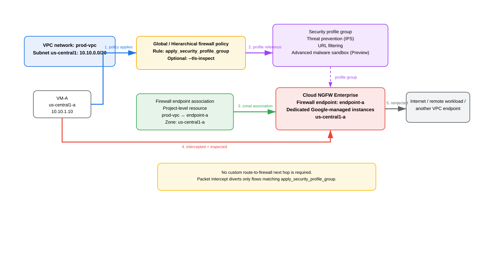
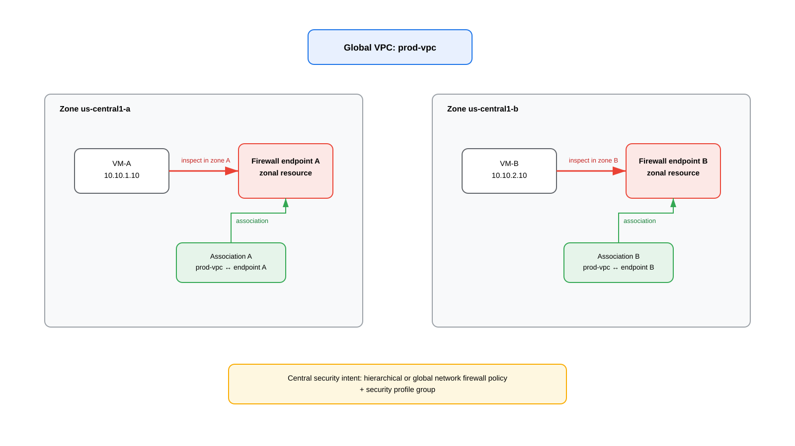
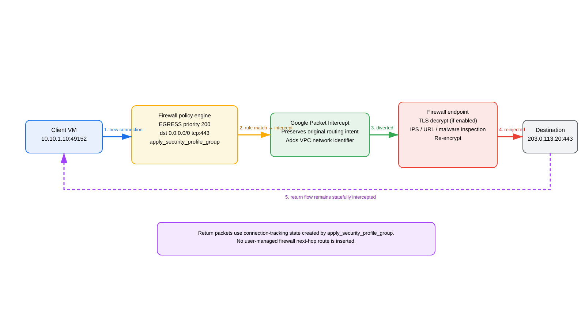

# Google Cloud NGFW Enterprise Firewall Endpoints — Deep Dive

## Scope

This guide focuses specifically on **Cloud Next Generation Firewall (Cloud NGFW) Enterprise firewall endpoints**: what an endpoint is, how endpoint associations work, how traffic is intercepted without a customer-managed firewall next-hop route, how security profile groups and firewall-policy rules select traffic for Layer 7 inspection, how TLS inspection changes the flow, how to deploy organization-level and project-level endpoints, how multi-zone coverage works, how URL filtering is customized, and how to verify and troubleshoot the service.

The guide intentionally separates firewall endpoints from other GCP service-insertion mechanisms such as Policy-Based Routes (PBR), internal passthrough Network Load Balancers in front of third-party appliances, Network Security Integration intercept endpoint groups, and Network Connectivity Center router appliances.

## Source URLs

Primary Google Cloud documentation used for this guide:

- https://docs.cloud.google.com/firewall/docs/about-firewall-endpoints
- https://docs.cloud.google.com/firewall/docs/configure-firewall-endpoints
- https://docs.cloud.google.com/firewall/docs/manage-firewall-endpoints
- https://docs.cloud.google.com/firewall/docs/about-app-layer-inspection
- https://docs.cloud.google.com/firewall/docs/configure-security-profiles
- https://docs.cloud.google.com/firewall/docs/about-threats
- https://docs.cloud.google.com/firewall/docs/about-intrusion-prevention
- https://docs.cloud.google.com/firewall/docs/configure-intrusion-prevention
- https://docs.cloud.google.com/firewall/docs/view-threats
- https://docs.cloud.google.com/firewall/docs/about-url-filtering
- https://docs.cloud.google.com/firewall/docs/configure-urlf-security-profiles
- https://docs.cloud.google.com/firewall/docs/tutorials/set-up-urlf-tutorial
- https://docs.cloud.google.com/firewall/docs/urlf_best_practices
- https://docs.cloud.google.com/firewall/docs/use-network-firewall-policies
- https://docs.cloud.google.com/firewall/docs/using-firewall-policies
- https://docs.cloud.google.com/firewall/docs/firewall-policies-rule-details
- https://docs.cloud.google.com/firewall/docs/firewall-policies-rule-eval-order
- https://docs.cloud.google.com/firewall/docs/about-tls-inspection
- https://docs.cloud.google.com/firewall/docs/setup-tls-inspection
- https://docs.cloud.google.com/firewall/docs/firewall-policy-rules-log-examples
- https://docs.cloud.google.com/firewall/docs/quotas
- https://docs.cloud.google.com/firewall/docs/release-notes

Useful Palo Alto Networks material about the jointly engineered service:

- https://www.paloaltonetworks.com/resources/techbriefs/achieving-simplicity-scale-and-security-with-google-cloud-ngfw-enterprise
- https://www.paloaltonetworks.com/blog/2024/04/google-cloud-ngfw-enterprise/
- https://www.paloaltonetworks.com/partners/nextwave-for-csp/google-cloud-and-palo-alto-networks

---

## 1. Executive mental model

A **firewall endpoint** is a **zonal Cloud NGFW Enterprise resource** that supplies advanced Layer 7 inspection. Google currently documents endpoint-backed capabilities including:

- intrusion detection and prevention service (IPS/IDPS);
- URL filtering;
- Advanced malware sandbox / WildFire, currently documented as Preview;
- optional Transport Layer Security (TLS) interception/decryption so encrypted application traffic can be inspected.

The most important architectural point is that the endpoint is **not a next hop that you place into a VPC route table**.

Cloud NGFW uses **Google Packet Intercept** to insert the endpoint into selected flows. The existing routing policy remains intact. A flow is diverted only when all of the required conditions are satisfied, especially:

1. the workload VPC is associated with a firewall endpoint in the workload's zone;
2. the traffic matches a supported hierarchical or global network firewall-policy rule whose action is `apply_security_profile_group`;
3. the referenced security profile group is valid for the endpoint scope;
4. if TLS inspection is requested, the endpoint association has the required TLS inspection policy and Certificate Authority Service configuration.

This is very different from a third-party NVA pattern in which a route points to an internal load balancer or appliance NIC.

### Source information

Google states that Packet Intercept inserts network appliances into selected traffic **without modifying the existing routing policies**. Google also states that `apply_security_profile_group` intercepts a new connection, sends it to the firewall endpoint, and creates connection-tracking state so both directions of the connection are intercepted.

Palo Alto Networks describes Cloud NGFW Enterprise as a **managed firewall service** from Google that is powered by Palo Alto Networks security technology. That does not mean customers receive hidden VM-Series/PAN-OS appliances that can be enrolled into Panorama.

### Additional explanation

Think of the endpoint as an **inspection attachment to Google's distributed VPC forwarding plane**, not as a customer-visible router hop. Your route still answers the question “where should this packet ultimately go?” The firewall policy answers the separate question “must this connection be inspected before it proceeds?”

### 1.1 Is this a Palo Alto firewall that you can manage with Panorama?

No. The most accurate mental model is:

> **Palo Alto Networks security technology is used in the managed inspection service, but the service is not exposed to you as a PAN-OS appliance.**

You do not receive or manage:

- PAN-OS management interfaces;
- appliance serial numbers;
- Panorama device groups;
- Panorama templates or template stacks;
- PAN-OS zones or virtual routers;
- PAN-OS NAT rules;
- PAN-OS CLI access;
- direct access to the underlying Google-managed firewall instances.

Instead, you manage Cloud NGFW Enterprise by using Google Cloud resources such as firewall policies, security profiles, security profile groups, firewall endpoints, endpoint associations, TLS inspection policies, Certificate Authority Service resources, IAM, and Cloud Logging/Monitoring.

This distinction is important because Palo Alto Networks' own **Cloud NGFW for AWS** has a different management model and supports Panorama integration. Do not transfer that management assumption to Google Cloud NGFW Enterprise.

---

## 2. Architecture and object relationships



[Editable draw.io source](images/09-07-26-07-05_gcp_ngfw_enterprise_endpoint_architecture.drawio)

**What this image shows**

The diagram separates the VPC/workload, firewall policy, security profile group, endpoint association, and the zonal firewall endpoint. It also shows that Packet Intercept diverts only selected traffic and then reinjects approved traffic toward its original destination.

**What matters**

- The **firewall policy rule** selects the flow.
- The **security profile group** defines which advanced inspection profiles apply.
- The **endpoint association** maps a VPC network to an endpoint in a specific zone.
- The **firewall endpoint** provides the managed inspection capacity.
- No user-defined route to the firewall endpoint is required.

**What to verify**

- endpoint state is active;
- association state is active and enabled;
- workload and endpoint are in the same zone;
- firewall-policy rule matches the intended direction, IP ranges, protocol/ports, and target;
- rule action is `apply_security_profile_group`;
- the referenced security profile group is valid for the endpoint's scope;
- TLS inspection policy is attached to the endpoint association if the rule uses TLS inspection.

### 2.1 Core resources

| Resource | Scope | Purpose |
|---|---|---|
| Firewall endpoint | Zonal; organization-level or project-level ownership | Provides managed Layer 7 inspection capacity |
| Firewall endpoint association | Project-level, zonal | Connects a VPC network to a firewall endpoint in that zone |
| Security profile | Global | Defines threat prevention, URL filtering, or malware-analysis behavior |
| Security profile group | Global | Container that can hold one profile of each supported type |
| Hierarchical firewall policy | Organization/folder | Central rule framework that can use `apply_security_profile_group` |
| Global network firewall policy | VPC-associated | Network-level policy that can use `apply_security_profile_group` |
| TLS inspection policy | Regional | Tells the endpoint how to perform TLS interception; references CA resources/trust configuration |

### 2.2 Organization-level endpoint

Use an organization-level endpoint when a central network/security team owns the inspection infrastructure and wants one endpoint resource to be shared with VPC networks in the organization.

Important characteristics:

- the endpoint is created under the organization;
- a billing/quota project is supplied for the endpoint;
- it supports organization-level security profile groups;
- endpoint associations are still created as project-level resources in the projects that contain the VPC networks being inspected.

### 2.3 Project-level endpoint

Use a project-level endpoint when inspection ownership belongs to a project team or when organization-level permissions are not available.

Important characteristics:

- the endpoint belongs to a project;
- project-level endpoints can use project-level and organization-level security profile groups, subject to documented scope rules;
- project-level endpoints support customer-managed encryption keys (CMEK) for data at rest in the firewall infrastructure;
- a project-level endpoint can be associated with a VPC network in another project only when the projects are in the same organization.

### 2.4 Scope mismatch warning

For project-level endpoints, Google explicitly warns that the security profile group must be in the same project as the endpoint for the intended association. If interception occurs but the endpoint cannot use the referenced group because of a project mismatch, Cloud NGFW can apply a default profile instead of the intended profile.

This is a subtle but high-impact failure mode: **traffic can be intercepted while your intended inspection policy is not the one actually being used**.

---

## 3. Endpoint associations: the zonal attachment that actually enables inspection

A firewall endpoint by itself does not inspect a VPC. The VPC must have a **firewall endpoint association** in the relevant zone.

Google documents these association rules:

- the association must be in the same zone as the endpoint;
- workloads you intend to inspect must have an applicable endpoint association in their zone;
- a VPC can be associated with only **one firewall endpoint per zone**, counting both project-level and organization-level endpoints;
- a single endpoint can be associated with multiple VPC networks, subject to quota;
- one VPC can use different firewall endpoints in different zones;
- the association is created in the project where the inspected VPC/workload resides, even when it points to an organization-level endpoint.

Google currently documents up to **50 firewall endpoint associations per firewall endpoint** for both organization-level and project-level endpoints.

### 3.1 Why the association is zonal even though the VPC is global

A normal VPC network is global, but Compute Engine VM instances reside in zones. Cloud NGFW's endpoint data plane is zonal. Therefore, a multi-zone deployment needs an endpoint/association in every zone in which inspected workloads run.



[Editable draw.io source](images/09-07-26-07-05_gcp_ngfw_enterprise_multizone.drawio)

**What this image shows**

The same global VPC has workloads in `us-central1-a` and `us-central1-b`. Each zone has its own firewall endpoint and VPC association.

**What matters**

A global policy does not eliminate the zonal endpoint requirement. Policy intent can be centralized, but inspection capacity and endpoint attachment remain zonal.

**What to verify**

Inventory every zone that contains workloads covered by `apply_security_profile_group`. Confirm a firewall endpoint association exists in each of those zones.

### 3.2 Failure-domain implication

Google documents that creating the endpoint in the workload's zone reduces latency, avoids cross-zonal traffic, and improves reliability. If a workload runs in a zone with no endpoint association, Layer 7 inspection is not performed for that workload's traffic.

This makes endpoint-association coverage part of application availability and security posture management. Autoscaling a managed instance group into a new zone without first creating an endpoint association can create a security coverage gap.

---

## 4. How a connection is intercepted

The action that triggers advanced inspection is:

```text
apply_security_profile_group
```

Google documents this behavior for a matching new connection:

1. Cloud NGFW firewall policy evaluation finds the matching rule.
2. The `apply_security_profile_group` action stops further evaluation in that policy.
3. Cloud NGFW creates firewall connection-tracking state.
4. The packet is intercepted and sent to the endpoint or intercept endpoint group referenced through the security profile group.
5. For Cloud NGFW Enterprise, the zonal firewall endpoint performs the required inspection.
6. If allowed, traffic is reinjected into the VPC forwarding path and continues toward the original destination.
7. Connection tracking causes packets in both directions for that connection to remain subject to interception.



[Editable draw.io source](images/09-07-26-07-05_gcp_ngfw_enterprise_packet_flow.drawio)

**What this image shows**

An egress HTTPS connection from `10.10.1.10:49152` to `203.0.113.20:443` matches an egress policy rule, is diverted through Packet Intercept, inspected, and reinjected. The return direction follows the same connection-tracking context.

**What matters**

The destination does not become the firewall endpoint. The original destination remains the destination of the connection. Packet Intercept is an insertion mechanism, not a route rewrite performed by you.

**What to verify**

- firewall policy logging shows `INTERCEPTED` for the matching session;
- endpoint capacity is healthy;
- threat/URL logs appear when the corresponding profile produces events;
- the VPC's normal route toward the real destination is still valid.

---

## 5. Routing, RIB/FIB, and why there is no firewall next-hop route

This is the key distinction from NVA service insertion.

### Source information

Google says Packet Intercept inserts the inspection service **without modifying existing routing policies**.

### Additional explanation

There is no customer-visible route such as:

```text
0.0.0.0/0 -> firewall-endpoint-a
```

and there is no firewall endpoint IP address that you use as a VPC next hop.

The VPC route lookup still resolves the final forwarding path. Depending on the traffic, that can be:

- another VM/subnet path inside the VPC;
- VPC peering where applicable;
- a Cloud VPN or Cloud Interconnect dynamic route;
- an internet route through the normal Google Cloud internet path;
- another supported route type.

The firewall-policy decision is a separate enforcement step that can cause the selected connection to be intercepted before forwarding completes.

### 5.1 Cloud NAT interaction

**Source information:** firewall endpoints do not replace VPC routing and are selected by firewall policy rather than by a route next hop.

**Reasonable inference:** when an inspected VM uses Cloud NAT for internet egress, Cloud NAT remains the service responsible for source translation; the firewall endpoint is an inspection function, not the NAT gateway. Do not create firewall-endpoint-specific routes or SNAT rules merely to enable endpoint inspection.

Google's public endpoint documentation does not expose every internal stage of Packet Intercept relative to Cloud NAT's implementation pipeline. Therefore, do not infer troubleshooting conclusions from an assumed undocumented micro-order. Verify the observable facts: rule interception, endpoint inspection logs, VPC effective route, and Cloud NAT logs/metrics where enabled.

### 5.2 Hybrid routing interaction

The same principle applies to a VM sending traffic toward an on-premises prefix learned through Cloud Router over HA VPN or Cloud Interconnect. The endpoint does not become a BGP next hop. The route remains the hybrid route; the policy selects whether the connection is inspected.

### 5.3 No route symmetry engineering to the endpoint

Third-party stateful NVAs often require symmetric route engineering so forward and reverse packets hit the same appliance path. Cloud NGFW endpoint interception instead uses firewall connection tracking and Google-managed endpoint infrastructure. You do not create separate forward/return VPC routes to force symmetry through an endpoint.

This does **not** mean general network asymmetry is irrelevant. The underlying application still needs valid routes in both directions. It means you do not solve endpoint symmetry by programming endpoint next hops.

---

## 6. Layer 7 security profiles and profile groups

Cloud NGFW Enterprise application-layer inspection uses security profiles. Current profile types documented by Google include:

- `THREAT_PREVENTION` — intrusion detection and prevention;
- `URL_FILTERING` — custom domain/URL matcher enforcement;
- `WILDFIRE_ANALYSIS` — Advanced malware sandbox behavior.

A **security profile group** is a container. A group can contain at most one profile of each supported type. The firewall-policy rule references the group, not each individual profile.

### 6.1 Threat prevention — how the Palo Alto-powered IPS policy is customized

Cloud NGFW Enterprise uses **Google-managed Palo Alto Networks signature-based threat detection and prevention technology** behind the firewall endpoint. You do not create a PAN-OS Vulnerability Protection profile or Anti-Spyware profile in Panorama. Instead, you create a Google Cloud **Threat Prevention security profile**, optionally override the default Palo Alto-backed behavior, place that profile in a **security profile group**, and reference the group from an `apply_security_profile_group` firewall-policy rule.

The complete policy chain is:

```text
Hierarchical/global firewall policy rule
       |
       | action = apply_security_profile_group
       v
Security profile group
       |
       +--> Threat Prevention security profile
       |       |
       |       +--> default Palo Alto-backed signatures
       |       +--> severity overrides
       |       +--> exact threat-ID overrides
       |       +--> antivirus protocol overrides
       |
       +--> optional URL Filtering profile
       +--> optional Advanced malware sandbox profile
       |
       v
Zonal Cloud NGFW Enterprise firewall endpoint
       |
       +--> inspect matching traffic
       +--> match signature
       +--> resolve effective action
       +--> allow / alert / deny
       v
Original forwarding path, if permitted
```

#### 6.1.1 What signatures are included by default

When you create a security profile of type `THREAT_PREVENTION`, Google automatically supplies the managed threat-signature set; you do not upload content packages or manually install dynamic updates. Google currently documents default signatures covering:

- **Vulnerability detection / vulnerability protection** — detects attempts to exploit software and protocol weaknesses, including attempts that can lead to unauthorized access, buffer-overflow exploitation, or code execution.
- **Anti-spyware** — detects infected or compromised hosts communicating with malicious infrastructure such as command-and-control (C2) systems.
- **Antivirus** — detects viruses and malware in supported application protocols and file-transfer traffic.
- **DNS threat signatures** — included in the default threat-prevention signature set documented for the security profile.

Google's threat-signature documentation notes that vulnerability signatures include known critical-, high-, and medium-severity threats plus applicable low- and informational-severity signatures. Cloud NGFW performs signature matching on traffic that has actually been intercepted by the firewall endpoint.

This is an important distinction from a basic VPC firewall rule:

```text
VPC/firewall-policy match       -> decides whether the flow reaches L7 inspection
Threat Prevention profile       -> decides what to do when the inspected traffic matches a threat
```

A Threat Prevention profile cannot protect a flow that never reaches an `apply_security_profile_group` rule or that has no valid endpoint association in the workload zone.

#### 6.1.2 Default actions versus your overrides

Every managed threat signature has a Palo Alto-backed **default action**. When you create a Threat Prevention profile, the override action for each severity starts as `DEFAULT`, meaning Cloud NGFW uses the predefined action associated with the matching threat signature.

Google exposes four actions for severity and supported signature overrides:

| Action | Effective behavior |
|---|---|
| `DEFAULT` | Use the predefined action associated with that specific managed threat signature. |
| `DENY` | Log the threat and drop/block the matching traffic. |
| `ALERT` | Log the threat but allow the session/traffic to continue. |
| `ALLOW` | Ignore the detected threat for enforcement purposes and allow the traffic. |

Not every action is valid for every threat type, so do not assume every signature supports every override.

#### 6.1.3 Severity overrides

Each managed signature has a severity. Cloud NGFW exposes these severity levels:

- `INFORMATIONAL`
- `LOW`
- `MEDIUM`
- `HIGH`
- `CRITICAL`

A **severity override** applies one action to all matching threats at the selected severity level unless a more-specific signature-ID override exists.

For example, you might start a production rollout by alerting on medium/high/critical events:

```cli
gcloud network-security security-profiles threat-prevention add-override "$TP_PROFILE" \
  --organization="$ORG_ID" \
  --billing-project="$SEC_PROJECT" \
  --location=global \
  --severities=MEDIUM,HIGH,CRITICAL \
  --action=ALERT
```

After validating the observed events and application impact, you could tighten high/critical enforcement:

```cli
gcloud network-security security-profiles threat-prevention update-override "$TP_PROFILE" \
  --organization="$ORG_ID" \
  --billing-project="$SEC_PROJECT" \
  --location=global \
  --severities=HIGH,CRITICAL \
  --action=DENY
```

**Important:** this is an example rollout strategy, not a statement that Google automatically configures those severities this way. Your explicit overrides replace the default behavior for the selected severity levels.

#### 6.1.4 Exact threat-ID overrides — the most specific exception

Cloud NGFW lets you override the action for one or more **exact threat signature IDs**. The threat ID is the vendor-specified signature identifier exposed by Cloud NGFW. You can find observed threat IDs from the Cloud NGFW threat dashboard/logs and consult the threat information exposed by Google/Palo Alto resources.

Example: if investigation confirms that a specific signature is a false positive for a known application, you can make an exception without weakening every threat of the same severity:

```cli
export THREAT_ID="REPLACE_WITH_OBSERVED_THREAT_ID"

gcloud network-security security-profiles threat-prevention add-override "$TP_PROFILE" \
  --organization="$ORG_ID" \
  --billing-project="$SEC_PROJECT" \
  --location=global \
  --threat-ids="$THREAT_ID" \
  --action=ALLOW
```

Do not invent threat IDs. Use an ID that Cloud NGFW actually reports for traffic in your environment or that is documented in the applicable threat catalog.

#### 6.1.5 Override precedence

This precedence rule is critical:

```text
Exact threat-ID override
        wins over
Severity-level override
        wins over / replaces
Managed signature's default action for that severity/profile decision
```

Example:

```text
Threat ID:               1234567
Threat severity:         HIGH
Severity override:       HIGH -> DENY
Threat-ID override:      1234567 -> ALERT

Effective action:        ALERT
```

The exact threat-ID exception wins because Google explicitly documents that **signature overrides take precedence over severity overrides**.

This allows a practical operating model in which you can enforce a broad severity posture while carving out narrowly scoped false-positive exceptions.

#### 6.1.6 Antivirus behavior can also be overridden by protocol

Antivirus is handled slightly differently because Cloud NGFW also exposes protocol-based antivirus overrides. Google currently documents antivirus inspection for:

- `SMTP`
- `SMB`
- `POP3`
- `IMAP`
- `HTTP2`
- `HTTP`
- `FTP`

Example: enforce `DENY` for detected antivirus threats across all documented protocols:

```cli
gcloud network-security security-profiles threat-prevention add-override "$TP_PROFILE" \
  --organization="$ORG_ID" \
  --billing-project="$SEC_PROJECT" \
  --location=global \
  --antivirus=SMB,IMAP,HTTP,HTTP2,FTP,SMTP,POP3 \
  --action=DENY
```

Google documents the following `DEFAULT` antivirus behavior from the Palo Alto-backed engine:

- for `SMTP`, `IMAP`, and `POP3`, a detected virus generates an alert;
- for `FTP`, `HTTP`, and `SMB`, detected malware traffic is blocked;
- `ALERT`, `ALLOW`, and `DENY` can be used as supported overrides.

Google's operational guidance recommends starting business-critical applications in an alert-oriented posture when you need to observe impact before enforcement, and using deny for non-critical workloads or after validation where appropriate.

#### 6.1.7 You configure one override dimension per command

Google documents that `add-override` and `update-override` accept one of these override selectors per command:

```text
--severities
--threat-ids
--antivirus
```

If you need severity overrides *and* a specific threat-ID exception *and* antivirus protocol overrides, run separate commands.

For example:

```cli
# 1. Broad severity policy
gcloud network-security security-profiles threat-prevention add-override "$TP_PROFILE" \
  --organization="$ORG_ID" \
  --billing-project="$SEC_PROJECT" \
  --location=global \
  --severities=HIGH,CRITICAL \
  --action=DENY

# 2. Narrow signature exception
gcloud network-security security-profiles threat-prevention add-override "$TP_PROFILE" \
  --organization="$ORG_ID" \
  --billing-project="$SEC_PROJECT" \
  --location=global \
  --threat-ids="$THREAT_ID" \
  --action=ALERT

# 3. Antivirus policy
gcloud network-security security-profiles threat-prevention add-override "$TP_PROFILE" \
  --organization="$ORG_ID" \
  --billing-project="$SEC_PROJECT" \
  --location=global \
  --antivirus=SMB,IMAP,HTTP,HTTP2,FTP,SMTP,POP3 \
  --action=DENY
```

#### 6.1.8 Create the Threat Prevention profile

Organization-level example:

```cli
gcloud network-security security-profiles threat-prevention create "$TP_PROFILE" \
  --organization="$ORG_ID" \
  --billing-project="$SEC_PROJECT" \
  --location=global \
  --description="Production Cloud NGFW Enterprise threat prevention"
```

Project-level example:

```cli
gcloud network-security security-profiles threat-prevention create "$TP_PROFILE" \
  --project="$SEC_PROJECT" \
  --location=global \
  --description="Project Cloud NGFW Enterprise threat prevention"
```

The relevant IAM permission for creating the profile is `networksecurity.securityProfiles.create`; updating overrides requires `networksecurity.securityProfiles.update`. Google documents `roles/networksecurity.securityProfileAdmin` and `roles/compute.networkAdmin` as applicable management roles, subject to the resource scope.

#### 6.1.9 Put the Threat Prevention profile in a security profile group

A firewall policy does **not** directly reference the Threat Prevention profile. The profile must be placed into a **security profile group**, and the firewall-policy rule references that group.

Organization-level example:

```cli
gcloud network-security security-profile-groups create "$SPG" \
  --organization="$ORG_ID" \
  --location=global \
  --project="$SEC_PROJECT" \
  --threat-prevention-profile="organizations/$ORG_ID/locations/global/securityProfiles/$TP_PROFILE" \
  --description="Cloud NGFW Enterprise threat prevention group"
```

The security profile group can also contain a URL-filtering profile and, where supported, an Advanced malware sandbox profile. This is why `apply_security_profile_group` is the firewall-policy action: the group is the bundle of Layer 7 controls applied to the intercepted flow.

#### 6.1.10 The firewall-policy rule selects which traffic is inspected

The Threat Prevention profile by itself does nothing until a compatible firewall-policy rule selects traffic for advanced inspection.

Conceptual egress example:

```cli
gcloud compute network-firewall-policies rules create 200 \
  --firewall-policy="$FW_POLICY" \
  --direction=EGRESS \
  --action=apply_security_profile_group \
  --dest-ip-ranges=0.0.0.0/0 \
  --layer4-configs=tcp:80,tcp:443 \
  --global-firewall-policy \
  --security-profile-group="//networksecurity.googleapis.com/organizations/$ORG_ID/locations/global/securityProfileGroups/$SPG" \
  --no-tls-inspect \
  --enable-logging \
  --project="$APP_PROJECT"
```

The Layer 4 scope is a design decision. Threat Prevention is not limited conceptually to only web traffic; select the protocols and destinations that match the inspection use case and documented support. If the traffic is encrypted and the threat signature requires visibility into encrypted application payloads, TLS inspection becomes relevant.

#### 6.1.11 How a threat decision is made for a packet/session

A simplified processing sequence is:

```text
1. New connection reaches firewall-policy evaluation
2. apply_security_profile_group rule matches
3. Packet Intercept diverts the session to the zonal firewall endpoint
4. Endpoint identifies protocol/content it can inspect
5. Palo Alto-backed signature engine evaluates the traffic
6. If no signature matches -> continue according to the security profile/group
7. If a signature matches -> determine threat ID + severity/type
8. Check exact threat-ID override
9. If none, check applicable severity/protocol override
10. If none, use managed signature DEFAULT behavior
11. Apply ALLOW / ALERT / DENY as resolved
12. Write applicable firewall/threat logging
13. If allowed, reinject traffic toward the original destination
```

The firewall endpoint remains an inspection insertion point; it is not a VPC route next hop and does not replace the destination route.

#### 6.1.12 Example — broad HIGH deny with one false-positive exception

Assume Cloud NGFW detects:

```text
Observed threat ID:      987654
Severity:                HIGH
Profile policy:          HIGH -> DENY
Threat-ID exception:     987654 -> ALERT
```

Decision:

1. Traffic matches the interception firewall rule.
2. The endpoint inspects the flow.
3. Signature `987654` matches.
4. The profile finds both a HIGH severity override and the exact threat-ID override.
5. The exact signature override has higher precedence.
6. Effective action becomes `ALERT`.
7. The event is logged and the traffic is allowed rather than denied.

This is the preferred pattern for a known false positive because it avoids relaxing **all** HIGH-severity signatures.

#### 6.1.13 TLS inspection materially changes threat visibility

Without TLS interception, Cloud NGFW cannot inspect arbitrary encrypted application payload bytes hidden inside an HTTPS session. It can still apply controls based on information available outside encryption and inspect traffic/protocols where the relevant threat data is visible, but payload-dependent detection requires visibility into the payload.

With TLS inspection enabled:

```text
Client
  -> TLS connection intercepted by Cloud NGFW
  -> endpoint presents dynamically generated certificate
  -> client trusts configured CA chain
  -> Cloud NGFW decrypts selected TLS flow
  -> Threat Prevention signatures inspect plaintext application content
  -> allowed content is re-encrypted toward the destination
```

This is why the TLS inspection policy on the endpoint association and `--tls-inspect` on the matching firewall rule are security-significant, not merely logging options.

#### 6.1.14 Signature content updates are managed for you

Cloud NGFW automatically updates its managed threat signatures. You do **not** download or schedule Palo Alto dynamic-content packages yourself.

Google documents that Palo Alto Networks signature updates are picked up by Cloud NGFW and pushed to existing firewall endpoints automatically, with estimated update latency of **up to 48 hours**.

Operational consequence:

- you manage **policy and exceptions**;
- Google manages **signature-content distribution** to the managed endpoints;
- there is no Panorama content-update job for these endpoints.

#### 6.1.15 Your override changes are not necessarily instantaneous

Google documents that modifying a default threat-signature action or a severity-level action can take **up to approximately 15 minutes** to take effect.

Therefore, when testing a new override:

1. save/update the profile;
2. verify the override is present;
3. allow for propagation;
4. start a **new** test session;
5. check threat logs and firewall interception logs.

Do not declare the override ineffective because a pre-existing session immediately continued with old state.

#### 6.1.16 List the currently configured overrides

Use:

```cli
gcloud network-security security-profiles threat-prevention list-overrides "$TP_PROFILE" \
  --organization="$ORG_ID" \
  --location=global
```

**What it tests:** the explicit severity, signature-ID, and supported antivirus overrides currently configured on the profile.

**Success criteria:** the expected selectors and actions are present.

**Failure indicators:** missing override, wrong scope, wrong profile name, or an unexpected action.

**Next action:** add or update the correct override and retest after propagation.

#### 6.1.17 Update or remove an override

Update an existing severity or signature override:

```cli
gcloud network-security security-profiles threat-prevention update-override "$TP_PROFILE" \
  --organization="$ORG_ID" \
  --billing-project="$SEC_PROJECT" \
  --location=global \
  --threat-ids="$THREAT_ID" \
  --action=DENY
```

Delete the explicit override and return to the underlying default behavior:

```cli
gcloud network-security security-profiles threat-prevention delete-override "$TP_PROFILE" \
  --organization="$ORG_ID" \
  --billing-project="$SEC_PROJECT" \
  --location=global \
  --threat-ids="$THREAT_ID"
```

For severity overrides, use `--severities=...`; for antivirus protocol overrides, use `--antivirus=...`.

#### 6.1.18 Where you obtain threat IDs and validate detections

Cloud NGFW exposes detected threats in the **Threat** view / Cloud NGFW dashboard and through Cloud Logging. Use observed events to determine:

- threat/signature ID;
- severity;
- source and destination context;
- traffic direction;
- affected workload;
- action taken;
- whether the event corresponds to a real exploit/malware condition or a false positive.

Do not create broad `ALLOW` exceptions merely because an application breaks. First identify the actual threat ID, verify what signature fired, and scope any exception as narrowly as possible.

#### 6.1.19 Verification workflow

A practical verification sequence is:

```cli
# 1. Confirm the profile exists
gcloud network-security security-profiles describe "$TP_PROFILE" \
  --organization="$ORG_ID" \
  --location=global

# 2. Confirm explicit overrides
gcloud network-security security-profiles threat-prevention list-overrides "$TP_PROFILE" \
  --organization="$ORG_ID" \
  --location=global

# 3. Confirm the security profile group points to the intended profile
gcloud network-security security-profile-groups describe "$SPG" \
  --organization="$ORG_ID" \
  --location=global

# 4. Confirm the firewall policy actually references the profile group
gcloud compute network-firewall-policies rules describe 200 \
  --firewall-policy="$FW_POLICY" \
  --global-firewall-policy \
  --project="$APP_PROJECT"

# 5. Confirm the workload VPC has an active endpoint association
gcloud network-security firewall-endpoint-associations describe "$ENDPOINT_ASSOC" \
  --location="$ZONE" \
  --project="$APP_PROJECT"
```

**Success criteria:**

- the Threat Prevention profile exists at the expected project/org scope;
- the expected overrides are present;
- the security profile group references that exact profile;
- the firewall-policy rule references that exact group and wins policy evaluation;
- the endpoint association is active in the workload's zone;
- new test connections produce the expected threat action/log behavior.

#### 6.1.20 Troubleshooting by symptom

**Symptom: the threat dashboard is empty even though test traffic should trigger IPS**

- **Where:** firewall-policy rule, profile group, endpoint association, MTU, and TLS visibility.
- **What it tests:** whether traffic reaches the endpoint and whether the endpoint can inspect the relevant content.
- **Failure indicators:** no `INTERCEPTED` firewall log, wrong profile group, missing zonal association, unsupported packet size, encrypted payload without TLS inspection where payload visibility is required.
- **Next action:** validate interception first; do not start by changing threat overrides.

**Symptom: a threat is logged but not blocked**

- **Where:** signature default action and profile overrides.
- **What it tests:** effective action resolution.
- **Likely causes:** managed default is alert, severity override is `ALERT`, exact threat-ID override is `ALERT`/`ALLOW`, or antivirus protocol behavior is configured to alert.
- **Next action:** list overrides and check whether a more-specific threat-ID exception is winning over the severity policy.

**Symptom: you changed HIGH to DENY but one HIGH threat is still allowed/alerted**

- **Where:** exact threat-ID overrides.
- **What it tests:** override precedence.
- **Likely cause:** a signature-ID override exists for that threat and takes precedence over the HIGH severity override.
- **Next action:** list overrides, inspect the exact threat ID, and update/delete the narrow exception if it is no longer appropriate.

**Symptom: a newly added override appears correct but behavior has not changed yet**

- **Where:** configuration propagation/session state.
- **What it tests:** whether the change has propagated and whether the test uses a new session.
- **Expected state:** allow up to the documented propagation window and retest with a new connection.
- **Next action:** confirm the override with `list-overrides`, wait for propagation, then retest; if still wrong, validate rule/profile-group scope.

**Symptom: Layer 7 rule exists but traffic is allowed with a fallback indication**

- **Where:** endpoint/profile availability.
- **What it tests:** whether Cloud NGFW could use a valid inspection endpoint/profile for the flow.
- **Failure indicator:** firewall logs can show `apply_security_profile_fallback_action = ALLOW` when the advanced-inspection configuration is invalid/unavailable for the flow.
- **Next action:** validate the endpoint exists in the workload zone, the association is active, and the referenced profile group is valid for the endpoint scope.

#### 6.1.21 How this differs from PAN-OS Threat Prevention profiles

The security technology is Palo Alto-backed, but the policy surface is intentionally different.

| Capability | Cloud NGFW Enterprise | Customer-managed PAN-OS / VM-Series |
|---|---|---|
| Signature engine | Palo Alto Networks-powered, Google-managed | Palo Alto Networks PAN-OS |
| Signature/content updates | Automatically distributed by Google | Managed with PAN-OS/Panorama content-update workflows |
| Severity overrides | Yes | Yes, using PAN-OS profile/rule constructs |
| Exact threat-ID exceptions | Yes | Yes, with broader PAN-OS exception controls |
| Antivirus protocol override | Yes for documented protocols | Broader PAN-OS security-profile controls |
| Panorama device groups/templates | No | Yes |
| Custom PAN-OS Vulnerability Protection profile objects | Not exposed as PAN-OS objects | Yes |
| Custom Anti-Spyware profile objects | Not exposed as PAN-OS objects | Yes |
| PAN-OS CLI/Web UI | No | Yes |
| Customer control of content update schedule | No; managed service | Yes |

**Design consequence:** Cloud NGFW Enterprise gives you a deliberately constrained Google Cloud abstraction over the Palo Alto-backed signature engine. If your security requirement depends on PAN-OS-specific custom signature objects, detailed PAN-OS decoder/action knobs, Panorama content-management workflows, or other profile features not exposed by Google's Threat Prevention security profile, evaluate VM-Series or another deployment that exposes PAN-OS directly.

### 6.2 URL filtering — how you actually customize the policy

Cloud NGFW Enterprise URL filtering is configured in a Google Cloud **URL filtering security profile**. It is not configured in Panorama and it is not a customer-visible PAN-OS URL Filtering profile.

The object relationship is:

```text
Hierarchical or global network firewall policy rule
        |
        | action = apply_security_profile_group
        v
Security profile group
        |
        +--> URL filtering security profile
        |      |
        |      +--> priority 1000: ALLOW example.com
        |      +--> priority 1100: DENY bad.example.net
        |      +--> implicit/default action
        |
        +--> optional Threat Prevention profile
        +--> optional WildFire/advanced malware profile
        |
        v
Zonal Cloud NGFW Enterprise firewall endpoint
```

#### 6.2.1 What a URL filter contains

Google documents URL filtering security profiles as Layer 7 policy structures made of URL filters. Each configured URL filter contains:

- a **unique priority**;
- one or more **matcher strings** representing domains/URLs;
- a filtering action such as **ALLOW** or **DENY**.

The firewall endpoint compares the observed domain information against these configured matcher strings and applies the action associated with the matching URL filter.

This is the customer-facing customization surface. You control the matcher strings, ordering, and allow/deny decisions; you do not log in to the underlying Palo Alto-powered inspection engine.

#### 6.2.2 What information is matched

For **unencrypted HTTP**, the service can evaluate the domain from the HTTP `Host` header.

For **HTTPS without TLS inspection**, Cloud NGFW relies on the plaintext **Server Name Indication (SNI)** in the TLS ClientHello for URL/domain matching.

For **HTTPS with TLS inspection enabled**, Cloud NGFW can decrypt the selected TLS traffic and use the domain information available in the HTTP host header in addition to SNI information.

This distinction matters operationally. Without TLS inspection, Cloud NGFW does not have arbitrary visibility into the encrypted HTTP payload or path. The useful Layer 7 identity comes primarily from TLS SNI.

#### 6.2.3 Important distinction from PAN-OS / PAN-DB URL Filtering

Do not interpret the Palo Alto Networks technology relationship as meaning the Google service exposes the complete PAN-OS URL Filtering/PAN-DB policy model.

| Capability | Google Cloud NGFW Enterprise URL filtering | Customer-managed PAN-OS / VM-Series |
|---|---|---|
| Management plane | Google Cloud Network Security | PAN-OS / Panorama / Strata Cloud Manager as applicable |
| Custom domain/URL matcher lists | Yes | Yes |
| Per-filter priority | Yes | PAN-OS policy/profile semantics differ |
| Allow/deny action on configured matcher | Yes | Yes, with broader PAN-OS URL actions/features |
| PAN-DB category policy exposed to customer | **Not the documented Cloud NGFW Enterprise URL-filtering model** | Yes |
| Custom URL categories in PAN-OS | Not exposed as PAN-OS objects | Yes |
| Panorama device group/template management | No | Yes |
| PAN-OS CLI/Web UI | No | Yes |
| App-ID policy model | Not exposed as PAN-OS security policy | Yes |
| Customer-managed PAN-OS zones/virtual routers/NAT | No | Yes |

**Practical design consequence:** if your requirement is specifically to reproduce an enterprise PAN-OS/Panorama URL-category policy with PAN-DB categories, custom categories, PAN-OS URL actions, App-ID-oriented rules, and related PAN-OS controls, use a Palo Alto Networks deployment model that exposes PAN-OS, such as VM-Series, rather than assuming Cloud NGFW Enterprise exposes the same policy surface.

#### 6.2.4 Example URL filtering profile YAML

Google documents creating/importing URL filtering profiles from YAML. A simple allow-list style profile can look like this:

```yaml
name: sec-profile-urlf
type: url-filtering
urlFilteringProfile:
  urlFilters:
    - filteringAction: ALLOW
      priority: 1000
      urls:
        - "www.example.com"
        - "*.example.com"
```

The exact matcher strings should follow the syntax documented by Google for URL filtering security profiles.

Import the profile:

```cli
gcloud network-security security-profiles import sec-profile-urlf \
  --location global \
  --source url-filtering-profile.yaml \
  --organization "$ORG_ID"
```

For a project-level profile, use `--project "$PROJECT_ID"` rather than `--organization`.

#### 6.2.5 Default/implicit behavior is critical

In Google's URL-filtering tutorial, the created allow-list profile has an **implicit deny URL filter at the lowest priority**, which means traffic that does not match an allowed URL is denied.

Do not assume an allow-list profile is merely additive to a general allow rule. Its default behavior can determine what happens to every HTTP(S) connection intercepted by the firewall policy rule.

This is one of the most important design points when moving from traditional firewall thinking to the Cloud NGFW security-profile model:

```text
Firewall policy rule decides WHICH CONNECTIONS get intercepted.
URL filtering security profile decides WHAT DOMAINS within those connections are allowed/denied.
```

If the interception rule is broad, the profile's default behavior is correspondingly broad.

#### 6.2.6 Create a security profile group containing the URL profile

The firewall policy rule does not directly reference the URL filtering profile. It references a **security profile group**, which in turn contains the URL profile.

For an organization-level profile:

```cli
gcloud network-security security-profile-groups create sec-profile-group-urlf \
  --organization "$ORG_ID" \
  --location global \
  --project "$SEC_PROJECT" \
  --url-filtering-profile="organizations/$ORG_ID/locations/global/securityProfiles/sec-profile-urlf" \
  --description="Cloud NGFW Enterprise URL filtering profile group"
```

A security profile group can also contain other supported profile types, such as Threat Prevention, so a single intercepted connection can be evaluated by multiple advanced security services where supported.

#### 6.2.7 Select HTTP/HTTPS traffic with the firewall policy

Google recommends constraining URL-filtering interception to the traffic that the URL filtering service is designed to inspect, commonly TCP ports 80 and 443.

Conceptually:

```text
Priority:       500
Direction:      EGRESS
Source:         selected workloads / subnet / secure tags
Destination:    0.0.0.0/0
Protocol:       TCP
Ports:          80,443
Action:         apply_security_profile_group
Profile group:  sec-profile-group-urlf
```

For wildcard domain filtering such as `*.example.com`, Google documents using `0.0.0.0/0` as the destination range because the wildcard decision occurs at Layer 7 in the security profile rather than through an IP-prefix match in the firewall rule.

#### 6.2.8 Use network contexts to separate internet and non-internet policy

Google recommends using **network contexts** to keep internet-bound and non-internet/east-west traffic from accidentally inheriting the wrong URL-filtering default action.

An example policy structure is:

| Priority | Direction | Network context | Protocol | Destination ports | Action |
|---:|---|---|---|---|---|
| 500 | Egress | Non-internet | TCP | 80,443 | Apply internal URL-filter profile group |
| 600 | Egress | Internet | TCP | 80,443 | Apply internet URL-filter profile group |

Why this matters:

- An internet allow-list profile might implicitly deny unmatched destinations.
- An internal east-west profile might have a different default action.
- Without network-context separation, a broad interception rule can make a profile's default behavior affect traffic classes you did not intend.

#### 6.2.9 Example packet decision — HTTPS without TLS inspection

Assume:

```text
Client VM:       10.10.1.10
Destination IP:  142.250.x.x
Destination TCP: 443
TLS SNI:         www.example.com
TLS inspection:  disabled
```

Flow:

1. The VM starts a TCP connection to the destination IP on port 443.
2. The global or hierarchical firewall policy evaluates the new connection.
3. The connection matches an `apply_security_profile_group` rule for TCP/443.
4. Packet Intercept sends the connection through the zonal firewall endpoint.
5. The endpoint observes the TLS ClientHello.
6. The endpoint extracts the plaintext SNI `www.example.com`.
7. The URL filtering profile compares the SNI against its configured matcher strings in priority order.
8. If `www.example.com` matches an ALLOW filter, the connection is allowed to continue.
9. If it matches a DENY filter, the endpoint blocks it.
10. If no explicit filter matches, the profile's default/implicit behavior applies.
11. Because TLS inspection is disabled, Cloud NGFW does not decrypt the HTTPS application payload for host-header inspection.

#### 6.2.10 Example packet decision — HTTPS with TLS inspection

When TLS inspection is enabled for the matching firewall rule and the endpoint association has a valid TLS inspection policy:

1. The connection matches the `apply_security_profile_group` rule.
2. Packet Intercept sends it through the endpoint.
3. Cloud NGFW performs TLS interception using the configured CA Service trust chain.
4. The client must trust the Cloud NGFW signing chain.
5. Cloud NGFW decrypts the selected TLS connection.
6. URL filtering can use domain information from the HTTP host header in addition to the SNI information available during TLS negotiation.
7. The configured URL-filter action is enforced.
8. Allowed traffic is re-encrypted and continues to the original destination.

Remember that TLS inspection has separate protocol and compatibility limitations; enabling it solely for URL filtering should be tested against applications that use HTTP/2, QUIC/HTTP/3, certificate pinning, or unusual TLS behavior.

#### 6.2.11 Verify the URL filtering security profile

Export the current profile so you can inspect the effective configuration:

```cli
gcloud network-security security-profiles export sec-profile-urlf \
  --organization "$ORG_ID" \
  --location global \
  --destination exported-url-filtering-profile.yaml
```

**What it tests:** whether the expected matcher strings, priorities, and actions are present in the deployed profile.

**Success criteria:** the exported profile contains the intended URL filters and their expected priorities/actions.

**Failure indicators:** missing URL, incorrect wildcard, wrong action, duplicate/unintended priority, or wrong organization/project scope.

**Next action:** correct the YAML and re-import/update the profile, then test with a new connection.

#### 6.2.12 URL filtering troubleshooting checklist

**Symptom: an allowed domain is blocked**

- **Where:** URL filtering profile and matcher syntax.
- **What to test:** exported profile, SNI/host name actually used by the application, default action.
- **Likely causes:** matcher doesn't match the actual SNI, application redirects to another domain, supporting CDN/authentication domains are not allowed, or the implicit/default action denies unmatched traffic.
- **Next action:** identify the exact domain/SNI used by the failed connection and add only the required matcher(s).

**Symptom: a blocked HTTPS domain still works**

- **Where:** firewall policy match, endpoint association, URL profile, protocol.
- **What to test:** whether the new connection is actually intercepted and whether the application uses TCP/443 versus QUIC/UDP/443.
- **Likely causes:** higher-priority allow rule bypasses inspection, workload zone has no endpoint association, wrong profile group is referenced, or the application is using traffic outside the rule's Layer 4 match.
- **Next action:** verify `INTERCEPTED` logging, endpoint association, and the actual transport protocol before changing the URL profile.

**Symptom: only some pages in an application work**

- **Where:** application dependency domains.
- **What to test:** redirects, authentication endpoints, CDNs, APIs, telemetry endpoints, and supporting hostnames.
- **What failure means:** the main site hostname was allowed, but the application requires other domains that hit the profile's default deny behavior.
- **Next action:** build the smallest documented dependency allow list rather than changing the profile to allow everything.

### 6.3 Advanced malware sandbox

Google currently documents Advanced malware sandbox / WildFire as Preview. The firewall endpoint can submit unknown or suspicious file content for analysis using the configured content-cloud/analysis settings. Because it is a Pre-GA capability, review release notes and Pre-GA terms before production adoption.

---

## 7. TLS inspection architecture

TLS inspection is optional and has **two separate configuration points**:

1. the endpoint association references a regional TLS inspection policy;
2. the firewall policy rule that should decrypt traffic uses the TLS-inspection option.

Google documents support for TLS 1.0, 1.1, 1.2, and 1.3, subject to the supported cipher list and limitations in the TLS inspection documentation.

### 7.1 Certificate chain

Cloud NGFW uses Certificate Authority Service (CAS):

1. you create a CA pool;
2. the TLS inspection policy references the CA resources and optional trust configuration;
3. Cloud NGFW creates short-lived intermediate CAs;
4. when a client opens a TLS session, Cloud NGFW dynamically generates a server certificate for the requested server name;
5. the client must trust the CA chain;
6. Cloud NGFW decrypts the traffic, performs the configured Layer 7 inspection, and re-encrypts it toward the actual destination.

Google states that the generated intermediate CAs are refreshed every 24 hours and are kept in memory.

### 7.2 Regional resource relationship

The TLS inspection policy and CA pool are regional. You therefore need the appropriate TLS resources in each region where TLS inspection is enabled, even though the firewall endpoint itself is zonal.

### 7.3 Important TLS limitations

Google currently documents the following limitations for TLS inspection:

- HTTP/2 is not supported with TLS inspection;
- QUIC is not supported with TLS inspection;
- HTTP/3 is not supported with TLS inspection;
- PROXY protocol traffic is not supported with TLS inspection;
- Cloud NGFW Enterprise decrypts TLS, not arbitrary encrypted protocols such as SSH;
- egress inspection from serverless workloads is not supported, including traffic using Direct VPC egress or Serverless VPC Access connectors.

Always check the current TLS inspection page because protocol support can evolve.

---

## 8. MTU and encapsulation

Endpoint insertion adds encapsulation overhead internally. Google documents that Cloud NGFW reserves **308 bytes** for GENEVE encapsulation used for data inspection and other extensions.

Current Google documentation contains two closely related jumbo-frame values:

- the firewall endpoint overview documents a maximum accepted packet size of **8,588 bytes**, which plus 308 bytes equals Google Cloud's 8,896-byte maximum MTU;
- some endpoint create/manage pages still describe jumbo-frame support using **8,500 bytes**.

Because these pages are not perfectly aligned, treat the discrepancy as a documentation-version issue rather than silently choosing one number.

### Recommended operational treatment

**Reasonable inference:** if you require the most conservative configuration across the currently published pages, keep the associated VPC MTU at or below the stricter documented value until Google reconciles the pages, and validate against the endpoint overview for the release you are actually using.

For non-jumbo endpoints, Google documents a maximum accepted packet size of **1,460 bytes**.

Google warns that URL filtering, Advanced malware sandbox, and intrusion prevention are not performed when the associated VPC MTU is greater than the endpoint's supported limit.

This is a critical security failure mode because the symptom may look like “the network works but advanced inspection is missing.”

---

## 9. Capacity, throughput, HA, and scaling

Google currently documents these endpoint performance limits:

| Measurement | TLS inspection | No TLS inspection |
|---|---:|---:|
| Endpoint aggregate processing | up to 2 Gbps | up to 10 Gbps |
| Maximum per connection | 250 Mbps | 1.25 Gbps |

Google warns that excessive traffic can overload an endpoint and cause packet loss. Because the endpoint does not forward traffic it cannot approve, overload can drop legitimate connections.

### 9.1 HA model

When an endpoint is created, Google provides a set of dedicated managed VM instances. Google manages failover for these endpoint instances. You do not manage an instance group, load balancer, health probe, or per-appliance routing policy.

### 9.2 Scaling guidance

Google recommends gradually increasing load while watching `firewall_endpoint` network-security metrics. Do not treat the service as infinitely elastic within a single endpoint. Multi-zone workload design also requires per-zone endpoints/associations.

### 9.3 Practical capacity design

For a high-throughput application, estimate separately:

- aggregate inspected traffic per zone;
- percentage that will use TLS inspection;
- largest expected single-flow throughput;
- burst behavior;
- failover/brownout tolerance when one application zone carries more workload after an application-level failover.

A single high-bandwidth flow can hit the per-connection ceiling even when aggregate endpoint utilization is low.

---

## 10. Complete `gcloud` deployment example

The following example uses:

- organization: `$ORG_ID`;
- quota/billing project: `$SEC_PROJECT`;
- workload project: `$APP_PROJECT`;
- VPC: `prod-vpc`;
- zone: `us-central1-a`;
- organization-level endpoint: `ngfw-ent-a`;
- threat-prevention profile: `tp-prod`;
- URL filtering profile: `urlf-prod`;
- security profile group: `spg-prod`;
- global network firewall policy: `prod-ngfw-policy`.

Commands below are based on current Google documentation. Optional TLS configuration is shown separately because it requires CA Service resources.

### 10.1 Set variables

```cli
export ORG_ID="123456789012"
export SEC_PROJECT="security-services-project"
export APP_PROJECT="application-project"
export REGION="us-central1"
export ZONE="us-central1-a"
export NETWORK="prod-vpc"
export ENDPOINT="ngfw-ent-a"
export ENDPOINT_ASSOC="ngfw-ent-a-prod-vpc"
export TP_PROFILE="tp-prod"
export URLF_PROFILE="urlf-prod"
export SPG="spg-prod"
export FW_POLICY="prod-ngfw-policy"
```

### 10.2 Enable required APIs

```cli
gcloud services enable compute.googleapis.com \
  --project="$APP_PROJECT"

gcloud services enable networksecurity.googleapis.com \
  --project="$SEC_PROJECT"

gcloud services enable privateca.googleapis.com \
  --project="$SEC_PROJECT"
```

If TLS inspection resources are hosted in another project, enable the required APIs there as well.

### 10.3 Confirm the VPC exists

```cli
gcloud compute networks describe "$NETWORK" \
  --project="$APP_PROJECT"
```

**Expected state, not verbatim output:** the network exists and the MTU is compatible with the endpoint type you plan to create.

### 10.4 Create an organization-level threat-prevention security profile

Google documents this command form:

```cli
gcloud network-security security-profiles threat-prevention create "$TP_PROFILE" \
  --organization="$ORG_ID" \
  --billing-project="$SEC_PROJECT" \
  --location=global \
  --description="Production Cloud NGFW Enterprise threat prevention"
```

### 10.5 Create the security profile group

The Google IPS tutorial documents an organization-level group that references the organization-level threat-prevention profile:

```cli
gcloud network-security security-profile-groups create "$SPG" \
  --organization="$ORG_ID" \
  --location=global \
  --project="$SEC_PROJECT" \
  --threat-prevention-profile="organizations/$ORG_ID/locations/global/securityProfiles/$TP_PROFILE" \
  --description="Cloud NGFW Enterprise production security profile group"
```

If you also want URL filtering, create/import the URL filtering profile as described in section 6.2 and include it in the profile group using `--url-filtering-profile`.

### 10.6 Create the zonal firewall endpoint

```cli
gcloud network-security firewall-endpoints create "$ENDPOINT" \
  --organization="$ORG_ID" \
  --location="$ZONE" \
  --billing-project="$SEC_PROJECT" \
  --enable-jumbo-frames
```

Google notes that endpoint creation can take up to approximately 20 minutes.

If you do not want jumbo support, omit `--enable-jumbo-frames`. Jumbo capability cannot be toggled on an existing endpoint; Google documents that you must recreate the endpoint to change this property.

### 10.7 Verify endpoint state

```cli
gcloud network-security firewall-endpoints describe "$ENDPOINT" \
  --organization="$ORG_ID" \
  --location="$ZONE" \
  --billing-project="$SEC_PROJECT"
```

**Expected successful state, not verbatim output:**

- endpoint state is `ACTIVE` after provisioning completes;
- location is `us-central1-a`;
- jumbo-frame support matches your design;
- billing project is the intended security project.

**Failure indicators:**

- endpoint remains in a creating/reconciling state beyond the normal provisioning window;
- incorrect zone;
- missing API/IAM errors;
- quota errors.

### 10.8 Create the endpoint association

For an organization-level endpoint, Google documents this resource form:

```cli
gcloud network-security firewall-endpoint-associations create "$ENDPOINT_ASSOC" \
  --endpoint="organizations/$ORG_ID/locations/$ZONE/firewallEndpoints/$ENDPOINT" \
  --network="projects/$APP_PROJECT/global/networks/$NETWORK" \
  --location="$ZONE" \
  --project="$APP_PROJECT"
```

Google notes that association creation can take up to approximately 15 minutes.

### 10.9 Verify the association

```cli
gcloud network-security firewall-endpoint-associations describe "$ENDPOINT_ASSOC" \
  --location="$ZONE" \
  --project="$APP_PROJECT"
```

**Expected successful state, not verbatim output:**

- lifecycle state is active;
- association is enabled;
- network is `prod-vpc`;
- endpoint resource URI points to `ngfw-ent-a` in `us-central1-a`;
- TLS inspection policy is empty unless you configured one.

### 10.10 Create a global network firewall policy

```cli
gcloud compute network-firewall-policies create "$FW_POLICY" \
  --global \
  --project="$APP_PROJECT"
```

### 10.11 Add an egress Layer 7 inspection rule

This example inspects HTTP/HTTPS egress. It deliberately does **not** enable TLS decryption yet.

```cli
gcloud compute network-firewall-policies rules create 200 \
  --firewall-policy="$FW_POLICY" \
  --direction=EGRESS \
  --action=apply_security_profile_group \
  --dest-ip-ranges=0.0.0.0/0 \
  --layer4-configs=tcp:80,tcp:443 \
  --global-firewall-policy \
  --security-profile-group="//networksecurity.googleapis.com/organizations/$ORG_ID/locations/global/securityProfileGroups/$SPG" \
  --no-tls-inspect \
  --enable-logging \
  --project="$APP_PROJECT"
```

The `--no-tls-inspect` flag makes the intended behavior explicit. When you have configured a TLS inspection policy on the endpoint association and want this rule to decrypt TLS, use the documented `--tls-inspect` option instead.

### 10.12 Associate the firewall policy with the VPC

```cli
gcloud compute network-firewall-policies associations create \
  --firewall-policy="$FW_POLICY" \
  --network="$NETWORK" \
  --name="prod-ngfw-policy-association" \
  --global-firewall-policy \
  --project="$APP_PROJECT"
```

### 10.13 Verify the rule

```cli
gcloud compute network-firewall-policies rules describe 200 \
  --firewall-policy="$FW_POLICY" \
  --global-firewall-policy \
  --project="$APP_PROJECT"
```

**Expected fields/state, not verbatim output:**

- direction: `EGRESS`;
- action: `apply_security_profile_group`;
- destination range: `0.0.0.0/0`;
- protocol/ports include TCP 80 and 443;
- security profile group URI is correct;
- logging enabled;
- TLS inspection enabled or disabled exactly as designed.

---

## 11. Project-level endpoint variant

For a project-level endpoint, use `--project` instead of `--organization` when creating the endpoint.

```cli
gcloud network-security firewall-endpoints create "$ENDPOINT" \
  --project="$SEC_PROJECT" \
  --location="$ZONE" \
  --enable-jumbo-frames
```

The association points to a project-scoped endpoint URI:

```cli
gcloud network-security firewall-endpoint-associations create "$ENDPOINT_ASSOC" \
  --endpoint="projects/$SEC_PROJECT/locations/$ZONE/firewallEndpoints/$ENDPOINT" \
  --network="projects/$APP_PROJECT/global/networks/$NETWORK" \
  --location="$ZONE" \
  --project="$APP_PROJECT"
```

Remember the project-level scope rule: the endpoint project and VPC project must be in the same organization, and project-level security profile groups apply only to firewall endpoints in their specific project.

---

## 12. Enabling TLS inspection on the association

The full CA Service setup is a separate workflow, but the endpoint-specific relationship is important.

After creating a regional TLS inspection policy, reference it on the endpoint association:

```cli
gcloud network-security firewall-endpoint-associations update "$ENDPOINT_ASSOC" \
  --project="$APP_PROJECT" \
  --location="$ZONE" \
  --tls-inspection-policy="projects/$SEC_PROJECT/locations/$REGION/tlsInspectionPolicies/prod-tls-policy"
```

Then update or create the firewall-policy rule with TLS inspection enabled:

```cli
gcloud compute network-firewall-policies rules update 200 \
  --firewall-policy="$FW_POLICY" \
  --global-firewall-policy \
  --tls-inspect \
  --project="$APP_PROJECT"
```

Before enabling this in production, confirm clients trust the CA chain used by Cloud NGFW; otherwise users will receive certificate-validation failures.

---

## 13. Ingress inspection

`apply_security_profile_group` can be used on ingress firewall-policy rules as well as egress rules where supported by the policy type and target.

A conceptual ingress flow is:

```text
Remote client
  -> normal Google Cloud ingress path
  -> ingress firewall-policy evaluation
  -> apply_security_profile_group
  -> Packet Intercept
  -> zonal firewall endpoint
  -> allow/deny based on security profiles
  -> destination workload
```

The return traffic for the accepted connection is covered by the connection-tracking entry created by the interception rule.

Do not confuse this with an external Application Load Balancer WAF. A Cloud NGFW firewall endpoint is an L7 network-security inspection service in the VPC enforcement architecture; it is not a reverse proxy that owns a public virtual IP or performs HTTP load balancing.

---

## 14. East-west inspection

Firewall endpoint inspection can be used for traffic within Google Cloud, not only internet traffic.

Example:

- VM-A: `10.10.1.10` in `us-central1-a`;
- VM-B: `10.10.2.20` reachable through the VPC's normal routing;
- an egress or ingress policy rule matches the connection and uses `apply_security_profile_group`;
- Packet Intercept diverts the matching connection to the appropriate zonal endpoint;
- the endpoint inspects and reinjects accepted traffic.

Because the selection is policy-based rather than route-based, you can express inspection intent using IP ranges, service accounts, and secure-tag targeting supported by the chosen firewall-policy type instead of creating a web of more-specific service-insertion routes.

---

## 15. Firewall policy evaluation consequences

A matching `apply_security_profile_group` rule behaves like a terminating action for the current firewall policy: it stops evaluation of later rules in that policy.

Cloud NGFW first checks existing connection-tracking state before evaluating rules for a new connection. That means an existing connection can continue according to its established state even after policy changes, depending on the connection lifecycle.

### Common policy mistake

Placing a broad `allow` rule at a higher precedence than the `apply_security_profile_group` rule can prevent interception entirely.

Because smaller priority numbers have higher precedence, review rule order carefully:

```text
priority 100  allow all tcp:443
priority 200  apply_security_profile_group tcp:443
```

In that example, new HTTPS connections matching priority 100 are allowed before priority 200 is reached. The inspection rule cannot help you if it never wins policy evaluation.

---

## 16. Logging and verification

### 16.1 Firewall policy interception log

Google documents that advanced-inspection rules use session-based logging. For a session intercepted by `apply_security_profile_group`, the firewall policy log contains:

```text
disposition = INTERCEPTED
action = APPLY_SECURITY_PROFILE_GROUP
```

The exact full log record varies by flow and configuration, so do not fabricate fixed IPs/ports when writing monitoring rules.

### 16.2 List endpoints

```cli
gcloud network-security firewall-endpoints list \
  --organization="$ORG_ID" \
  --location="$ZONE" \
  --billing-project="$SEC_PROJECT"
```

**What it tests:** endpoint inventory in the zone.

**Success criteria:** the expected endpoint is present and active.

**Failure indicators:** missing endpoint, wrong scope, wrong zone, provisioning state not active.

**Next action:** describe the endpoint and inspect operation/IAM/quota errors.

### 16.3 List associations for the VPC

```cli
gcloud network-security firewall-endpoint-associations list \
  --filter="network:$NETWORK" \
  --project="$APP_PROJECT"
```

**What it tests:** whether the VPC is actually attached to an endpoint.

**Success criteria:** one enabled association exists in each workload zone that needs Layer 7 inspection.

**Failure indicators:** no association for a workload zone, disabled association, wrong endpoint.

**Next action:** create/enable the correct zonal association.

### 16.4 Show the firewall policy rules

```cli
gcloud compute network-firewall-policies rules list \
  --firewall-policy="$FW_POLICY" \
  --global-firewall-policy \
  --project="$APP_PROJECT"
```

**What it tests:** rule order and interception action.

**Success criteria:** intended traffic reaches an enabled `apply_security_profile_group` rule before any broader terminating allow/deny rule.

**Failure indicators:** wrong direction, wrong priority, rule disabled, wrong target, wrong security profile group.

### 16.5 Check VPC MTU

```cli
gcloud compute networks describe "$NETWORK" \
  --project="$APP_PROJECT" \
  --format="get(mtu)"
```

**What it tests:** whether packet size is compatible with the endpoint configuration.

**Failure meaning:** if VPC MTU exceeds the endpoint's supported inspection packet size, advanced inspection services can fail to operate for that VPC traffic.

### 16.6 Verify the original route

For a VM-based workload, inspect its effective routing using the normal Compute Engine/VPC routing tools. The key question is still whether the original destination has a valid route; you should not expect a route whose next hop is the firewall endpoint.

### 16.7 Verify URL filtering policy objects

```cli
gcloud network-security security-profiles export "$URLF_PROFILE" \
  --organization="$ORG_ID" \
  --location=global \
  --destination=/tmp/urlf-effective.yaml
```

**What it tests:** the configured URL matchers, priorities, actions, and profile scope.

**Success criteria:** expected allow/deny entries are present and the security profile group references this profile.

**Failure indicators:** wrong scope, wrong profile, missing matcher, wrong wildcard, or unexpected implicit/default behavior.

**Next action:** correct the profile, confirm the profile group reference, and retest with a new session.

---

## 17. Troubleshooting by symptom

### Symptom: Traffic works, but there are no threat/URL events

**Where:** endpoint association, firewall policy, security profile group, MTU.

**Commands/tools:**

```cli
gcloud network-security firewall-endpoint-associations describe "$ENDPOINT_ASSOC" \
  --location="$ZONE" --project="$APP_PROJECT"

gcloud compute network-firewall-policies rules describe 200 \
  --firewall-policy="$FW_POLICY" --global-firewall-policy --project="$APP_PROJECT"

gcloud compute networks describe "$NETWORK" \
  --project="$APP_PROJECT" --format="get(mtu)"
```

**What it tests:** whether the flow is actually eligible for endpoint inspection.

**Expected state:** active association, matching interception rule, correct profile group, compatible MTU.

**What failure means:** the connection may bypass advanced inspection even though basic network connectivity is fine.

**Next action:** fix the missing zone association, rule match, profile-group scope, or MTU.

### Symptom: HTTPS breaks immediately after enabling TLS inspection

**Where:** client trust store, CA pool, TLS inspection policy, endpoint association, protocol support.

**What it tests:** whether clients trust the signing chain and whether the application uses a supported TLS protocol behavior.

**Expected state:** client trusts the CA chain; association references the intended regional TLS policy; rule has `--tls-inspect` only for intended traffic.

**What failure means:** certificate trust failure, unsupported HTTP/2/QUIC/HTTP/3 path, unsupported cipher/protocol, or TLS policy misconfiguration.

**Next action:** test with a controlled TLS client, inspect the presented certificate chain, verify CA distribution, and temporarily narrow the TLS-inspection rule instead of disabling all firewall inspection.

### Symptom: Workloads in zone A are inspected but workloads in zone B are not

**Where:** endpoint association inventory.

**What it tests:** zonal coverage.

**Expected state:** each workload zone has a valid association for the VPC.

**Failure meaning:** the global VPC/policy exists, but zone B has no endpoint data-plane attachment.

**Next action:** deploy an endpoint in zone B and create the VPC association there.

### Symptom: Rule logging never shows `INTERCEPTED`

**Where:** firewall-policy evaluation.

**What it tests:** whether the interception rule wins for a new connection.

**Expected state:** the applicable policy contains an enabled `apply_security_profile_group` rule that matches before a terminating allow/deny rule.

**Failure meaning:** wrong policy association, wrong direction, wrong IP/protocol match, target mismatch, or higher-precedence rule shadows the interception rule.

**Next action:** inspect effective firewall rules on the workload NIC and review the documented evaluation order.

### Symptom: Endpoint shows high utilization and users see intermittent packet loss

**Where:** Cloud Monitoring `firewall_endpoint` metrics.

**What it tests:** capacity exhaustion.

**Expected state:** sustained utilization remains within designed headroom.

**Failure meaning:** endpoint can be overloaded; Google explicitly warns that it can drop legitimate traffic it cannot inspect/approve.

**Next action:** reduce the inspected scope where justified, distribute workload across properly provisioned zones/endpoints, and re-evaluate the TLS-inspection percentage and single-flow requirements.

### Symptom: Cross-project project-level endpoint intercepts traffic but policy behavior is unexpected

**Where:** endpoint project and security profile group project.

**What it tests:** project-level security profile scope.

**Expected state:** the project-level security profile group belongs to the same project as the project-level firewall endpoint.

**Failure meaning:** Google warns the endpoint can fall back to a default profile if the group is not valid for that endpoint.

**Next action:** create/use the security profile group in the correct project or use the appropriate organization-level resource model.

### Symptom: URL filtering behaves differently than a Panorama policy you expected to reproduce

**Where:** architecture/design assumption.

**What it tests:** whether the design depends on PAN-OS/PAN-DB constructs that Cloud NGFW Enterprise does not expose.

**Expected state:** Cloud NGFW Enterprise uses Google Cloud URL filtering security profiles with domain/URL matcher strings and allow/deny actions.

**Failure meaning:** the requirement may actually call for customer-managed Palo Alto PAN-OS capabilities rather than the Google-managed service abstraction.

**Next action:** map every required PAN-OS feature to a documented Cloud NGFW Enterprise equivalent. If a required feature such as PAN-DB category policy, custom PAN-OS URL categories, App-ID security policy, Panorama templates, or PAN-OS routing/NAT has no documented equivalent, evaluate VM-Series or another architecture that exposes PAN-OS.

---

## 18. Common mistakes

1. **Creating the firewall endpoint but not the endpoint association.** The endpoint exists, but the VPC is not attached to it in the workload zone.
2. **Assuming one endpoint covers all zones of a global VPC.** Endpoint inspection is zonal.
3. **Adding a route to the endpoint.** Cloud NGFW Enterprise firewall endpoints use Packet Intercept, not a customer-managed next-hop route.
4. **Using a regional network firewall policy for `apply_security_profile_group`.** Google documents that regional network firewall policies do not support this action.
5. **Putting a broad allow rule ahead of the interception rule.** The allow terminates evaluation and prevents advanced inspection.
6. **Enabling TLS inspection without distributing trust.** Clients reject dynamically generated certificates.
7. **Ignoring HTTP/2, QUIC, or HTTP/3 application behavior.** These are documented TLS-inspection limitations.
8. **Ignoring MTU.** Advanced inspection can disappear when the VPC MTU exceeds the endpoint's supported packet size.
9. **Mixing project-level endpoint and profile-group scopes incorrectly.** This can lead to default-profile behavior.
10. **Assuming Cloud NAT is performed by the firewall endpoint.** The endpoint is an inspection service; NAT remains a separate VPC service.
11. **Assuming serverless egress is supported.** Google documents serverless egress inspection as unsupported for Cloud NGFW Enterprise TLS/IPS scenarios.
12. **Treating endpoint capacity as unlimited.** Aggregate and per-connection throughput limits are documented and should be monitored.
13. **Assuming the service is directly Panorama-managed because Palo Alto technology is underneath.** The customer management surface is Google Cloud, not PAN-OS/Panorama.
14. **Assuming PAN-DB category controls are exposed.** The documented Google URL-filtering model uses configured URL/domain matcher strings and allow/deny actions.
15. **Forgetting the implicit/default URL action.** A broad interception rule plus an allow-list profile can deny every unmatched HTTP(S) destination.
16. **Testing only the primary website hostname.** Modern applications often require authentication, API, CDN, and supporting domains that must also satisfy the URL profile.
17. **Using a broad severity `ALLOW` to solve one false positive.** Prefer an exact threat-ID exception when you can validate the specific signature.
18. **Assuming severity overrides beat signature overrides.** Exact threat-ID overrides take precedence over severity-level overrides.
19. **Expecting signature feeds to be managed in Panorama.** Google manages signature distribution to firewall endpoints; documented Palo Alto content-update latency can be up to 48 hours.
20. **Testing an override immediately on an old session.** Profile changes can take up to about 15 minutes to propagate; retest with a new connection after verifying the override.

---

## 19. When firewall endpoints are the right service-insertion method

Choose Cloud NGFW Enterprise firewall endpoints when you want:

- Google-managed advanced inspection rather than self-managed NGFW VM appliances;
- IPS/threat prevention integrated with Google Cloud firewall policy;
- Google-managed URL/domain filtering with explicit matcher lists;
- optional TLS decryption;
- central policy with distributed/zonal managed inspection;
- no customer-managed service-insertion route topology;
- security enforcement based on firewall-policy matching instead of explicit NVA next hops.

Do **not** assume firewall endpoints replace every NVA use case. A third-party appliance may still be necessary when you require vendor-specific VPN termination, routing protocols, SD-WAN, custom NAT, PAN-OS/PAN-DB URL-category policy, App-ID-oriented policy, Panorama management, custom PAN-OS threat-prevention profile controls, application proxies, unsupported inspection protocols, or other firewall features not exposed by Cloud NGFW Enterprise.

---

## 20. Organization-level versus project-level design decision

| Decision | Organization-level endpoint | Project-level endpoint |
|---|---|---|
| Primary owner | Central security/platform team | Project/application team |
| Endpoint parent | Organization | Project |
| Billing | Designated billing/quota project | Owning project |
| Share across projects | Yes through associations | Yes within same organization |
| Profile-group model | Organization-level | Project-level and supported organization-level resources |
| CMEK support | Check current docs for scope | Documented for project-level endpoints |
| Best use | Centralized enterprise governance | Delegated project ownership |

For a large enterprise, organization-level endpoints often align well with centralized security governance, while endpoint associations let application projects opt into the zonal inspection infrastructure. The final choice should follow IAM delegation, billing ownership, profile scope, and tenant-isolation requirements rather than aesthetics.

---

## 21. Design checklist

Before production deployment, confirm all of the following:

- [ ] Required APIs are enabled.
- [ ] IAM roles allow endpoint creation/use and association creation.
- [ ] Endpoint ownership model (organization or project) is deliberate.
- [ ] Security profiles and profile groups are in compatible scopes.
- [ ] Threat Prevention default behavior and any severity overrides are documented.
- [ ] Exact threat-ID exceptions are justified and narrower than broad severity exceptions.
- [ ] Antivirus protocol overrides match the intended enforcement posture.
- [ ] Endpoint exists in every workload zone that requires inspection.
- [ ] VPC has one valid endpoint association per required zone.
- [ ] No zone attempts to associate the same VPC with more than one endpoint.
- [ ] Global/hierarchical firewall-policy rule uses `apply_security_profile_group`.
- [ ] Rule order does not allow traffic before the interception rule.
- [ ] Rule targets only the intended workloads/services.
- [ ] URL filtering rules are scoped deliberately to HTTP/HTTPS traffic.
- [ ] URL matcher strings, priorities, allow/deny actions, and default behavior are documented.
- [ ] Internet and non-internet URL policies use separate network contexts where appropriate.
- [ ] Required supporting application domains are included in allow-list designs.
- [ ] No design assumption depends on Panorama/PAN-OS objects that the managed service does not expose.
- [ ] Firewall-policy logging is enabled during rollout.
- [ ] VPC MTU is compatible with endpoint packet-size support.
- [ ] Endpoint throughput and single-flow limits are acceptable.
- [ ] TLS CA trust is deployed before enabling `--tls-inspect`.
- [ ] TLS-dependent applications have been tested for HTTP/2/QUIC/HTTP/3 behavior.
- [ ] Serverless workloads are excluded from unsupported inspection assumptions.
- [ ] Monitoring covers endpoint capacity, threat events, and policy interception logs.
- [ ] Threat override changes are tested after the documented propagation window with new sessions.
- [ ] Release notes are reviewed for Preview features such as Advanced malware sandbox.

---

## 22. Key takeaways

1. A Cloud NGFW Enterprise firewall endpoint is a **zonal managed inspection service**, not a route next hop and not a customer-managed PAN-OS appliance.
2. **Packet Intercept** transparently diverts only connections selected by an `apply_security_profile_group` rule.
3. The VPC must have a **firewall endpoint association in every workload zone** that needs Layer 7 inspection.
4. Policy intent can be centralized even though endpoint data-plane capacity is zonal.
5. `apply_security_profile_group` creates connection-tracking state so both directions of the connection remain intercepted.
6. Threat Prevention uses a Google-managed Palo Alto-backed signature set; you customize enforcement with severity overrides, exact threat-ID overrides, and supported antivirus protocol overrides.
7. Exact threat-ID overrides take precedence over severity overrides, which lets you preserve a broad enforcement posture while making narrow exceptions.
8. Palo Alto signature content is distributed automatically by Google; there is no Panorama content-update workflow for Cloud NGFW Enterprise endpoints.
9. URL filtering is customized through Google Cloud **URL filtering security profiles** containing prioritized domain/URL matcher strings and allow/deny actions.
10. Without TLS inspection, HTTPS URL filtering primarily relies on TLS SNI; with TLS inspection, Cloud NGFW can also use domain information from decrypted HTTP headers and Threat Prevention can inspect decrypted application content where supported.
11. The documented Cloud NGFW Enterprise policy surface is **not the same as PAN-OS/PAN-DB or PAN-OS Threat Prevention profiles**, and Panorama does not manage these Google-managed endpoints.
12. TLS inspection requires both a TLS inspection policy on the endpoint association and TLS-inspection enablement on the firewall-policy rule.
13. MTU, protocol support, project/org scope, profile default behavior, override precedence, propagation delay, and endpoint capacity are operationally significant; failures in these areas can produce security gaps or packet loss without any need for a route-table problem.
14. Cloud NAT, hybrid routes, and normal VPC routing remain separate from endpoint insertion because the endpoint does not replace the original forwarding path.

---

## Sources

### Google Cloud

- Google Cloud, Firewall endpoint overview: https://docs.cloud.google.com/firewall/docs/about-firewall-endpoints
- Google Cloud, Create firewall endpoints and endpoint associations: https://docs.cloud.google.com/firewall/docs/configure-firewall-endpoints
- Google Cloud, Manage firewall endpoints and endpoint associations: https://docs.cloud.google.com/firewall/docs/manage-firewall-endpoints
- Google Cloud, Application layer inspection overview: https://docs.cloud.google.com/firewall/docs/about-app-layer-inspection
- Google Cloud, Create and manage threat prevention security profiles: https://docs.cloud.google.com/firewall/docs/configure-security-profiles
- Google Cloud, Threat signatures overview: https://docs.cloud.google.com/firewall/docs/about-threats
- Google Cloud, Intrusion detection and prevention overview: https://docs.cloud.google.com/firewall/docs/about-intrusion-prevention
- Google Cloud, Configure intrusion detection and prevention service: https://docs.cloud.google.com/firewall/docs/configure-intrusion-prevention
- Google Cloud, View threats: https://docs.cloud.google.com/firewall/docs/view-threats
- Google Cloud, URL filtering service overview: https://docs.cloud.google.com/firewall/docs/about-url-filtering
- Google Cloud, Create and manage URL filtering security profiles: https://docs.cloud.google.com/firewall/docs/configure-urlf-security-profiles
- Google Cloud, Set up URL filtering service in your network: https://docs.cloud.google.com/firewall/docs/tutorials/set-up-urlf-tutorial
- Google Cloud, Best practices for URL filtering service: https://docs.cloud.google.com/firewall/docs/urlf_best_practices
- Google Cloud, Create global network firewall policies and rules: https://docs.cloud.google.com/firewall/docs/use-network-firewall-policies
- Google Cloud, Create hierarchical firewall policies and rules: https://docs.cloud.google.com/firewall/docs/using-firewall-policies
- Google Cloud, Firewall policy rule components: https://docs.cloud.google.com/firewall/docs/firewall-policies-rule-details
- Google Cloud, Firewall policy evaluation order: https://docs.cloud.google.com/firewall/docs/firewall-policies-rule-eval-order
- Google Cloud, TLS inspection overview: https://docs.cloud.google.com/firewall/docs/about-tls-inspection
- Google Cloud, Set up TLS inspection: https://docs.cloud.google.com/firewall/docs/setup-tls-inspection
- Google Cloud, Firewall policy rule logging examples: https://docs.cloud.google.com/firewall/docs/firewall-policy-rules-log-examples
- Google Cloud, Quotas and limits: https://docs.cloud.google.com/firewall/docs/quotas
- Google Cloud, Release notes: https://docs.cloud.google.com/firewall/docs/release-notes

### Palo Alto Networks

- Palo Alto Networks, Achieving Simplicity, Scale, and Security With Google Cloud NGFW Enterprise: https://www.paloaltonetworks.com/resources/techbriefs/achieving-simplicity-scale-and-security-with-google-cloud-ngfw-enterprise
- Palo Alto Networks, Google Cloud and Palo Alto Networks Deliver Cloud-Native NGFW Service: https://www.paloaltonetworks.com/blog/2024/04/google-cloud-ngfw-enterprise/
- Palo Alto Networks, Google Cloud partnership page: https://www.paloaltonetworks.com/partners/nextwave-for-csp/google-cloud-and-palo-alto-networks
