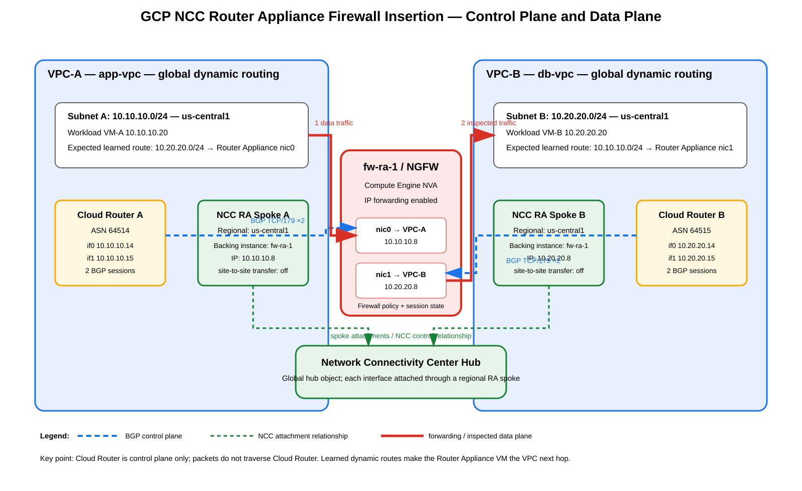
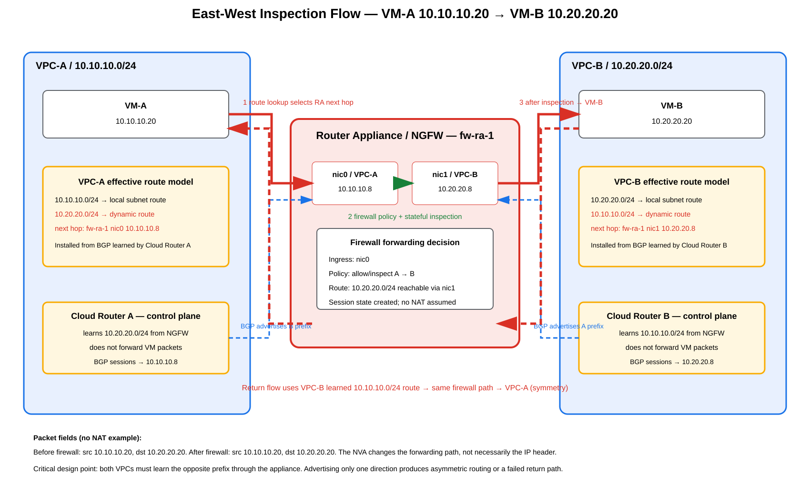
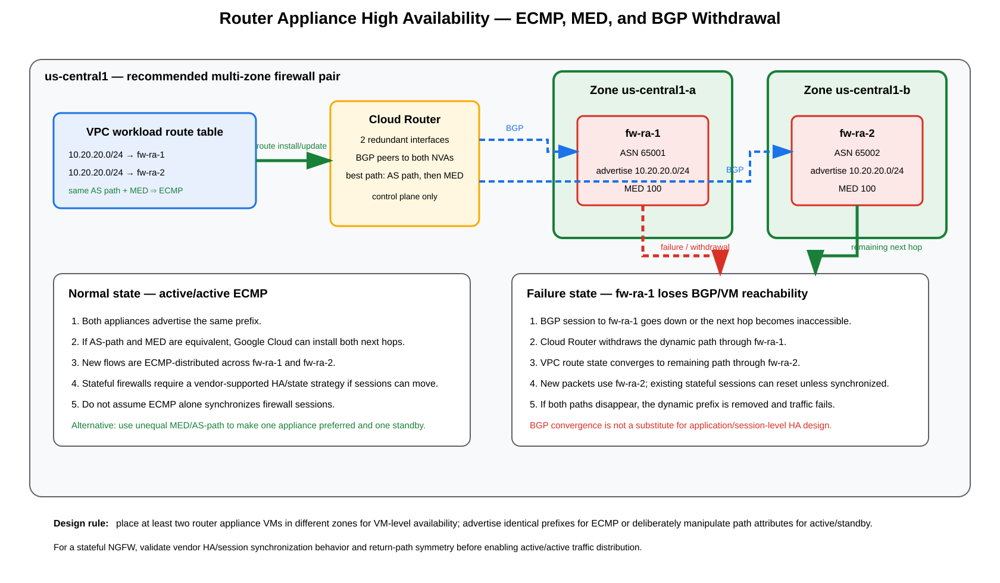

# GCP Firewall Insertion with Network Connectivity Center Router Appliance + BGP — Deep Dive

## Scope

This guide explains how to use **Google Cloud Network Connectivity Center (NCC) Router Appliance** with **Cloud Router and Border Gateway Protocol (BGP)** to insert a third-party firewall or other network virtual appliance (NVA) into a routed traffic path.

The primary design is the Google-documented **VPC-to-VPC firewall topology**: a multi-NIC Compute Engine firewall VM has one interface in each VPC, each interface is registered through its own Router Appliance spoke, and each VPC has a Cloud Router that establishes redundant BGP sessions to the firewall interface in that VPC. The firewall advertises the remote VPC prefix into each local VPC. As a result, the VPC distributed data plane sends traffic for the remote VPC to the firewall VM as the dynamic-route next hop.

The guide also explains site-to-cloud use, high availability, ECMP, active/standby design, route precedence, return-path symmetry, NAT considerations, verification, and troubleshooting.

> **Important distinction:** NCC and Cloud Router form the **routing/control-plane mechanism**. They do not inspect packets. The third-party Router Appliance VM is the packet-forwarding and inspection component.

---

## Source URLs

### Google Cloud primary sources

- https://docs.cloud.google.com/network-connectivity/docs/network-connectivity-center/concepts/ra-overview
- https://docs.cloud.google.com/network-connectivity/docs/network-connectivity-center/concepts/connect-vpc-networks
- https://docs.cloud.google.com/network-connectivity/docs/network-connectivity-center/how-to/connect-site-to-cloud
- https://docs.cloud.google.com/network-connectivity/docs/network-connectivity-center/how-to/creating-router-appliances
- https://docs.cloud.google.com/network-connectivity/docs/network-connectivity-center/concepts/site-to-cloud
- https://docs.cloud.google.com/network-connectivity/docs/network-connectivity-center/concepts/high-availability
- https://docs.cloud.google.com/network-connectivity/docs/router/concepts/how-cloud-router-works
- https://docs.cloud.google.com/network-connectivity/docs/router/concepts/learned-routes
- https://docs.cloud.google.com/vpc/docs/routes
- https://docs.cloud.google.com/vpc/docs/create-use-multiple-interfaces
- https://docs.cloud.google.com/compute/docs/instances/create-instance-multiple-nics
- https://docs.cloud.google.com/sdk/gcloud/reference/compute/instances/create

### Source information, additional explanation, and inference conventions

- **Source information** means behavior explicitly documented by Google Cloud in the sources above.
- **Additional explanation** means networking explanation added to connect the documented building blocks into an operational design.
- **Reasonable inference** means a conclusion drawn from documented routing behavior but not stated by Google in exactly that form. Inferences are labeled as such.

---

# 1. What Router Appliance actually is

**Source information:** Router Appliance is an NCC feature that lets a third-party virtual network appliance running on a Compute Engine VM exchange routes with Cloud Router by using BGP. Google documents Router Appliance for connecting VPC networks to one another, connecting VPCs to external networks, site-to-site data transfer, SD-WAN, firewall, and related appliance use cases.

The key sequence is:

1. A firewall VM runs a supported partner image or a custom image.
2. The firewall VM is associated with an NCC Router Appliance spoke.
3. A Cloud Router in the same region creates redundant interfaces in the same subnet as the firewall interface.
4. Cloud Router establishes BGP sessions with the firewall VM.
5. The firewall advertises prefixes.
6. Cloud Router learns those prefixes.
7. The VPC distributed routing system installs applicable dynamic routes with the **Router Appliance VM as the next hop**.
8. Workload packets matching those routes are delivered to the NVA.
9. The NVA inspects and forwards the packet according to its own policy and routing table.

Cloud Router itself is not an inline router. Google describes Cloud Router as a control-plane abstraction implemented by BGP tasks and dynamic route control-plane components. Its BGP tasks do not process workload packet data.

---

# 2. The most important firewall-insertion topology

Google explicitly documents a VPC-to-VPC topology where the Router Appliance VM hosts a firewall image and mediates connectivity between two VPC networks.

In the example design used throughout this guide:

| Object | Example value |
|---|---|
| Project | `my-project` |
| Region | `us-central1` |
| NCC hub | `fw-hub` |
| VPC-A | `app-vpc` |
| VPC-A subnet | `app-subnet`, `10.10.10.0/24` |
| Workload A | `vm-a`, `10.10.10.20` |
| VPC-B | `db-vpc` |
| VPC-B subnet | `db-subnet`, `10.20.20.0/24` |
| Workload B | `vm-b`, `10.20.20.20` |
| Firewall VM | `fw-ra-1` |
| Firewall nic0 | `10.10.10.8` in VPC-A |
| Firewall nic1 | `10.20.20.8` in VPC-B |
| Cloud Router A | `cr-app`, ASN `64514` |
| Cloud Router B | `cr-db`, ASN `64515` |
| Firewall ASN | example `65001` |



[Editable draw.io source](images/09-07-26-09-03_gcp_ncc_ra_architecture.drawio)

**What this image shows**

The same multi-NIC firewall VM participates in two different VPC networks. Each interface is represented by a separate Router Appliance spoke relationship. Each VPC has its own Cloud Router and redundant BGP sessions to the firewall interface in that VPC.

**What matters**

- The firewall is in the actual data path.
- The Cloud Routers are not.
- VPC-A learns VPC-B's prefix through firewall `nic0`.
- VPC-B learns VPC-A's prefix through firewall `nic1`.
- Both directions are required for a symmetric stateful firewall path.

**What to verify**

- `fw-ra-1` has IP forwarding enabled.
- Both firewall interfaces use RFC 1918 internal addresses supported for Router Appliance peering.
- Both VPC networks use the required dynamic routing mode for the intended design; Google Router Appliance guidance uses global dynamic routing where cross-region exchange is needed.
- Each Cloud Router is in the same region as the corresponding firewall interface/subnet.
- TCP/179 is permitted between Cloud Router interface addresses and the appliance interface.
- The firewall advertises only the prefixes that should be reachable through it.

---

# 3. Why the firewall becomes the next hop

## 3.1 Control-plane sequence

Assume VPC-A must reach `10.20.20.0/24` through the firewall.

1. The firewall knows that `10.20.20.0/24` is reachable through `nic1` because `nic1` is attached to VPC-B and the appliance has an appropriate route or directly connected subnet.
2. The firewall's BGP process advertises `10.20.20.0/24` to Cloud Router A over the BGP sessions using `nic0`.
3. Cloud Router A receives the route.
4. The VPC dynamic routing system creates a dynamic route for `10.20.20.0/24` whose next hop is the Router Appliance VM/interface path.
5. A packet emitted by VM-A for `10.20.20.20` is evaluated by the VPC routing system.
6. The dynamic route points the packet to `fw-ra-1`.
7. The firewall receives the packet on `nic0`, evaluates security policy and its own route table, and forwards the packet out `nic1`.
8. VPC-B delivers the packet to VM-B because `10.20.20.20` matches VPC-B's local subnet route.

The reverse direction works because the firewall advertises `10.10.10.0/24` to Cloud Router B.

## 3.2 What NCC contributes

The Router Appliance instance must be associated with NCC to establish this form of BGP peering. Google explicitly states that Router Appliance requires NCC and cannot be configured as a standalone Router Appliance VM peering to Cloud Router outside that model.

The NCC hub is therefore part of the management/control relationship, but packets between the two workload VPCs do **not** have to traverse a central software hub datapath in the way people often picture a physical hub router.

---

# 4. Critical route-precedence caveat: this is not a universal same-VPC service-chain tool

This is one of the most important design limitations to understand.

**Source information:** Google VPC routing evaluates subnet routes ahead of custom routes such as dynamic routes. A directly connected/local subnet prefix is therefore authoritative for destinations inside that VPC subnet.

**Reasonable inference:** If two workloads are in subnets that are already directly reachable inside the same VPC and you merely advertise those same subnet prefixes from a Router Appliance, you should not expect the dynamic BGP routes to override the VPC's own subnet routes and force same-VPC traffic through the firewall.

That is why the Google-documented firewall topology uses **two VPC networks** with the firewall bridging the Layer-3 routing relationship between them.

Use Router Appliance when the firewall is the routed boundary between:

- VPC-A and VPC-B;
- a VPC and on-premises;
- a VPC and another cloud/site;
- sites connected through a Router Appliance design;
- segmented networks where the remote prefix is not already a directly connected local VPC subnet route that bypasses the appliance.

For source-based or policy-based steering inside a VPC, Google Cloud **Policy-Based Routes (PBR)**, internal passthrough Network Load Balancer next hops, Network Security Integration, or other insertion patterns might be more appropriate.

---

# 5. VPC-to-VPC packet flow in detail



[Editable draw.io source](images/09-07-26-09-03_gcp_ncc_ra_packet_flow.drawio)

**What this image shows**

The diagram separates the BGP control plane from the packet data plane and shows the exact route each VPC must learn for symmetric inspection.

**What matters**

- VPC-A needs `10.20.20.0/24 → fw-ra-1`.
- VPC-B needs `10.10.10.0/24 → fw-ra-1`.
- The firewall receives the first packet before VM-B sees it.
- Return traffic is forced back through the same firewall routing boundary.

**What to verify**

- The route is present in both VPCs.
- The firewall has correct interface/zone policy in both directions.
- The firewall's own route table sends each remote prefix out the correct interface.
- NAT is either deliberately configured or deliberately absent.
- A stateful firewall sees both directions of the same session.

## 5.1 Forward path: VM-A to VM-B

Example flow:

```text
Source:      10.10.10.20
Destination: 10.20.20.20
Protocol:    TCP
Source port: ephemeral
Destination port: 443
```

### Stage 1 — VM-A sends the packet

VM-A emits:

```text
src=10.10.10.20:ephemeral
 dst=10.20.20.20:443
```

### Stage 2 — VPC-A route lookup

The relevant route is:

```text
10.20.20.0/24 -> dynamic route -> Router Appliance fw-ra-1 / VPC-A side
```

This route was installed because Cloud Router A learned the prefix from the BGP peer on `fw-ra-1`.

### Stage 3 — Packet delivered to firewall nic0

The packet enters:

```text
fw-ra-1 nic0 = 10.10.10.8
```

The packet does **not** traverse Cloud Router A.

### Stage 4 — Firewall policy evaluation

The firewall performs vendor-specific processing. A typical stateful NGFW pipeline can include:

1. ingress interface/zone lookup;
2. session lookup;
3. destination route lookup;
4. security policy lookup;
5. application/threat inspection;
6. NAT lookup if configured;
7. session creation;
8. egress forwarding.

Exact ordering is vendor-specific and must be verified against the firewall vendor's documentation.

### Stage 5 — Firewall forwards into VPC-B

Assuming no NAT:

```text
Before firewall:
src=10.10.10.20
 dst=10.20.20.20

After firewall:
src=10.10.10.20
 dst=10.20.20.20
```

The firewall changes the **path**, not necessarily the packet IP addresses.

### Stage 6 — VPC-B local delivery

Once the firewall transmits the packet on `nic1`, VPC-B's local subnet route for `10.20.20.0/24` reaches VM-B.

## 5.2 Return path: VM-B to VM-A

VM-B replies:

```text
src=10.20.20.20:443
 dst=10.10.10.20:ephemeral
```

VPC-B must select:

```text
10.10.10.0/24 -> dynamic route -> fw-ra-1 / VPC-B side
```

The firewall receives the return packet on `nic1`, matches the existing session, and forwards it through `nic0` to VPC-A.

The symmetry requirement is not optional for a conventional stateful firewall. If VPC-B has a competing path that bypasses the firewall, the return packet can avoid the existing session state and the connection can fail or behave inconsistently.

---

# 6. What BGP advertisements should look like

For a simple two-VPC firewall boundary:

### From firewall to Cloud Router A

Advertise:

```text
10.20.20.0/24
```

### From firewall to Cloud Router B

Advertise:

```text
10.10.10.0/24
```

Do **not** blindly redistribute everything. Route leaking through a stateful firewall is a security function as much as a routing function.

A safer design uses explicit prefix filters on the firewall and, where appropriate, Cloud Router BGP route policies so only intended prefixes become reachable through the inspection path.

---

# 7. Global versus regional dynamic routing

Google documents Router Appliance examples with VPC dynamic routing mode set to `global`, especially when route exchange or failover spans regions.

With **global** dynamic routing, learned dynamic routes can apply across regions according to Google Cloud route-selection behavior. With regional dynamic routing, learned routes are constrained by region.

For a single-region VPC-to-VPC firewall lab, both Cloud Routers and the firewall interfaces are normally placed in the same region. For multi-region production designs, global dynamic routing is generally the relevant mode, but you must still validate:

- where each firewall VM runs;
- which Cloud Router learns each prefix;
- how MED and AS path influence best path;
- whether both directions remain symmetric during regional failover;
- whether the firewall vendor supports the intended cross-zone or cross-region HA/session design.

---

# 8. Build the lab with gcloud

The following is a reproducible example based on Google-documented command forms. Substitute the firewall image and vendor-specific bootstrap settings for the appliance you actually use.

## 8.1 Variables

```cli
export PROJECT_ID="my-project"
export REGION="us-central1"
export ZONE="us-central1-a"
export HUB="fw-hub"
export VPC_A="app-vpc"
export VPC_B="db-vpc"
export SUBNET_A="app-subnet"
export SUBNET_B="db-subnet"
export FW="fw-ra-1"
```

Set the active project:

```cli
gcloud config set project "$PROJECT_ID"
```

## 8.2 Enable required APIs

At minimum, Network Connectivity and Compute Engine APIs are involved. Enable the APIs required by your environment before creating NCC and Compute resources.

```cli
gcloud services enable \
  networkconnectivity.googleapis.com \
  compute.googleapis.com
```

## 8.3 Create VPCs with global dynamic routing

```cli
gcloud compute networks create "$VPC_A" \
  --subnet-mode=custom \
  --bgp-routing-mode=global

gcloud compute networks create "$VPC_B" \
  --subnet-mode=custom \
  --bgp-routing-mode=global
```

## 8.4 Create subnets

```cli
gcloud compute networks subnets create "$SUBNET_A" \
  --network="$VPC_A" \
  --region="$REGION" \
  --range=10.10.10.0/24

gcloud compute networks subnets create "$SUBNET_B" \
  --network="$VPC_B" \
  --region="$REGION" \
  --range=10.20.20.0/24
```

## 8.5 Reserve firewall interface addresses

Example:

```cli
gcloud compute addresses create fw-ra-1-vpca \
  --region="$REGION" \
  --subnet="$SUBNET_A" \
  --addresses=10.10.10.8

gcloud compute addresses create fw-ra-1-vpcb \
  --region="$REGION" \
  --subnet="$SUBNET_B" \
  --addresses=10.20.20.8
```

## 8.6 Create the multi-NIC firewall VM

Google documents repeating `--network-interface` to create a multi-NIC VM and requires IP forwarding for a Router Appliance that forwards traffic.

The image settings below are placeholders because the exact image, licenses, machine type, service account, bootstrap metadata, disk layout, and marketplace terms depend on your firewall vendor.

```cli
gcloud compute instances create "$FW" \
  --zone="$ZONE" \
  --can-ip-forward \
  --network-interface=network="$VPC_A",subnet="$SUBNET_A",private-network-ip=10.10.10.8,no-address \
  --network-interface=network="$VPC_B",subnet="$SUBNET_B",private-network-ip=10.20.20.8,no-address \
  --image-project=YOUR_FIREWALL_IMAGE_PROJECT \
  --image=YOUR_FIREWALL_IMAGE
```

**Important:** multi-NIC guests often need vendor- or OS-specific route configuration. Google documents that `nic0` is the default interface and that guest routing may need custom route tables and policy routing for additional interfaces. A commercial firewall image normally handles this using its own routing configuration.

## 8.7 Allow BGP TCP/179

Google requires accessibility for BGP traffic through TCP port 179 and notes that VPC firewall rules might be necessary.

Do not use unrestricted `0.0.0.0/0` sources for production BGP rules. Scope them to the Cloud Router interface addresses or the minimum documented source range appropriate for your topology.

Example after Cloud Router interface addresses are assigned:

```cli
gcloud compute firewall-rules create allow-bgp-vpca \
  --network="$VPC_A" \
  --direction=INGRESS \
  --action=ALLOW \
  --rules=tcp:179 \
  --source-ranges=10.10.10.14/32,10.10.10.15/32

gcloud compute firewall-rules create allow-bgp-vpcb \
  --network="$VPC_B" \
  --direction=INGRESS \
  --action=ALLOW \
  --rules=tcp:179 \
  --source-ranges=10.20.20.14/32,10.20.20.15/32
```

Also create the workload-to-firewall and firewall-to-workload VPC firewall rules required by your security policy.

## 8.8 Create the NCC hub

```cli
gcloud network-connectivity hubs create "$HUB" \
  --description="NCC hub for Router Appliance firewall insertion"
```

## 8.9 Create one Router Appliance spoke per firewall interface/VPC

Build the VM URI:

```cli
FW_URI="https://www.googleapis.com/compute/v1/projects/${PROJECT_ID}/zones/${ZONE}/instances/${FW}"
```

Create the VPC-A-side spoke:

```cli
gcloud network-connectivity spokes linked-router-appliances create fw-spoke-a \
  --hub="$HUB" \
  --description="Router Appliance interface in app-vpc" \
  --router-appliance=instance="$FW_URI",ip=10.10.10.8 \
  --region="$REGION"
```

Create the VPC-B-side spoke:

```cli
gcloud network-connectivity spokes linked-router-appliances create fw-spoke-b \
  --hub="$HUB" \
  --description="Router Appliance interface in db-vpc" \
  --router-appliance=instance="$FW_URI",ip=10.20.20.8 \
  --region="$REGION"
```

For this VPC-to-VPC firewall example, Google’s sample topology uses site-to-site data transfer disabled for these spokes.

## 8.10 Create one Cloud Router in each VPC

```cli
gcloud compute routers create cr-app \
  --region="$REGION" \
  --network="$VPC_A" \
  --asn=64514 \
  --project="$PROJECT_ID"

gcloud compute routers create cr-db \
  --region="$REGION" \
  --network="$VPC_B" \
  --asn=64515 \
  --project="$PROJECT_ID"
```

## 8.11 Add redundant Cloud Router interfaces in VPC-A

Google documents two redundant Cloud Router interfaces for Router Appliance connectivity.

```cli
gcloud compute routers add-interface cr-app \
  --interface-name=ra-if-0 \
  --ip-address=10.10.10.14 \
  --subnetwork="$SUBNET_A" \
  --region="$REGION" \
  --project="$PROJECT_ID"

gcloud compute routers add-interface cr-app \
  --interface-name=ra-if-1 \
  --ip-address=10.10.10.15 \
  --subnetwork="$SUBNET_A" \
  --redundant-interface=ra-if-0 \
  --region="$REGION" \
  --project="$PROJECT_ID"
```

## 8.12 Add redundant Cloud Router interfaces in VPC-B

```cli
gcloud compute routers add-interface cr-db \
  --interface-name=ra-if-0 \
  --ip-address=10.20.20.14 \
  --subnetwork="$SUBNET_B" \
  --region="$REGION" \
  --project="$PROJECT_ID"

gcloud compute routers add-interface cr-db \
  --interface-name=ra-if-1 \
  --ip-address=10.20.20.15 \
  --subnetwork="$SUBNET_B" \
  --redundant-interface=ra-if-0 \
  --region="$REGION" \
  --project="$PROJECT_ID"
```

## 8.13 Add BGP peers from Cloud Router A to the firewall

Both BGP peers point to the same firewall interface address, `10.10.10.8`, but use different Cloud Router interfaces.

```cli
gcloud compute routers add-bgp-peer cr-app \
  --peer-name=fw-ra-1-a-0 \
  --interface=ra-if-0 \
  --peer-ip-address=10.10.10.8 \
  --peer-asn=65001 \
  --instance="$FW" \
  --instance-zone="$ZONE" \
  --region="$REGION"

gcloud compute routers add-bgp-peer cr-app \
  --peer-name=fw-ra-1-a-1 \
  --interface=ra-if-1 \
  --peer-ip-address=10.10.10.8 \
  --peer-asn=65001 \
  --instance="$FW" \
  --instance-zone="$ZONE" \
  --region="$REGION"
```

## 8.14 Add BGP peers from Cloud Router B to the firewall

```cli
gcloud compute routers add-bgp-peer cr-db \
  --peer-name=fw-ra-1-b-0 \
  --interface=ra-if-0 \
  --peer-ip-address=10.20.20.8 \
  --peer-asn=65001 \
  --instance="$FW" \
  --instance-zone="$ZONE" \
  --region="$REGION"

gcloud compute routers add-bgp-peer cr-db \
  --peer-name=fw-ra-1-b-1 \
  --interface=ra-if-1 \
  --peer-ip-address=10.20.20.8 \
  --peer-asn=65001 \
  --instance="$FW" \
  --instance-zone="$ZONE" \
  --region="$REGION"
```

## 8.15 Configure BGP on the firewall

This part is vendor-specific. On the firewall, configure four BGP sessions:

### VPC-A side

```text
Local interface/IP: 10.10.10.8
Peer 1: 10.10.10.14 / Cloud Router ASN 64514
Peer 2: 10.10.10.15 / Cloud Router ASN 64514
Local ASN: 65001
Advertise: 10.20.20.0/24
```

### VPC-B side

```text
Local interface/IP: 10.20.20.8
Peer 1: 10.20.20.14 / Cloud Router ASN 64515
Peer 2: 10.20.20.15 / Cloud Router ASN 64515
Local ASN: 65001
Advertise: 10.10.10.0/24
```

Vendor-specific configuration must also ensure the appliance itself can route `10.10.10.0/24` through `nic0` and `10.20.20.0/24` through `nic1`.

---

# 9. Why there are two BGP sessions per firewall interface

Google’s Router Appliance design creates two redundant Cloud Router interfaces and has each appliance interface peer to both of them.

This is about Cloud Router control-plane redundancy. It does not mean two different physical links exist inside the VM. The VM still has a single VPC interface for that side of the topology, but the Cloud Router abstraction can maintain redundant BGP tasks/interfaces.

For a single firewall VM, you therefore normally see:

```text
VPC-A side: 2 BGP sessions
VPC-B side: 2 BGP sessions
Total:      4 BGP sessions
```

For two firewall VMs in the same spoke, each can peer with both Cloud Router interfaces, producing additional BGP sessions.

---

# 10. High availability: two Router Appliance VMs

A production stateful firewall design should not rely on one VM.

Google recommends multiple router appliance instances in different zones for stronger VM availability. When multiple Router Appliance instances advertise the same prefixes with the same effective path attributes, Google Cloud can use ECMP.



[Editable draw.io source](images/09-07-26-09-03_gcp_ncc_ra_ha_failover.drawio)

**What this image shows**

Two Router Appliance firewall VMs in different zones advertise the same route. The route can be installed with multiple next hops for ECMP, or attributes can be adjusted to create a preferred/standby path.

**What matters**

- BGP convergence and VM availability are separate from firewall session synchronization.
- An ECMP-capable routing design does not automatically make a stateful firewall cluster session-safe.
- Failover can move new flows to the surviving VM, but existing sessions might reset unless the vendor has a compatible state-synchronization model.

**What to verify**

- Both VMs are in different zones.
- Both advertise the same intended prefixes.
- AS path and MED are deliberately chosen.
- Firewall HA heartbeat/state sync is supported by the vendor design.
- Reverse-path routing follows the same surviving appliance after failure.

## 10.1 Active/active with ECMP

**Source information:** if multiple Router Appliance instances advertise the same prefix with the same MED and equivalent path-selection characteristics, Google Cloud can perform ECMP across the instances.

Use this only when the firewall vendor supports active/active forwarding semantics compatible with ECMP.

### Risk

A flow sent through firewall 1 in one direction and firewall 2 in the opposite direction can break if the vendor cluster does not share state appropriately or if routing is not symmetric.

## 10.2 Active/standby using BGP attributes

Google Cloud route selection considers BGP path characteristics. Router Appliance documentation notes shortest AS path first, then MED for ties in the relevant Cloud Router decision process.

You can therefore design a preference model such as:

```text
fw-ra-1: prefix 10.20.20.0/24, preferred path
fw-ra-2: same prefix, less-preferred MED or AS path
```

The exact path-engineering mechanism should be validated against Cloud Router best-path behavior and the appliance vendor's BGP implementation.

## 10.3 Failure sequence

If the active appliance or its BGP reachability fails:

1. BGP session changes state.
2. Cloud Router removes or de-preferences the path from the failed appliance.
3. The VPC dynamic route state converges.
4. Packets use the remaining path.
5. Existing firewall sessions might be lost unless synchronized.

If **all** paths for the advertised prefix are withdrawn, the dynamic route disappears; traffic then follows the next applicable route if one exists, or fails.

---

# 11. Site-to-cloud firewall insertion

Router Appliance is also designed to connect an external site to a VPC.

Example:

```text
On-premises LAN 172.16.0.0/16
        |
   third-party WAN/VPN/SD-WAN connectivity
        |
Router Appliance firewall VM
        |
   BGP to Cloud Router
        |
VPC workloads 10.10.0.0/16
```

The appliance advertises the external-site prefixes to Cloud Router. Cloud Router installs dynamic routes in the VPC. The appliance learns or statically knows the VPC prefixes and sends them toward the external side.

This is useful when the third-party NVA itself provides:

- VPN termination;
- SD-WAN overlay termination;
- advanced firewall inspection;
- vendor-specific routing policy;
- route exchange between Google Cloud and external networks.

---

# 12. Site-to-site data transfer is a different Router Appliance use case

NCC Router Appliance can also support site-to-site data transfer, where traffic between external sites traverses the Google Cloud networking design.

Do not confuse that feature with the two-VPC firewall topology in this guide.

For the VPC-to-VPC firewall example, Google’s documented procedure uses Router Appliance spokes on each firewall interface and leaves site-to-site data transfer disabled.

Enable site-to-site data transfer only when the topology specifically requires external-site-to-external-site transit and the location/design requirements are met.

---

# 13. NAT behavior

NCC Router Appliance does not inherently perform NAT. NAT behavior belongs to the firewall/NVA configuration or other Google Cloud NAT services placed elsewhere.

## 13.1 East-west inspection without NAT

For VPC-A to VPC-B, preserving source IP is normally desirable:

```text
Before firewall: 10.10.10.20 -> 10.20.20.20
After firewall:  10.10.10.20 -> 10.20.20.20
```

Benefits:

- destination sees original source;
- logs retain source identity;
- return path can use the reciprocal dynamic route;
- no unnecessary translation state.

## 13.2 When SNAT can become necessary

SNAT can be required when the downstream network lacks a route to the original source, when overlapping addresses exist, or when the firewall vendor design intentionally hides source networks.

However, SNAT can also mask routing mistakes. Do not use it merely to make an asymmetric design appear functional unless that is the intended architecture.

## 13.3 Internet egress

Router Appliance+BGP can participate in an egress design if the firewall advertises an appropriate default or external prefix and has a valid Internet-facing forwarding/NAT design.

But Internet egress introduces more moving parts:

- public/external IP ownership;
- Cloud NAT versus appliance NAT;
- default-route precedence;
- vendor licensing;
- asymmetric inbound return paths;
- health/failover semantics.

Treat Internet egress as a separate design rather than assuming the VPC-to-VPC pattern automatically provides it.

---

# 14. Route selection and competing paths

## 14.1 More-specific routes

Google VPC routing uses destination prefix specificity and route-category ordering. A more specific valid route can beat a broader route.

Example:

```text
10.20.0.0/16 -> firewall
10.20.20.0/24 -> another valid higher-preference route
```

Traffic to `10.20.20.20` can follow the `/24`, not the firewall `/16`.

## 14.2 Subnet routes

Local subnet routes are especially important because they can prevent a dynamic route from becoming the effective service-insertion path for destinations that are local to the VPC.

## 14.3 Multiple spoke types advertising the same prefix

Google specifically recommends avoiding advertisement of the same prefixes through a mixture of Router Appliance, Cloud VPN, and VLAN attachment spoke types when that causes unwanted ECMP or traffic imbalance.

For a firewall boundary, ambiguous equal-cost paths are especially dangerous because some paths can bypass inspection.

## 14.4 MED

MED can influence route preference after higher-order selection criteria are equal. Use MED deliberately and document which appliance/path should be preferred.

## 14.5 AS path

Cloud Router considers AS path length in BGP route selection. An active/standby design can use path length and/or MED, but do not invent attributes without testing the exact best-path mode and vendor behavior.

---

# 15. Shared VPC limitations

Google documents a Router Appliance Shared VPC restriction: the Router Appliance VM must be deployed in the **Shared VPC host project**, along with the associated NCC resources such as the hub, spoke, and Cloud Router for that model. A Router Appliance VM deployed in a Shared VPC service project is not supported for this feature.

This can materially affect security-project architecture. If your organization normally places firewalls in a separate service project, validate whether Router Appliance fits that ownership model before committing to it.

---

# 16. Verification commands

## 16.1 Verify the NCC hub

```cli
gcloud network-connectivity hubs describe fw-hub
```

**Where:** NCC control plane.

**What it tests:** The hub exists and is administratively available.

**Expected state:** The hub description returns successfully and identifies the expected project and hub resource.

**Failure indicators:** Not found, permission denied, wrong project.

**Next action:** Confirm project context, API enablement, IAM, and hub name.

## 16.2 Verify Router Appliance spokes

```cli
gcloud network-connectivity spokes linked-router-appliances describe fw-spoke-a \
  --region=us-central1

gcloud network-connectivity spokes linked-router-appliances describe fw-spoke-b \
  --region=us-central1
```

**Expected state:** Each spoke references `fw-ra-1` and the correct interface IP.

**Important fields:** hub reference, region/location, linked Router Appliance instance, IP address, site-to-site data-transfer setting.

**Failure indicators:** Wrong VM URI, wrong interface address, spoke not active/accepted as expected.

## 16.3 Verify the firewall has IP forwarding enabled

```cli
gcloud compute instances describe fw-ra-1 \
  --zone=us-central1-a \
  --format='yaml(name,canIpForward,networkInterfaces)'
```

**Expected state:**

```text
canIpForward: true
```

The `networkInterfaces` section should show one interface in each intended VPC/subnet with the expected internal addresses.

## 16.4 Verify Cloud Router configuration

```cli
gcloud compute routers describe cr-app \
  --region=us-central1

gcloud compute routers describe cr-db \
  --region=us-central1
```

**What it tests:** Router ASN, interfaces, and BGP peer objects.

**Success criteria:** Both redundant interfaces and both appliance BGP peers exist on each Cloud Router.

## 16.5 Verify BGP operational state

```cli
gcloud compute routers get-status cr-app \
  --region=us-central1

gcloud compute routers get-status cr-db \
  --region=us-central1
```

**Expected fields/state:** formatting can change across gcloud versions, but inspect the BGP peer status information for:

- peer name;
- local/peer IP information;
- session status;
- uptime when established;
- learned routes;
- advertised routes.

**Success criteria:** Both BGP sessions per firewall interface are established and the expected remote prefix is learned.

**Failure indicators:** session down, no learned route, wrong ASN, wrong peer IP, or route absent from the learned set.

## 16.6 Verify dynamic routes in VPC-A

```cli
gcloud compute routes list \
  --filter='network:app-vpc AND destRange:10.20.20.0/24' \
  --format=table
```

**Success criteria:** A dynamic route for `10.20.20.0/24` is present with the Router Appliance path as the next hop.

Do not depend on exact table column ordering; gcloud output formatting evolves.

## 16.7 Verify dynamic routes in VPC-B

```cli
gcloud compute routes list \
  --filter='network:db-vpc AND destRange:10.10.10.0/24' \
  --format=table
```

**Success criteria:** VPC-B has the reciprocal route through the firewall.

## 16.8 Verify the appliance route table

Use the firewall vendor CLI to verify:

```text
10.10.10.0/24 -> nic0 / VPC-A side
10.20.20.0/24 -> nic1 / VPC-B side
```

Also verify the BGP RIB and advertised prefixes.

Do not assume the firewall automatically redistributes connected routes. Many firewall platforms require explicit redistribution/export policy.

## 16.9 Verify the security policy/session

Generate a TCP connection from VM-A to VM-B and inspect firewall logs/session state.

Success criteria:

- forward packet enters VPC-A-side firewall interface;
- security policy allows the connection;
- egress is VPC-B-side interface;
- VM-B responds;
- reverse packet returns to the same logical firewall session;
- no unintended SNAT occurs unless configured.

---

# 17. Expected flow verification table

| Checkpoint | Expected forward packet | Expected result |
|---|---|---|
| VM-A | `10.10.10.20 -> 10.20.20.20` | packet emitted |
| VPC-A route lookup | destination `10.20.20.0/24` | Router Appliance next hop selected |
| Firewall nic0 | same src/dst | packet received for inspection |
| Firewall security policy | A-to-B policy | allow + inspect |
| Firewall route lookup | destination `10.20.20.20` | nic1 selected |
| Firewall nic1 | same src/dst unless NAT configured | packet transmitted into VPC-B |
| VPC-B | local `10.20.20.0/24` route | VM-B receives packet |
| VM-B reply | `10.20.20.20 -> 10.10.10.20` | return packet emitted |
| VPC-B route lookup | destination `10.10.10.0/24` | firewall next hop selected |
| Firewall nic1 | return packet | existing session matched |
| Firewall nic0 | return packet | transmitted into VPC-A |
| VM-A | return packet | session succeeds |

---

# 18. Troubleshooting by symptom

## Symptom: BGP session never establishes

**Where:** Cloud Router and firewall interface.

**Command/tool:**

```cli
gcloud compute routers get-status cr-app --region=us-central1
```

**What it tests:** BGP adjacency state.

**Expected state:** peer established.

**Check:**

- firewall interface IP matches `--peer-ip-address`;
- Cloud Router interface and appliance interface are in the same subnet;
- peer ASN is correct;
- TCP/179 permitted;
- Router Appliance spoke exists before using the special appliance peering;
- firewall BGP process is listening on the intended interface;
- no vendor policy blocks the session.

**Next action:** packet capture or vendor BGP debug on the firewall, plus review VPC firewall logging if enabled.

## Symptom: BGP is established but no route appears

**Where:** firewall BGP export policy and Cloud Router learned routes.

**What it tests:** route advertisement rather than transport/session setup.

**Check:**

- prefix exists in firewall RIB;
- prefix is eligible for BGP export;
- redistribution/export policy allows it;
- route is not filtered;
- Google Cloud route limits are not exceeded;
- the route does not conflict with a higher-order route category.

**Next action:** inspect advertised routes on the firewall and learned routes in `gcloud compute routers get-status`.

## Symptom: VPC-A can reach the firewall but not VM-B

**Where:** firewall forwarding/security path.

**Check:**

- firewall has a route to `10.20.20.0/24` via `nic1`;
- IP forwarding enabled on the Compute Engine VM;
- firewall security policy allows A-to-B;
- VPC-B ingress firewall rules allow the source/policy;
- guest routing is correct for a multi-NIC VM;
- no source NAT changes traffic unexpectedly.

## Symptom: SYN reaches VM-B, SYN/ACK never gets back

This usually points to return-path failure.

**Where:** VPC-B route table and firewall state.

**Check:**

```cli
gcloud compute routes list \
  --filter='network:db-vpc AND destRange:10.10.10.0/24'
```

VPC-B must know that the source subnet is reachable through the Router Appliance. If it sends the return packet another way, the firewall session can be bypassed.

## Symptom: only some sessions fail with two firewalls

Likely causes include:

- ECMP sends related directions to different independent firewalls;
- session sync is missing;
- one firewall advertises different prefixes or MED;
- one firewall has a different security policy;
- asymmetric routing appears only for certain route lengths/prefixes.

**Next action:** correlate a failing five-tuple with firewall session ownership and BGP-selected next hop.

## Symptom: advertising a workload subnet does not force same-VPC traffic through the firewall

This can be expected. Local subnet routes in the VPC routing model can take precedence over dynamic routes for the same directly connected prefix.

**Next action:** redesign the security boundary with separate VPCs or use a service-insertion method designed for policy steering such as PBR/internal passthrough NLB or Network Security Integration, depending on requirements.

## Symptom: route exists in one VPC only

A one-direction route is insufficient for normal stateful inspection.

**Next action:** verify the reciprocal advertisement:

```text
VPC-A must learn VPC-B prefix through firewall.
VPC-B must learn VPC-A prefix through firewall.
```

## Symptom: failover changes routes but applications still reset

BGP failover has done its job, but stateful firewall session state has not survived.

**Next action:** verify vendor-supported session synchronization/HA architecture. Routing convergence cannot recreate transport-layer session state by itself.

---

# 19. Common mistakes

1. **Thinking Cloud Router forwards the packet.** It does not; it exchanges routes and programs the VPC dynamic routing state.
2. **Creating only one BGP session per firewall interface.** Google’s Router Appliance examples use redundant Cloud Router interfaces and two BGP sessions per appliance interface.
3. **Forgetting the Router Appliance spoke.** The appliance peering model requires NCC.
4. **Advertising only the forward destination prefix.** Stateful firewall return traffic needs reciprocal routing.
5. **Trying to override a local same-VPC subnet route with BGP.** Router Appliance is not a universal same-VPC service-chain primitive.
6. **Using ECMP with independent stateful firewalls without session-aware HA.** Routing redundancy and firewall state redundancy are not the same thing.
7. **Leaving IP forwarding disabled on the firewall VM.** The instance must be able to forward packets not addressed to itself.
8. **Assuming the guest OS will route secondary NIC traffic correctly by default.** Multi-NIC guests often require vendor-specific routing configuration.
9. **Allowing TCP/179 too broadly.** Scope BGP access to the required peers.
10. **Redistributing every connected/static route.** Route export is part of the security boundary; advertise only intended destinations.
11. **Ignoring duplicate prefixes learned through VPN/Interconnect and Router Appliance.** Equal/competing paths can bypass inspection or create imbalance.
12. **Using SNAT to hide routing problems.** NAT can make return routing appear to work while obscuring a flawed design.
13. **Putting the Router Appliance VM in a Shared VPC service project.** Google documents support in the host-project model, not service-project deployment of the appliance VM.
14. **Assuming BGP failover preserves existing sessions.** It changes reachability; session survival is vendor-HA behavior.

---

# 20. When Router Appliance + BGP is a good firewall insertion choice

Use it when:

- the third-party firewall is itself the routed boundary;
- you need dynamic BGP exchange between the firewall and Google VPC routing;
- you are connecting separate VPCs through a firewall;
- the firewall also terminates SD-WAN/VPN/external routing;
- you want route-driven active/active or active/standby behavior;
- the vendor supports NCC Router Appliance or a compatible custom BGP appliance design;
- you need route advertisements to appear natively as VPC dynamic routes.

It is particularly natural for classic routed firewall designs where each security zone maps to a distinct VPC interface and the firewall owns inter-zone routing.

---

# 21. When another insertion method is probably better

Use another method when:

- you must steer traffic based on source, destination, protocol, or tags rather than only destination routing;
- you need to insert a firewall transparently without making it the routed boundary;
- workloads are in the same VPC and local subnet routing would bypass the appliance;
- you want a managed Google firewall endpoint model;
- you need GENEVE-based service insertion;
- you need load-balanced NVA scale-out behind a stable next hop rather than direct Router Appliance next hops.

Relevant alternatives include:

- Cloud NGFW distributed firewall policies;
- Cloud NGFW Enterprise firewall endpoints;
- Network Security Integration;
- Policy-Based Routes to an internal passthrough Network Load Balancer;
- static routes to supported next hops;
- NCC Gateway/SSE for supported cloud-delivered security services.

---

# 22. Mental model for certification/interview questions

If asked, “How does NCC Router Appliance insert a firewall?”, use this answer structure:

1. **The firewall is a multi-NIC Compute Engine VM.**
2. **Each participating interface is attached through an NCC Router Appliance spoke.**
3. **A Cloud Router in each VPC peers with the firewall over BGP.**
4. **The firewall advertises the opposite network's prefix.**
5. **Cloud Router installs a VPC dynamic route whose next hop is the Router Appliance.**
6. **The VPC data plane sends matching workload traffic directly to the firewall VM, not through Cloud Router.**
7. **The firewall inspects and routes the packet to the other VPC/interface.**
8. **The reverse VPC must learn the source prefix through the same firewall path to maintain symmetry.**
9. **Multiple appliance VMs can advertise the same prefixes for ECMP; BGP withdrawal provides route failover, but firewall state HA must be designed separately.**
10. **Local subnet routes can prevent this method from steering same-VPC directly connected traffic.**

---

# 23. Final design checklist

- [ ] Separate routed security domains/VPCs identified.
- [ ] Non-overlapping prefixes verified.
- [ ] Dynamic routing mode selected deliberately.
- [ ] Router Appliance VMs use supported internal addressing.
- [ ] IP forwarding enabled.
- [ ] Multi-NIC guest routing configured correctly.
- [ ] NCC hub created.
- [ ] Router Appliance spoke created for each relevant interface/VPC relationship.
- [ ] Cloud Router exists in each involved VPC/region.
- [ ] Two redundant Cloud Router interfaces created per appliance-facing subnet.
- [ ] Two BGP peers created per firewall interface.
- [ ] TCP/179 permitted only as required.
- [ ] Firewall advertises only intended remote prefixes.
- [ ] Both forward and return prefixes are learned through the firewall.
- [ ] Effective VPC routes verified.
- [ ] Firewall security policy verified.
- [ ] NAT behavior documented.
- [ ] HA mode chosen: ECMP active/active or BGP-engineered active/standby.
- [ ] Vendor session synchronization behavior validated.
- [ ] Failure testing performed by stopping BGP or an appliance VM.
- [ ] Workload packet captures/logs confirm no bypass path.

---

# Sources

- Google Cloud, Router appliance overview: https://docs.cloud.google.com/network-connectivity/docs/network-connectivity-center/concepts/ra-overview
- Google Cloud, VPC-to-VPC topology that uses a third-party appliance: https://docs.cloud.google.com/network-connectivity/docs/network-connectivity-center/concepts/connect-vpc-networks
- Google Cloud, Establish connectivity by using a third-party appliance: https://docs.cloud.google.com/network-connectivity/docs/network-connectivity-center/how-to/connect-site-to-cloud
- Google Cloud, Create router appliance instances: https://docs.cloud.google.com/network-connectivity/docs/network-connectivity-center/how-to/creating-router-appliances
- Google Cloud, Site-to-cloud topologies: https://docs.cloud.google.com/network-connectivity/docs/network-connectivity-center/concepts/site-to-cloud
- Google Cloud, High availability requirements for spoke resources: https://docs.cloud.google.com/network-connectivity/docs/network-connectivity-center/concepts/high-availability
- Google Cloud, How Cloud Router works: https://docs.cloud.google.com/network-connectivity/docs/router/concepts/how-cloud-router-works
- Google Cloud, Learned routes: https://docs.cloud.google.com/network-connectivity/docs/router/concepts/learned-routes
- Google Cloud, VPC routes: https://docs.cloud.google.com/vpc/docs/routes
- Google Cloud, Create VMs with multiple network interfaces: https://docs.cloud.google.com/vpc/docs/create-use-multiple-interfaces
- Google Cloud, Compute Engine multiple NIC overview: https://docs.cloud.google.com/compute/docs/instances/create-instance-multiple-nics
- Google Cloud SDK, `gcloud compute instances create`: https://docs.cloud.google.com/sdk/gcloud/reference/compute/instances/create
