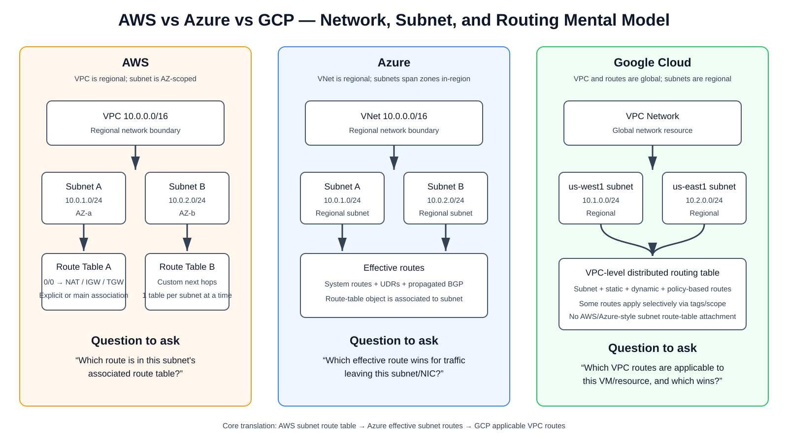

# AWS vs Azure vs Google Cloud Networking — VPC, VNet, Subnet, Route Table, NAT, and Routing Mental Model

This guide is for engineers who already understand one cloud reasonably well and need a reliable way to translate the same networking concepts into AWS, Microsoft Azure, and Google Cloud. The most important idea is that all three clouds implement the same fundamental networking jobs — **network boundary, IP subnet, route selection, security enforcement, NAT, and connectivity to other networks** — but they package those jobs differently.

## URLs reviewed

- AWS VPC subnet route tables: https://docs.aws.amazon.com/vpc/latest/userguide/subnet-route-tables.html
- AWS create/associate route tables: https://docs.aws.amazon.com/vpc/latest/userguide/create-vpc-route-table.html
- Azure VNets and subnets: https://learn.microsoft.com/en-us/azure/networking/design-guide/vnets-subnets
- Azure route tables and UDR association: https://learn.microsoft.com/en-us/azure/virtual-network/manage-route-table
- Google Cloud VPC networks: https://cloud.google.com/vpc/docs/vpc
- Google Cloud subnets: https://cloud.google.com/vpc/docs/subnets
- Google Cloud routes: https://cloud.google.com/vpc/docs/routes
- Google Cloud Policy-Based Routes: https://cloud.google.com/vpc/docs/policy-based-routes
- Google Cloud Cloud NAT product interactions: https://cloud.google.com/nat/docs/nat-product-interactions

---

## 1. Start with the common abstraction, not the product names

Every cloud packet effectively has to answer the same questions:

1. **Which logical network am I in?**
2. **Which IP subnet/interface owns my source address?**
3. **Which route applies to the destination?**
4. **What is the next hop?**
5. **Does a firewall/security policy allow the packet?**
6. **Does source or destination NAT occur?**
7. **How does the return packet get back?**

The confusion comes from where each cloud stores or applies the routing decision.

| Concept | AWS | Azure | Google Cloud |
|---|---|---|---|
| Logical private network | VPC | VNet | VPC Network |
| Network scope | Regional | Regional | **Global** |
| Subnet | Subnet | Subnet | Subnet / subnetwork |
| Subnet scope | **Availability Zone** | **Regional; spans zones in-region** | **Regional** |
| Traditional route-table object | Yes | Yes | **No subnet route-table attachment model** |
| Route-table association | Subnet → route table | Subnet → route table | Routes belong to the VPC network; applicability determines which resources use them |
| Built-in local/subnet reachability | Local VPC route | System routes | Automatically created subnet routes |
| Dynamic routes | TGW/VGW/DX/etc. depending on design | BGP via VPN/ExpressRoute/Route Server/vWAN | Cloud Router / NCC dynamic routes |
| Instance security | Security Group | NSG | VPC firewall rules / network firewall policies |
| Subnet stateless ACL | Network ACL | No direct NACL equivalent | No AWS-style subnet NACL |
| Internet egress NAT | NAT Gateway | NAT Gateway | Cloud NAT |

> **Source information:** AWS explicitly associates each subnet with one route table at a time. Azure route tables are associated to subnets and contribute User Defined Routes (UDRs) to effective routing. Google Cloud documents the VPC routing table at the VPC-network level and then determines which routes are *applicable* to a resource.

---

## 2. The diagram to memorize



[Open the editable draw.io source](images/09-07-26-09-16_cross_cloud_networking_mental_model.drawio)

**What this image shows**  
The same basic hierarchy expressed in each cloud: AWS routes are strongly tied to a subnet route-table association, Azure computes effective routes from system routes, UDRs, and propagated routes, while Google Cloud maintains a distributed routing table at the VPC-network level and calculates the subset of routes applicable to each resource.

**What matters**  
Do not ask “what route table is attached to this GCP subnet?” There is no AWS/Azure-style subnet route-table attachment. Ask “which routes in the VPC apply to this VM, tunnel, or VLAN attachment, and which route wins?”

**What to verify**  
For troubleshooting, always identify the packet source resource, destination prefix, applicable route set, selected next hop, firewall policy, NAT stage, and return path.

---

# 3. AWS mental model

AWS gives you the most explicit **subnet → route table** relationship.

```text
VPC 10.0.0.0/16
 |
 +-- Subnet-A 10.0.1.0/24 in us-east-1a
 |      |
 |      +-- Route Table A
 |
 +-- Subnet-B 10.0.2.0/24 in us-east-1b
        |
        +-- Route Table B
```

Every subnet must use a route table. A subnet can be explicitly associated with a custom route table or implicitly use the VPC's main route table. A subnet can use only one subnet route table at a time, while one route table can serve multiple subnets.

Typical route table:

```text
Destination       Target
10.0.0.0/16       local
0.0.0.0/0         igw-0123456789abcdef0
```

For a private subnet:

```text
Destination       Target
10.0.0.0/16       local
0.0.0.0/0         nat-0123456789abcdef0
```

For centralized connectivity:

```text
Destination       Target
10.0.0.0/16       local
10.100.0.0/16     tgw-0123456789abcdef0
0.0.0.0/0         nat-0123456789abcdef0
```

The mental flow is:

```text
EC2 instance
   ↓
Subnet
   ↓
Associated subnet route table
   ↓
Longest-prefix matching route
   ↓
Route target
```

### AWS geographic scope

A VPC belongs to one AWS Region. A normal VPC subnet belongs to one Availability Zone.

```text
us-east-1 VPC
 |
 +-- subnet-a → us-east-1a
 +-- subnet-b → us-east-1b
 +-- subnet-c → us-east-1c
```

This is one reason multi-region AWS designs often use multiple VPCs and then connect them with Transit Gateway peering, Cloud WAN, VPC peering, VPN, or other services.

---

# 4. Azure mental model

Azure feels much closer to AWS than Google Cloud does.

```text
VNet 10.0.0.0/16
 |
 +-- Subnet-A 10.0.1.0/24
 |      |
 |      +-- Route Table / UDRs
 |
 +-- Subnet-B 10.0.2.0/24
```

An Azure route-table resource contains **User Defined Routes (UDRs)**. The route table is associated with one or more subnets.

Example:

```text
Address prefix     Next hop type        Next hop
10.20.0.0/16       VirtualAppliance     10.0.100.4
0.0.0.0/0          VirtualAppliance     10.0.100.4
```

The major difference from the simplified AWS view is that Azure computes **effective routes** from multiple sources.

Conceptually:

```text
Effective routing
=
System routes
+
User Defined Routes
+
BGP-propagated routes
```

The packet does not simply consult “the UDR table” in isolation. Azure evaluates the effective route set for the network interface/subnet context and selects the route according to Azure route-selection rules.

### Azure geographic scope

A VNet is regional, but Azure subnets are not bound to a single Availability Zone.

```text
East US VNet
 |
 +-- Frontend subnet
 +-- Application subnet
 +-- Database subnet
```

Resources deployed in different availability zones in the same region can use the same subnet when the service supports zonal placement.

This makes the following translation useful:

```text
AWS:   VPC = Region, Subnet ≈ AZ boundary
Azure: VNet = Region, Subnet ≠ AZ boundary
```

---

# 5. Google Cloud mental model — the important change

Google Cloud VPC networking is where AWS/Azure intuition most often causes mistakes.

Google documents the following clearly:

- the **VPC network is a global resource**;
- its associated routes and firewall rules are global network resources;
- **subnets are regional resources**;
- the VPC has a **distributed virtual routing mechanism**;
- the routing table is defined at the **VPC-network level**;
- each resource uses the subset of routes that are applicable to it.

A single VPC can therefore contain subnets in many regions:

```text
                 prod-vpc
                  GLOBAL
                    |
       +------------+-------------+
       |            |             |
    us-west1     us-central1    us-east1
       |            |             |
 10.10.0.0/16  10.20.0.0/16  10.30.0.0/16
```

No Transit Gateway or Azure Virtual WAN equivalent is required merely because those three subnets are in different Google Cloud regions. They already belong to the same VPC network.

### The Google Cloud routing question

Do **not** think:

```text
VM
 ↓
Subnet
 ↓
Subnet route table
```

Think:

```text
VM
 ↓
VPC network
 ↓
Routes applicable to this VM
 ↓
Google Cloud route-selection order
 ↓
Selected next hop
```

This one change in wording prevents a large number of design errors.

---

# 6. Google Cloud route types

Google Cloud routes are broader than the simple “static route list” many engineers first see.

Important categories include:

- **Policy-based routes (PBRs)**
- **Local subnet routes**
- **Peering subnet routes**
- **NCC subnet routes**
- **Static custom routes**
- **Dynamic routes learned through Cloud Router**
- **Peering dynamic routes**
- **NCC dynamic routes**
- **System-generated default routes**

Google Cloud automatically creates local subnet routes for subnet IP ranges. These routes apply across the VPC network.

For a new VPC, Google Cloud also normally creates an IPv4 default route similar to:

```text
0.0.0.0/0 → default-internet-gateway
```

### Applicability matters

Not every route necessarily applies to every VM.

Examples:

- A static route with no network tag can apply broadly within the VPC.
- A static route with a network tag can apply only to VMs carrying that tag.
- A policy-based route can apply to all VMs or only selected VMs using network tags.
- Dynamic-route regional/global applicability depends on the VPC dynamic routing mode and the product that learned the route.

Therefore, two VMs in the same subnet can, under some route types, have different applicable route sets.

That is very different from the AWS instinct that two instances in the same subnet normally share the same subnet route table.

---

# 7. Routing comparison using the same destination

Assume:

```text
Source VM:      10.10.1.10
Destination:    10.20.1.10
```

## AWS

```text
EC2 10.10.1.10
 ↓
Subnet-A route table
 ↓
10.20.0.0/16 → Transit Gateway
 ↓
TGW route table
 ↓
Destination VPC attachment
```

There can be multiple explicit route-table domains: VPC subnet routing and Transit Gateway routing.

## Azure

```text
VM 10.10.1.10
 ↓
Subnet/NIC effective routes
 ↓
10.20.0.0/16 → Virtual network gateway / vWAN / NVA
 ↓
Destination
```

The engineer should inspect effective routes rather than only the UDR object.

## Google Cloud

```text
VM 10.10.1.10
 ↓
Applicable routes from the VPC routing table
 ↓
Route-selection process
 ↓
Selected next hop
 ↓
Destination
```

The engineer should inspect the route type, scope/applicability, priority, next hop, and any higher-precedence policy-based or subnet routing behavior.

---

# 8. NAT Gateway vs Cloud NAT — a major conceptual trap

Coming from AWS, it is easy to assume every managed NAT service is a route next hop.

## AWS NAT Gateway

A common private-subnet route table contains:

```text
0.0.0.0/0 → NAT Gateway
```

The NAT Gateway is therefore an explicit route target.

Conceptually:

```text
EC2 private IP
  ↓
Subnet route 0/0 → NAT Gateway
  ↓
SNAT
  ↓
Internet Gateway
  ↓
Internet
```

## Azure NAT Gateway

Azure NAT Gateway is associated with a subnet and provides outbound SNAT for eligible connections. It is not configured as a `VirtualAppliance` UDR next hop.

## Google Cloud Public Cloud NAT

Google Cloud Public NAT is especially important to understand:

```text
VM without external IPv4
  ↓
Applicable route 0.0.0.0/0
  ↓
default-internet-gateway
  ↓
Cloud NAT performs eligible source translation
  ↓
Internet
```

You do **not** normally create:

```text
0.0.0.0/0 → Cloud NAT
```

Google documentation states that Public Cloud NAT depends on routes whose next hop is the **default internet gateway**.

So in Google Cloud:

```text
Routing decision ≠ Cloud NAT translation decision
```

This distinction becomes critical when inserting a firewall/NVA. If a more-specific or default route points traffic to an NVA instead of the default internet gateway, Public Cloud NAT does not magically remain the packet's next hop.

---

# 9. Security-policy translation

## AWS

Typical layers:

```text
Subnet
  ↓
Network ACL — stateless

ENI / instance
  ↓
Security Group — stateful
```

AWS therefore trains engineers to think about both a subnet-level stateless policy and an ENI-level stateful policy.

## Azure

Network Security Groups (NSGs) are stateful and can be associated with subnets and network interfaces. Azure Firewall, NVAs, Application Security Groups, and higher-level policy services add other enforcement layers.

## Google Cloud

Google Cloud VPC firewall rules and network firewall policies are attached to the network/policy hierarchy and can selectively target workloads. This resembles the GCP routing philosophy: define policy at a broader network level and control applicability rather than relying on an AWS-style per-NIC security-group object plus subnet NACL.

---

# 10. Why AWS “public subnet/private subnet” thinking does not translate perfectly

In AWS, a subnet's route table is a major part of what makes it public, private, or inspection-oriented.

For example:

```text
Public subnet
0.0.0.0/0 → IGW

Private subnet
0.0.0.0/0 → NAT Gateway

Inspection-oriented subnet
specific routes → GWLBE / TGW / firewall ENI
```

That encourages subnet boundaries to double as routing-policy boundaries.

In Google Cloud, subnet membership by itself does not provide a unique route-table object. You often achieve selective traffic behavior through combinations of:

- static-route applicability;
- network tags;
- Policy-Based Routes;
- internal passthrough Network Load Balancer next hops;
- dynamic routing;
- firewall policy;
- service accounts or secure tags for security policy depending on the feature;
- multiple VPCs when a stronger routing/isolation boundary is required.

**Reasonable inference:** For an engineer coming from AWS, a better GCP design question is often “what should be the routing/policy boundary?” rather than “what subnet should have this route table?”

---

# 11. Hub-and-spoke translation

The services are not exact equivalents, but the following mapping is useful:

| Function | AWS | Azure | Google Cloud |
|---|---|---|---|
| Multi-network transit hub | Transit Gateway | Virtual WAN vHub | Network Connectivity Center (NCC) |
| Policy/global WAN construct | Cloud WAN | Virtual WAN | NCC plus VPC/hybrid spokes depending on design |
| Dynamic appliance BGP integration | VPC Route Server / TGW Connect depending on design | Azure Route Server / vWAN integrated NVA | Cloud Router + NCC Router Appliance |
| Dedicated private connectivity | Direct Connect | ExpressRoute | Cloud Interconnect |
| Managed VPN | Site-to-Site VPN | VPN Gateway | Cloud VPN |

Do not interpret this as one-to-one feature equivalence. Each service has different routing semantics, attachment models, service-insertion behavior, quotas, and HA requirements.

---

# 12. Where NCC fits in the Google Cloud model

Network Connectivity Center is **not** “the GCP subnet route table.”

Think of NCC as a connectivity and route-exchange control plane that can connect VPC spokes and hybrid spokes.

Conceptually:

```text
                       NCC Hub
                         |
          +--------------+--------------+
          |              |              |
       VPC Spoke      VPC Spoke     Hybrid Spoke
                                       |
                                  Cloud Router
                                       |
                                      BGP
                                       |
                               Router Appliance/NVA
```

Routes imported through NCC become part of the routing information available to participating VPCs according to NCC and VPC routing rules. Packets still leave workloads according to the applicable route in the VPC routing system.

For an NCC Router Appliance design, separate the two planes mentally:

```text
CONTROL PLANE
Cloud Router ⇄ BGP ⇄ Router Appliance/NVA

DATA PLANE
Workload → applicable VPC route → next hop/path → NVA/destination
```

This separation is essential when troubleshooting firewall insertion.

---

# 13. Firewall insertion translation

Assume:

```text
Application network: 10.10.0.0/16
Firewall:            10.100.0.10
Destination:         Internet
```

## AWS-style thinking

```text
Application subnet route table
0.0.0.0/0 → GWLBE / firewall path / TGW
```

The subnet route-table association is usually the steering boundary.

## Azure-style thinking

```text
Application subnet UDR
0.0.0.0/0 → VirtualAppliance 10.100.0.10
```

The UDR contributes to the subnet's effective routes.

## Google Cloud-style thinking

You need to ask which mechanism makes the firewall path applicable to the selected workloads:

```text
Application VM
  ↓
Applicable VPC route or Policy-Based Route
  ↓
Firewall/NVA next-hop construct
  ↓
Post-inspection route/NAT decision
  ↓
Internet or private destination
```

Depending on architecture, the mechanism might be:

- a static custom route;
- a Policy-Based Route pointing to an internal passthrough NLB;
- routes learned through Cloud Router/NCC;
- Network Security Integration / Packet Intercept for supported managed integration patterns;
- another documented Google Cloud service-insertion design.

The key question is no longer simply “which subnet route table has `0/0`?”

---

# 14. Packet-walk troubleshooting method that works in all three clouds

When a packet does not follow the expected path, write down the tuple and trace one decision at a time.

Example:

```text
Source:      10.10.1.10:49152
Destination: 8.8.8.8:443
Protocol:    TCP
```

Then answer:

1. **Ingress/source interface** — which VM NIC/resource emitted the packet?
2. **Network** — VPC/VNet/VPC Network?
3. **Subnet** — which subnet contains the interface?
4. **Route source** — subnet route table, UDR/effective route, or applicable VPC route?
5. **Selected prefix** — `8.8.8.8/32`, a more-specific aggregate, or `0.0.0.0/0`?
6. **Next hop** — IGW/NAT/TGW/NVA/vHub/default internet gateway/NLB/etc.?
7. **Security policy** — SG/NACL, NSG, GCP firewall policy, NGFW rule?
8. **NAT** — exactly which component changes source or destination IP/port?
9. **Inspection/state** — does a stateful firewall see both directions?
10. **Return route** — does the reverse packet return through the same stateful path?

For every hop, write the tuple before and after any NAT operation.

Example:

```text
Before SNAT
10.10.1.10:49152 → 8.8.8.8:443

After SNAT
203.0.113.25:62001 → 8.8.8.8:443
```

Never say only “traffic is redirected.” Identify the route, policy, next hop, and component performing the translation or inspection.

---

# 15. Common mistakes

## Mistake 1 — Looking for a GCP subnet route table

There is no AWS/Azure-style per-subnet route-table attachment model. The Google Cloud routing table is defined at the VPC-network level and each resource gets applicable routes.

## Mistake 2 — Treating a GCP VPC as regional

The VPC network is global. Subnets are regional.

## Mistake 3 — Treating an Azure subnet like an AWS AZ subnet

Azure VNets are regional, but Azure subnets can span availability zones in the region.

## Mistake 4 — Treating Cloud NAT as an AWS NAT Gateway route target

Public Cloud NAT relies on a route whose next hop is the default internet gateway; Cloud NAT performs translation for eligible traffic rather than serving as the route's next-hop object.

## Mistake 5 — Looking only at configured routes in Azure

Inspect the effective route set because system routes, UDRs, and propagated routes can all matter.

## Mistake 6 — Assuming same subnet means same GCP route behavior

Some GCP route types can apply selectively using network tags or other route-specific applicability rules.

## Mistake 7 — Treating NCC as a data-plane firewall or subnet router

NCC provides connectivity and route exchange. The packet forwarding decision still resolves through participating network routing and the configured next-hop architecture.

---

# 16. The three questions to memorize

When troubleshooting routing, translate the same problem this way:

### AWS

> **Which route in this subnet's associated route table wins, and what target does it point to?**

### Azure

> **Which effective route wins for this source NIC/subnet after considering system routes, UDRs, and propagated routes?**

### Google Cloud

> **Which VPC routes are applicable to this source resource, what stage of routing evaluation applies, and which route/next hop wins?**

That is the shortest reliable bridge between the three cloud networking models.

---

# 17. Fast memory map

```text
AWS
EC2
 ↓
Subnet (AZ)
 ↓
Associated Route Table
 ↓
Target

Azure
VM/NIC
 ↓
Subnet (regional)
 ↓
Effective Routes
  ├─ System
  ├─ UDR
  └─ BGP
 ↓
Next hop

Google Cloud
VM/resource
 ↓
Subnet (regional)
 ↓
Global VPC routing system
 ↓
Applicable route set
 ↓
Route-selection order
 ↓
Next hop
```

And for geographic scope:

```text
AWS VPC       = regional
AWS subnet    = Availability Zone

Azure VNet    = regional
Azure subnet  = regional / can span zones

GCP VPC       = global
GCP subnet    = regional
```

If those two blocks are clear, the rest of AWS/Azure/GCP routing becomes much easier to reason about.

---

# Sources

## AWS

- Amazon VPC — Subnet route tables: https://docs.aws.amazon.com/vpc/latest/userguide/subnet-route-tables.html
- Amazon VPC — Create a route table for your VPC: https://docs.aws.amazon.com/vpc/latest/userguide/create-vpc-route-table.html

## Microsoft Azure

- Azure virtual networks and subnets: https://learn.microsoft.com/en-us/azure/networking/design-guide/vnets-subnets
- Create, change, or delete an Azure route table: https://learn.microsoft.com/en-us/azure/virtual-network/manage-route-table

## Google Cloud

- VPC networks: https://cloud.google.com/vpc/docs/vpc
- Subnets: https://cloud.google.com/vpc/docs/subnets
- Routes: https://cloud.google.com/vpc/docs/routes
- Policy-Based Routes: https://cloud.google.com/vpc/docs/policy-based-routes
- Cloud NAT product interactions: https://cloud.google.com/nat/docs/nat-product-interactions
