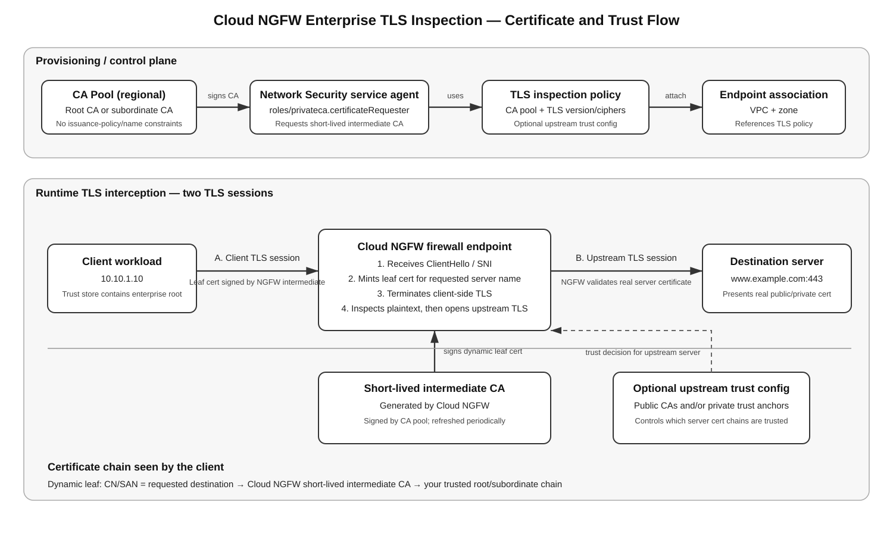

# Google Cloud NGFW Enterprise TLS Inspection — Certificate Chain, CA Service, Trust, and Runtime Flow

## Scope

This guide explains in implementation-level detail how **Cloud NGFW Enterprise TLS inspection** builds and uses its certificate chain. It covers Certificate Authority Service (CA Service), the regional CA pool, Google Cloud Network Security service-agent permissions, Cloud NGFW-generated short-lived intermediate certificate authorities (CAs), dynamically generated leaf/server certificates, optional Certificate Manager trust configs for validating upstream private servers, firewall endpoint associations, firewall-policy `--tls-inspect`, client trust-store deployment, packet/session flow, verification, limitations, and troubleshooting.

The most important idea is that Cloud NGFW creates **two independent TLS sessions** during decryption:

1. **Client ↔ Cloud NGFW** — Cloud NGFW impersonates the requested destination by presenting a dynamically generated certificate that chains to a CA trusted by the client.
2. **Cloud NGFW ↔ real destination server** — Cloud NGFW acts as a TLS client and validates the real server certificate using public trust and, optionally, a private Certificate Manager trust config.

These are different trust directions and are configured with different objects.

## Source URLs

- https://docs.cloud.google.com/firewall/docs/about-tls-inspection
- https://docs.cloud.google.com/firewall/docs/setup-tls-inspection
- https://docs.cloud.google.com/firewall/docs/manage-firewall-endpoints
- https://docs.cloud.google.com/firewall/docs/about-firewall-endpoints
- https://docs.cloud.google.com/firewall/docs/about-app-layer-inspection
- https://docs.cloud.google.com/certificate-authority-service/docs/creating-ca-pool
- https://docs.cloud.google.com/certificate-authority-service/docs/creating-root-ca
- https://docs.cloud.google.com/certificate-authority-service/docs/create-subordinate-ca
- https://docs.cloud.google.com/certificate-authority-service/docs/managing-ca-state
- https://docs.cloud.google.com/certificate-manager/docs/trust-configs
- https://docs.cloud.google.com/sdk/gcloud/reference/certificate-manager/trust-configs/import

---

## 1. Architecture at a glance



[Editable draw.io source](images/09-07-26-07-05_gcp_ngfw_tls_certificate_chain.drawio)

**What this image shows**

The upper lane shows the provisioning/control-plane relationship among the CA pool, Network Security service agent, TLS inspection policy, and firewall endpoint association. The lower lane shows the runtime split into two TLS sessions.

**What matters**

- The CA pool is used to sign Cloud NGFW-generated intermediate CAs.
- The Cloud NGFW service agent needs `roles/privateca.certificateRequester` on that CA pool.
- The TLS inspection policy references the CA pool and optional upstream trust config.
- The firewall endpoint association references the TLS inspection policy.
- The firewall rule must separately enable TLS inspection with `--tls-inspect`.
- The client must trust the root/issuing chain that ultimately signs Cloud NGFW's generated interception certificates.
- Optional trust configs are for the **upstream server side**, not for making clients trust Cloud NGFW.

**What to verify**

- CA is enabled and usable in the regional CA pool.
- No unsupported issuance policy or certificate-name constraints are attached to the interception CA pool.
- Network Security service agent has certificate-requester permission.
- TLS inspection policy references the expected regional CA pool.
- Endpoint association references that TLS inspection policy.
- Matching firewall rule uses `--tls-inspect`.
- Clients trust the enterprise CA chain.
- Private upstream roots, if needed, are present in a Certificate Manager trust config.

---

## 2. The two certificate chains you must keep separate

### 2.1 Client-facing interception chain

This chain answers:

> **Why does the client trust the certificate that Cloud NGFW presents instead of the real server certificate?**

Conceptually:

```text
Enterprise root CA or enterprise subordinate CA
              |
              | signs
              v
Cloud NGFW short-lived intermediate CA
              |
              | signs dynamically at runtime
              v
Leaf certificate for www.example.com
              |
              | presented to
              v
Client workload
```

The client validates the dynamically generated leaf certificate back to a root it already trusts.

### 2.2 Upstream-server trust chain

This chain answers:

> **How does Cloud NGFW decide whether to trust the actual destination server's certificate?**

Conceptually:

```text
Real server certificate
      |
      +--> public CA chain
      |       or
      +--> private enterprise CA chain
                 |
                 v
Certificate Manager trust config
                 |
                 v
Cloud NGFW upstream TLS validation
```

By default, the TLS policy can trust public CAs. If an upstream application uses certificates signed by a private enterprise CA, add that private trust anchor through a Certificate Manager **trust config** and reference it in the TLS inspection policy.

Do not confuse the upstream trust config with the CA pool that signs Cloud NGFW interception certificates.

---

## 3. End-to-end object relationship

```text
CA Service API
   |
   +--> Regional CA pool
          |
          +--> Root CA
          |      or
          +--> Subordinate CA signed by enterprise root
          |
          +--> Network Security service agent has
               roles/privateca.certificateRequester

Certificate Manager API (optional)
   |
   +--> Trust config for private upstream server CAs

Network Security API
   |
   +--> Regional TLS inspection policy
   |      +--> CA pool
   |      +--> min TLS version
   |      +--> cipher profile
   |      +--> public-CA trust choice
   |      +--> optional private trust config
   |
   +--> Zonal firewall endpoint association
          +--> VPC network
          +--> firewall endpoint
          +--> TLS inspection policy

Compute firewall policy
   |
   +--> rule action = apply_security_profile_group
   +--> --tls-inspect

Runtime
   |
   +--> Cloud NGFW creates/uses short-lived intermediate CA
   +--> dynamically signs destination leaf certificates
   +--> decrypts application data
   +--> threat prevention / URL filtering / malware analysis
   +--> re-encrypts to the real destination
```

---

## 4. Example values used in this guide

```cli
export ORG_ID="123456789012"
export PKI_PROJECT="security-pki-project"
export APP_PROJECT="application-project"
export REGION="us-central1"
export ZONE="us-central1-a"

export CA_POOL="ngfw-tls-ca-pool"
export ROOT_CA="ngfw-tls-root-ca"
export TLS_POLICY="ngfw-prod-tls-policy"
export TRUST_CONFIG="corp-upstream-trust"

export ENDPOINT_ASSOC="ngfw-ent-a-prod-vpc"
export FW_POLICY="prod-ngfw-policy"
```

Use your real values. Do not copy example project IDs into production.

---

## 5. Enable required APIs

Cloud NGFW TLS inspection needs Certificate Authority Service. Certificate Manager is needed only if you use a private upstream trust config.

```cli
gcloud services enable privateca.googleapis.com \
  --project="$PKI_PROJECT"

gcloud services enable networksecurity.googleapis.com \
  --project="$PKI_PROJECT"

gcloud services enable certificatemanager.googleapis.com \
  --project="$PKI_PROJECT"
```

**What it does**

- `privateca.googleapis.com` enables CA Service.
- `networksecurity.googleapis.com` enables Network Security resources including TLS inspection policies.
- `certificatemanager.googleapis.com` enables trust configs.

**Success criteria**

The services appear enabled for the project that owns the TLS/PKI resources.

---

## 6. Create the CA pool used by Cloud NGFW

The CA pool is regional and must be in the **same region** as the TLS inspection policy.

```cli
gcloud privateca pools create "$CA_POOL" \
  --project="$PKI_PROJECT" \
  --location="$REGION" \
  --tier=enterprise
```

### Critical CA-pool restriction

Google explicitly warns that the CA pool used by Cloud NGFW for TLS interception must **not** contain unsupported certificate issuance policies or certificate-name constraints.

Cloud NGFW periodically generates an intermediate CA and asks the configured CA pool to sign it. If the pool enforces constraints incompatible with the certificate Cloud NGFW needs to generate, the resulting interception certificates can be invalid.

So for the **Cloud NGFW interception CA pool**:

```text
Do not add restrictive issuance policy merely because you use such policies for normal workload certificates.
Do not add certificate-name constraints that prevent Cloud NGFW from creating the required intermediate/leaf chain.
```

This CA pool is a specialized PKI resource for TLS inspection.

### Verify the pool

```cli
gcloud privateca pools describe "$CA_POOL" \
  --project="$PKI_PROJECT" \
  --location="$REGION"
```

**Success criteria**

- correct region;
- intended tier;
- no incompatible issuance policy/name constraints.

---

## 7. Option A — use a root CA directly in CA Service

If you do not need to chain into an existing corporate PKI, create a root CA in the same pool.

```cli
gcloud privateca roots create "$ROOT_CA" \
  --project="$PKI_PROJECT" \
  --pool="$CA_POOL" \
  --location="$REGION" \
  --subject="CN=Cloud NGFW TLS Inspection Root,O=Example Corp" \
  --key-algorithm=rsa-pkcs1-4096-sha256 \
  --auto-enable
```

If you omit `--auto-enable`, the root is created staged and must be enabled before it participates in issuance.

### Verify CA state

```cli
gcloud privateca roots describe "$ROOT_CA" \
  --project="$PKI_PROJECT" \
  --pool="$CA_POOL" \
  --location="$REGION"
```

**Success criteria**

The CA is enabled and belongs to the expected pool/region.

### Export the public root certificate

```cli
gcloud privateca roots describe "$ROOT_CA" \
  --project="$PKI_PROJECT" \
  --pool="$CA_POOL" \
  --location="$REGION" \
  --format="value(pemCaCertificates)" \
  > ngfw-tls-root-ca.pem
```

That PEM contains the **public root certificate**, not the private key.

This is the certificate that must be distributed to managed client trust stores when this root is the trust anchor for the interception chain.

---

## 8. Option B — chain Cloud NGFW into an existing enterprise root CA

Many enterprises do not want a new standalone root trusted across every workstation. Instead, they issue a subordinate CA under their existing corporate root.

Conceptually:

```text
Existing enterprise root CA
        |
        | signs
        v
CA Service subordinate CA
        |
        | signs
        v
Cloud NGFW generated intermediate CA
        |
        | signs
        v
Dynamic leaf certificate
```

### 8.1 Why path length matters

Cloud NGFW itself needs to create **another intermediate CA below your subordinate**.

Therefore, the subordinate certificate used for NGFW must allow at least one subordinate CA beneath it:

```text
pathLenConstraint >= 1
```

Google notes that the default subordinate CSR behavior uses a chain-length restriction that is too small for this use case, so the NGFW-compatible subordinate must be created with the appropriate CLI options.

### 8.2 Create a subordinate CA CSR

Google's documented pattern uses key usages that permit CA signing and `--max-chain-length=1`.

```cli
gcloud privateca subordinates create ngfw-tls-subca \
  --project="$PKI_PROJECT" \
  --pool="$CA_POOL" \
  --location="$REGION" \
  --create-csr \
  --csr-output-file=ngfw-tls-subca.csr \
  --key-algorithm=rsa-pss-4096-sha256 \
  --subject="CN=Cloud NGFW TLS Inspection Subordinate,O=Example Corp" \
  --key-usages=cert_sign,crl_sign \
  --extended-key-usages=server_auth \
  --max-chain-length=1
```

The exact enterprise signing process depends on your existing PKI. The generated CSR must be signed by the enterprise parent/root CA according to your organization's CA procedures.

After signing, activate the subordinate in CA Service using the CA Service subordinate-activation workflow.

### 8.3 Client trust impact

If all managed clients already trust the enterprise root, you normally do **not** need to distribute a new root. They can validate:

```text
Dynamic server leaf
   -> Cloud NGFW intermediate
   -> CA Service enterprise subordinate
   -> existing enterprise root
```

This is usually operationally cleaner in mature enterprise PKI environments.

---

## 9. Create the Network Security service identity

Cloud NGFW needs a Google-managed service identity so it can request certificate issuance from your CA pool.

```cli
gcloud beta services identity create \
  --service=networksecurity.googleapis.com \
  --project="$PKI_PROJECT"
```

Google creates a service agent in this form:

```text
service-PROJECT_NUMBER@gcp-sa-networksecurity.iam.gserviceaccount.com
```

Get the numeric project number:

```cli
export PKI_PROJECT_NUMBER=$(gcloud projects describe "$PKI_PROJECT" \
  --format='value(projectNumber)')

export NETWORK_SECURITY_SA="service-${PKI_PROJECT_NUMBER}@gcp-sa-networksecurity.iam.gserviceaccount.com"

echo "$NETWORK_SECURITY_SA"
```

---

## 10. Grant the service agent permission to request certificates

Grant the Network Security service agent `roles/privateca.certificateRequester` on the CA pool:

```cli
gcloud privateca pools add-iam-policy-binding "$CA_POOL" \
  --project="$PKI_PROJECT" \
  --location="$REGION" \
  --member="serviceAccount:$NETWORK_SECURITY_SA" \
  --role="roles/privateca.certificateRequester"
```

### Why this permission is required

Cloud NGFW needs to ask CA Service to sign its generated intermediate CA. Without this permission, the TLS inspection policy can exist but certificate generation/inspection cannot operate correctly.

### Verify IAM

```cli
gcloud privateca pools get-iam-policy "$CA_POOL" \
  --project="$PKI_PROJECT" \
  --location="$REGION"
```

**Success criteria**

The Network Security service agent is bound to `roles/privateca.certificateRequester` on the intended pool.

---

## 11. Optional — build a trust config for private upstream servers

A trust config is needed when Cloud NGFW must connect to servers whose certificates do not chain to the normal public CA set.

Examples:

- internal HTTPS applications;
- private APIs;
- servers signed by an enterprise root CA;
- internal PKI-issued management portals.

### Important distinction

```text
CA pool
  = signs Cloud NGFW's interception certificate chain toward CLIENTS

Trust config
  = tells Cloud NGFW which private certificate chains to trust toward SERVERS
```

These are not interchangeable.

### 11.1 Export a private trust anchor

If the trust anchor is in CA Service:

```cli
gcloud privateca roots describe corp-private-root \
  --project="$PKI_PROJECT" \
  --pool=corp-server-ca-pool \
  --location="$REGION" \
  --format="value(pemCaCertificates)" \
  > corp-private-root.pem
```

If it is an external/on-premises root, use the organization's PEM-encoded public CA certificate.

### 11.2 Create trust-config YAML

Example:

```yaml
name: projects/security-pki-project/locations/us-central1/trustConfigs/corp-upstream-trust
trustStores:
  - trustAnchors:
      - pemCertificate: |
          -----BEGIN CERTIFICATE-----
          REPLACE_WITH_REAL_PRIVATE_CA_PEM
          -----END CERTIFICATE-----
```

Do not fabricate the PEM. Insert the actual public CA certificate.

### 11.3 Import the trust config

```cli
gcloud certificate-manager trust-configs import "$TRUST_CONFIG" \
  --project="$PKI_PROJECT" \
  --source=corp-upstream-trust.yaml \
  --location="$REGION"
```

### Verify it

```cli
gcloud certificate-manager trust-configs describe "$TRUST_CONFIG" \
  --project="$PKI_PROJECT" \
  --location="$REGION"
```

---

## 12. Create the TLS inspection policy

The TLS inspection policy ties the PKI settings to Network Security.

Create a YAML file:

```yaml
name: projects/security-pki-project/locations/us-central1/tlsInspectionPolicies/ngfw-prod-tls-policy
caPool: projects/security-pki-project/locations/us-central1/caPools/ngfw-tls-ca-pool
minTlsVersion: TLS_1_2
tlsFeatureProfile: PROFILE_MODERN
excludePublicCaSet: false
trustConfig: projects/security-pki-project/locations/us-central1/trustConfigs/corp-upstream-trust
```

Then import it:

```cli
gcloud network-security tls-inspection-policies import "$TLS_POLICY" \
  --project="$PKI_PROJECT" \
  --source=ngfw-prod-tls-policy.yaml \
  --location="$REGION"
```

### Field-by-field meaning

| Field | Meaning |
|---|---|
| `caPool` | CA pool used to sign Cloud NGFW-generated intermediate CAs. Must be in the same region. |
| `minTlsVersion` | Minimum accepted TLS version for inspected sessions. Documented choices include TLS 1.0, 1.1, and 1.2 as policy minimums. |
| `tlsFeatureProfile` | Cipher/feature posture such as compatible, modern, restricted, or custom. |
| `excludePublicCaSet` | `false` means public CA roots remain trusted for upstream servers. `true` means public CA roots are excluded. |
| `trustConfig` | Optional private trust anchors for validating upstream private server certificates. |

### Public-only case

If you inspect only normal Internet HTTPS servers, you can omit `trustConfig` and leave the public CA set enabled.

### Private-only case

If you set:

```yaml
excludePublicCaSet: true
```

Cloud NGFW will not trust public server certificate chains; upstream servers must chain to a CA in the specified trust config.

---

## 13. Attach the TLS inspection policy to the firewall endpoint association

The TLS inspection policy must be attached to the **endpoint association**, not directly to the firewall endpoint.

```cli
gcloud network-security firewall-endpoint-associations update "$ENDPOINT_ASSOC" \
  --project="$APP_PROJECT" \
  --location="$ZONE" \
  --tls-inspection-policy="projects/$PKI_PROJECT/locations/$REGION/tlsInspectionPolicies/$TLS_POLICY"
```

### Verify the association

```cli
gcloud network-security firewall-endpoint-associations describe "$ENDPOINT_ASSOC" \
  --project="$APP_PROJECT" \
  --location="$ZONE"
```

**Success criteria**

- association is active;
- expected endpoint is attached;
- expected TLS inspection policy URI is present.

Remember: the association is **zonal** while the TLS inspection policy and CA pool are **regional**.

---

## 14. Enable TLS decryption on the actual firewall-policy rule

Attaching the TLS policy to the endpoint association does **not** decrypt every flow automatically.

The matching firewall-policy rule must also use:

```text
--tls-inspect
```

Example:

```cli
gcloud compute network-firewall-policies rules update 200 \
  --firewall-policy="$FW_POLICY" \
  --global-firewall-policy \
  --tls-inspect \
  --project="$APP_PROJECT"
```

The rule must already use:

```text
action = apply_security_profile_group
```

So the activation logic is:

```text
Endpoint association has TLS policy
              AND
Firewall rule matches the connection
              AND
Firewall rule action = apply_security_profile_group
              AND
Firewall rule has --tls-inspect
              ↓
TLS decryption is eligible for that session
```

---

## 15. Distribute the CA trust anchor to clients

This is the step that prevents browser/application certificate errors.

When Cloud NGFW intercepts `https://www.example.com`, the client no longer sees the original website's leaf certificate. It sees a new certificate generated by Cloud NGFW for `www.example.com`.

The client must be able to build that certificate chain back to a trusted root.

### Windows domain clients

Common enterprise method:

1. Open **Group Policy Management**.
2. Edit the GPO applied to managed computers.
3. Go to **Computer Configuration > Policies > Windows Settings > Security Settings > Public Key Policies > Trusted Root Certification Authorities**.
4. Import the public enterprise/root CA certificate.
5. Apply/refresh policy.

Verify on a client:

```cli
gpupdate /force
```

Then inspect **certlm.msc > Trusted Root Certification Authorities**.

### Linux clients

Trust-store method is distribution-specific. For Debian/Ubuntu-style systems, place the CA certificate under the local CA directory and update the store using the distribution's documented trust command. For RHEL-family systems, use the system trust-anchor mechanism appropriate to the OS release.

Do not blindly copy Windows/Linux commands into unmanaged distributions; use the supported trust-store procedure for the operating system.

### Managed browsers and applications

Some applications use their own trust stores rather than the OS trust store. Java runtimes, containers, custom appliances, and pinned applications may require separate trust configuration.

Certificate pinning can make transparent TLS interception impossible for some applications even when the operating system trusts your CA.

---

## 16. What happens during a real HTTPS session

Assume:

```text
Client:            10.10.1.10
Destination:       www.example.com
Resolved IP:       203.0.113.20
Destination port:  443
Firewall action:   apply_security_profile_group
TLS inspect:       enabled
```

### Step 1 — client begins TCP/TLS

The client sends traffic to:

```text
10.10.1.10:49152 -> 203.0.113.20:443
```

Normal VPC routing still determines the real destination path.

### Step 2 — firewall policy selects the session

The new connection matches an applicable hierarchical/global firewall policy rule using `apply_security_profile_group` and `--tls-inspect`.

### Step 3 — Packet Intercept sends it to the zonal firewall endpoint

The endpoint becomes an inline inspection point for the session without becoming the VPC route next hop.

### Step 4 — endpoint reads TLS ClientHello

The endpoint can observe the TLS handshake information such as Server Name Indication (SNI):

```text
SNI = www.example.com
```

### Step 5 — endpoint establishes the upstream server side

Cloud NGFW opens a TLS connection to the real destination server.

The real server sends its actual certificate chain.

Cloud NGFW validates that chain using:

- the normal public CA set if enabled;
- the private trust config if configured;
- both if the policy is configured for public and private trust.

### Step 6 — Cloud NGFW generates a client-facing leaf certificate

Cloud NGFW creates a short-lived server certificate representing the requested host, for example:

```text
Subject/SAN: www.example.com
Issuer:      Cloud NGFW generated intermediate CA
```

The leaf is not the original server's leaf certificate.

### Step 7 — Cloud NGFW sends that certificate to the client

The client evaluates the chain:

```text
www.example.com dynamic leaf
     ↓
Cloud NGFW short-lived intermediate
     ↓
CA Service root/subordinate chain
     ↓
trusted enterprise root
```

If the client trusts the root chain, the TLS handshake succeeds.

If not, the user sees an unknown/untrusted issuer error.

### Step 8 — Cloud NGFW now has plaintext application data

The endpoint terminates the client-side TLS and decrypts the application stream.

That plaintext can be evaluated by the attached security profile group, such as:

- Threat Prevention;
- URL filtering;
- supported malware-analysis services.

### Step 9 — Cloud NGFW re-encrypts toward the real server

Cloud NGFW uses the independent upstream TLS session to send allowed traffic to the actual destination.

Therefore, there are two cryptographically separate sessions:

```text
Client ===== TLS session A ===== Cloud NGFW ===== TLS session B ===== Server
```

The client and server do not share one end-to-end TLS session when inspection is active.

---

## 17. Where the short-lived intermediate CA comes from

Google documents that Cloud NGFW periodically generates an intermediate CA and has the configured CA pool sign it.

The conceptual sequence is:

```text
1. Network Security service generates/requests intermediate CA material
2. Service agent requests signing from CA Service
3. CA Service signs the intermediate using a CA in the pool
4. Cloud NGFW keeps the generated intermediate in memory
5. Cloud NGFW uses it to sign dynamic server leaf certificates
6. Intermediate is periodically refreshed/rotated
```

The customer does not manually upload an intermediate CA into every firewall endpoint.

Google also documents that TLS-inspection leaf certificates are short-lived and, once issued, cannot be individually modified or revoked through CA Service. Their short lifetime is part of the operational model.

The main Cloud NGFW documentation also states that generated intermediates are periodically refreshed, historically documented on a 24-hour cycle. Always verify the current TLS-inspection documentation/release notes for exact lifecycle wording because service implementation details can evolve.

---

## 18. Why the private key does not need to be deployed to clients

Only the **public trust anchor** must reach client trust stores.

```text
Client receives:
  public root/intermediate certificates as trust anchors

Client does NOT receive:
  root CA private key
  subordinate CA private key
  Cloud NGFW generated intermediate private key
```

The signing keys remain in the managed PKI/Cloud NGFW service boundary.

Distributing CA private keys to endpoints would be a severe security error.

---

## 19. Verification workflow

### 19.1 Verify CA pool

```cli
gcloud privateca pools describe "$CA_POOL" \
  --project="$PKI_PROJECT" \
  --location="$REGION"
```

**What it tests:** correct pool, region, and policy posture.

**Expected state:** pool exists in the TLS-policy region and has no incompatible issuance/name constraints.

### 19.2 Verify root/subordinate CA

Root example:

```cli
gcloud privateca roots describe "$ROOT_CA" \
  --project="$PKI_PROJECT" \
  --pool="$CA_POOL" \
  --location="$REGION"
```

**Expected state:** enabled.

For a subordinate architecture, verify the subordinate is active and its signed certificate chain permits the additional Cloud NGFW intermediate CA.

### 19.3 Verify service-agent IAM

```cli
gcloud privateca pools get-iam-policy "$CA_POOL" \
  --project="$PKI_PROJECT" \
  --location="$REGION"
```

**Success criteria:** Network Security service agent has `roles/privateca.certificateRequester`.

### 19.4 Verify TLS inspection policy

```cli
gcloud network-security tls-inspection-policies describe "$TLS_POLICY" \
  --project="$PKI_PROJECT" \
  --location="$REGION"
```

Check:

- CA pool URI;
- minimum TLS version;
- feature/cipher profile;
- public CA trust setting;
- trust-config URI if used.

### 19.5 Verify endpoint association

```cli
gcloud network-security firewall-endpoint-associations describe "$ENDPOINT_ASSOC" \
  --project="$APP_PROJECT" \
  --location="$ZONE"
```

**Success criteria:** association is active and references the intended TLS inspection policy.

### 19.6 Verify the firewall rule

```cli
gcloud compute network-firewall-policies rules describe 200 \
  --firewall-policy="$FW_POLICY" \
  --global-firewall-policy \
  --project="$APP_PROJECT"
```

**Success criteria:** rule uses `apply_security_profile_group` and TLS inspection is enabled.

### 19.7 Verify from a client with OpenSSL

From a controlled client:

```cli
openssl s_client -connect www.example.com:443 \
  -servername www.example.com \
  -showcerts
```

When the flow is being decrypted, inspect the certificate chain shown to the client.

You should expect the presented leaf to represent the destination hostname but chain through the enterprise/Cloud NGFW interception hierarchy rather than directly through the website's original public issuer.

Do not hard-code an expected serial number or issuer string because generated certificates and intermediates rotate.

### 19.8 Verify the actual destination separately

Run the same test from a network path that is **not** subject to TLS inspection, if operationally allowed, and compare the issuer chain.

This helps prove that Cloud NGFW is generating the client-facing leaf rather than merely passing the server certificate through unchanged.

---

## 20. Troubleshooting by symptom

### Symptom: browser shows `NET::ERR_CERT_AUTHORITY_INVALID` or equivalent

**Where:** client trust store.

**What it tests:** whether the client trusts the interception root chain.

**Likely causes:**

- root CA not distributed;
- wrong root distributed;
- application uses its own trust store;
- subordinate chain missing;
- client has stale policy/trust configuration.

**Next action:** inspect the presented certificate chain and confirm its root is trusted by that specific application/runtime.

### Symptom: TLS policy exists but no decryption happens

**Where:** firewall rule and endpoint association.

**What it tests:** both activation points.

**Likely causes:**

- TLS policy not attached to the zonal endpoint association;
- firewall rule does not use `--tls-inspect`;
- traffic never reaches `apply_security_profile_group` because a higher-priority rule wins;
- missing endpoint association in the workload zone.

**Next action:** verify the association, then verify the effective firewall-policy rule.

### Symptom: public websites work but private HTTPS applications fail

**Where:** upstream trust config.

**What it tests:** whether Cloud NGFW trusts the private server's issuer.

**Likely cause:** the private enterprise root/subordinate is missing from the Certificate Manager trust config.

**Next action:** import the correct private CA certificate and reference the trust config in the TLS policy.

### Symptom: private sites work but normal Internet HTTPS fails

**Where:** `excludePublicCaSet`.

**Likely cause:** public CA trust was disabled by setting `excludePublicCaSet: true`.

**Next action:** if public websites must be trusted, set the policy to include the public CA set.

### Symptom: certificate generation fails after adding CA-pool policy restrictions

**Where:** CA pool issuance policy/name constraints.

**What it tests:** compatibility with Cloud NGFW intermediate/leaf generation.

**Failure meaning:** Google explicitly warns that unsupported CA-pool issuance policies or certificate-name constraints can result in invalid Cloud NGFW certificates.

**Next action:** use a dedicated CA pool without those unsupported restrictions.

### Symptom: external-root subordinate architecture cannot create the Cloud NGFW intermediate chain

**Where:** subordinate CA Basic Constraints/path length.

**Likely cause:** `pathLenConstraint` does not allow another intermediate CA below the subordinate.

**Next action:** recreate/sign the subordinate with `--max-chain-length=1` or another value consistent with the required PKI hierarchy and organizational policy.

### Symptom: permission denied when Cloud NGFW tries to use the CA pool

**Where:** CA-pool IAM.

**Likely cause:** `roles/privateca.certificateRequester` was granted to a human/admin account rather than the Network Security service agent, or granted on the wrong pool/project.

**Next action:** verify the exact `service-PROJECT_NUMBER@gcp-sa-networksecurity.iam.gserviceaccount.com` principal on the correct pool.

### Symptom: only some applications fail after TLS inspection is enabled

**Where:** application TLS behavior.

**Possible causes:**

- certificate pinning;
- unsupported TLS/application behavior;
- HTTP/2/QUIC/HTTP/3 limitations documented for Cloud NGFW TLS inspection;
- application-specific trust store;
- mutual TLS assumptions;
- unsupported cipher profile.

**Next action:** test with a controlled client, inspect TLS negotiation, then create a scoped bypass/exclusion only when the architecture requires it and the risk is understood.

---

## 21. Common mistakes

1. **Thinking the trust config makes clients trust Cloud NGFW.** It does not; it controls Cloud NGFW's trust of upstream private servers.
2. **Creating a CA pool in a different region from the TLS inspection policy.** The referenced CA pool must be in the same region.
3. **Granting `certificateRequester` to the administrator instead of the Network Security service agent.** The managed service needs the permission.
4. **Adding restrictive issuance policies/name constraints to the interception CA pool.** Google warns this can generate invalid certificates.
5. **Using a subordinate CA with `pathLenConstraint=0`.** Cloud NGFW needs to create another intermediate below it.
6. **Attaching the TLS policy to the association but forgetting `--tls-inspect` on the firewall rule.** Both are required.
7. **Enabling `--tls-inspect` on a rule that never wins firewall-policy evaluation.** Higher-priority allow/deny rules can prevent interception.
8. **Forgetting to distribute the trust root to clients.** TLS immediately fails with certificate trust errors.
9. **Assuming every application uses the OS trust store.** Java, containers, browsers, appliances, and embedded clients can maintain separate stores.
10. **Assuming certificate pinning can always be bypassed transparently.** Some applications intentionally reject dynamically re-signed certificates.
11. **Disabling the public CA set unintentionally.** This can break normal public HTTPS destinations.
12. **Assuming one TLS policy covers every region automatically.** TLS inspection policies and CA pools are regional resources.

---

## 22. Production rollout pattern

A safe operational sequence is:

1. Create a dedicated regional CA pool.
2. Create or activate the root/subordinate CA hierarchy.
3. Verify the subordinate path length if using an external enterprise root.
4. Create the Network Security service identity.
5. Grant only the required CA-pool certificate-requester permission.
6. Export/distribute the public trust anchor to a pilot device group.
7. Create any required upstream private trust config.
8. Create the regional TLS inspection policy.
9. Attach the policy to a test-zone firewall endpoint association.
10. Enable `--tls-inspect` only on a narrow pilot firewall rule.
11. Verify the client sees a re-signed certificate and trusts the chain.
12. Verify Cloud NGFW validates the real upstream server certificate.
13. Verify Threat Prevention/URL filtering sees the decrypted content as expected.
14. Test pinned applications, legacy TLS, and application-specific trust stores.
15. Expand scope gradually by workload/tag/policy rather than enabling decryption globally in one change.

---

## 23. Key takeaways

1. Cloud NGFW TLS inspection is a **TLS proxy/interception model with two TLS sessions**, not passive decryption of one end-to-end TLS connection.
2. The CA pool signs Cloud NGFW-generated intermediate CAs; those intermediates sign short-lived destination leaf certificates.
3. Clients must trust the root chain behind those generated certificates.
4. The Network Security service agent needs `roles/privateca.certificateRequester` on the CA pool.
5. The CA pool and TLS inspection policy must be regional and compatible.
6. Do not attach unsupported issuance policies or name constraints to the interception CA pool.
7. An externally signed subordinate must allow at least one additional intermediate beneath it (`pathLenConstraint >= 1`).
8. Certificate Manager trust configs are optional and control **upstream private-server trust**, not client trust.
9. TLS decryption requires both the TLS policy on the endpoint association and `--tls-inspect` on a matching `apply_security_profile_group` firewall rule.
10. Certificate pinning, private trust stores, TLS feature compatibility, and documented HTTP/2/QUIC/HTTP/3 limitations must be validated before broad production rollout.

---

## Sources

- Google Cloud, TLS inspection overview: https://docs.cloud.google.com/firewall/docs/about-tls-inspection
- Google Cloud, Set up TLS inspection: https://docs.cloud.google.com/firewall/docs/setup-tls-inspection
- Google Cloud, Manage firewall endpoint associations: https://docs.cloud.google.com/firewall/docs/manage-firewall-endpoints
- Google Cloud, Firewall endpoint overview: https://docs.cloud.google.com/firewall/docs/about-firewall-endpoints
- Google Cloud, Application layer inspection overview: https://docs.cloud.google.com/firewall/docs/about-app-layer-inspection
- Certificate Authority Service, Create a CA pool: https://docs.cloud.google.com/certificate-authority-service/docs/creating-ca-pool
- Certificate Authority Service, Create a root CA: https://docs.cloud.google.com/certificate-authority-service/docs/creating-root-ca
- Certificate Authority Service, Create a subordinate CA: https://docs.cloud.google.com/certificate-authority-service/docs/create-subordinate-ca
- Certificate Authority Service, Manage CA state: https://docs.cloud.google.com/certificate-authority-service/docs/managing-ca-state
- Certificate Manager, Manage trust configs: https://docs.cloud.google.com/certificate-manager/docs/trust-configs
- Google Cloud CLI, Trust config import: https://docs.cloud.google.com/sdk/gcloud/reference/certificate-manager/trust-configs/import
