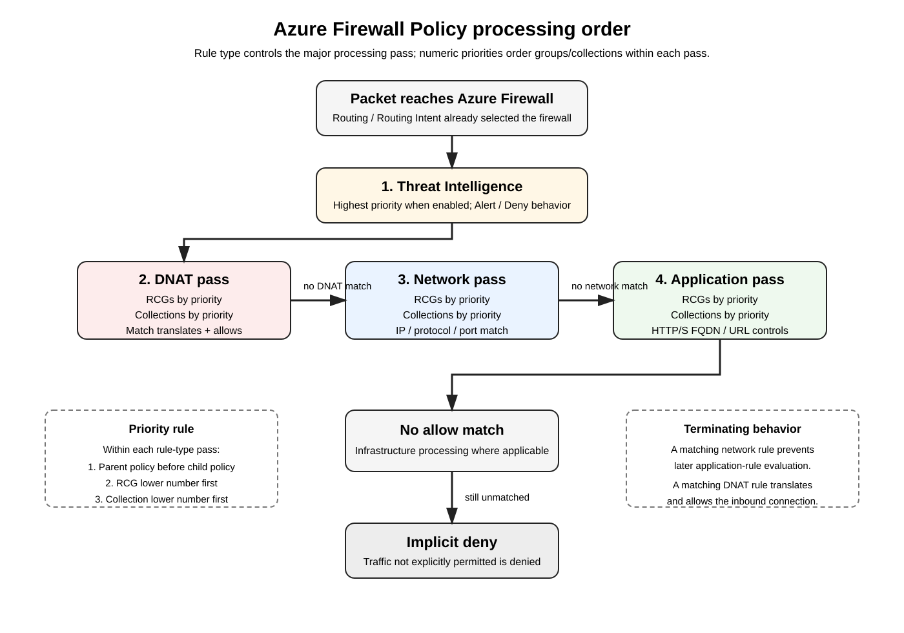

# Azure Firewall Policy — Rule Collections, DNAT, Network/Application Rules, DNS, IDPS, TLS Inspection, Logging, and Azure CLI Deep Dive

> Standalone deep dive for building and validating an **Azure Firewall Policy** used by Azure Firewall, including secured Azure Virtual WAN hubs. This guide focuses on the policy object itself: rule collection groups, rule collections, rules, rule-processing order, DNAT, east-west and branch policy, Internet application control, DNS dependencies, Premium inspection, diagnostics, verification, and troubleshooting.

## Source URLs

- https://learn.microsoft.com/en-us/azure/firewall/policy-rule-sets
- https://learn.microsoft.com/en-us/azure/firewall/rule-processing
- https://learn.microsoft.com/en-us/azure/firewall-manager/rule-processing
- https://learn.microsoft.com/en-us/azure/firewall-manager/policy-overview
- https://learn.microsoft.com/en-us/cli/azure/network/firewall/policy?view=azure-cli-latest
- https://learn.microsoft.com/en-us/cli/azure/network/firewall/policy/rule-collection-group?view=azure-cli-latest
- https://learn.microsoft.com/en-us/cli/azure/network/firewall/policy/rule-collection-group/collection?view=azure-cli-latest
- https://learn.microsoft.com/en-us/azure/firewall/secure-firewall
- https://learn.microsoft.com/en-us/azure/firewall/monitor-firewall
- https://learn.microsoft.com/en-us/azure/firewall/monitor-firewall-reference
- https://learn.microsoft.com/en-us/azure/azure-monitor/reference/queries/azfwnetworkrule

## Table of contents

1. [Where Firewall Policy fits](#1-where-firewall-policy-fits)
2. [Policy hierarchy](#2-policy-hierarchy)
3. [Rule-processing order](#3-rule-processing-order)
4. [Lab addressing and variables](#4-lab-addressing-and-variables)
5. [Create the Firewall Policy](#5-create-the-firewall-policy)
6. [Create a rule collection group](#6-create-a-rule-collection-group)
7. [East-west network rules](#7-east-west-network-rules)
8. [Branch-to-spoke rules](#8-branch-to-spoke-rules)
9. [Internet application rules](#9-internet-application-rules)
10. [DNS dependencies and DNS Proxy](#10-dns-dependencies-and-dns-proxy)
11. [DNAT publishing example](#11-dnat-publishing-example)
12. [Premium IDPS](#12-premium-idps)
13. [Premium TLS inspection](#13-premium-tls-inspection)
14. [Logging and diagnostics](#14-logging-and-diagnostics)
15. [Verification](#15-verification)
16. [Packet-processing examples](#16-packet-processing-examples)
17. [Common mistakes](#17-common-mistakes)
18. [Troubleshooting by symptom](#18-troubleshooting-by-symptom)
19. [Production design checklist](#19-production-design-checklist)
20. [Sources](#20-sources)

---

## 1. Where Firewall Policy fits

**Azure Firewall Policy** is the top-level policy resource that contains Azure Firewall security and operational settings. A firewall can be associated with a Firewall Policy whether it is deployed in a customer-managed VNet or as an Azure Firewall inside a secured Virtual WAN hub.

The important separation is:

```text
Virtual WAN Routing Intent / routes
        |
        | decides that the flow must reach Azure Firewall
        v
Azure Firewall dataplane
        |
        | evaluates Firewall Policy
        v
Threat Intelligence / DNAT / Network / Application / IDPS
        |
        v
Allow, deny, translate, log
```

**Routing does not replace policy.** Routing Intent gets the packet to the firewall. Firewall Policy decides whether the packet is permitted and what security processing applies.

## 2. Policy hierarchy

Azure Firewall Policy uses three levels:

```text
Firewall Policy
   |
   +-- Rule Collection Group (RCG)
          |
          +-- Rule Collection
                 |
                 +-- Rule
```

- **Rule Collection Group** — first organizational/priority unit.
- **Rule Collection** — second priority unit. Each collection is DNAT, Network, or Application.
- **Rule** — the actual match criteria. Rules themselves do not carry an independent numeric priority; the containing group/collection ordering controls evaluation.

Microsoft provides three default rule collection groups:

| Default group | Priority |
|---|---:|
| Default DNAT rule collection group | `100` |
| Default Network rule collection group | `200` |
| Default Application rule collection group | `300` |

You can create custom rule collection groups with your own priorities. Microsoft documents rule-collection-group priorities from `100` through `65000`, where the lower value is processed earlier.

## 3. Rule-processing order



[Editable draw.io version](images/09-07-26-15-20_azure_firewall_policy_processing.drawio)

**What this image shows:** A packet reaches Azure Firewall, Threat Intelligence can deny first, then Azure Firewall performs rule-type passes in the fixed order DNAT → Network → Application. Within each pass, rule collection groups and collections are evaluated by priority. Unmatched traffic is denied by default.

**What matters:** A lower application-rule priority number does **not** cause application rules to run before network rules. Rule type wins over numeric priority across types.

**What to verify:** Confirm the intended rule type, collection priority, parent/child policy inheritance, and whether the packet is inbound or outbound.

Microsoft documents the processing sequence as:

1. **Threat Intelligence** rules, when enabled, have the highest priority and can alert/deny before normal rules.
2. **DNAT rules**.
3. **Network rules**.
4. **Application rules**.
5. Infrastructure processing where applicable.
6. **Implicit deny** when no rule permits the traffic.

A matching rule is terminating. For example, if an outbound flow matches a network rule, Azure Firewall does not continue to application rules for that flow.

For DNAT, a matching DNAT rule translates and allows the connection; Microsoft documents that it is not subsequently evaluated by normal network rules. Application rules are not used to filter inbound Internet connections.

### Parent/child policy nuance

If a Firewall Policy inherits from a parent policy, inherited network and application rule collections are processed before equivalent child-policy collections. NAT rule collections are not inherited because they are specific to the individual firewall.

## 4. Lab addressing and variables

This guide uses a realistic example:

```text
Spoke-A:              10.10.0.0/16
Spoke-B:              10.20.0.0/16
Web server in Spoke-B 10.20.1.10
Branch:               10.50.0.0/16
DNS-1:                10.100.10.10
DNS-2:                10.100.10.11
Azure Firewall PIP:   20.30.40.50
```

Variables:

```cli
RG='rg-network'
LOCATION='eastus'
FW_POLICY='azfw-policy-eastus'
RCG='rcg-production'
FW_NAME='azfw-vhub-eastus'
LOG_WORKSPACE_ID='/subscriptions/<SUB_ID>/resourceGroups/<LOG_RG>/providers/Microsoft.OperationalInsights/workspaces/<WORKSPACE>'
```

Install/upgrade the Azure Firewall CLI extension before using rule-collection commands:

```cli
az extension add --name azure-firewall --upgrade
```

**CLI support caveat:** Microsoft currently documents several `az network firewall policy rule-collection-group collection ...` create/add operations as **Preview** even though Azure Firewall Policy itself is a production service. Validate the exact Azure CLI and extension version before using these commands in production automation.

## 5. Create the Firewall Policy

Create a Premium Firewall Policy:

```cli
az network firewall policy create \
  --resource-group "$RG" \
  --name "$FW_POLICY" \
  --location "$LOCATION" \
  --sku Premium
```

Verify:

```cli
az network firewall policy show \
  --resource-group "$RG" \
  --name "$FW_POLICY" \
  --output yaml
```

**Success criteria:** policy provisioning succeeds, SKU is the intended tier, and the firewall resource is associated with this policy.

## 6. Create a rule collection group

Create one production group with priority `100`:

```cli
az network firewall policy rule-collection-group create \
  --resource-group "$RG" \
  --policy-name "$FW_POLICY" \
  --name "$RCG" \
  --priority 100
```

Verify:

```cli
az network firewall policy rule-collection-group show \
  --resource-group "$RG" \
  --policy-name "$FW_POLICY" \
  --name "$RCG" \
  --output yaml
```

A production environment can use multiple RCGs, for example:

```text
100  rcg-shared-infrastructure
200  rcg-east-west
300  rcg-branch-access
400  rcg-internet-egress
```

However, remember that Azure Firewall still performs its DNAT, Network, and Application passes in that fixed rule-type order.

## 7. East-west network rules

Use a **NetworkRule** when the policy decision is based on source/destination IP, protocol, and destination port.

Example: Spoke-A may access HTTPS servers in Spoke-B.

```cli
az network firewall policy rule-collection-group collection add-filter-collection \
  --resource-group "$RG" \
  --policy-name "$FW_POLICY" \
  --rule-collection-group-name "$RCG" \
  --name east-west-allow \
  --collection-priority 100 \
  --action Allow \
  --rule-name spoke-a-to-spoke-b-https \
  --rule-type NetworkRule \
  --description "Allow Spoke A HTTPS to application servers in Spoke B" \
  --source-addresses 10.10.0.0/16 \
  --destination-addresses 10.20.0.0/16 \
  --destination-ports 443 \
  --ip-protocols TCP
```

**Expected effect:** only TCP/443 matching the configured prefixes is permitted by this rule. This does not automatically permit unrelated ports or reverse-initiated sessions.

## 8. Branch-to-spoke rules

Example: allow a branch to reach HTTPS and RDP services in Spoke-B.

```cli
az network firewall policy rule-collection-group collection add-filter-collection \
  --resource-group "$RG" \
  --policy-name "$FW_POLICY" \
  --rule-collection-group-name "$RCG" \
  --name branch-to-spokes \
  --collection-priority 110 \
  --action Allow \
  --rule-name branch-to-spoke-b \
  --rule-type NetworkRule \
  --description "Permit approved branch services to Spoke B" \
  --source-addresses 10.50.0.0/16 \
  --destination-addresses 10.20.0.0/16 \
  --destination-ports 443 3389 \
  --ip-protocols TCP
```

For tighter control, split management protocols such as RDP/SSH from normal application traffic so they can have separate owners, logging expectations, and source ranges.

## 9. Internet application rules

Use an **ApplicationRule** when you want Layer-7 destination controls such as FQDNs rather than simply allowing destination TCP/443 to arbitrary IP addresses.

Example:

```cli
az network firewall policy rule-collection-group collection add-filter-collection \
  --resource-group "$RG" \
  --policy-name "$FW_POLICY" \
  --rule-collection-group-name "$RCG" \
  --name internet-applications \
  --collection-priority 200 \
  --action Allow \
  --rule-name allow-microsoft-web \
  --rule-type ApplicationRule \
  --description "Allow approved Microsoft HTTPS destinations" \
  --source-addresses 10.10.0.0/16 \
  --target-fqdns www.microsoft.com login.microsoftonline.com \
  --protocols Https=443
```

### Network rule versus application rule

| Requirement | Prefer |
|---|---|
| Exact IP/protocol/port control | Network rule |
| HTTP/HTTPS FQDN control | Application rule |
| Web categories / URL control where supported | Application rule |
| Non-HTTP/S L3/L4 protocol | Network rule |

Because network rules are evaluated before application rules, a broad network allow for TCP/443 can defeat the intent of a later restrictive application rule. Avoid overly broad L3/L4 permits when you expect Layer-7 FQDN enforcement.

## 10. DNS dependencies and DNS Proxy

Suppose workloads must use internal resolvers `10.100.10.10` and `10.100.10.11`.

Allow DNS explicitly:

```cli
az network firewall policy rule-collection-group collection add-filter-collection \
  --resource-group "$RG" \
  --policy-name "$FW_POLICY" \
  --rule-collection-group-name "$RCG" \
  --name dns-access \
  --collection-priority 120 \
  --action Allow \
  --rule-name workload-to-dns \
  --rule-type NetworkRule \
  --description "Permit workloads to internal DNS resolvers" \
  --source-addresses 10.10.0.0/16 10.20.0.0/16 \
  --destination-addresses 10.100.10.10 10.100.10.11 \
  --destination-ports 53 \
  --ip-protocols TCP UDP
```

Configure Firewall Policy DNS servers and DNS Proxy:

```cli
az network firewall policy update \
  --resource-group "$RG" \
  --name "$FW_POLICY" \
  --dns-servers 10.100.10.10 10.100.10.11 \
  --enable-dns-proxy true
```

**Why DNS Proxy matters:** Microsoft recommends DNS Proxy when Azure Firewall and clients need consistent name resolution for FQDN-based controls. If the client resolves one address and Azure Firewall resolves another, FQDN-based policy behavior can become difficult to troubleshoot.

## 11. DNAT publishing example

Example publication:

```text
Public address: 20.30.40.50:443
Translated to:  10.20.1.10:443
```

Create a NAT collection:

```cli
az network firewall policy rule-collection-group collection add-nat-collection \
  --resource-group "$RG" \
  --policy-name "$FW_POLICY" \
  --rule-collection-group-name "$RCG" \
  --name inbound-dnat \
  --collection-priority 50 \
  --action DNAT \
  --rule-name publish-web-https \
  --description "Publish Spoke B web server" \
  --source-addresses '<TRUSTED_PUBLIC_SOURCE_CIDR>' \
  --destination-addresses 20.30.40.50 \
  --destination-ports 443 \
  --ip-protocols TCP \
  --translated-address 10.20.1.10 \
  --translated-port 443
```

**Security recommendation:** Microsoft recommends using specific Internet source ranges for DNAT rather than wildcard sources when possible.

Conceptual translation:

```text
Before Azure Firewall
src = trusted-client-public-ip:<ephemeral>
dst = 20.30.40.50:443

After matching DNAT
src = trusted-client-public-ip:<ephemeral>
dst = 10.20.1.10:443
```

A matching DNAT rule is terminating for the normal rule-processing path. Application rules do not provide inbound HTTP/S filtering; use an appropriate WAF design when Layer-7 inbound web filtering is required.

## 12. Premium IDPS

Azure Firewall Premium Intrusion Detection and Prevention System (IDPS) uses Microsoft-managed signatures to detect/block suspicious traffic.

A safe rollout pattern is:

```text
Off -> Alert -> review/tune -> Deny
```

Configure Alert mode first:

```cli
az network firewall policy update \
  --resource-group "$RG" \
  --name "$FW_POLICY" \
  --idps-mode Alert
```

After validation/tuning, move to prevention:

```cli
az network firewall policy update \
  --resource-group "$RG" \
  --name "$FW_POLICY" \
  --idps-mode Deny
```

Accepted modes in the current CLI surface are `Alert`, `Deny`, and `Off`.

**Success criteria:** the policy shows the intended intrusion-detection mode and `AZFWIdpsSignature` events appear when signatures match.

## 13. Premium TLS inspection

TLS inspection is a Premium capability and requires a trusted enterprise CA workflow, a certificate/secret stored appropriately, and identity/Key Vault permissions according to Microsoft's documented design.

The current Firewall Policy CLI exposes TLS certificate-related parameters such as policy identity, certificate name, and Key Vault secret reference. Because these arguments and certificate workflows can be version-sensitive, validate the exact current command syntax and certificate format before automating production TLS inspection.

Operationally, TLS inspection introduces three important checks:

1. Clients must trust the enterprise CA used by Azure Firewall.
2. The Firewall Policy identity must be able to access the required certificate secret.
3. Application rules must be designed so the intended HTTPS traffic is actually subject to TLS inspection.

Do not interpret "Premium firewall" as "all TLS is automatically decrypted."

## 14. Logging and diagnostics

Configure diagnostics on the **Azure Firewall resource**, not merely on the Firewall Policy object.

Microsoft recommends resource-specific structured logs. Important tables include:

- `AZFWNetworkRule`
- `AZFWApplicationRule`
- `AZFWNatRule`
- `AZFWThreatIntel`
- `AZFWIdpsSignature`
- `AZFWDnsQuery`
- `AZFWInternalFqdnResolutionFailure`

### Discover supported diagnostic categories

```cli
FW_ID=$(az network firewall show \
  --resource-group "$RG" \
  --name "$FW_NAME" \
  --query id -o tsv)

az monitor diagnostic-settings categories list \
  --resource "$FW_ID" \
  --output table
```

Use the returned category names from your current subscription/region to build the diagnostic setting rather than hard-coding stale category strings.

### Example KQL — network-rule hits

```text
AZFWNetworkRule
| take 100
```

### Example KQL — all major firewall decisions

```text
AZFWNetworkRule
| union AZFWApplicationRule,
        AZFWNatRule,
        AZFWThreatIntel,
        AZFWIdpsSignature
| take 100
```

Microsoft notes that structured logs can take time to begin populating after diagnostics are enabled; do not declare policy failure solely because the table is empty immediately after configuration.

## 15. Verification

Inspect the policy:

```cli
az network firewall policy show \
  --resource-group "$RG" \
  --name "$FW_POLICY" \
  --output yaml
```

List rule collection groups:

```cli
az network firewall policy rule-collection-group list \
  --resource-group "$RG" \
  --policy-name "$FW_POLICY" \
  --output table
```

Inspect the production group:

```cli
az network firewall policy rule-collection-group show \
  --resource-group "$RG" \
  --policy-name "$FW_POLICY" \
  --name "$RCG" \
  --output yaml
```

List collections:

```cli
az network firewall policy rule-collection-group collection list \
  --resource-group "$RG" \
  --policy-name "$FW_POLICY" \
  --rule-collection-group-name "$RCG" \
  --output table
```

### Expected logical structure

```text
Firewall Policy: azfw-policy-eastus
|
+-- RCG: rcg-production
    |
    +-- inbound-dnat
    |   +-- publish-web-https
    |
    +-- east-west-allow
    |   +-- spoke-a-to-spoke-b-https
    |
    +-- branch-to-spokes
    |   +-- branch-to-spoke-b
    |
    +-- dns-access
    |   +-- workload-to-dns
    |
    +-- internet-applications
        +-- allow-microsoft-web
```

## 16. Packet-processing examples

### 16.1 Spoke-A to Spoke-B HTTPS

Packet:

```text
10.10.1.20:50000 -> 10.20.1.10:443 TCP
```

Processing:

1. Routing/Routing Intent delivers the packet to Azure Firewall.
2. Threat Intelligence evaluates first when enabled.
3. No inbound DNAT match is expected for this private east-west flow.
4. Network-rule pass evaluates `east-west-allow`.
5. `spoke-a-to-spoke-b-https` matches and allows.
6. Application-rule pass is not reached because the network rule match is terminating.
7. The flow is logged in `AZFWNetworkRule` when structured logging is enabled.

### 16.2 Spoke-A to Microsoft HTTPS

Packet:

```text
10.10.1.20:<ephemeral> -> resolved-IP-for-login.microsoftonline.com:443
```

Processing:

1. The firewall receives the Internet-bound flow.
2. Threat Intelligence evaluates.
3. Network rules are evaluated first.
4. If no broad network rule permits TCP/443, application rules are evaluated.
5. The HTTPS FQDN is evaluated against `allow-microsoft-web`.
6. If matched, traffic is allowed and logged in `AZFWApplicationRule`.

**Common design failure:** creating a broad network rule such as `10.10.0.0/16 -> Internet TCP/443 Allow` causes the flow to terminate at the network-rule stage, bypassing the intended application-rule FQDN restriction.

### 16.3 Internet client to published HTTPS server

Packet:

```text
client-public-ip:<ephemeral> -> 20.30.40.50:443
```

Processing:

1. Azure Firewall receives the inbound packet.
2. Threat Intelligence evaluates.
3. DNAT rules are evaluated before network/application rules.
4. `publish-web-https` matches.
5. Destination is translated to `10.20.1.10:443`.
6. The DNAT match permits the translated flow; normal application-rule filtering is not applied to the inbound connection.
7. The event is logged in `AZFWNatRule` when configured.

## 17. Common mistakes

### Treating numeric priority as global across rule types

A collection priority of `100` for an application collection does not make it run before a network collection with priority `500`. Azure Firewall performs DNAT, Network, and Application passes by rule type.

### Broad network allow defeats application policy

If TCP/443 is already allowed by a network rule, the firewall does not continue to application rules.

### Assuming DNAT needs a second network allow

Microsoft documents a DNAT match as translating and allowing the connection; the packet does not continue into normal network-rule processing.

### Using wildcard Internet sources for DNAT unnecessarily

Use specific trusted public source prefixes where possible.

### DNS proxy enabled but clients use unrelated DNS

FQDN-based enforcement becomes harder to reason about when clients and Azure Firewall resolve names differently.

### IDPS switched directly to Deny without observation

Start in Alert, observe real traffic, tune, then move to Deny according to risk requirements.

### TLS inspection configured but enterprise CA is not trusted

Clients will experience certificate failures even though the firewall policy is otherwise correct.

### Diagnostics configured on the wrong resource

Traffic logs come from the Azure Firewall resource. Verify diagnostic settings there.

## 18. Troubleshooting by symptom

### East-west HTTPS is denied

**Where:** Firewall Policy RCG/collection/rule and `AZFWNetworkRule`.

**Command/tool:**

```cli
az network firewall policy rule-collection-group show \
  -g "$RG" --policy-name "$FW_POLICY" -n "$RCG" -o yaml
```

**What it tests:** the source, destination, port, protocol, action, and collection ordering.

**Expected:** `10.10.0.0/16 -> 10.20.0.0/16 TCP/443` matches an Allow network rule.

**Failure means:** wrong address range, wrong collection action, a higher-priority deny, parent-policy rule, or traffic never reached the firewall.

**Next action:** correlate effective routing with the firewall logs before modifying the rule.

### Application rule never receives hits

**Where:** network and application collections.

**What it tests:** whether a network rule terminates the flow first.

**Expected:** no earlier network Allow should broadly match the same HTTPS flow when FQDN application control is required.

**Next action:** narrow/remove the broad network rule and retest.

### DNAT rule exists but server is unreachable

**Where:** `AZFWNatRule`, backend routing, NSG, application listener, and return path.

**Expected:** a DNAT hit is logged and the translated server accepts the destination port.

**Failure means:** source does not match, wrong firewall public IP/port, backend is unavailable, or return traffic is broken.

**Next action:** distinguish "no DNAT hit" from "DNAT hit but backend/return path failure."

### FQDN rule behaves inconsistently

**Where:** DNS client configuration, Firewall Policy DNS settings, `AZFWDnsQuery`, and internal FQDN resolution failure logs.

**Expected:** clients and Azure Firewall use a coherent DNS path and the firewall can resolve the target FQDN.

**Next action:** enable/validate DNS Proxy where appropriate and inspect DNS logs before changing security rules.

### IDPS blocks legitimate traffic

**Where:** `AZFWIdpsSignature`.

**Expected:** signature ID, action, protocol, source/destination, and rule context identify the event.

**Next action:** validate the signature and traffic, then tune supported IDPS settings rather than disabling inspection globally.

### TLS-inspected clients report certificate errors

**Where:** client trust store, Firewall Policy identity, Key Vault certificate secret, and application rule.

**Failure means:** enterprise CA trust/certificate access is incomplete or traffic is being inspected unexpectedly.

**Next action:** validate the certificate chain and policy identity permissions before troubleshooting routing.

## 19. Production design checklist

- [ ] Firewall Policy SKU matches required Standard/Premium features.
- [ ] Rule collection groups have intentional priorities and ownership boundaries.
- [ ] DNAT, Network, and Application rule-type processing order is understood.
- [ ] Parent/child policy inheritance is documented.
- [ ] East-west rules use least-privilege source/destination/port definitions.
- [ ] Branch-to-spoke management rules are separated from application traffic where appropriate.
- [ ] Broad network rules do not bypass intended application/FQDN enforcement.
- [ ] DNS servers and DNS Proxy behavior are intentional.
- [ ] DNAT uses trusted source ranges when possible.
- [ ] Backend DNAT return routing is symmetric.
- [ ] IDPS is rolled out with observation/tuning before broad blocking.
- [ ] TLS inspection CA, Key Vault, identity, and client trust are validated.
- [ ] Structured logs are enabled on the Azure Firewall resource.
- [ ] `AZFWNetworkRule`, `AZFWApplicationRule`, `AZFWNatRule`, `AZFWThreatIntel`, `AZFWIdpsSignature`, and DNS tables are queryable as required.
- [ ] Test flows are validated against both policy logs and routing/effective-route state.

## 20. Sources

1. Microsoft Learn — Azure Firewall Policy rule sets  
   https://learn.microsoft.com/en-us/azure/firewall/policy-rule-sets
2. Microsoft Learn — Azure Firewall rule processing logic  
   https://learn.microsoft.com/en-us/azure/firewall/rule-processing
3. Microsoft Learn — Azure Firewall Manager rule processing logic  
   https://learn.microsoft.com/en-us/azure/firewall-manager/rule-processing
4. Microsoft Learn — Firewall Manager policy overview  
   https://learn.microsoft.com/en-us/azure/firewall-manager/policy-overview
5. Microsoft Learn — Azure CLI: Azure Firewall Policy  
   https://learn.microsoft.com/en-us/cli/azure/network/firewall/policy?view=azure-cli-latest
6. Microsoft Learn — Azure CLI: Firewall Policy rule collection groups  
   https://learn.microsoft.com/en-us/cli/azure/network/firewall/policy/rule-collection-group?view=azure-cli-latest
7. Microsoft Learn — Azure CLI: Firewall Policy rule collections  
   https://learn.microsoft.com/en-us/cli/azure/network/firewall/policy/rule-collection-group/collection?view=azure-cli-latest
8. Microsoft Learn — Secure your Azure Firewall deployment  
   https://learn.microsoft.com/en-us/azure/firewall/secure-firewall
9. Microsoft Learn — Monitor Azure Firewall  
   https://learn.microsoft.com/en-us/azure/firewall/monitor-firewall
10. Microsoft Learn — Azure Firewall monitoring data reference  
    https://learn.microsoft.com/en-us/azure/firewall/monitor-firewall-reference
11. Microsoft Learn — Example `AZFWNetworkRule` queries  
    https://learn.microsoft.com/en-us/azure/azure-monitor/reference/queries/azfwnetworkrule
