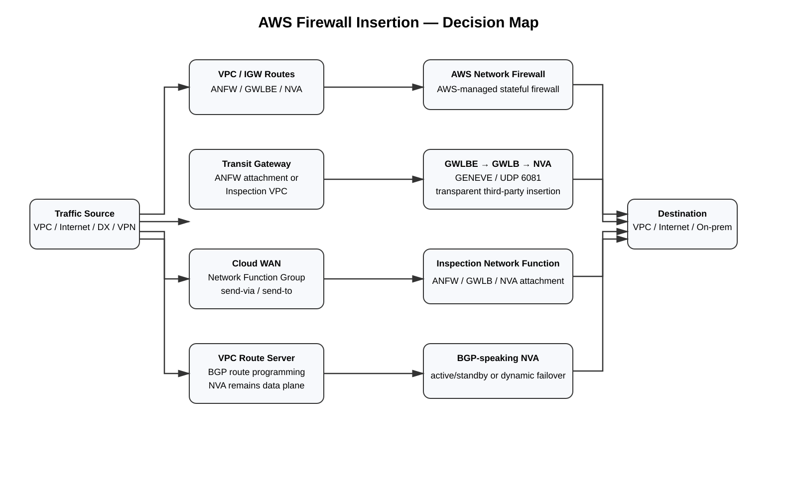

# AWS Firewall Insertion Summary

## Purpose

This guide condenses the major AWS firewall-inspection and service-insertion methods into one decision-oriented reference. The goal is to make it easy to distinguish **AWS Network Firewall**, **Gateway Load Balancer/Gateway Load Balancer Endpoint**, **Transit Gateway centralized inspection**, **Cloud WAN service insertion**, **VPC Route Server dynamic routing**, **Direct Connect/VPN inspection**, **Internet ingress/egress**, and **Layer-7 WAF designs**.

For exhaustive implementation details, use the linked deep-dive guides in this repository.

## Core mental model

AWS has several fundamentally different ways to put a security function into a packet path:

| Method | What selects traffic? | Where is the firewall? | Customer route steering? | Best mental label |
|---|---|---|---:|---|
| **[AWS Network Firewall in a VPC](09-06-26-15-03_AWS_Firewall_Inspection_Insertion_Comprehensive_Study_Guide.md)** | VPC/IGW route table | AWS-managed firewall endpoints | Yes | **Native routed firewall** |
| **[TGW-attached AWS Network Firewall](09-06-26-15-03_AWS_Firewall_Inspection_Insertion_Comprehensive_Study_Guide.md)** | Transit Gateway route table | AWS-managed network-function attachment | Yes, on TGW | **Native TGW security attachment** |
| **[Distributed GWLBE](09-06-26-15-23_Distributed_GWLBE_Centralized_Third_Party_Firewall_Fleet_Deep_Dive.md)** | VPC/IGW route → GWLBE | Third-party NVA behind centralized GWLB | Yes | **Distributed transparent insertion** |
| **[TGW + GWLB inspection VPC](09-06-26-15-45_TGW_Centralized_GWLB_GWLBE_Inspection_VPC_Deep_Dive.md)** | TGW route table + VPC routes | Third-party NVA behind GWLB | Yes | **Centralized third-party inspection** |
| **[Legacy TGW + direct NVA VPC](09-06-26-16-41_Legacy_TGW_NVA_VPC_Attachment_Deep_Dive.md)** | TGW route table + ENI/VPC route | Customer-managed NVA | Yes | **Direct appliance transit** |
| **[Cloud WAN service insertion](09-06-26-17-01_AWS_Cloud_WAN_Service_Insertion_Deep_Dive.md)** | Core-network policy `send-via` / `send-to` | Network Function Group | Policy-driven | **Global policy service insertion** |
| **[VPC Route Server + NVA](09-06-26-17-01_AWS_VPC_Route_Server_NVA_Dynamic_Service_Insertion_Deep_Dive.md)** | BGP advertisements | Customer-managed NVA | Dynamic | **Dynamic VPC routed insertion** |
| **[AWS WAF / CloudFront / ALB](09-06-26-15-03_AWS_Firewall_Inspection_Insertion_Comprehensive_Study_Guide.md)** | L7 resource association | AWS WAF | No routed hop | **HTTP/S application inspection** |

A useful shorthand is:

```text
ANFW           = AWS-managed stateful firewall
GWLBE          = routable transparent service-chain next hop
GWLB           = appliance load balancer / GENEVE service plane
TGW            = centralized regional routing fabric
Appliance mode = AZ/path symmetry helper for stateful inspection
Cloud WAN NFG  = policy-defined security insertion group
VPC Route Server = BGP control plane for VPC/IGW route tables
WAF            = L7 reverse-proxy/resource protection, not transit firewalling
```



[Editable draw.io source](images/09-07-26_aws_firewall_insertion_summary.drawio)

**What this image shows:** The major AWS service-insertion families and the routing/policy mechanism that makes the security function inline.

**What matters:** Deploying a firewall does not make it inline. The source routing domain, Transit Gateway, Cloud WAN policy, ingress route table, or endpoint chain must deliberately select it.

**What to verify:** Prove the forward route, inspection hop, post-inspection route, and return path for every traffic class.

---

## 1. AWS Network Firewall in a VPC

AWS Network Firewall (**ANFW**) is AWS's managed stateful firewall and intrusion-prevention service.

Typical Internet-egress path:

```text
Private workload subnet
   |
   | 0.0.0.0/0 -> firewall endpoint
   v
AWS Network Firewall
   |
   v
NAT Gateway
   |
   v
Internet Gateway
   |
   v
Internet
```

Return:

```text
Internet
 -> IGW
 -> NAT Gateway
 -> AWS Network Firewall endpoint
 -> workload
```

Key points:

- Firewall endpoints are zonal.
- Route tables must send both directions through the appropriate firewall endpoint.
- AWS Network Firewall is stateful and does not support asymmetric routing.
- NAT is normally placed after outbound inspection if you want the firewall to see the original workload private IP.
- Stateful rules use Suricata-compatible semantics.

**Memorize:**

> AWS Network Firewall = native managed firewall, but routing still makes it inline.

Deep dive: [AWS Firewall Inspection and Service Insertion — Comprehensive Study Guide](09-06-26-15-03_AWS_Firewall_Inspection_Insertion_Comprehensive_Study_Guide.md)

---

## 2. Internet ingress with AWS Network Firewall

AWS VPC ingress routing allows an Internet Gateway route table to steer inbound traffic through a firewall endpoint before the workload.

```text
Internet
   |
   v
Internet Gateway
   |
   | IGW ingress route table
   v
AWS Network Firewall endpoint
   |
   v
Public/application subnet
```

Return direction must also traverse the firewall endpoint before leaving through the IGW.

Important distinction:

> The Internet Gateway route table controls traffic entering the VPC from the IGW. It is different from a normal subnet route table.

**Memorize:**

> ANFW Internet ingress = IGW ingress routing + symmetric return routing.

---

## 3. TGW-attached AWS Network Firewall

AWS now supports attaching AWS Network Firewall directly to an **AWS Transit Gateway (TGW)** as a network-function attachment.

Conceptually:

```text
Spoke VPC A
    |
    v
Transit Gateway
    |
    | TGW route
    v
AWS Network Firewall
network-function attachment
    |
    v
Transit Gateway
    |
    v
Spoke VPC B / DX / VPN / egress
```

Key points:

- You do not need to create a traditional customer-managed inspection VPC merely to host Network Firewall endpoints for this deployment mode.
- AWS provisions/manages the required firewall attachment resources.
- Appliance mode behavior is automatically enabled for the Network Firewall attachment.
- Transit Gateway route tables steer traffic toward the Network Firewall attachment.
- AWS currently documents static routing on TGW Network Firewall attachments.
- This is the cleanest native centralized-ANFW model when the traffic already transits TGW and the feature fits the topology.

**Memorize:**

> TGW-attached ANFW = native firewall as a first-class Transit Gateway security attachment.

---

## 4. Traditional centralized AWS Network Firewall with TGW

The older and still valid architecture uses an **inspection VPC**.

```text
Spoke A
  |
  v
TGW
  |
  | pre-inspection route
  v
Inspection VPC attachment
  |
  v
ANFW endpoint
  |
  v
TGW
  |
  | post-inspection route
  v
Spoke B / DX / VPN / egress
```

Key points:

- The inspection VPC contains zonal Network Firewall endpoints.
- TGW appliance mode is important to keep forward and return traffic aligned to the same AZ path.
- TGW route tables separate **pre-inspection** and **post-inspection** forwarding domains.
- VPC route tables inside the inspection VPC must steer TGW-originated traffic to the correct zonal firewall endpoint and return it to TGW after inspection.

**Memorize:**

> Traditional centralized ANFW = TGW routes + inspection VPC + zonal firewall endpoints.

---

## 5. Gateway Load Balancer fundamentals

AWS Gateway Load Balancer (**GWLB**) is purpose-built for transparent virtual-appliance insertion.

The major pieces are:

```text
Consumer routing
      |
      v
GWLBE
      |
      | PrivateLink service relationship
      v
GWLB
      |
      | GENEVE UDP/6081
      v
Firewall / NVA fleet
```

Key points:

- **GWLBE** is the routable next hop that appears in the consumer route table.
- **GWLB** load-balances flows to firewall/NVA targets.
- The appliances receive the original packet encapsulated in **GENEVE over UDP 6081**.
- The service chain is transparent to the original source/destination tuple.
- GWLB handles appliance scale/health distribution; the firewall still owns security/session/NAT behavior according to the vendor design.

**Memorize:**

> GWLBE = route target. GWLB = appliance load balancer. NVA = actual firewall.

---

## 6. Distributed GWLBE with a centralized firewall fleet

This pattern puts the **GWLBE close to the workload**, while the firewall fleet remains centralized behind GWLB.

```text
Workload VPC
   |
   | subnet route
   v
Local GWLBE
   |
   v
Central GWLB
   |
   v
Firewall fleet
   |
   v
GWLBE return
   |
   v
Normal workload-VPC route
```

Advantages:

- Service insertion can be controlled per workload VPC/subnet.
- You avoid forcing every flow through a centralized Transit Gateway solely to reach the firewall service.
- The security fleet can still be operated centrally.
- Per-VPC egress and ingress designs can be constructed with local endpoints.

Important caveat:

> Distributed endpoints simplify some routing but do not eliminate the need to design the return path and NAT placement correctly.

**Memorize:**

> Distributed GWLBE = endpoint near workload, firewall fleet centralized.

Deep dive: [Distributed GWLBE with a Centralized Third-Party Firewall Fleet](09-06-26-15-23_Distributed_GWLBE_Centralized_Third_Party_Firewall_Fleet_Deep_Dive.md)

---

## 7. Centralized TGW + GWLB inspection VPC

This is the classic scalable third-party firewall architecture for many VPCs.

```text
Spoke VPC A
   |
   v
Transit Gateway
   |
   | PRE-INSPECTION TGW RT
   v
Inspection VPC attachment
   |
   v
GWLBE
   |
   v
GWLB
   |
   v
NVA fleet
   |
   v
GWLBE
   |
   v
Transit Gateway
   |
   | POST-INSPECTION TGW RT
   v
Spoke B / DX / VPN / egress
```

Key points:

- TGW route tables force selected flows into the inspection VPC.
- Inspection-VPC subnet routes force them through a GWLBE.
- GWLB sends the flow to an eligible firewall backend.
- After inspection, traffic returns to TGW and is routed to the real destination.
- Enable **appliance mode** on the inspection VPC TGW attachment for stateful symmetry.

**Memorize:**

> TGW chooses the inspection VPC; GWLBE/GWLB chooses the firewall path.

Deep dive: [AWS Transit Gateway + Centralized GWLB/GWLBE Inspection VPC](09-06-26-15-45_TGW_Centralized_GWLB_GWLBE_Inspection_VPC_Deep_Dive.md)

---

## 8. Transit Gateway appliance mode

Transit Gateway appliance mode is one of the most important concepts in centralized AWS stateful inspection.

Without appliance mode, forward and reverse flows can arrive at different AZ-specific appliance paths.

With appliance mode enabled on the inspection attachment:

```text
Flow A -> inspection attachment AZ-X
Return A -> same inspection attachment AZ-X
```

This helps preserve the same zonal appliance path for the flow lifetime.

But:

> Appliance mode does not fix a bad route table.

You still need:

- correct pre-inspection TGW routes;
- correct post-inspection TGW routes;
- correct VPC/GWLBE routes;
- healthy firewall backends;
- compatible firewall state/NAT design.

**Memorize:**

> Appliance mode helps AZ symmetry; routing still defines the service chain.

---

## 9. Legacy TGW + direct NVA VPC attachment

Before GWLB, a common architecture was to attach a firewall VPC directly to TGW and route packets to firewall ENIs.

```text
Spoke
  |
  v
TGW
  |
  v
Firewall VPC attachment
  |
  | subnet route
  v
Firewall ENI
  |
  v
TGW / destination
```

Key points:

- Firewalls are directly in the data path; there is no GWLB abstraction.
- You must design HA, ENI next hops, route changes, and failover yourself.
- Appliance mode remains important for stateful symmetry.
- Source/destination check must be disabled on forwarding instances.
- Active/standby designs often require automation or dynamic route control when the active firewall changes.

**Memorize:**

> Legacy TGW NVA = direct appliance routing, no GWLB safety net.

Deep dive: [Legacy AWS Transit Gateway + Direct NVA VPC Attachment](09-06-26-16-41_Legacy_TGW_NVA_VPC_Attachment_Deep_Dive.md)

---

## 10. VPC Route Server + NVA

Amazon VPC Route Server provides a BGP control plane that can dynamically update supported VPC and Internet Gateway route tables based on NVA advertisements.

```text
NVA / firewall
   |
   | eBGP
   v
VPC Route Server endpoint
   |
   | propagated dynamic route
   v
VPC subnet route table / IGW route table
```

Key points:

- Route Server is **control plane**, not a packet-forwarding appliance.
- The firewall/NVA remains the packet next hop.
- Route Server can update supported subnet/VPC/IGW route tables dynamically.
- It can use BFD for faster peer failure detection when configured/supported.
- It does not directly propagate into TGW route tables; AWS directs TGW dynamic-routing use cases toward TGW Connect.
- It is useful for active/standby and dynamic failover where static ENI routes are operationally cumbersome.

**Memorize:**

> VPC Route Server = BGP-driven VPC route programming; NVA = data plane.

Deep dive: [AWS VPC Route Server + NVA — Dynamic Service Insertion](09-06-26-17-01_AWS_VPC_Route_Server_NVA_Dynamic_Service_Insertion_Deep_Dive.md)

---

## 11. Same-VPC service insertion

AWS allows VPC route tables to steer traffic between subnets through an appliance endpoint/ENI when the route design is valid.

Example:

```text
Subnet A 10.10.1.0/24
   |
   | route 10.10.2.0/24 -> GWLBE / firewall ENI
   v
Firewall
   |
   v
Subnet B 10.10.2.0/24
```

Return direction must have corresponding steering when the firewall is stateful.

AWS VPC Route Server is particularly relevant for dynamically changing these VPC/IGW next hops when using BGP-speaking appliances.

**Memorize:**

> Same VPC = VPC route table or Route Server-programmed route makes the appliance inline.

---

## 12. AWS Cloud WAN service insertion

Cloud WAN provides policy-driven service insertion through **Network Function Groups (NFGs)**.

Two terms matter most:

```text
send-via = east-west service insertion
send-to  = north-south service insertion
```

### `send-via`

Use when traffic goes between network attachments/segments and must traverse an inspection function.

```text
Development segment
      |
      | send-via
      v
Inspection NFG
      |
      v
Production segment
```

`send-via` supports single-hop and dual-hop modes.

### `send-to`

Use when traffic must be sent through a security attachment on its way out toward Internet or on-premises.

```text
Production segment
      |
      | send-to
      v
Inspection NFG
      |
      v
Internet / on-prem
```

Key points:

- The service-insertion decision is part of the Cloud WAN **core network policy**.
- Network Function Groups contain the attachments that provide the security/network function.
- Cloud WAN can steer VPC, VPN, Connect, Direct Connect gateway, and other supported attachment traffic according to policy.
- If a referenced NFG has no usable attachment in the needed location, traffic can blackhole even though policy deployment succeeds.

**Memorize:**

> Cloud WAN `send-via` = east-west; `send-to` = north-south.

Deep dive: [AWS Cloud WAN Service Insertion](09-06-26-17-01_AWS_Cloud_WAN_Service_Insertion_Deep_Dive.md)

---

## 13. Direct Connect inspection

A common enterprise path is:

```text
On-premises
   |
   v
Direct Connect
   |
   v
Direct Connect Gateway
   |
   v
Transit Gateway
   |
   | TGW route
   v
Inspection function
   |
   v
Workload VPC
```

Inspection can use:

- TGW-attached AWS Network Firewall;
- traditional ANFW inspection VPC;
- TGW + GWLB inspection VPC;
- legacy direct NVA attachment;
- Cloud WAN Network Function Group if Cloud WAN is the transit fabric.

Important distinction:

> Direct Connect itself does not perform firewall insertion. The transit fabric's route/policy after the DX attachment determines whether traffic goes through inspection.

**Memorize:**

> DX brings the route into AWS; TGW/Cloud WAN decides whether it is inspected.

---

## 14. Site-to-Site VPN inspection

The same principle applies to VPN.

```text
On-prem
  |
  v
Site-to-Site VPN
  |
  v
TGW / Cloud WAN
  |
  | inspection route/policy
  v
ANFW / GWLB / NVA
  |
  v
VPC
```

Key points:

- The VPN attachment is just a connectivity attachment.
- TGW route-table association/propagation determines the pre-inspection routing domain.
- Cloud WAN can use service-insertion policy for VPN attachments.
- Stateful symmetry and ECMP behavior must be considered if multiple VPN paths exist.

**Memorize:**

> VPN termination is not inspection; transit routing creates inspection.

---

## 15. Internet egress through third-party firewalls

A centralized egress architecture often looks like:

```text
Workload VPC
   |
   | 0.0.0.0/0 -> TGW
   v
TGW
   |
   v
Inspection VPC
   |
   v
GWLBE -> GWLB -> firewall
   |
   v
NAT Gateway
   |
   v
IGW -> Internet
```

There are two independent functions:

```text
Firewall = inspection/policy/state
NAT Gateway or firewall NAT = source translation
```

Where NAT occurs changes what source IP the firewall sees.

**Memorize:**

> Route to firewall first if you want inspection of the original workload source; NAT placement is a separate design decision.

---

## 16. Internet ingress inspection

AWS has several different ingress patterns.

### Network Firewall before application

```text
Internet
 -> IGW ingress route table
 -> ANFW endpoint
 -> application subnet / load balancer path
```

### GWLB before endpoint

```text
Internet
 -> IGW ingress route
 -> GWLBE
 -> GWLB
 -> firewall
 -> ALB/NLB/application path
```

### ALB / CloudFront + AWS WAF

```text
Client
 -> CloudFront or ALB
 -> AWS WAF web ACL
 -> application
```

These solve different problems.

**Memorize:**

> L3/L4 inline inspection = ANFW/GWLB route chain. HTTP application inspection = WAF.

Deep dive: [AWS ALB/NLB + Inline Firewall Endpoint — GWLB/GWLBE](09-06-26-16-42_AWS_ALB_NLB_Inline_Firewall_Endpoint_GWLBE_Deep_Dive.md)

---

## 17. ALB versus NLB in inspected ingress designs

Do not treat ALB and NLB as interchangeable.

### ALB

- Layer 7 proxy.
- Terminates client connections and creates backend connections.
- Backend route symmetry relates to ALB node/backend flows, not the original Internet TCP session in the same way as NLB.

### NLB

- Layer 4 load balancer.
- Client-IP preservation and routing behavior can impose stricter symmetry/topology constraints.
- Some centralized TGW/GWLBE designs that work cleanly with ALB do not preserve the desired NLB client-IP behavior.

**Memorize:**

> ALB proxies. NLB forwards L4 flows. The firewall return-path problem is therefore different.

Deep dive: [Caveats for Centralized Ingress Routing — ALB, NLB, GWLB/GWLBE, TGW](09-06-26-16-23_Caveats_for_Centralized_Ingress_Routing.md)

---

## 18. AWS WAF is not general firewall insertion

AWS WAF protects supported HTTP/S resources such as CloudFront and ALB through a web ACL association.

```text
Client
  |
  v
CloudFront / ALB
  |
  | WAF web ACL
  v
HTTP application
```

WAF can inspect:

- HTTP methods;
- URI paths;
- headers;
- query strings;
- body content within service limits;
- managed/custom web attack signatures;
- rate-based patterns.

It does not replace a transit firewall for arbitrary TCP/UDP, VPC-to-VPC, Direct Connect, or VPN traffic.

**Memorize:**

> WAF = application request filtering, not packet-transit service insertion.

---

## 19. PrivateLink and GWLBE: do not confuse them

Gateway Load Balancer Endpoint uses PrivateLink technology, but it is a special endpoint type for transparent appliance insertion.

```text
Interface endpoint
= privately expose/connect to a service

GWLBE
= route packets through an appliance service
```

An ordinary Interface VPC Endpoint does not automatically inspect traffic.

**Memorize:**

> PrivateLink = private service connectivity. GWLBE = firewall/appliance service insertion.

Deep dive: [AWS PrivateLink, VPC Endpoints, and GWLB Firewall Inspection](09-04-26-16-18_AWS_PrivateLink_GWLB_Firewall_Inspection_Study_Guide.md)

---

## 20. NAT placement

NAT changes what the firewall can identify.

### Firewall before NAT

```text
10.10.1.25
   |
   v
Firewall
   | sees 10.10.1.25
   v
NAT Gateway
   |
   v
198.51.100.25
```

This preserves workload identity at inspection time.

### NAT before firewall

```text
10.10.1.25
   |
   v
NAT
   |
   v
198.51.100.25
   |
   v
Firewall
```

The firewall now sees the translated source rather than the original workload source.

**Memorize:**

> Inspection placement relative to NAT determines source-address visibility.

---

## 21. Stateful symmetry

For stateful firewalls, the fundamental rule is:

```text
Forward flow -> inspection state owner
Return flow  -> same logical inspection state owner
```

AWS mechanisms that help include:

- Network Firewall zonal endpoint routing;
- TGW appliance mode;
- GWLB flow stickiness;
- vendor session synchronization where supported;
- careful AZ-local GWLBE design;
- deterministic NAT placement.

None of these substitutes for correct routing.

**Memorize:**

> Symmetry is an end-to-end routing property, not a checkbox on the firewall.

---

## 22. Pre-inspection versus post-inspection route tables

A centralized TGW architecture is easiest to reason about when you separate two route domains.

### Pre-inspection TGW route table

Attachments that must be inspected associate here.

Example:

```text
10.20.0.0/16 -> Inspection attachment
0.0.0.0/0    -> Inspection attachment
```

### Post-inspection TGW route table

The inspection attachment associates here so inspected traffic can reach the real destination.

Example:

```text
10.10.0.0/16 -> Spoke A attachment
10.20.0.0/16 -> Spoke B attachment
172.16.0.0/16 -> DX/VPN attachment
```

This prevents a packet from being immediately routed back into the inspection attachment after inspection.

**Memorize:**

> PRE = send to firewall. POST = send to destination.

---

## 23. Direct NVA versus GWLB

### Direct NVA next hop

```text
Route -> firewall ENI
```

You own:

- HA/failover;
- active firewall selection;
- ENI next-hop changes;
- scale;
- health integration;
- state distribution.

### GWLB

```text
Route -> GWLBE -> GWLB -> firewall fleet
```

AWS provides:

- appliance distribution;
- endpoint abstraction;
- health-aware backend selection;
- transparent encapsulation path.

**Memorize:**

> Direct NVA = maximum control, maximum routing/HA responsibility.

> GWLB = purpose-built appliance insertion abstraction.

---

## 24. One-page cheat sheet

```text
AWS-NATIVE FIREWALL IN ONE VPC
AWS Network Firewall
= VPC routes / IGW ingress routes
= zonal firewall endpoints

AWS-NATIVE CENTRAL FIREWALL WITH TGW
TGW-attached AWS Network Firewall
= TGW route -> network-function attachment
= appliance mode handled automatically

TRADITIONAL CENTRAL ANFW
TGW -> inspection VPC -> ANFW endpoints -> TGW
= pre/post inspection routing

THIRD-PARTY TRANSPARENT FIREWALL
Route -> GWLBE -> GWLB -> NVA
= GENEVE/UDP 6081

DISTRIBUTED THIRD-PARTY
local GWLBE in workload VPC
-> centralized GWLB/NVA fleet

CENTRAL THIRD-PARTY
TGW
-> inspection VPC
-> GWLBE/GWLB/NVA
= appliance mode

LEGACY DIRECT NVA
TGW/VPC route -> firewall ENI
= customer-managed HA/failover

DYNAMIC VPC FIREWALL ROUTING
VPC Route Server <-> BGP NVA
= dynamic VPC/IGW route programming

GLOBAL CLOUD WAN
send-via = east-west
send-to  = north-south
Network Function Group = security insertion target

DIRECT CONNECT / VPN
connectivity attachment
-> TGW/Cloud WAN policy decides inspection

INTERNET EGRESS
workload -> firewall -> NAT -> IGW

INTERNET INGRESS
IGW ingress route -> ANFW or GWLBE
OR CloudFront/ALB -> WAF for L7
```

---

## 25. Decision tree

```text
Do you want AWS-managed stateful firewalling?
        |
       YES
        |
        v
Is traffic primarily inside one VPC / edge VPC?
        |
       YES -> AWS Network Firewall + VPC/IGW routing
        |
       NO
        v
Does traffic already transit Transit Gateway?
        |
       YES -> Consider TGW-attached AWS Network Firewall
               or traditional TGW inspection VPC

Do you specifically need a third-party NGFW?
        |
       YES
        |
        v
Do you want transparent scalable appliance insertion?
        |
       YES -> GWLB + GWLBE
        |
       NO -> direct NVA routing / legacy TGW NVA

Do you need centralized multi-VPC inspection?
        |
       YES -> TGW + GWLB inspection VPC

Do you want endpoints distributed near workloads?
        |
       YES -> distributed GWLBE + centralized GWLB fleet

Do you need BGP-driven dynamic VPC route changes?
        |
       YES -> VPC Route Server + NVA

Are you using Cloud WAN globally?
        |
       YES -> Network Function Group
               send-via = east-west
               send-to  = north-south

Is this only HTTP/S application protection?
        |
       YES -> AWS WAF / CloudFront / ALB
```

---

## 26. Quick selection table

| Requirement | Usually start with |
|---|---|
| Managed AWS-native single-VPC firewall | AWS Network Firewall |
| Managed native centralized TGW firewall | TGW-attached AWS Network Firewall |
| Third-party firewall, scalable/transparent | GWLB + GWLBE |
| Large centralized regional third-party inspection | TGW + GWLB inspection VPC |
| Per-VPC transparent endpoints, central NVA fleet | Distributed GWLBE |
| Dynamic BGP-based firewall next-hop failover inside VPC | VPC Route Server + NVA |
| Global multi-Region service insertion | Cloud WAN Network Function Group |
| Legacy/custom NVA route control | Direct NVA or TGW NVA VPC |
| Inspect Direct Connect/VPN traffic | TGW/Cloud WAN inspection policy after attachment |
| HTTP/S attack protection | AWS WAF |
| Preserve original workload IP at firewall before egress | Inspect before NAT Gateway |

---

## 27. Core verification commands

### VPC routes

```cli
aws ec2 describe-route-tables \
  --filters Name=vpc-id,Values=vpc-xxxxxxxx \
  --output table
```

**Success criteria:** The destination prefix points to the intended firewall endpoint, GWLBE, ENI, TGW, or other documented next hop.

### Transit Gateway routes

```cli
aws ec2 search-transit-gateway-routes \
  --transit-gateway-route-table-id tgw-rtb-xxxxxxxx \
  --filters Name=state,Values=active \
  --output table
```

**Success criteria:** Pre-inspection routes point to the inspection/network-function attachment; post-inspection routes point to the real workload/hybrid attachments.

### GWLB endpoint state

```cli
aws ec2 describe-vpc-endpoints \
  --vpc-endpoint-ids vpce-xxxxxxxx \
  --output table
```

**Success criteria:** Endpoint is available and associated with the intended service/VPC/subnets.

### GWLB target health

```cli
aws elbv2 describe-target-health \
  --target-group-arn <GWLB_TARGET_GROUP_ARN> \
  --output table
```

**Success criteria:** Intended appliance targets are healthy.

### AWS Network Firewall

```cli
aws network-firewall describe-firewall \
  --firewall-name <FIREWALL_NAME>
```

**Success criteria:** Firewall is ready and endpoint/attachment state is healthy for the deployment model.

### VPC Route Server

```cli
aws ec2 describe-route-servers
aws ec2 describe-route-server-peers
```

**Success criteria:** Route Server is operational and BGP peers are established/healthy according to current API state.

---

## 28. Common mistakes

1. **Deploying a firewall but not routing traffic through it.**
2. **Forgetting the return path.** Stateful inspection requires symmetry.
3. **Using one TGW route table for both pre- and post-inspection logic without checking for bypass/loops.**
4. **Forgetting appliance mode on a traditional inspection VPC attachment.**
5. **Assuming appliance mode repairs bad VPC/TGW routes.** It does not.
6. **Confusing GWLBE with GWLB.** The endpoint is the route target; GWLB distributes to appliances.
7. **Confusing ordinary PrivateLink interface endpoints with GWLBE service insertion.**
8. **Putting NAT before inspection when firewall policy requires original workload identity.**
9. **Assuming Direct Connect/VPN automatically passes through a firewall.** Transit routing must insert it.
10. **Treating AWS WAF as a replacement for L3/L4 east-west/hybrid inspection.**
11. **Assuming ALB and NLB have identical return-path/client-IP behavior.**
12. **Using a Cloud WAN NFG without a healthy attachment in the required edge location.** This can blackhole traffic.
13. **Assuming VPC Route Server forwards traffic.** It only programs routing through BGP-derived routes.
14. **Assuming TGW-attached Network Firewall supports arbitrary dynamic routing.** AWS currently documents static TGW routing for that attachment type.

---

## 29. Final mental model

```text
AWS FIREWALL INSERTION = WHO CHANGES THE NEXT HOP?

VPC route table / IGW ingress route
    -> ANFW endpoint / GWLBE / NVA ENI / TGW

Transit Gateway route table
    -> Network Firewall attachment
    -> Inspection VPC attachment

Cloud WAN policy
    -> Network Function Group
    -> send-via / send-to

VPC Route Server
    -> BGP-derived VPC/IGW route

WAF association
    -> HTTP/S request inspection only
```

Then ask four questions for every flow:

```text
1. What route/policy selects the inspection path?
2. Which component owns firewall state?
3. Where does NAT occur?
4. How is the return flow forced through the same logical state owner?
```

If those four answers are precise, the AWS firewall-insertion design is usually understandable and troubleshootable.

---

## Sources

### AWS documentation

- https://docs.aws.amazon.com/network-firewall/latest/developerguide/what-is-aws-network-firewall.html
- https://docs.aws.amazon.com/network-firewall/latest/developerguide/asymmetric-routing.html
- https://docs.aws.amazon.com/network-firewall/latest/developerguide/tgw-firewall.html
- https://docs.aws.amazon.com/vpc/latest/tgw/how-transit-gateways-work.html
- https://docs.aws.amazon.com/elasticloadbalancing/latest/gateway/introduction.html
- https://docs.aws.amazon.com/vpc/latest/privatelink/gateway-load-balancer-endpoints.html
- https://docs.aws.amazon.com/network-manager/latest/cloudwan/cloudwan-policy-service-insertion.html
- https://docs.aws.amazon.com/network-manager/latest/cloudwan/cloudwan-policies-json.html
- https://docs.aws.amazon.com/vpc/latest/userguide/dynamic-routing-route-server.html
- https://docs.aws.amazon.com/cli/latest/reference/ec2/create-route-server.html
- https://docs.aws.amazon.com/cli/latest/reference/ec2/create-route-server-peer.html
- https://docs.aws.amazon.com/waf/latest/developerguide/what-is-aws-waf.html

### Related repository deep dives

- [AWS Firewall Inspection and Service Insertion — Comprehensive Study Guide](09-06-26-15-03_AWS_Firewall_Inspection_Insertion_Comprehensive_Study_Guide.md)
- [Distributed GWLBE with a Centralized Third-Party Firewall Fleet](09-06-26-15-23_Distributed_GWLBE_Centralized_Third_Party_Firewall_Fleet_Deep_Dive.md)
- [AWS Transit Gateway + Centralized GWLB/GWLBE Inspection VPC](09-06-26-15-45_TGW_Centralized_GWLB_GWLBE_Inspection_VPC_Deep_Dive.md)
- [Legacy AWS Transit Gateway + Direct NVA VPC Attachment](09-06-26-16-41_Legacy_TGW_NVA_VPC_Attachment_Deep_Dive.md)
- [AWS ALB/NLB + Inline Firewall Endpoint](09-06-26-16-42_AWS_ALB_NLB_Inline_Firewall_Endpoint_GWLBE_Deep_Dive.md)
- [AWS Cloud WAN Service Insertion](09-06-26-17-01_AWS_Cloud_WAN_Service_Insertion_Deep_Dive.md)
- [AWS VPC Route Server + NVA](09-06-26-17-01_AWS_VPC_Route_Server_NVA_Dynamic_Service_Insertion_Deep_Dive.md)
- [AWS PrivateLink, VPC Endpoints, and GWLB Firewall Inspection](09-04-26-16-18_AWS_PrivateLink_GWLB_Firewall_Inspection_Study_Guide.md)
