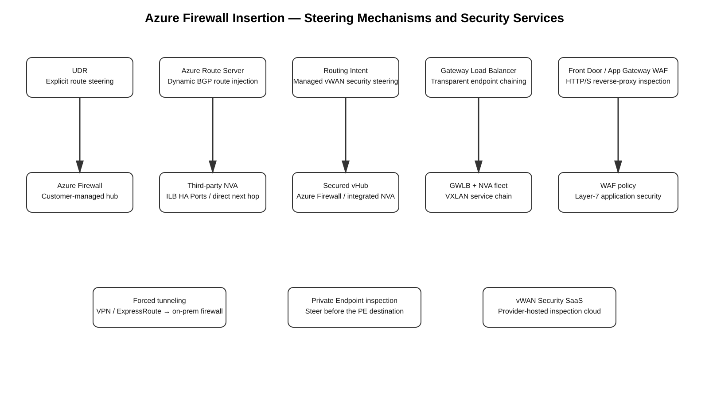

# Azure Firewall Insertion Summary

## Purpose

This guide condenses the major Azure firewall-inspection and service-insertion methods into one decision-oriented reference. The goal is to make it easy to distinguish **UDR-based routed insertion**, **dynamic BGP insertion with Azure Route Server**, **Virtual WAN Routing Intent**, **integrated third-party NVAs**, **Gateway Load Balancer transparent chaining**, **forced tunneling to on-premises**, **Private Endpoint inspection**, and **Layer-7 WAF designs**.

For exhaustive details, use the linked deep-dive guides in this repository.

## Core mental model

Azure has several fundamentally different ways to make traffic reach a security device:

| Method | What selects the traffic? | Where is the firewall? | Customer route steering? | Best mental label |
|---|---|---|---:|---|
| **Azure Firewall in customer-managed hub** | UDR / effective route | Azure Firewall in your hub VNet | Yes | **Explicit routed insertion** |
| **Third-party NVA in customer-managed hub** | UDR / effective route | NVA VM(s), often behind Standard ILB HA Ports | Yes | **Routed NVA insertion** |
| **Azure Route Server + NVA** | BGP advertisements + Azure route selection | NVA VM(s) in customer-managed VNet | Dynamic | **Dynamic routed insertion** |
| **Virtual WAN secured hub + Azure Firewall** | Routing Intent / vHub routing | Azure Firewall in managed vHub | No per-spoke UDRs | **Managed security routing** |
| **Integrated NVA in Virtual WAN hub** | vHub routing / Routing Intent where supported | Qualified vendor NVA inside managed vHub | No per-spoke UDRs | **Managed third-party hub insertion** |
| **Security SaaS Provider in Virtual WAN** | vWAN security configuration / provider integration | Provider security cloud | No per-spoke UDRs | **Cloud-delivered security insertion** |
| **Gateway Load Balancer** | Endpoint chaining reference | Third-party NVA behind GWLB | No UDR for the chained endpoint | **Transparent service chaining** |
| **Forced tunnel to on-premises** | BGP default / VPN Default Site / UDR | On-prem firewall | Yes / dynamic | **Backhaul for inspection** |
| **Front Door / Application Gateway WAF** | Reverse-proxy listener | Azure edge/regional L7 proxy | No routed firewall hop | **HTTP/S application inspection** |

A useful shorthand is:

```text
UDR            = explicit route steering
ILB HA Ports   = highly available NVA next hop
Route Server   = BGP control plane, not packet forwarding
Routing Intent = managed vWAN security steering
GWLB           = transparent endpoint chaining
Forced tunnel  = send traffic to on-prem inspection
WAF            = Layer-7 reverse proxy, not general L3/L4 transit firewall
```



[Editable draw.io source](images/09-07-26_azure_firewall_insertion_summary.drawio)

**What this image shows:** The major Azure insertion families and the steering mechanism that places the firewall/security service in the path.

**What matters:** The steering mechanism is the architecture. Merely deploying a firewall does not cause Azure traffic to traverse it.

**What to verify:** For every design, prove the source-side route or chaining decision, the firewall/NVA state, and the reverse path.

---

## 1. Azure Firewall in a customer-managed hub VNet

This is the classic Azure hub-and-spoke design.

```text
Spoke subnet
   |
   | UDR
   v
Azure Firewall
   |
   v
Destination
```

Typical UDR:

```text
10.20.0.0/16 -> VirtualAppliance -> 10.0.1.4
0.0.0.0/0    -> VirtualAppliance -> 10.0.1.4
```

Key points:

- Azure Firewall does not automatically attract traffic just because it is deployed in the hub.
- The workload subnet's effective route must select the firewall.
- Spoke-to-spoke inspection normally requires explicit remote-spoke prefixes in both directions.
- Hybrid inbound inspection can require deliberate `GatewaySubnet` routing so the VPN/ExpressRoute gateway does not bypass the firewall.
- Azure Firewall is stateful; reverse-path symmetry matters.
- Internet egress normally uses Azure Firewall SNAT unless another supported egress design changes the translator.

**Memorize:**

> Customer-managed hub + Azure Firewall = UDR-driven service insertion.

Deep dive: [Azure Firewall in a Customer-Managed Hub VNet — Method 1](09-05-26-18-55_Azure_Firewall_Customer_Managed_Hub_VNet_Method_1_Deep_Dive.md)

---

## 2. Third-party NVA in a customer-managed hub VNet

This has the same fundamental routing model as Method 1, but the security data plane is a vendor appliance.

```text
Spoke
  |
  | UDR
  v
Standard Internal Load Balancer
  | HA Ports
  v
NVA-1 / NVA-2
  |
  | vendor routing / policy / optional NAT
  v
Destination
```

Key points:

- UDRs steer traffic to the firewall tier.
- An Internal Standard Load Balancer with HA Ports can provide a stable next-hop VIP for multiple NVA instances.
- The ILB does not replace the firewall's route table, security policy, NAT, or state.
- Azure NIC IP forwarding must be enabled for forwarding appliances.
- Return traffic must traverse the same stateful inspection domain.
- Vendor HA/session-sync behavior is separate from Azure Load Balancer health and flow selection.

**Memorize:**

> ILB = HA next hop. NVA = actual firewall/router/session owner.

Deep dive: [Third-Party NGFW/NVA in a Customer-Managed Hub VNet](09-05-26-19-45_Third_Party_NGFW_NVA_Customer_Managed_Hub_VNet_Method_2_Deep_Dive.md)

---

## 3. UDR versus Azure Route Server

This distinction removes a lot of confusion.

### UDR = explicit destination steering

Example:

```text
10.20.0.0/16 -> VirtualAppliance -> 10.0.2.10
```

Use UDRs when you want deterministic prefix-based service insertion and are comfortable managing route-table associations.

### Azure Route Server = dynamic BGP control plane

```text
NVA
 | eBGP
 v
Azure Route Server
 |
 | Azure SDN installs eligible learned routes
 v
Workload effective routes
```

Azure Route Server (**ARS**) does not forward packets. It exchanges BGP routes between NVAs and supported Azure gateways.

**Memorize:**

> UDR = configure the route yourself.

> Route Server = let the NVA advertise the route dynamically.

---

## 4. Azure Route Server + third-party NVA

Use this when dynamic routing is more appropriate than maintaining large UDR sets.

```text
                 BGP
NVA-1/NVA-2 <----------> Azure Route Server
                              |
                              | route distribution
                              v
                         Azure SDN
                              |
                              v
                           Spokes
```

Key points:

- ARS is **control plane only**.
- The NVA remains the data-plane next hop.
- The NVA advertises prefixes; Azure SDN can install eligible learned routes into effective route tables.
- ARS does not edit Azure Route Table resources.
- Active/active can use ECMP; active/standby can be influenced with BGP attributes such as AS path.
- ARS can exchange routes with supported VPN/ExpressRoute gateway designs when branch-to-branch exchange is enabled.
- Same-VNet subnet-to-subnet service insertion is a major caveat: directly connected/local VNet routing is not generally overridden just because an NVA advertises the same VNet's subnet route with BGP. UDR or another insertion method is often required.

**Memorize:**

> ARS = dynamic route injection, not a transit router.

Deep dive: [Azure Route Server + Third-Party NVA for Dynamic Service Insertion](09-05-26-13-55_Azure_Route_Server_Third_Party_NVA_Dynamic_Service_Insertion_Study_Guide.md)

---

## 5. Same-VNet east-west inspection

If workloads are in different subnets of the **same VNet**, normal Azure VNet-local routing already knows the destination directly.

For a routed firewall design, use a UDR on the source workload subnet:

```text
Source subnet 10.10.1.0/24
       |
       | UDR:
       | 10.10.2.0/24 -> 10.0.1.4
       v
Azure Firewall / NVA
       |
       v
Destination subnet 10.10.2.0/24
```

Return direction also needs service insertion when stateful symmetry is required.

**Memorize:**

> Same VNet = usually UDR-based steering; Route Server alone is not the answer.

---

## 6. Inter-VNet / hub-and-spoke inspection

For two spokes connected to a customer-managed hub:

```text
Spoke A
   |
   | UDR to remote-spoke prefix
   v
Hub Firewall / NVA
   |
   v
Spoke B
```

The important Azure rule is that **VNet peering is not a security service chain**.

You normally need:

```text
Spoke A:
10.20.0.0/16 -> firewall

Spoke B:
10.10.0.0/16 -> firewall
```

Peering settings must also allow the required forwarded traffic.

**Memorize:**

> Peering provides reachability. UDRs provide inspection insertion.

---

## 7. Virtual WAN secured hub + Azure Firewall

Virtual WAN changes the model substantially.

Instead of manually managing spoke UDRs, Azure's managed vHub routing fabric can steer traffic through Azure Firewall.

```text
VNet / VPN / ExpressRoute
          |
          v
     Virtual Hub
          |
     Routing Intent
          |
          v
    Azure Firewall
          |
          v
      Destination
```

Key points:

- A secured virtual hub is a Virtual WAN hub with an integrated security provider such as Azure Firewall.
- Routing Intent can steer **Private Traffic** and/or **Internet Traffic** to the security provider.
- No per-spoke UDRs are required for the normal secured-hub model.
- Routing Intent is required for scenarios such as inspected branch-to-branch and inter-hub private traffic.
- Virtual WAN route association/propagation is managed at the connection/vHub route-table layer, not by attaching Azure UDRs to the vHub.
- Custom vHub route-table segmentation and Routing Intent are not two freely combinable routing-control models in the same hub; choose the architecture deliberately.

**Memorize:**

> vWAN Routing Intent = managed security steering.

Deep dives:

- [Azure Virtual WAN Secured Hub with Azure Firewall or Integrated NVA](09-05-26-15-56_Azure_Virtual_WAN_Secured_Hub_Method_4_Study_Guide.md)
- [Azure Virtual WAN Segmented Routing Deep Dive](09-07-26_Azure_Virtual_WAN_Segmented_Routing_Deep_Dive.md)

---

## 8. Integrated third-party NVA directly in the Virtual WAN hub

Azure Virtual WAN also supports select vendor NVAs directly inside the managed hub.

```text
Branches / VNets / ER
        |
        v
     vWAN Hub
        |
        v
 Integrated NVA
        |
        v
  remote connection
```

Key points:

- This is not "put any Marketplace VM inside the vHub."
- Only qualified integrated NVA offerings are supported.
- Microsoft and the vendor jointly manage the backing infrastructure.
- Azure manages the VM scale-set/load-balancer infrastructure behind the integration.
- The integrated NVA can provide firewall, SD-WAN, or combined functions depending on the vendor.
- Internet-inbound DNAT is supported only for specific integrated NVA partners/capabilities.
- Vendor security policy remains vendor-specific even though the insertion infrastructure is integrated with vWAN.

**Memorize:**

> Integrated NVA = vendor firewall inside the managed vHub, not a customer-owned VM in a hub VNet.

Deep dive: [Integrated Third-Party NGFW Directly Inside an Azure Virtual WAN Hub](09-05-26-20-00_Azure_Virtual_WAN_Integrated_Third_Party_NGFW_Direct_Hub_Deep_Dive.md)

---

## 9. Virtual WAN Security SaaS Provider

This is different from both Azure Firewall and an integrated NVA.

```text
VNet / Branch
    |
    v
Virtual WAN
    |
    | secured Internet path / service tunnel
    v
Security provider cloud
    |
    v
Internet
```

Key points:

- The security enforcement point is provider-hosted, not an NVA VM that you operate.
- It is especially suited to Secure Web Gateway / cloud-delivered Internet security.
- Azure Virtual WAN and Firewall Manager program the service relationship.
- The current supported-provider list must be checked before design; provider availability and integration class change over time.
- Do not confuse **Security Partner Provider**, **integrated NVA**, and **direct-in-vHub SaaS** integrations; they are different architectures.

**Memorize:**

> Security SaaS = inspection in the provider's security cloud.

Deep dive: [Azure Virtual WAN Security SaaS Provider — Method 6](09-05-26-16-44_Azure_Virtual_WAN_Security_SaaS_Provider_Method_6_Deep_Dive.md)

---

## 10. Gateway Load Balancer: transparent NVA insertion

Gateway Load Balancer (**GWLB**) is Azure's transparent service-chaining method for supported public endpoint consumers.

```text
Internet
   |
   v
Standard Public Load Balancer / VM public IP
   |
   | gatewayLoadBalancer reference
   v
Gateway Load Balancer
   |
   | VXLAN
   v
NVA fleet
   |
   v
Gateway Load Balancer
   |
   v
Original application path
```

Key points:

- Chaining is created by a resource reference to the GWLB frontend.
- You do not need a UDR merely to force traffic for the chained endpoint through GWLB.
- GWLB can inspect inbound and supported outbound flows.
- The NVA sees the original flow through VXLAN-based service chaining.
- GWLB is not a generic "route every VNet prefix through this firewall" fabric.
- NAT Gateway does not participate in GWLB chaining and can change outbound-path expectations.

**Memorize:**

> GWLB = endpoint chaining, not route-table insertion.

Deep dive: [Azure Gateway Load Balancer for Transparent NVA Insertion](09-05-26-17-03_Gateway_Load_Balancer_Transparent_NVA_Insertion_Study_Guide.md)

---

## 11. Internet egress through a customer-managed firewall

### Azure Firewall

```text
Spoke
 |
 | 0.0.0.0/0 UDR
 v
Azure Firewall
 |
 | policy + SNAT
 v
Internet
```

### Third-party NVA

```text
Spoke
 |
 | 0.0.0.0/0 UDR
 v
ILB / NVA
 |
 | vendor policy + route + SNAT
 v
Internet
```

The firewall or NVA becomes part of the Internet egress data path and state/NAT design.

**Memorize:**

> Traditional Azure egress = default route to the security next hop.

---

## 12. Internet ingress

Azure has several completely different ingress-inspection patterns.

### Azure Firewall DNAT

```text
Internet
   |
   v
Azure Firewall public IP
   |
   | DNAT + firewall policy
   v
Private backend
```

### Integrated vWAN NVA DNAT

```text
Internet
   |
   v
Integrated NVA public IP
   |
   | vendor DNAT/security
   v
vWAN-connected backend
```

### Gateway Load Balancer

```text
Internet
   |
   v
Public Load Balancer / VM public IP
   |
   v
GWLB -> NVA -> original endpoint
```

### WAF

```text
Internet
   |
   v
Front Door WAF / Application Gateway WAF
   |
   | HTTP/S reverse proxy
   v
Application
```

**Memorize:**

> "Internet ingress inspection" is not one Azure feature. Choose DNAT, transparent GWLB chaining, or L7 WAF according to the application and security requirement.

---

## 13. Front Door WAF and Application Gateway WAF

WAF is application-layer inspection, not general firewall insertion.

```text
Client
  |
  v
Front Door / App Gateway
  |
  | terminate/proxy HTTP(S)
  | WAF policy
  v
Backend
```

Key points:

- Front Door is global-edge reverse proxy/WAF.
- Application Gateway is regional L7 reverse proxy/WAF.
- They inspect HTTP/S semantics and can enforce managed/custom WAF rules.
- They do not replace an L3/L4 transit firewall for arbitrary TCP/UDP traffic.
- They can be layered with Azure Firewall/NVA when both application and network inspection are required.

**Memorize:**

> WAF = HTTP/S reverse proxy security, not routed transit firewalling.

Deep dive: [Azure Front Door WAF and Application Gateway WAF — Method 9](09-06-26-10-24_Azure_Front_Door_Application_Gateway_WAF_Method_9_Deep_Dive.md)

---

## 14. Private Endpoint inspection

A Private Endpoint is the **private destination**, not the inspection device.

```text
Client
  |
  | route steering
  v
Firewall / NVA
  |
  v
Private Endpoint IP
  |
  v
Private Link
  |
  v
PaaS service
```

For a routed ILB/NVA example:

```text
Private Endpoint IP: 10.20.1.4
ILB next-hop VIP:    10.0.2.10

Client-subnet UDR:
10.20.1.4/32 -> VirtualAppliance -> 10.0.2.10
```

Key points:

- The route belongs to the **source/client subnet**, not to the Private Endpoint object.
- The packet destination remains the PE IP; the ILB VIP is the routing next hop, not the application destination.
- Private Endpoint subnet network policies must permit the required UDR enforcement.
- `/32` is the clearest route for one PE; a dedicated PE subnet prefix can be used when the architecture intentionally sends all PEs in that prefix through inspection.
- A default `0.0.0.0/0` alone is not sufficient to override a more-specific Private Endpoint route.
- Stateful NVA designs usually need deliberate return-path handling/SNAT according to the supported architecture.

**Memorize:**

> Private Endpoint = destination. UDR/Routing Intent = interception. Firewall/NVA = inspection.

Deep dive: [Azure Private Endpoint Inspection](09-06-26-12-37_Azure_Private_Endpoint_Inspection_Azure_Firewall_Deep_Dive.md)

---

## 15. ExpressRoute and VPN hybrid inspection

Hybrid traffic can be inspected in Azure, on-premises, or both.

### Azure-side inspection

```text
On-prem
   |
VPN / ExpressRoute gateway
   |
   | GatewaySubnet / vHub routing
   v
Azure Firewall / NVA
   |
   v
Spoke
```

### On-premises forced-tunnel inspection

```text
Azure workload
   |
   | default route
   v
VPN / ExpressRoute
   |
   v
On-prem firewall
   |
   | SNAT
   v
Internet
```

The critical questions are:

- Which route does Azure select?
- Where does final Internet SNAT occur?
- What is the return path?
- Does failure of the learned default fail closed or fall back to another Azure route?

Deep dive: [Azure Forced Tunneling — Inspect Internet Traffic On-Premises](09-05-26-20-53_Azure_Forced_Tunneling_On_Premises_Internet_Inspection_Deep_Dive.md)

---

## 16. Forced tunneling to on-premises

Three common controls are:

```text
VPN + BGP:
on-prem advertises 0.0.0.0/0

VPN Default Site:
Azure VPN Gateway identifies the represented remote site for forced tunneling

ExpressRoute Private Peering:
customer advertises 0.0.0.0/0 toward Azure
```

Key points:

- The hybrid circuit/tunnel is only the transport.
- The selected route is what actually forces the packet on-premises.
- The on-prem firewall normally owns Internet SNAT.
- Stateful symmetry must be preserved.
- Loss of a BGP default does not automatically mean fail-closed; Azure can select a remaining route such as the system Internet route unless another security control prevents it.

**Memorize:**

> Forced tunnel = route Internet traffic back to your security perimeter.

---

## 17. UDR recursion, bypass, and post-inspection routing

Whenever a firewall is inserted as a routed next hop, ask:

> After the firewall allows the packet, what route does the firewall itself use?

A bad design can recirculate traffic:

```text
Workload
  |
  v
Firewall
  |
  | route accidentally points back to same firewall service
  v
Firewall again
```

You must ensure the post-inspection route resolves toward the real destination, not recursively back into the same service-insertion hop.

This is particularly important with:

- ILB-backed NVAs;
- `GatewaySubnet` UDRs;
- multiple route tables;
- BGP-learned service routes;
- Private Endpoint inspection;
- multi-NVA environments.

**Memorize:**

> Source steering gets traffic into the firewall. Post-inspection routing gets it out.

---

## 18. Stateful symmetry

Azure does not make every stateful-firewall design symmetric automatically.

You need:

- forward traffic to reach the firewall;
- return traffic to reach the same stateful inspection domain;
- compatible HA/session-sync design;
- correct NAT ownership;
- health/failover behavior that does not silently bypass state.

Common symptoms of asymmetry:

```text
SYN reaches server but SYN/ACK disappears
one direction appears in firewall logs
DNAT works one way but application hangs
failover resets every session
```

**Memorize:**

> Reachability is not enough. Stateful inspection requires return-path correctness.

---

## 19. One-page cheat sheet

```text
AZURE-NATIVE FIREWALL / CUSTOMER HUB
UDR
-> Azure Firewall
= explicit routed insertion

THIRD-PARTY NVA / CUSTOMER HUB
UDR
-> ILB HA Ports
-> NVA
= explicit routed NVA insertion

DYNAMIC NVA ROUTING
NVA BGP
<-> Azure Route Server
= dynamic route injection
= ARS is control plane only

SAME VNET
UDR
-> firewall/NVA
= Route Server alone generally does not override VNet-local forwarding

VIRTUAL WAN SECURED HUB
Routing Intent
-> Azure Firewall / supported security provider
= managed security routing
= no normal per-spoke UDR requirement

INTEGRATED NVA IN vWAN
vHub routing
-> qualified third-party NVA
= vendor firewall directly in managed vHub

SECURITY SaaS
vWAN security integration
-> provider cloud
= cloud-delivered Internet security

TRANSPARENT NVA
Public LB / VM public IP
-> GWLB
-> NVA
= chained endpoint
= no UDR for the chaining relationship

PRIVATE ENDPOINT
client UDR / vWAN security routing
-> firewall/NVA
-> PE IP
= PE is destination, not inspection engine

FORCED TUNNEL
BGP default / VPN Default Site / UDR
-> VPN/ER
-> on-prem firewall
= backhaul for inspection

HTTP/S INGRESS
Front Door WAF / Application Gateway WAF
= L7 reverse-proxy inspection
```

---

## 20. Decision tree

```text
Do you want Azure-native stateful firewalling?
        |
       YES
        |
        v
Customer-managed hub or Virtual WAN?
   |
   +-- Customer-managed hub
   |      |
   |      v
   |   Azure Firewall + UDR
   |
   +-- Virtual WAN
          |
          v
      Secured hub + Routing Intent

Do you require a third-party NGFW?
        |
       YES
        |
        v
Customer-managed VNet?
   |
   +-- Static/explicit steering -> UDR + NVA
   |
   +-- Dynamic BGP steering -> Route Server + NVA

Need the NVA directly inside managed vWAN hub?
   |
   +-- YES -> Integrated NVA, supported vendors only

Need cloud-delivered SWG/security?
   |
   +-- YES -> vWAN Security SaaS integration

Need transparent inspection of a public endpoint?
   |
   +-- YES -> Gateway Load Balancer

Need HTTP/S application attack protection?
   |
   +-- YES -> Front Door WAF / Application Gateway WAF

Need Private Endpoint traffic inspected?
   |
   +-- YES -> steer traffic BEFORE the PE using UDR or supported vWAN security routing

Need Azure Internet egress inspected on-prem?
   |
   +-- YES -> forced tunneling over VPN/ExpressRoute
```

---

## 21. Quick method-selection table

| Requirement | Preferred Azure pattern |
|---|---|
| Simple centralized Azure-native firewall | Customer-managed hub + Azure Firewall + UDR |
| Third-party firewall in classic hub | NVA + UDR; optionally ILB HA Ports |
| Dynamic firewall routes / BGP | Azure Route Server + NVA |
| Managed multi-region transit + inspection | Virtual WAN secured hub + Routing Intent |
| Third-party NGFW directly in managed vHub | Integrated NVA |
| Cloud-delivered Secure Web Gateway | vWAN Security SaaS provider |
| Transparent public-endpoint NVA insertion | Gateway Load Balancer |
| Same-VNet subnet-to-subnet firewalling | UDR to Azure Firewall/NVA |
| Spoke-to-spoke customer hub inspection | Symmetric UDRs through hub firewall |
| Internet egress through Azure firewall | `0.0.0.0/0` UDR to firewall |
| Internet egress inspected on-prem | VPN/ER forced tunneling |
| Inbound public L3/L4 publication | Azure Firewall DNAT / supported NVA DNAT |
| Inbound HTTP/S protection | Front Door WAF / Application Gateway WAF |
| Private Endpoint inspection | Source-side PE prefix route to firewall/NVA or supported vWAN security routing |
| ExpressRoute/VPN branch inspection in vWAN | Secured hub + Routing Intent |
| Custom vWAN route-domain isolation | Custom vHub route tables, not Routing Intent as a parallel interchangeable mechanism |

---

## 22. Final mental model

When troubleshooting any Azure firewall-insertion design, answer these questions in order:

```text
1. What selected the packet?
   UDR?
   BGP?
   Routing Intent?
   GWLB chaining?
   reverse proxy?

2. What is the next hop / inspection service?
   Azure Firewall?
   ILB-backed NVA?
   integrated vWAN NVA?
   provider security cloud?
   GWLB?
   WAF?

3. What does the firewall do?
   security policy?
   routing?
   NAT?
   TLS/IDPS?
   DNAT?

4. How does the allowed packet leave the firewall?
   VNet route?
   peering?
   gateway?
   Internet?
   Private Endpoint?

5. How does the return packet reach the same state owner?
```

If those five answers are explicit, the architecture is usually understandable and troubleshootable.

---

## Detailed Azure guides in this repository

- [Azure Firewall Inspection Methods — Comprehensive Guide](09-05-26-12-41_Azure_Firewall_Inspection_Methods_Comprehensive_Study_Guide.md)
- [Azure Firewall in a Customer-Managed Hub VNet](09-05-26-18-55_Azure_Firewall_Customer_Managed_Hub_VNet_Method_1_Deep_Dive.md)
- [Third-Party NGFW/NVA in a Customer-Managed Hub VNet](09-05-26-19-45_Third_Party_NGFW_NVA_Customer_Managed_Hub_VNet_Method_2_Deep_Dive.md)
- [Azure Route Server + Third-Party NVA](09-05-26-13-55_Azure_Route_Server_Third_Party_NVA_Dynamic_Service_Insertion_Study_Guide.md)
- [Azure Virtual WAN Secured Hub](09-05-26-15-56_Azure_Virtual_WAN_Secured_Hub_Method_4_Study_Guide.md)
- [Integrated Third-Party NGFW in Virtual WAN Hub](09-05-26-20-00_Azure_Virtual_WAN_Integrated_Third_Party_NGFW_Direct_Hub_Deep_Dive.md)
- [Azure Virtual WAN Security SaaS Provider](09-05-26-16-44_Azure_Virtual_WAN_Security_SaaS_Provider_Method_6_Deep_Dive.md)
- [Azure Gateway Load Balancer](09-05-26-17-03_Gateway_Load_Balancer_Transparent_NVA_Insertion_Study_Guide.md)
- [Azure Forced Tunneling](09-05-26-20-53_Azure_Forced_Tunneling_On_Premises_Internet_Inspection_Deep_Dive.md)
- [Azure Private Endpoint Inspection](09-06-26-12-37_Azure_Private_Endpoint_Inspection_Azure_Firewall_Deep_Dive.md)
- [Azure Front Door / Application Gateway WAF](09-06-26-10-24_Azure_Front_Door_Application_Gateway_WAF_Method_9_Deep_Dive.md)
- [Azure Virtual WAN Segmented Routing](09-07-26_Azure_Virtual_WAN_Segmented_Routing_Deep_Dive.md)

---

## Sources

- https://learn.microsoft.com/en-us/azure/firewall/overview
- https://learn.microsoft.com/en-us/azure/networking/design-guide/hub-spoke
- https://learn.microsoft.com/en-us/azure/virtual-network/virtual-networks-udr-overview
- https://learn.microsoft.com/en-us/azure/route-server/overview
- https://learn.microsoft.com/en-us/azure/route-server/expressroute-vpn-support
- https://learn.microsoft.com/en-us/azure/firewall-manager/secured-virtual-hub
- https://learn.microsoft.com/en-us/azure/firewall-manager/routing-intent
- https://learn.microsoft.com/en-us/azure/virtual-wan/about-nva-hub
- https://learn.microsoft.com/en-us/azure/virtual-wan/third-party-integrations
- https://learn.microsoft.com/en-us/azure/load-balancer/gateway-overview
- https://learn.microsoft.com/en-us/azure/firewall/forced-tunneling
- https://learn.microsoft.com/en-us/azure/private-link/disable-private-endpoint-network-policy
- https://learn.microsoft.com/en-us/azure/frontdoor/web-application-firewall
- https://learn.microsoft.com/en-us/azure/web-application-firewall/ag/ag-overview
