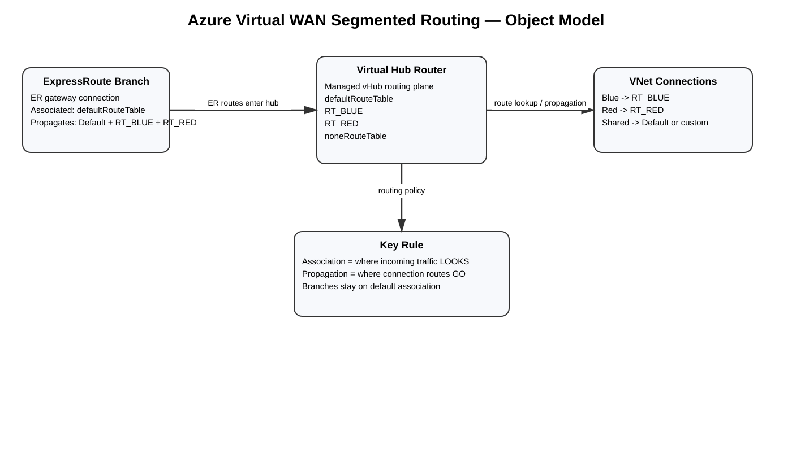
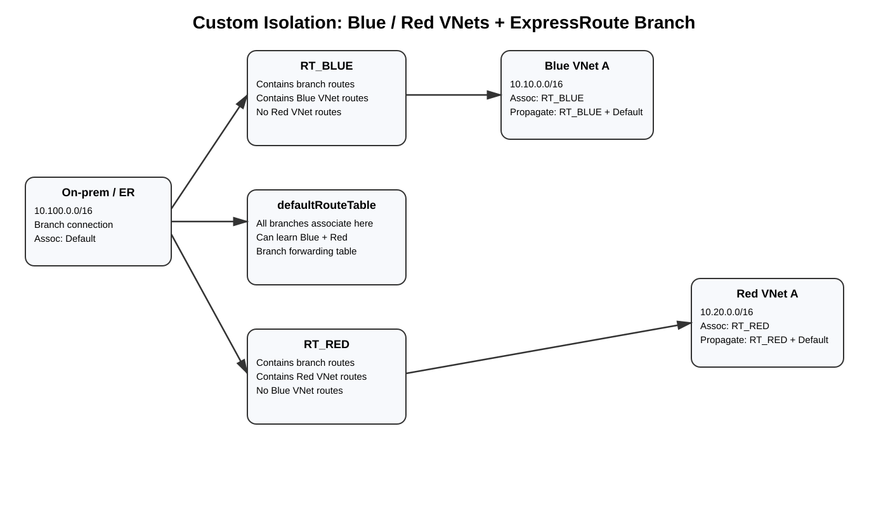
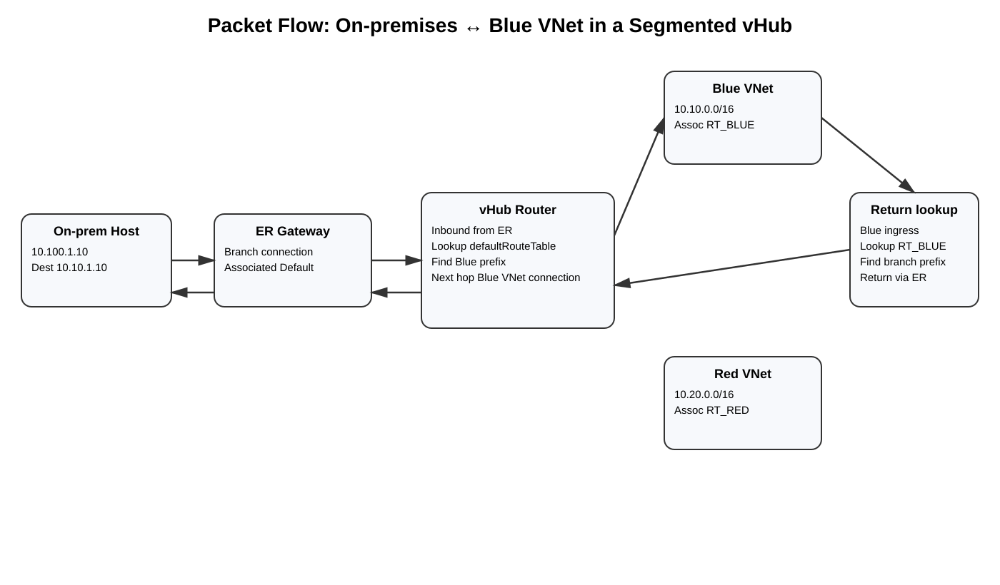

# Azure Virtual WAN Segmented Routing — vHub Route Tables, Association, Propagation, ExpressRoute, and Isolation Deep Dive

> **Scope:** How Azure Virtual WAN (vWAN) uses virtual hub route tables to create routing domains, how association and propagation work, how ExpressRoute/VPN/P2S branch connections participate, how to isolate VNet groups, how to configure the design with Azure CLI, and how to verify/troubleshoot packet paths.
>
> **Validated against Microsoft documentation:** September 7, 2026.

## Source URLs

- https://learn.microsoft.com/azure/virtual-wan/about-virtual-hub-routing
- https://learn.microsoft.com/azure/virtual-wan/how-to-virtual-hub-routing
- https://learn.microsoft.com/azure/virtual-wan/scenario-isolate-vnets
- https://learn.microsoft.com/azure/virtual-wan/scenario-isolate-vnets-custom
- https://learn.microsoft.com/azure/virtual-wan/scenario-shared-services-vnet
- https://learn.microsoft.com/azure/virtual-wan/scenario-any-to-any
- https://learn.microsoft.com/azure/virtual-wan/effective-routes-virtual-hub
- https://learn.microsoft.com/azure/virtual-wan/static-routes-firewall-basic
- https://learn.microsoft.com/azure/networking/design-guide/virtual-wan
- https://learn.microsoft.com/cli/azure/network/vhub
- https://learn.microsoft.com/cli/azure/network/vhub/connection
- https://learn.microsoft.com/cli/azure/network/express-route/gateway/connection
- https://learn.microsoft.com/cli/azure/network/vpn-gateway/connection

## Table of contents

- [1. What segmented routing means](#1-what-segmented-routing-means)
- [2. The object model](#2-the-object-model)
  - [2.1 vHub route tables are not VNet UDRs](#21-vhub-route-tables-are-not-vnet-udrs)
  - [2.2 Association](#22-association)
  - [2.3 Propagation](#23-propagation)
  - [2.4 Labels](#24-labels)
  - [2.5 Default and None route tables](#25-default-and-none-route-tables)
- [3. Critical ExpressRoute branch behavior](#3-critical-expressroute-branch-behavior)
- [4. Default any-to-any routing](#4-default-any-to-any-routing)
- [5. Segmentation example: Blue and Red VNets with ExpressRoute](#5-segmentation-example-blue-and-red-vnets-with-expressroute)
  - [5.1 Desired connectivity matrix](#51-desired-connectivity-matrix)
  - [5.2 Route-table design](#52-route-table-design)
  - [5.3 Why the ExpressRoute connection stays associated to Default](#53-why-the-expressroute-connection-stays-associated-to-default)
  - [5.4 Packet flow: on-premises to Blue VNet](#54-packet-flow-on-premises-to-blue-vnet)
  - [5.5 Why Blue cannot directly reach Red](#55-why-blue-cannot-directly-reach-red)
- [6. Azure CLI — build the segmented design](#6-azure-cli--build-the-segmented-design)
  - [6.1 Variables and resource IDs](#61-variables-and-resource-ids)
  - [6.2 Create custom vHub route tables](#62-create-custom-vhub-route-tables)
  - [6.3 Create Blue VNet connections](#63-create-blue-vnet-connections)
  - [6.4 Create Red VNet connections](#64-create-red-vnet-connections)
  - [6.5 Configure the ExpressRoute branch connection](#65-configure-the-expressroute-branch-connection)
  - [6.6 Verify routing configuration objects](#66-verify-routing-configuration-objects)
- [7. Shared-services pattern](#7-shared-services-pattern)
- [8. Multi-hub labels and propagation](#8-multi-hub-labels-and-propagation)
- [9. Static routes and NVA/Azure Firewall service insertion](#9-static-routes-and-nvaazure-firewall-service-insertion)
- [10. Routing Intent interaction](#10-routing-intent-interaction)
- [11. Verification](#11-verification)
  - [11.1 Inspect route tables](#111-inspect-route-tables)
  - [11.2 Inspect VNet connection routing configuration](#112-inspect-vnet-connection-routing-configuration)
  - [11.3 Inspect ExpressRoute connection routing configuration](#113-inspect-expressroute-connection-routing-configuration)
  - [11.4 View effective routes](#114-view-effective-routes)
- [12. Troubleshooting by symptom](#12-troubleshooting-by-symptom)
- [13. Common mistakes](#13-common-mistakes)
- [14. Design checklist](#14-design-checklist)
- [15. Mental model](#15-mental-model)
- [Sources](#sources)

---

## 1. What segmented routing means

In Azure Virtual WAN, **segmented routing** means creating separate routing domains inside a virtual hub so that different connection groups learn and use different route sets.

By default, a Standard Virtual WAN behaves like an any-to-any transit fabric: connections associate with and propagate to the virtual hub's `defaultRouteTable`. Custom vHub route tables let you change that behavior for isolation or controlled sharing.

Example goal:

```text
Blue VNets:
  reach other Blue VNets
  reach on-premises over ExpressRoute
  do NOT directly reach Red VNets

Red VNets:
  reach other Red VNets
  reach on-premises over ExpressRoute
  do NOT directly reach Blue VNets
```

This is a **routing isolation boundary**, not a firewall policy. If two networks have another route between them, or if a firewall/service insertion policy intentionally connects them, routing-table segmentation alone is not an access-control substitute.

---

## 2. The object model



[Editable draw.io source](images/09-07-26_vwan_segmented_routing_object_model.drawio)

**What this image shows**  
The ExpressRoute gateway connection, virtual hub router, vHub route tables, and VNet connections are separate objects. The vHub route tables belong to the **virtual hub**, not to the ExpressRoute gateway itself.

**What matters**  
The connection's routing configuration references the vHub route tables through **association** and **propagation**.

**What to verify**  
Inspect each connection's `routingConfiguration.associatedRouteTable` and `routingConfiguration.propagatedRouteTables`.

### 2.1 vHub route tables are not VNet UDRs

Do not confuse these constructs:

| Construct | Resource scope | Primary purpose |
|---|---|---|
| VNet route table / UDR | `Microsoft.Network/routeTables`, associated to subnet | Override/steer subnet traffic |
| vHub route table | child of `Microsoft.Network/virtualHubs` | Control routing domains between vWAN connections |
| ExpressRoute gateway routing state | managed by vWAN | Learns/advertises branch routes; not a customer-created route table |

A vHub route table is therefore not "attached to the ERGW." The **ExpressRoute connection** has a routing configuration that tells the vHub routing system which route table it uses and where its learned routes propagate.

### 2.2 Association

**Association answers: "Which route table does traffic arriving from this connection LOOK UP?"**

A connection is associated to one vHub route table.

For a Blue VNet connection:

```text
Blue VNet traffic enters the vHub
        |
        v
connection associated with RT_BLUE
        |
        v
vHub performs destination lookup in RT_BLUE
```

If `RT_BLUE` does not contain a Red prefix, the Blue connection does not gain a direct Red route through that table.

### 2.3 Propagation

**Propagation answers: "Which route tables RECEIVE routes originating from this connection?"**

Example:

```text
Blue VNet prefix 10.10.0.0/16
   |
   +--> propagate to RT_BLUE
   +--> propagate to defaultRouteTable
```

Connections associated with those route tables can then learn/use that Blue route according to the vWAN routing model.

### 2.4 Labels

Labels logically group route tables for propagation.

The built-in `defaultRouteTable` has the label:

```text
Default
```

Propagating a connection to the `Default` label applies propagation to Default route tables across hubs in the Virtual WAN, which is useful in multi-hub designs.

### 2.5 Default and None route tables

Each virtual hub has:

- `defaultRouteTable`
- `noneRouteTable`

`defaultRouteTable` is the normal shared routing domain.

Propagating to `noneRouteTable` means the connection does not need to propagate routes into usable route tables. Microsoft often exposes this in the portal as **Propagate to none**.

---

## 3. Critical ExpressRoute branch behavior

This is the most important constraint in this guide.

Microsoft groups these as **branch connections**:

- ExpressRoute
- Site-to-Site VPN
- Point-to-Site/User VPN
- supported branch-style BGP/NVA connections

Microsoft's current Virtual WAN routing guidance states that **all branch connections in the same hub need to be associated to `defaultRouteTable` and use the same propagation set**.

Therefore, do not design per-branch isolation inside one vHub like this:

```text
ER connection -> associated RT_BLUE
VPN connection -> associated RT_RED
```

as though ExpressRoute and VPN were independently assignable branch routing domains.

For a supported VNet-isolation design, use:

```text
Branches:
  associated -> defaultRouteTable
  propagate -> RT_BLUE, RT_RED, defaultRouteTable

Blue VNets:
  associated -> RT_BLUE

Red VNets:
  associated -> RT_RED
```

This makes **VNet connections** the primary segmentation unit while branches remain in the common branch routing domain.

---

## 4. Default any-to-any routing

With no custom segmentation:

```text
All VNets:
  associated -> defaultRouteTable
  propagate  -> defaultRouteTable

All branches:
  associated -> defaultRouteTable
  propagate  -> defaultRouteTable
```

Result:

```text
VNet A <-> VNet B
VNet A <-> ExpressRoute
VNet B <-> VPN
ExpressRoute <-> VPN
```

subject to branch-to-branch configuration and service-specific constraints.

This default model is convenient, but it is exactly why custom vHub route tables are required when you want route isolation.

---

## 5. Segmentation example: Blue and Red VNets with ExpressRoute



[Editable draw.io source](images/09-07-26_vwan_segmented_routing_blue_red.drawio)

**What this image shows**  
Blue VNets use `RT_BLUE`; Red VNets use `RT_RED`; the ExpressRoute branch stays associated to `defaultRouteTable` and propagates its on-prem routes into both custom route tables.

**What matters**  
Branches are shared; VNets are segmented by association and selective propagation.

**What to verify**  
`RT_BLUE` contains branch + Blue routes but no Red routes, and `RT_RED` contains branch + Red routes but no Blue routes.

### 5.1 Desired connectivity matrix

| From \ To | Blue | Red | On-prem ER |
|---|---:|---:|---:|
| Blue | Yes | No | Yes |
| Red | No | Yes | Yes |
| On-prem ER | Yes | Yes | N/A |

### 5.2 Route-table design

Use:

```text
Blue VNet connections:
  associate -> RT_BLUE
  propagate -> RT_BLUE + defaultRouteTable

Red VNet connections:
  associate -> RT_RED
  propagate -> RT_RED + defaultRouteTable

ExpressRoute branch:
  associate -> defaultRouteTable
  propagate -> RT_BLUE + RT_RED + defaultRouteTable
```

The resulting route contents are conceptually:

```text
RT_BLUE
  10.10.0.0/16  Blue VNet
  10.11.0.0/16  Blue VNet
  10.100.0.0/16 On-prem via ER
  [no Red prefixes]

RT_RED
  10.20.0.0/16  Red VNet
  10.21.0.0/16  Red VNet
  10.100.0.0/16 On-prem via ER
  [no Blue prefixes]

defaultRouteTable
  branch routes
  Blue routes if Blue propagates to Default
  Red routes if Red propagates to Default
```

### 5.3 Why the ExpressRoute connection stays associated to Default

A common misunderstanding is:

```text
"Blue must reach ER, so associate the ER connection with RT_BLUE."
```

Association works in the **incoming direction**.

When traffic arrives **from ExpressRoute**, the branch connection's associated route table determines the lookup used for that traffic. Because branches in the hub share the Default association, `defaultRouteTable` must contain routes to the Blue/Red VNets that the branch needs to reach.

That is why Blue and Red VNets typically propagate their prefixes to `defaultRouteTable`.

Conversely, when Blue traffic needs to reach on-premises, Blue's associated `RT_BLUE` must contain the on-prem route. That is why the ER branch propagates its routes into `RT_BLUE`.

### 5.4 Packet flow: on-premises to Blue VNet



[Editable draw.io source](images/09-07-26_vwan_segmented_routing_packet_flow.drawio)

Assume:

```text
On-prem source: 10.100.1.10
Blue VM:        10.10.1.10
```

Forward:

1. On-prem router selects Azure prefix `10.10.0.0/16`.
2. Packet enters ExpressRoute Private Peering.
3. vWAN ExpressRoute gateway receives the branch traffic.
4. ER branch connection is associated with `defaultRouteTable`.
5. `defaultRouteTable` contains `10.10.0.0/16` because Blue propagated its route there.
6. vHub router forwards toward the Blue VNet connection.
7. Blue VM receives the packet.

Return:

1. Blue VM sends to `10.100.1.10`.
2. Blue VNet connection traffic enters vHub.
3. Blue is associated with `RT_BLUE`.
4. `RT_BLUE` contains `10.100.0.0/16` because the ER branch propagated that prefix to `RT_BLUE`.
5. vHub forwards through ER gateway.
6. ExpressRoute Private Peering carries the packet to on-premises.

### 5.5 Why Blue cannot directly reach Red

Blue traffic uses `RT_BLUE`.

If Red prefixes are **not propagated to RT_BLUE**, the table does not contain the direct Red route.

Likewise Red traffic uses `RT_RED`, which does not contain Blue routes.

This routing-domain separation is what creates the segmentation.

---

## 6. Azure CLI — build the segmented design

> **CLI status note:** `az network vhub route-table` is currently an Azure CLI extension command group and is GA. Some connection routing-configuration switches such as associated/propagated route-table parameters are shown as Preview in parts of current Azure CLI reference even though the underlying Virtual WAN routing feature is established. Validate CLI extension/API versions before production automation.

### 6.1 Variables and resource IDs

```cli
SUB_ID=<subscription-id>
RG=RG-vWAN
LOCATION=westus2
VHUB=vHub-West
ERGW=ERGW-vHub-West

RT_BLUE=RT_BLUE
RT_RED=RT_RED
```

Get built-in table IDs:

```cli
DEFAULT_RT_ID=$(az network vhub route-table show \
  --resource-group "$RG" \
  --vhub-name "$VHUB" \
  --name defaultRouteTable \
  --query id -o tsv)

NONE_RT_ID=$(az network vhub route-table show \
  --resource-group "$RG" \
  --vhub-name "$VHUB" \
  --name noneRouteTable \
  --query id -o tsv)
```

### 6.2 Create custom vHub route tables

```cli
az network vhub route-table create \
  --resource-group "$RG" \
  --vhub-name "$VHUB" \
  --name "$RT_BLUE"
```

```cli
az network vhub route-table create \
  --resource-group "$RG" \
  --vhub-name "$VHUB" \
  --name "$RT_RED"
```

Get their IDs:

```cli
RT_BLUE_ID=$(az network vhub route-table show \
  -g "$RG" \
  --vhub-name "$VHUB" \
  -n "$RT_BLUE" \
  --query id -o tsv)

RT_RED_ID=$(az network vhub route-table show \
  -g "$RG" \
  --vhub-name "$VHUB" \
  -n "$RT_RED" \
  --query id -o tsv)
```

Verify:

```cli
az network vhub route-table list \
  -g "$RG" \
  --vhub-name "$VHUB" \
  -o table
```

### 6.3 Create Blue VNet connections

Assume:

```text
VNet-Blue-A = 10.10.0.0/16
VNet-Blue-B = 10.11.0.0/16
```

Get remote VNet IDs:

```cli
BLUE_A_ID=$(az network vnet show \
  -g RG-Blue \
  -n VNet-Blue-A \
  --query id -o tsv)

BLUE_B_ID=$(az network vnet show \
  -g RG-Blue \
  -n VNet-Blue-B \
  --query id -o tsv)
```

Create connections associated with `RT_BLUE`, while propagating their routes to `RT_BLUE` and `defaultRouteTable`:

```cli
az network vhub connection create \
  -g "$RG" \
  --vhub-name "$VHUB" \
  -n Blue-A-to-vHub \
  --remote-vnet "$BLUE_A_ID" \
  --associated-route-table "$RT_BLUE_ID" \
  --propagated-route-tables "$RT_BLUE_ID" "$DEFAULT_RT_ID"
```

```cli
az network vhub connection create \
  -g "$RG" \
  --vhub-name "$VHUB" \
  -n Blue-B-to-vHub \
  --remote-vnet "$BLUE_B_ID" \
  --associated-route-table "$RT_BLUE_ID" \
  --propagated-route-tables "$RT_BLUE_ID" "$DEFAULT_RT_ID"
```

### 6.4 Create Red VNet connections

```cli
RED_A_ID=$(az network vnet show \
  -g RG-Red \
  -n VNet-Red-A \
  --query id -o tsv)

az network vhub connection create \
  -g "$RG" \
  --vhub-name "$VHUB" \
  -n Red-A-to-vHub \
  --remote-vnet "$RED_A_ID" \
  --associated-route-table "$RT_RED_ID" \
  --propagated-route-tables "$RT_RED_ID" "$DEFAULT_RT_ID"
```

### 6.5 Configure the ExpressRoute branch connection

Get the ER private peering ID:

```cli
ER_PEERING_ID=$(az network express-route peering show \
  -g RG-Network \
  --circuit-name ER-LA-01 \
  -n AzurePrivatePeering \
  --query id -o tsv)
```

For branch consistency, use `defaultRouteTable` as the associated table and propagate the branch routes into both VNet isolation tables plus Default:

```cli
az network express-route gateway connection create \
  --resource-group "$RG" \
  --gateway-name "$ERGW" \
  --name Conn-ER-LA-01 \
  --peering "$ER_PEERING_ID" \
  --associated-route-table "$DEFAULT_RT_ID" \
  --propagated-route-tables "$RT_BLUE_ID" "$RT_RED_ID" "$DEFAULT_RT_ID" \
  --routing-weight 100
```

**Important correction to a common example:** Do not treat the ER connection as though it can be independently associated with `RT_BLUE` while other branch connections use something else. Microsoft requires branch connections in a hub to use the Default association and a consistent propagation set.

If S2S VPN/P2S connections exist in the same hub, align their branch routing configuration with the same branch propagation design.

### 6.6 Verify routing configuration objects

Blue VNet:

```cli
az network vhub connection show \
  -g "$RG" \
  --vhub-name "$VHUB" \
  -n Blue-A-to-vHub \
  --query 'routingConfiguration' \
  -o json
```

Expected conceptual state:

```text
associatedRouteTable.id -> .../hubRouteTables/RT_BLUE
propagatedRouteTables.ids:
  - .../hubRouteTables/RT_BLUE
  - .../hubRouteTables/defaultRouteTable
```

ExpressRoute:

```cli
az network express-route gateway connection show \
  -g "$RG" \
  --gateway-name "$ERGW" \
  -n Conn-ER-LA-01 \
  --query 'routingConfiguration' \
  -o json
```

Expected conceptual state:

```text
associatedRouteTable.id -> .../hubRouteTables/defaultRouteTable

propagatedRouteTables.ids:
  - .../hubRouteTables/RT_BLUE
  - .../hubRouteTables/RT_RED
  - .../hubRouteTables/defaultRouteTable
```

---

## 7. Shared-services pattern

A common extension is:

```text
Blue -> Shared
Red  -> Shared
Blue !-> Red
```

Microsoft documents a shared-services pattern in which isolated VNets associate with a custom table, while shared services and branch connections make their routes available to that table.

Example:

```text
RT_SHARED:
  branch routes
  shared-services routes

Isolated application VNets:
  associated -> RT_SHARED
  propagate -> defaultRouteTable

Shared VNet:
  associated -> defaultRouteTable
  propagate -> RT_SHARED + defaultRouteTable

Branches:
  associated -> defaultRouteTable
  propagate -> RT_SHARED + defaultRouteTable
```

For more complex Blue/Red/shared-service requirements, build the desired connectivity matrix first, then derive association and propagation from that matrix.

---

## 8. Multi-hub labels and propagation

In multi-region Virtual WAN, labels reduce the need to manually reference every route table ID.

The `Default` label represents Default route tables across hubs.

Conceptually:

```text
Hub West defaultRouteTable -- label Default
Hub East defaultRouteTable -- label Default

Connection propagates to label Default
        |
        +--> both Default route tables
```

Use labels when the segmentation intent spans hubs, but verify that the same-named custom routing domain exists where required.

Microsoft's shared-services guidance notes that multi-hub designs require the necessary custom route table in each hub and propagation across hubs using labels.

---

## 9. Static routes and NVA/Azure Firewall service insertion

Custom route tables can also contain static routes.

Example intent:

```text
RT_BLUE
  0.0.0.0/0 -> Azure Firewall / NVA next hop
```

or:

```text
10.20.0.0/16 -> inspection next hop
```

This is different from pure route-table isolation:

```text
Segmentation:
  omit routes between domains

Service insertion:
  deliberately add a route whose next hop is a firewall/NVA path
```

Microsoft documents vHub static-route scenarios and warns that if you need consistent inter-hub/branch-to-branch inspection, Routing Intent may be the appropriate managed model rather than ad-hoc static routing.

---

## 10. Routing Intent interaction

Routing Intent is a separate Virtual WAN security-routing mechanism that programs private and/or Internet traffic toward a security provider such as Azure Firewall in a secured hub.

Do not assume you can freely combine every custom route-table segmentation pattern with Routing Intent.

Microsoft Zero Trust guidance explicitly notes that custom route-table isolation and Routing Intent are not generally combined as interchangeable controls.

Use:

- **custom vHub route tables** when your primary goal is routing-domain isolation;
- **Routing Intent** when your primary goal is managed security service insertion for private/Internet traffic.

Validate the exact combination for the current service version before production deployment.

---

## 11. Verification

### 11.1 Inspect route tables

```cli
az network vhub route-table list \
  -g "$RG" \
  --vhub-name "$VHUB" \
  -o json
```

Inspect one:

```cli
az network vhub route-table show \
  -g "$RG" \
  --vhub-name "$VHUB" \
  -n RT_BLUE \
  -o json
```

### 11.2 Inspect VNet connection routing configuration

```cli
az network vhub connection show \
  -g "$RG" \
  --vhub-name "$VHUB" \
  -n Blue-A-to-vHub \
  --query 'routingConfiguration' \
  -o json
```

**Success criteria:**

```text
Blue:
  associated -> RT_BLUE
  propagated -> RT_BLUE + defaultRouteTable
```

### 11.3 Inspect ExpressRoute connection routing configuration

```cli
az network express-route gateway connection show \
  -g "$RG" \
  --gateway-name "$ERGW" \
  -n Conn-ER-LA-01 \
  --query 'routingConfiguration' \
  -o json
```

**Success criteria:**

```text
ER:
  associated -> defaultRouteTable
  propagated -> same branch propagation set used by other branches
```

### 11.4 View effective routes

Portal path:

**Virtual WAN -> Virtual hubs -> `<hub>` -> Effective Routes**

Select either a connection or route table.

Important fields include destination prefix and next hop/origin information.

For workload verification, also inspect the VM NIC's effective routes where useful:

```cli
az network nic show-effective-route-table \
  -g <VNET_RESOURCE_GROUP> \
  -n <VM_NIC_NAME> \
  -o table
```

The vHub effective-route view is the stronger source for understanding association/propagation behavior; NIC effective routes show the workload-facing result.

---

## 12. Troubleshooting by symptom

### Symptom: Blue VNet cannot reach on-premises

**Where:** `RT_BLUE` and ER branch propagation.

**Commands:**

```cli
az network vhub route-table show \
  -g "$RG" \
  --vhub-name "$VHUB" \
  -n RT_BLUE \
  -o json
```

```cli
az network express-route gateway connection show \
  -g "$RG" \
  --gateway-name "$ERGW" \
  -n Conn-ER-LA-01 \
  --query routingConfiguration \
  -o json
```

**What it tests:** whether branch routes are propagated into `RT_BLUE`.

**Failure meaning:** Blue's associated table does not contain the on-prem route.

**Next action:** include `RT_BLUE` in the consistent branch propagation set.

### Symptom: on-premises cannot reach Blue

**Where:** `defaultRouteTable` plus Blue VNet propagation.

**What it tests:** traffic arriving from ER uses Default association; therefore Blue prefixes must be present in Default.

**Failure meaning:** Blue VNet did not propagate to Default or the route is otherwise absent.

**Next action:** propagate Blue VNet route to `defaultRouteTable`.

### Symptom: Blue can unexpectedly reach Red

**Where:** `RT_BLUE`.

**What to inspect:** whether a Red VNet connection propagated Red prefixes into `RT_BLUE`, a static aggregate covers Red, or another security/routing feature inserted a reachable path.

**Next action:** remove the unintended propagation/static route after verifying business intent.

### Symptom: ER works but S2S VPN branch behaves differently

**Where:** routing configuration of all branch connections in the hub.

**Failure meaning:** branch propagation sets are inconsistent.

**Next action:** align ExpressRoute, S2S VPN, P2S, and other branch-style connections with the same branch routing configuration as required by Microsoft.

### Symptom: custom route table exists but has no useful learned routes

**Where:** propagation settings.

**Failure meaning:** creating the table alone does not populate it; connections must propagate into it or static routes must be configured.

### Symptom: route-table CLI arguments fail

**Where:** Azure CLI version/extensions.

Check:

```cli
az version
az extension list -o table
az network vhub route-table create --help
az network vhub connection create --help
az network express-route gateway connection create --help
```

**Failure meaning:** command/parameter availability can differ by core CLI/extension version, and some routing-configuration parameters are marked Preview in current command references.

**Next action:** update the appropriate extension/CLI and validate the API version before automating.

---

## 13. Common mistakes

1. Thinking a custom vHub route table is attached directly to the ExpressRoute gateway.
2. Treating vHub route tables like subnet UDRs.
3. Reversing association and propagation.
4. Associating ExpressRoute to a custom VNet route domain while other branch connections use a different association.
5. Forgetting that branches must use a consistent propagation set.
6. Creating `RT_BLUE` but never propagating ER/on-prem routes into it.
7. Forgetting to propagate Blue prefixes to Default when branches need to reach Blue.
8. Accidentally propagating Red into Blue and destroying isolation.
9. Assuming route isolation is equivalent to firewall policy.
10. Combining custom segmentation and Routing Intent without validating the supported interaction.
11. Using the `Default` label without realizing it can affect Default route tables across multiple hubs.
12. Troubleshooting only VM NIC effective routes and never checking the vHub route-table/connection routing configuration.

---

## 14. Design checklist

Before deployment:

1. Draw the connectivity matrix.
2. Identify which connections are **branches** and which are **VNet connections**.
3. Keep all branches associated with `defaultRouteTable`.
4. Choose one consistent branch propagation set.
5. Create one custom route table per VNet routing domain where needed.
6. Associate each VNet connection to the correct custom table.
7. Propagate VNet routes only into tables that should learn them.
8. Propagate branch routes into every custom table whose VNets need branch reachability.
9. Verify Default contains VNet routes required for branch-to-VNet return traffic.
10. Validate multi-hub label effects.
11. Decide whether isolation alone is sufficient or firewall inspection is also required.
12. Validate Routing Intent interactions before combining controls.
13. Verify vHub effective routes before testing applications.
14. Test both forward and return paths.

---

## 15. Mental model

Use this mnemonic:

```text
Association = LOOK
Propagation = PUBLISH
```

For a VNet connection:

```text
Association:
  Which routing table do packets FROM this VNet look at?

Propagation:
  Which routing tables learn this VNet's prefixes?
```

For ExpressRoute in vWAN:

```text
ER gateway is not given its own custom route table.

ER branch connection:
  associated -> defaultRouteTable
  propagated -> the branch propagation set

Custom route tables:
  primarily segment VNet connection routing domains.
```

And the packet-direction test:

```text
On-prem -> Blue
  ER association = Default
  Therefore Default must know Blue.

Blue -> On-prem
  Blue association = RT_BLUE
  Therefore RT_BLUE must know ER/on-prem.
```

If those two statements are true, the route design is internally consistent.

---

## Sources

- Microsoft Learn — About virtual hub routing: https://learn.microsoft.com/azure/virtual-wan/about-virtual-hub-routing
- Microsoft Learn — Configure virtual hub routing: https://learn.microsoft.com/azure/virtual-wan/how-to-virtual-hub-routing
- Microsoft Learn — Isolating VNets: https://learn.microsoft.com/azure/virtual-wan/scenario-isolate-vnets
- Microsoft Learn — Custom isolation for VNets: https://learn.microsoft.com/azure/virtual-wan/scenario-isolate-vnets-custom
- Microsoft Learn — Shared services VNet routing: https://learn.microsoft.com/azure/virtual-wan/scenario-shared-services-vnet
- Microsoft Learn — Any-to-any scenario: https://learn.microsoft.com/azure/virtual-wan/scenario-any-to-any
- Microsoft Learn — Effective routes in virtual hub: https://learn.microsoft.com/azure/virtual-wan/effective-routes-virtual-hub
- Microsoft Learn — Static routes with Azure Firewall: https://learn.microsoft.com/azure/virtual-wan/static-routes-firewall-basic
- Microsoft Learn — Virtual WAN design guide: https://learn.microsoft.com/azure/networking/design-guide/virtual-wan
- Azure CLI — `az network vhub`: https://learn.microsoft.com/cli/azure/network/vhub
- Azure CLI — `az network vhub connection`: https://learn.microsoft.com/cli/azure/network/vhub/connection
- Azure CLI — `az network express-route gateway connection`: https://learn.microsoft.com/cli/azure/network/express-route/gateway/connection
- Azure CLI — `az network vpn-gateway connection`: https://learn.microsoft.com/cli/azure/network/vpn-gateway/connection

---

## Information-quality labels

- **Source information** — behavior stated by Microsoft documentation.
- **Additional explanation** — networking interpretation used to make association/propagation behavior explicit.
- **Reasonable inference** — design conclusion derived from the documented routing model; not presented as a product guarantee.
