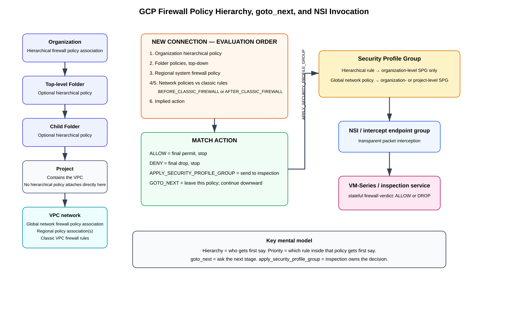

# GCP Firewall Policy Hierarchy, `goto_next`, and NSI — Deep Dive

**Last validated:** 2026-09-07  
**Focus:** organization/folder hierarchical firewall policies, VPC-scoped global and regional network firewall policies, classic VPC firewall rules, evaluation order, `goto_next`, `apply_security_profile_group`, Network Security Integration (NSI), policy association, worked packet walks, CLI configuration, verification, limitations, and troubleshooting.

> **Source information** = behavior explicitly documented by Google Cloud.  
> **Additional explanation** = networking/security interpretation added to make the behavior easier to reason about.  
> **Reasonable inference** = a design conclusion based on documented behavior; validate it against the exact production hierarchy and VPC configuration before rollout.

---

## Table of contents

- [1. Why this topic is confusing](#1-why-this-topic-is-confusing)
- [2. The three separate hierarchies you must keep apart](#2-the-three-separate-hierarchies-you-must-keep-apart)
  - [2.1 Google Cloud resource hierarchy](#21-google-cloud-resource-hierarchy)
  - [2.2 Firewall policy attachment hierarchy](#22-firewall-policy-attachment-hierarchy)
  - [2.3 Firewall rule evaluation hierarchy](#23-firewall-rule-evaluation-hierarchy)
- [3. Policy types and where each one attaches](#3-policy-types-and-where-each-one-attaches)
  - [3.1 Hierarchical firewall policy](#31-hierarchical-firewall-policy)
  - [3.2 Global network firewall policy](#32-global-network-firewall-policy)
  - [3.3 Regional network firewall policy](#33-regional-network-firewall-policy)
  - [3.4 Classic VPC firewall rules](#34-classic-vpc-firewall-rules)
- [4. The complete evaluation order](#4-the-complete-evaluation-order)
  - [4.1 Default `AFTER_CLASSIC_FIREWALL`](#41-default-after_classic_firewall)
  - [4.2 `BEFORE_CLASSIC_FIREWALL`](#42-before_classic_firewall)
  - [4.3 Hierarchical policies are always first](#43-hierarchical-policies-are-always-first)
- [5. What `goto_next` actually means](#5-what-goto_next-actually-means)
  - [5.1 `goto_next` does not mean allow](#51-goto_next-does-not-mean-allow)
  - [5.2 `goto_next` does not mean next rule in the same policy](#52-goto_next-does-not-mean-next-rule-in-the-same-policy)
  - [5.3 Explicit versus implied `goto_next`](#53-explicit-versus-implied-goto_next)
- [6. What `allow`, `deny`, and `apply_security_profile_group` mean](#6-what-allow-deny-and-apply_security_profile_group-mean)
- [7. Where NSI fits](#7-where-nsi-fits)
  - [7.1 NSI is not a policy scope](#71-nsi-is-not-a-policy-scope)
  - [7.2 Security profile group scope rules](#72-security-profile-group-scope-rules)
  - [7.3 Regional network policies cannot invoke NSI interception](#73-regional-network-policies-cannot-invoke-nsi-interception)
- [8. Apply policy to an organization or folder](#8-apply-policy-to-an-organization-or-folder)
  - [8.1 Create an organization-owned hierarchical policy](#81-create-an-organization-owned-hierarchical-policy)
  - [8.2 Associate it with the organization](#82-associate-it-with-the-organization)
  - [8.3 Associate a hierarchical policy with a folder](#83-associate-a-hierarchical-policy-with-a-folder)
- [9. Apply a global network firewall policy to a VPC](#9-apply-a-global-network-firewall-policy-to-a-vpc)
- [10. Build an NSI interception rule in a global network firewall policy](#10-build-an-nsi-interception-rule-in-a-global-network-firewall-policy)
- [11. Build an NSI interception rule in a hierarchical policy](#11-build-an-nsi-interception-rule-in-a-hierarchical-policy)
- [12. Worked example 1 — organization delegates, VPC invokes NSI](#12-worked-example-1--organization-delegates-vpc-invokes-nsi)
- [13. Worked example 2 — folder denies before NSI can run](#13-worked-example-2--folder-denies-before-nsi-can-run)
- [14. Worked example 3 — hierarchical policy invokes NSI directly](#14-worked-example-3--hierarchical-policy-invokes-nsi-directly)
- [15. Worked example 4 — why a lower-level rule cannot override a higher-level allow or deny](#15-worked-example-4--why-a-lower-level-rule-cannot-override-a-higher-level-allow-or-deny)
- [16. Priority inside a policy versus hierarchy between policies](#16-priority-inside-a-policy-versus-hierarchy-between-policies)
- [17. Changing `BEFORE_CLASSIC_FIREWALL` versus `AFTER_CLASSIC_FIREWALL`](#17-changing-before_classic_firewall-versus-after_classic_firewall)
- [18. Verification workflow](#18-verification-workflow)
  - [18.1 Verify hierarchical policy associations](#181-verify-hierarchical-policy-associations)
  - [18.2 Verify global network policy associations](#182-verify-global-network-policy-associations)
  - [18.3 Verify the VPC enforcement order](#183-verify-the-vpc-enforcement-order)
  - [18.4 Verify policy rules](#184-verify-policy-rules)
  - [18.5 Verify effective firewall rules](#185-verify-effective-firewall-rules)
- [19. Troubleshooting by symptom](#19-troubleshooting-by-symptom)
- [20. Common mistakes](#20-common-mistakes)
- [21. One-page mental model](#21-one-page-mental-model)
- [22. Design guidance](#22-design-guidance)
- [Sources](#sources)

---

## Source URLs

Primary Google Cloud references:

- https://docs.cloud.google.com/firewall/docs/firewall-policies-rule-eval-order
- https://docs.cloud.google.com/firewall/docs/firewall-policies
- https://docs.cloud.google.com/firewall/docs/using-firewall-policies
- https://docs.cloud.google.com/firewall/docs/network-firewall-policies
- https://docs.cloud.google.com/firewall/docs/configure-global-fw-policies
- https://docs.cloud.google.com/firewall/docs/use-regional-firewall-policies
- https://docs.cloud.google.com/firewall/docs/firewall-policies-rule-details
- https://docs.cloud.google.com/firewall/docs/firewall-policies-examples
- https://docs.cloud.google.com/network-security-integration/docs/in-band/firewall-policies-overview
- https://docs.cloud.google.com/network-security-integration/docs/in-band/configure-firewall-rules
- https://docs.cloud.google.com/network-security-integration/docs/in-band/configure-consumer-service
- https://docs.cloud.google.com/network-security-integration/docs/in-band/security-profile-groups-overview
- https://docs.cloud.google.com/network-security-integration/docs/quotas
- https://docs.cloud.google.com/sdk/gcloud/reference/compute/firewall-policies/rules/create

---

# 1. Why this topic is confusing

The confusion usually comes from using the word **global** to mean two different things.

A **global network firewall policy** is a project/VPC-level firewall policy resource whose rules can apply across regions of an associated VPC network.

A **hierarchical firewall policy** is attached to the Google Cloud **resource hierarchy** at the organization or folder level.

Those are not the same thing.

```text
GLOBAL NETWORK FIREWALL POLICY
!=
ORGANIZATION HIERARCHICAL FIREWALL POLICY
```

The second source of confusion is that NSI is not itself a policy type.

```text
NSI
= packet interception / service insertion framework
```

The firewall rule that invokes NSI uses:

```text
apply_security_profile_group
```

That action can live in a supported hierarchical firewall policy or a global network firewall policy.

---

# 2. The three separate hierarchies you must keep apart

## 2.1 Google Cloud resource hierarchy

```text
Organization
   |
   +-- Folder-A
          |
          +-- Folder-B
                 |
                 +-- Project
                        |
                        +-- VPC
                               |
                               +-- VM / NIC
```

This hierarchy determines ownership, inheritance, IAM scope, and which higher-level hierarchical firewall policies can affect a workload.

## 2.2 Firewall policy attachment hierarchy

```text
Organization
   |
   +-- Hierarchical firewall policy association
   |
   +-- Folder-A
          |
          +-- Optional hierarchical firewall policy association
          |
          +-- Folder-B
                 |
                 +-- Optional hierarchical firewall policy association
                 |
                 +-- Project
                        |
                        +-- VPC
                               |
                               +-- Global network firewall policy association
                               +-- Regional network firewall policy association(s)
                               +-- Classic VPC firewall rules
```

Important facts:

- A hierarchical firewall policy can be associated with an organization or folder.
- It cannot be associated directly with a project or VPC.
- A global network firewall policy is associated with one or more VPC networks in the same project as the policy.
- A VPC can have only one associated global network firewall policy.
- A global network firewall policy can be associated with multiple VPCs in that project.
- A policy object has no enforcement effect until it is associated with an applicable resource.

## 2.3 Firewall rule evaluation hierarchy

The evaluation hierarchy is about **which policy gets to make the decision first**.



[Editable draw.io source](images/09-07-26_gcp_firewall_policy_hierarchy_nsi.drawio)

**What this image shows**  
The resource hierarchy, where each policy type attaches, the major evaluation stages, and the handoff from `apply_security_profile_group` to a security profile group and NSI.

**What matters**  
`goto_next` moves evaluation downward to the next policy/evaluation stage. `allow`, `deny`, and `apply_security_profile_group` are terminating actions for the normal firewall-rule evaluation path.

**What to verify**  
Check which hierarchical policies are inherited by the workload, which global/regional network policy is associated with the VPC, and the VPC's `networkFirewallPolicyEnforcementOrder`.

---

# 3. Policy types and where each one attaches

## 3.1 Hierarchical firewall policy

**Association target:**

```text
Organization
or
Folder
```

A hierarchical policy is inherited by resources below the associated organization/folder, subject to each rule's targets and match conditions.

A single organization or folder can have only one hierarchical firewall policy association, although a workload can inherit multiple hierarchical policies through its ancestry:

```text
Organization policy
   -> top folder policy
      -> child folder policy
         -> workload project/VPC
```

Hierarchical rules support:

```text
allow
deny
goto_next
apply_security_profile_group
```

This is where `goto_next` is especially useful because a central team can deliberately delegate some traffic to a lower folder or VPC policy.

## 3.2 Global network firewall policy

**Association target:**

```text
VPC network
```

The policy is a project resource.

A global network firewall policy can be associated with multiple VPC networks **in the same project**, but each VPC can have only one associated global network firewall policy.

Global network policies support:

```text
allow
deny
goto_next
apply_security_profile_group
```

For NSI, this is the most common consumer-VPC policy model.

## 3.3 Regional network firewall policy

A regional network firewall policy applies to a VPC in a particular region.

It supports normal firewall actions such as:

```text
allow
deny
goto_next
```

But Google does **not** support `apply_security_profile_group` in regional network firewall policies.

Therefore do not build NSI in-band interception in a regional network firewall policy.

## 3.4 Classic VPC firewall rules

Classic VPC firewall rules are network-scoped rules associated with the VPC itself.

They are still part of the overall evaluation chain, but their relative position versus global/regional network firewall policies depends on the VPC's enforcement-order setting.

---

# 4. The complete evaluation order

Google supports two network firewall policy enforcement orders.

## 4.1 Default `AFTER_CLASSIC_FIREWALL`

The default order is:

```text
1. Hierarchical firewall policies
     organization
       -> folders top-down

2. Regional system firewall policies

3. Classic VPC firewall rules

4. Global network firewall policy

5. Regional network firewall policy

6. Implied action
```

For a VM network interface, if traffic reaches the final implied action:

```text
Ingress -> implied deny
Egress  -> implied allow
```

## 4.2 `BEFORE_CLASSIC_FIREWALL`

If the VPC is configured with:

```text
BEFORE_CLASSIC_FIREWALL
```

then the order becomes:

```text
1. Hierarchical firewall policies
2. Regional system firewall policies
3. Global network firewall policy
4. Regional network firewall policy
5. Classic VPC firewall rules
6. Implied action
```

The important thing to notice is that **hierarchical policies remain first in both models**.

## 4.3 Hierarchical policies are always first

Inside the hierarchical stage, Google evaluates:

```text
Organization policy
   |
   v
Top-level folder policy
   |
   v
Next child folder policy
   |
   v
Folder containing the project
```

A higher-level final decision cannot be overridden by a lower-level policy.

---

# 5. What `goto_next` actually means

## 5.1 `goto_next` does not mean allow

Suppose an organization policy contains:

```text
priority 100
source 10.0.0.0/8
action goto_next
```

Traffic from `10.1.1.10` matches.

The result is **not**:

```text
ALLOW
```

The result is:

```text
Organization policy matched
   |
   | goto_next
   v
Stop evaluating this organization policy
   |
   v
Continue to the next applicable policy/evaluation stage
```

The next policy might deny, allow, invoke NSI, or itself delegate again.

## 5.2 `goto_next` does not mean next rule in the same policy

This is critical.

If the policy contains:

```text
priority 100  source 10.0.0.0/8   goto_next
priority 200  source 10.1.0.0/16  deny
```

Traffic from `10.1.1.10` matches priority `100` first.

Google does this:

```text
priority 100 matches
   -> goto_next
   -> EXIT CURRENT POLICY
   -> continue to next policy/evaluation stage
```

Google does **not** continue to priority `200` in that same policy.

## 5.3 Explicit versus implied `goto_next`

There are two ways evaluation can leave a policy without a final allow/deny/inspection decision.

### Explicit

A matching rule says:

```text
action = goto_next
```

### Implied

No applicable rule in that policy matches.

Google treats this as an implied `goto_next` and proceeds to the next stage.

Therefore:

```text
NO MATCH
```

and:

```text
MATCH goto_next
```

both result in continued evaluation, but for different reasons.

---

# 6. What `allow`, `deny`, and `apply_security_profile_group` mean

| Action | Result | Continue normal firewall evaluation? |
|---|---|---:|
| `allow` | Permit connection | No |
| `deny` | Drop connection | No |
| `goto_next` | Delegate to next policy/evaluation stage | Yes |
| `apply_security_profile_group` | Hand traffic to the configured inspection service | No |

The most useful mnemonic is:

```text
ALLOW     = YES
DENY      = NO
GOTO_NEXT = ASK THE NEXT STAGE
APPLY_*   = INSPECTION OWNS THE DECISION
```

When `apply_security_profile_group` matches, Google stops normal firewall rule evaluation and sends traffic to the configured firewall endpoint or NSI intercept endpoint group referenced through the security profile group.

---

# 7. Where NSI fits

## 7.1 NSI is not a policy scope

NSI is not:

```text
organization policy
folder policy
VPC policy
```

NSI is the interception framework used after a supported firewall rule selects a connection for inspection.

Conceptually:

```text
Firewall policy rule
   |
   | action = apply_security_profile_group
   v
Security Profile Group
   |
   v
custom intercept security profile
   |
   v
intercept endpoint group
   |
   v
NSI producer service
   |
   v
VM-Series / other inspection service
```

## 7.2 Security profile group scope rules

This is one of the most important NSI policy-scope rules.

### Hierarchical firewall policy rule

Can reference:

```text
organization-level security profile group
```

It cannot use a project-level security profile group.

### Global network firewall policy rule

Can reference:

```text
organization-level security profile group
or
project-level security profile group
```

Google's NSI consumer documentation specifically distinguishes these two scopes.

## 7.3 Regional network policies cannot invoke NSI interception

Google does not allow:

```text
apply_security_profile_group
```

in regional network firewall policies.

So the supported NSI control points are primarily:

```text
Hierarchical firewall policy
or
Global network firewall policy
```

---

# 8. Apply policy to an organization or folder

## 8.1 Create an organization-owned hierarchical policy

```cli
gcloud compute firewall-policies create \
  --organization ORG_ID \
  --short-name corp-security-policy \
  --description "Central organization firewall policy"
```

Creating the policy does **not** enforce it yet.

## 8.2 Associate it with the organization

```cli
gcloud compute firewall-policies associations create \
  --firewall-policy corp-security-policy \
  --organization ORG_ID \
  --name corp-security-policy-assoc
```

After association, applicable rules are inherited by resources below the organization.

## 8.3 Associate a hierarchical policy with a folder

A policy can instead be associated to a folder:

```cli
gcloud compute firewall-policies associations create \
  --firewall-policy app-folder-policy \
  --organization ORG_ID \
  --folder FOLDER_ID \
  --name app-folder-policy-assoc
```

Important distinction:

```text
Policy parent
!=
Policy association target
```

Creating a policy under an organization or folder only defines where the policy resource lives. Association is the step that makes it enforceable on an organization/folder.

---

# 9. Apply a global network firewall policy to a VPC

Create the policy:

```cli
gcloud compute network-firewall-policies create pan-nsi-policy \
  --project app-prod-1 \
  --global
```

Associate it with the VPC:

```cli
gcloud compute network-firewall-policies associations create \
  --project app-prod-1 \
  --firewall-policy pan-nsi-policy \
  --network prod-vpc \
  --name pan-nsi-prod-vpc \
  --global-firewall-policy
```

A second VPC in the same project can use the same policy:

```cli
gcloud compute network-firewall-policies associations create \
  --project app-prod-1 \
  --firewall-policy pan-nsi-policy \
  --network dev-vpc \
  --name pan-nsi-dev-vpc \
  --global-firewall-policy
```

But each VPC can be associated with only one global network firewall policy.

---

# 10. Build an NSI interception rule in a global network firewall policy

Example egress interception rule:

```cli
gcloud compute network-firewall-policies rules create 100 \
  --project app-prod-1 \
  --firewall-policy pan-nsi-policy \
  --global-firewall-policy \
  --direction EGRESS \
  --action APPLY_SECURITY_PROFILE_GROUP \
  --dest-ip-ranges 10.20.0.0/16 \
  --layer4-configs tcp:443 \
  --security-profile-group \
    //networksecurity.googleapis.com/organizations/ORG_ID/locations/global/securityProfileGroups/pan-nsi-spg
```

Conceptually:

```text
VM initiates TCP/443 to 10.20.0.0/16
        |
        v
Global network firewall policy
        |
        | priority 100 matches
        | APPLY_SECURITY_PROFILE_GROUP
        v
pan-nsi-spg
        |
        v
NSI intercept endpoint group
        |
        v
VM-Series
```

Normal firewall rule evaluation stops when the interception rule matches.

---

# 11. Build an NSI interception rule in a hierarchical policy

A hierarchical policy can also invoke `apply_security_profile_group`.

Create an organization-level policy:

```cli
gcloud compute firewall-policies create \
  --organization ORG_ID \
  --short-name org-nsi-policy
```

Add an NSI interception rule:

```cli
gcloud compute firewall-policies rules create 100 \
  --organization ORG_ID \
  --firewall-policy org-nsi-policy \
  --direction EGRESS \
  --action apply_security_profile_group \
  --dest-ip-ranges 10.20.0.0/16 \
  --layer4-configs tcp:443 \
  --security-profile-group \
    //networksecurity.googleapis.com/organizations/ORG_ID/locations/global/securityProfileGroups/pan-nsi-spg
```

Associate the policy with the organization or intended folder.

Important:

```text
Hierarchical NSI rule
-> organization-level security profile group only
```

---

# 12. Worked example 1 — organization delegates, VPC invokes NSI

Resource layout:

```text
Organization
   |
   +-- Production Folder
          |
          +-- Project app-prod-1
                 |
                 +-- prod-vpc
```

Organization policy:

```text
100 deny      source = known-malicious-range
200 goto_next source = 10.0.0.0/8
```

Global network firewall policy on `prod-vpc`:

```text
100 apply_security_profile_group
    source = 10.10.0.0/16
    destination = 10.20.0.0/16
```

Packet:

```text
10.10.1.10 -> 10.20.1.20:443
```

Walk:

```text
1. Organization policy
   10.0.0.0/8 matches
   -> goto_next

2. No lower folder policy makes a final decision
   -> continue

3. Global network firewall policy
   NSI rule matches
   -> apply_security_profile_group

4. NSI intercepts
   -> VM-Series inspection

5. VM-Series verdict
   -> allow or drop
```

The organization policy did **not** allow the connection. It delegated the decision.

### Matching gcloud commands

Create the organization hierarchical policy and the `goto_next` rule:

```cli
gcloud compute firewall-policies create \
  --organization=ORG_ID \
  --short-name=corp-org-policy

gcloud compute firewall-policies rules create 200 \
  --organization=ORG_ID \
  --firewall-policy=corp-org-policy \
  --direction=INGRESS \
  --action=goto_next \
  --src-ip-ranges=10.0.0.0/8

gcloud compute firewall-policies associations create \
  --organization=ORG_ID \
  --firewall-policy=corp-org-policy
```

Create the VPC global network firewall policy, attach it to `prod-vpc`, and invoke NSI for the application flow:

```cli
gcloud compute network-firewall-policies create pan-nsi-policy \
  --project=app-prod-1 \
  --global

gcloud compute network-firewall-policies rules create 100 \
  --project=app-prod-1 \
  --firewall-policy=pan-nsi-policy \
  --global-firewall-policy \
  --direction=INGRESS \
  --action=APPLY_SECURITY_PROFILE_GROUP \
  --src-ip-ranges=10.10.0.0/16 \
  --dest-ip-ranges=10.20.0.0/16 \
  --layer4-configs=tcp:443 \
  --security-profile-group=organizations/ORG_ID/locations/global/securityProfileGroups/pan-nsi-spg \
  --enable-logging

gcloud compute network-firewall-policies associations create \
  --project=app-prod-1 \
  --firewall-policy=pan-nsi-policy \
  --network=prod-vpc \
  --name=pan-nsi-prod-vpc \
  --global-firewall-policy

gcloud compute networks update prod-vpc \
  --project=app-prod-1 \
  --network-firewall-policy-enforcement-order=BEFORE_CLASSIC_FIREWALL
```

---

# 13. Worked example 2 — folder denies before NSI can run

Organization policy:

```text
100 goto_next source = 10.0.0.0/8
```

Folder policy:

```text
100 deny source = 10.10.0.0/16 destination = 10.20.0.0/16
```

VPC global network policy:

```text
100 apply_security_profile_group
```

Packet:

```text
10.10.1.10 -> 10.20.1.20:443
```

Walk:

```text
Organization
  -> goto_next

Folder
  -> DENY
  -> STOP
```

NSI is never invoked because a higher evaluation stage already made a final deny decision.

### Matching gcloud commands

Create an organization policy that delegates the private range, then a folder policy that denies the application flow:

```cli
gcloud compute firewall-policies create \
  --organization=ORG_ID \
  --short-name=corp-org-policy

gcloud compute firewall-policies rules create 100 \
  --organization=ORG_ID \
  --firewall-policy=corp-org-policy \
  --direction=INGRESS \
  --action=goto_next \
  --src-ip-ranges=10.0.0.0/8

gcloud compute firewall-policies associations create \
  --organization=ORG_ID \
  --firewall-policy=corp-org-policy

gcloud compute firewall-policies create \
  --organization=ORG_ID \
  --short-name=prod-folder-policy

gcloud compute firewall-policies rules create 100 \
  --organization=ORG_ID \
  --firewall-policy=prod-folder-policy \
  --direction=INGRESS \
  --action=deny \
  --src-ip-ranges=10.10.0.0/16 \
  --dest-ip-ranges=10.20.0.0/16 \
  --layer4-configs=tcp:443 \
  --enable-logging

gcloud compute firewall-policies associations create \
  --organization=ORG_ID \
  --folder=FOLDER_ID \
  --firewall-policy=prod-folder-policy
```

Even if `prod-vpc` also has the NSI global network policy from example 1, the folder `deny` terminates evaluation first.

---

# 14. Worked example 3 — hierarchical policy invokes NSI directly

Organization policy:

```text
100 apply_security_profile_group
    source = 10.10.0.0/16
    destination = 10.20.0.0/16
```

Packet:

```text
10.10.1.10 -> 10.20.1.20:443
```

Walk:

```text
Organization hierarchical policy
  -> APPLY_SECURITY_PROFILE_GROUP
  -> NSI
  -> VM-Series
```

The folder and VPC firewall policies do not get a later opportunity to override that intercepted connection because normal firewall-rule evaluation has already stopped.

### Matching gcloud commands

Create an organization hierarchical policy that invokes NSI directly:

```cli
gcloud compute firewall-policies create \
  --organization=ORG_ID \
  --short-name=org-nsi-policy

gcloud compute firewall-policies rules create 100 \
  --organization=ORG_ID \
  --firewall-policy=org-nsi-policy \
  --direction=INGRESS \
  --action=apply_security_profile_group \
  --src-ip-ranges=10.10.0.0/16 \
  --dest-ip-ranges=10.20.0.0/16 \
  --layer4-configs=tcp:443 \
  --security-profile-group=//networksecurity.googleapis.com/organizations/ORG_ID/locations/global/securityProfileGroups/pan-nsi-spg \
  --enable-logging

gcloud compute firewall-policies associations create \
  --organization=ORG_ID \
  --firewall-policy=org-nsi-policy
```

A hierarchical NSI rule must reference an organization-level Security Profile Group.

---

# 15. Worked example 4 — why a lower-level rule cannot override a higher-level allow or deny

Organization policy:

```text
100 allow source = 10.10.0.0/16
```

VPC global network firewall policy:

```text
100 deny source = 10.10.0.0/16
```

Packet:

```text
10.10.1.10 -> target
```

Walk:

```text
Organization policy
  -> ALLOW
  -> STOP
```

The lower VPC policy is not evaluated for that new connection.

Likewise, an organization-level `deny` cannot be overridden by a lower VPC `allow`.

This is why central guardrails belong at the hierarchy level where you want them to be authoritative.

### Matching gcloud commands

Organization-level final allow:

```cli
gcloud compute firewall-policies create \
  --organization=ORG_ID \
  --short-name=org-authoritative-policy

gcloud compute firewall-policies rules create 100 \
  --organization=ORG_ID \
  --firewall-policy=org-authoritative-policy \
  --direction=INGRESS \
  --action=allow \
  --src-ip-ranges=10.10.0.0/16

gcloud compute firewall-policies associations create \
  --organization=ORG_ID \
  --firewall-policy=org-authoritative-policy
```

A lower VPC global policy can contain a deny, but it is not reached for a connection already allowed by the higher hierarchical policy:

```cli
gcloud compute network-firewall-policies rules create 100 \
  --project=app-prod-1 \
  --firewall-policy=pan-nsi-policy \
  --global-firewall-policy \
  --direction=INGRESS \
  --action=deny \
  --src-ip-ranges=10.10.0.0/16 \
  --layer4-configs=all
```

---

# 16. Priority inside a policy versus hierarchy between policies

These are two independent concepts.

### Rule priority

Inside one policy:

```text
100 evaluated before 200
200 evaluated before 300
```

Lower number = higher priority.

### Policy hierarchy

Across policies:

```text
Organization policy
before
Folder policy
before
VPC-level stages
```

A priority `10` rule in a VPC-level policy does not leap above a priority `1000` organization rule.

The priority number only orders rules **inside the same policy**.

Mnemonic:

```text
Hierarchy = WHO gets first say
Priority  = WHICH RULE inside that policy gets first say
```

---

# 17. Changing `BEFORE_CLASSIC_FIREWALL` versus `AFTER_CLASSIC_FIREWALL`

## 17.1 Which one is the default?

`AFTER_CLASSIC_FIREWALL` is the Google Cloud default. If `networkFirewallPolicyEnforcementOrder` is not explicitly set on a VPC, Google treats it as `AFTER_CLASSIC_FIREWALL`.

The setting belongs to the **VPC network**, not to an individual firewall policy. It determines whether VPC-level **global/regional network firewall policies** are evaluated before or after **classic VPC firewall rules**. It does not move hierarchical firewall policies; organization/folder hierarchical policies remain ahead of both models.

Mnemonic:

```text
AFTER_CLASSIC_FIREWALL  = classic VPC rules get first VPC-level say
BEFORE_CLASSIC_FIREWALL = network firewall policies get first VPC-level say
```

## 17.2 Exact evaluation order

With the default `AFTER_CLASSIC_FIREWALL`:

```text
1. Hierarchical firewall policies
   Organization -> folders top-down
2. Regional system firewall policies
3. Classic VPC firewall rules
4. Global network firewall policy
5. Regional network firewall policy
6. Implied action
```

With `BEFORE_CLASSIC_FIREWALL`:

```text
1. Hierarchical firewall policies
   Organization -> folders top-down
2. Regional system firewall policies
3. Global network firewall policy
4. Regional network firewall policy
5. Classic VPC firewall rules
6. Implied action
```

The setting therefore changes only the relative ordering of the **classic VPC firewall rules** versus the **global/regional network firewall-policy stages**.

## 17.3 Why NSI normally uses `BEFORE_CLASSIC_FIREWALL`

Google's NSI consumer setup instructs participating VPCs to use `BEFORE_CLASSIC_FIREWALL`. The reason is simple: an NSI interception rule normally lives in a global network firewall policy and uses `apply_security_profile_group`. If the VPC remains at the default `AFTER_CLASSIC_FIREWALL`, a matching classic VPC rule can allow or deny the connection before the NSI interception rule is reached. In particular, a classic VPC deny can drop the flow before VM-Series ever sees it.

For an NSI consumer VPC, think of the desired chain as:

```text
Org/folder guardrails
        |
        | goto_next / no match
        v
Global network firewall policy
        |
        | APPLY_SECURITY_PROFILE_GROUP
        v
NSI -> VM-Series
```

not:

```text
Classic VPC rule
   |
   | allow/deny terminates first
   v
Global NSI rule never reached
```

## 17.4 Configure and verify with gcloud

Check the current VPC setting:

```cli
gcloud compute networks describe prod-vpc \
  --project=app-prod-1 \
  --format='value(networkFirewallPolicyEnforcementOrder)'
```

Set the NSI-friendly order:

```cli
gcloud compute networks update prod-vpc \
  --project=app-prod-1 \
  --network-firewall-policy-enforcement-order=BEFORE_CLASSIC_FIREWALL
```

Restore the Google Cloud default:

```cli
gcloud compute networks update prod-vpc \
  --project=app-prod-1 \
  --network-firewall-policy-enforcement-order=AFTER_CLASSIC_FIREWALL
```

Verify the effective order:

```cli
gcloud compute networks get-effective-firewalls prod-vpc \
  --project=app-prod-1
```

**Success criterion for `BEFORE_CLASSIC_FIREWALL`:** the effective-firewall output lists the `network-firewall-policy` stage ahead of the classic `network-firewall` stage.

---

# 18. Verification workflow

## 18.1 Verify hierarchical policy associations

```cli
gcloud compute firewall-policies associations list \
  --organization ORG_ID \
  --firewall-policy corp-security-policy
```

**What it tests:** Whether the hierarchical policy is actually associated with the intended organization/folder resource.

**Expected state:** An association identifies the intended organization or folder.

**Failure indicator:** The policy exists but no intended association appears.

**Next action:** Create or correct the policy association. A policy that merely exists but is unassociated has no enforcement effect.

## 18.2 Verify global network policy associations

```cli
gcloud compute network-firewall-policies associations list \
  --project app-prod-1 \
  --firewall-policy pan-nsi-policy
```

**Expected state:** `prod-vpc` appears as an associated network.

**Failure indicator:** The intended VPC is absent.

**Next action:** Associate the global network firewall policy with the VPC.

## 18.3 Verify the VPC enforcement order

```cli
gcloud compute networks describe prod-vpc \
  --project app-prod-1 \
  --format='yaml(name,networkFirewallPolicyEnforcementOrder)'
```

**Expected state:** The field shows either:

```text
AFTER_CLASSIC_FIREWALL
```

or:

```text
BEFORE_CLASSIC_FIREWALL
```

according to the intended design.

## 18.4 Verify policy rules

For a global network policy:

```cli
gcloud compute network-firewall-policies describe pan-nsi-policy \
  --project app-prod-1 \
  --global
```

And inspect the interception rule:

```cli
gcloud compute network-firewall-policies rules describe 100 \
  --project app-prod-1 \
  --firewall-policy pan-nsi-policy \
  --global-firewall-policy
```

**Success criteria:**

- expected direction;
- expected source/destination match;
- expected protocol/port;
- action is `APPLY_SECURITY_PROFILE_GROUP`;
- intended security profile group is referenced.

## 18.5 Verify effective firewall rules

Google exposes effective firewall rules for networks and VM interfaces.

Use effective-rule views when the configured object model looks correct but actual behavior is surprising.

The operational question is:

```text
Which organization/folder rules are inherited?
Which global/regional policies apply?
Which classic rules remain in the path?
What is their actual evaluation order for this VPC?
```

---

# 19. Troubleshooting by symptom

## Symptom A — `goto_next` traffic is unexpectedly denied

**Where:** Organization/folder/VPC evaluation chain.

**What it tests:** Whether a lower stage made the deny decision after delegation.

**Check:**

1. Identify which policy contains the matching `goto_next`.
2. Identify the next applicable folder or VPC stage.
3. Inspect the first matching rule there.
4. Check the final implied action if every policy delegates.

**What failure means:** `goto_next` did exactly what it was supposed to do; a later stage denied the connection.

## Symptom B — NSI rule never fires

**Where:** Higher-level hierarchical policies and VPC enforcement order.

**Check:**

- organization/folder policy does not already `allow` or `deny` the flow;
- global network firewall policy is actually associated with the VPC;
- rule match direction and prefixes are correct;
- VPC enforcement order is intentional;
- interception rule uses `APPLY_SECURITY_PROFILE_GROUP`.

**What failure means:** A higher stage terminated evaluation or the NSI policy/rule is not applicable.

## Symptom C — policy exists but has no effect

**Where:** Policy association.

**What it tests:** Whether the policy is attached to an enforcement target.

**Failure meaning:** Creating a policy object does not automatically associate it.

**Next action:** Associate hierarchical policies to an organization/folder or global network policies to a VPC.

## Symptom D — hierarchical NSI rule cannot reference the security profile group

**Likely cause:** The security profile group is project-level.

**Rule:** Hierarchical firewall policies can reference organization-level security profile groups only.

**Next action:** Use an organization-level security profile group or move the interception rule to an appropriate global network firewall policy that can reference project-level security profile groups.

## Symptom E — trying to configure NSI in a regional network firewall policy

**Failure:** `apply_security_profile_group` is not supported in regional network firewall policies.

**Next action:** Use a global network firewall policy or a supported hierarchical firewall policy.

## Symptom F — a lower VPC deny does not block traffic allowed by an organization rule

**Cause:** The organization-level `allow` already terminated firewall evaluation.

**Next action:** Reconsider the higher-level rule. If the organization wants to delegate rather than make a final permit decision, use an appropriately scoped `goto_next` instead of `allow`.

---

# 20. Common mistakes

1. **Thinking global network policy means organization-wide.** It means a global-scoped network policy associated with VPC networks.
2. **Thinking NSI is itself a firewall policy type.** NSI is invoked by `apply_security_profile_group` from a supported policy rule.
3. **Using `allow` when you intend delegation.** `allow` is final; `goto_next` delegates.
4. **Thinking `goto_next` evaluates the next rule in the same policy.** It exits the current policy.
5. **Assuming a created hierarchical policy is automatically enforced.** It must be associated with an organization or folder.
6. **Trying to attach a hierarchical firewall policy directly to a project or VPC.** Association targets are organization/folder.
7. **Trying to attach a global network firewall policy to a folder.** It associates with VPC networks.
8. **Forgetting that each VPC can have only one global network firewall policy association.**
9. **Trying to invoke NSI from a regional network firewall policy.** `apply_security_profile_group` is unsupported there.
10. **Using a project-level security profile group from a hierarchical rule.** Hierarchical interception requires an organization-level group.
11. **Assuming rule priority crosses policy boundaries.** Priority only orders rules inside a given policy.
12. **Ignoring the VPC `BEFORE_CLASSIC_FIREWALL` / `AFTER_CLASSIC_FIREWALL` setting.** It changes where classic VPC firewall rules sit relative to network firewall policies.

---

# 21. One-page mental model

```text
RESOURCE HIERARCHY

Organization
   |
   +-- Folder
          |
          +-- Project
                 |
                 +-- VPC
```

```text
ATTACHMENT MODEL

Organization / Folder
    = hierarchical firewall policy

VPC
    = global network firewall policy
    = regional network firewall policy
    = classic VPC firewall rules
```

```text
ACTION MODEL

ALLOW
= final permit

DENY
= final drop

GOTO_NEXT
= leave this policy and ask the next evaluation stage

APPLY_SECURITY_PROFILE_GROUP
= stop normal rule evaluation and hand traffic to inspection
```

```text
NSI MODEL

Firewall policy rule
   -> apply_security_profile_group
   -> security profile group
   -> custom intercept profile
   -> intercept endpoint group
   -> NSI
   -> VM-Series
```

And the single most useful mnemonic:

```text
Hierarchy = WHO gets first say
Priority  = WHICH RULE gets first say inside that policy
GOTO_NEXT = ASK THE NEXT STAGE
APPLY_*   = INSPECTION OWNS THE DECISION
```

---

# 22. Design guidance

Use a **hierarchical firewall policy** when the control must be authoritative or inherited across an organization/folder boundary.

Examples:

```text
central deny lists
mandatory management access policy
organization-wide NSI interception
folder-specific security guardrails
```

Use a **global network firewall policy** when the security policy is primarily owned at the VPC/network level and needs global coverage across that VPC.

Examples:

```text
VPC-specific NSI interception
project-owned east-west inspection
application-specific network policy
VPC-specific Cloud NGFW L7 policy
```

Use `goto_next` deliberately when the higher level should define guardrails but allow a lower layer to make the final decision.

A good organizational pattern is:

```text
Organization
  DENY centrally prohibited traffic
  ALLOW only truly organization-final exceptions
  GOTO_NEXT for traffic delegated to lower policy owners

Folder
  apply business-unit guardrails
  GOTO_NEXT where project/VPC teams should decide

VPC global network policy
  invoke NSI / make network-specific decisions
```

That model prevents the common mistake of placing a broad organization-level `allow` rule that unintentionally prevents lower-level security controls from ever being evaluated.

---

# Sources

- Google Cloud — Evaluation order for firewall policies and rules: https://docs.cloud.google.com/firewall/docs/firewall-policies-rule-eval-order
- Google Cloud — Hierarchical firewall policies: https://docs.cloud.google.com/firewall/docs/firewall-policies
- Google Cloud — Create hierarchical firewall policies and rules: https://docs.cloud.google.com/firewall/docs/using-firewall-policies
- Google Cloud — Global network firewall policies: https://docs.cloud.google.com/firewall/docs/network-firewall-policies
- Google Cloud — Configure a global network firewall policy: https://docs.cloud.google.com/firewall/docs/configure-global-fw-policies
- Google Cloud — Regional network firewall policies: https://docs.cloud.google.com/firewall/docs/use-regional-firewall-policies
- Google Cloud — Firewall policy rule components: https://docs.cloud.google.com/firewall/docs/firewall-policies-rule-details
- Google Cloud — Hierarchical firewall policy examples: https://docs.cloud.google.com/firewall/docs/firewall-policies-examples
- Google Cloud NSI — Firewall policies and rules overview: https://docs.cloud.google.com/network-security-integration/docs/in-band/firewall-policies-overview
- Google Cloud NSI — Create and manage firewall rules: https://docs.cloud.google.com/network-security-integration/docs/in-band/configure-firewall-rules
- Google Cloud NSI — Set up consumer services: https://docs.cloud.google.com/network-security-integration/docs/in-band/configure-consumer-service
- Google Cloud NSI — Security profile groups overview: https://docs.cloud.google.com/network-security-integration/docs/in-band/security-profile-groups-overview
- Google Cloud NSI — Quotas and limits: https://docs.cloud.google.com/network-security-integration/docs/quotas
- Google Cloud SDK — `gcloud compute firewall-policies rules create`: https://docs.cloud.google.com/sdk/gcloud/reference/compute/firewall-policies/rules/create
