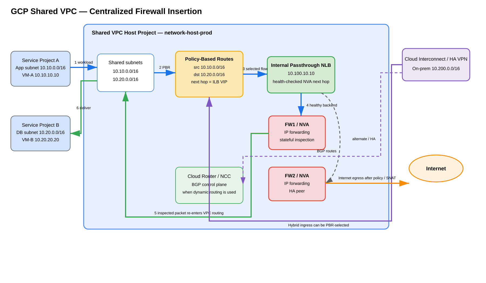

# GCP Shared VPC Centralized Firewall Insertion — Method 11 Deep Dive

> **Last validated:** 2026-09-07  
> **Method:** 11  
> **Focus:** Shared VPC as the common enterprise routing/policy domain for centralized firewall insertion using Policy-Based Routing (PBR), internal passthrough Network Load Balancers, Cloud NGFW Enterprise, Network Security Integration (NSI), hybrid connectivity, and Network Connectivity Center (NCC) Router Appliance.

> **Source information** = behavior documented by Google Cloud.  
> **Additional explanation** = packet-flow and design reasoning added to make the architecture easier to understand.  
> **Reasonable inference** = a design conclusion that must be validated against the exact vendor/firewall implementation.

---

## Table of contents

- [1. What Method 11 actually is](#1-what-method-11-actually-is)
- [2. Shared VPC is not itself a steering primitive](#2-shared-vpc-is-not-itself-a-steering-primitive)
- [3. Architecture and ownership model](#3-architecture-and-ownership-model)
  - [3.1 Shared VPC foundation gcloud build](#31-shared-vpc-foundation-gcloud-build)
- [4. Why Shared VPC is useful for centralized firewall insertion](#4-why-shared-vpc-is-useful-for-centralized-firewall-insertion)
- [5. Shared VPC + PBR + internal passthrough NLB + firewall](#5-shared-vpc--pbr--internal-passthrough-nlb--firewall)
  - [5.1 Example addressing](#51-example-addressing)
  - [5.2 East-west packet flow](#52-east-west-packet-flow)
  - [5.3 Why PBR matters for same-VPC subnet traffic](#53-why-pbr-matters-for-same-vpc-subnet-traffic)
  - [5.4 Firewall ILB + PBR gcloud build](#54-firewall-ilb--pbr-gcloud-build)
- [6. Shared VPC + Cloud Interconnect or HA VPN ingress](#6-shared-vpc--cloud-interconnect-or-ha-vpn-ingress)
  - [6.1 Hybrid ingress packet flow](#61-hybrid-ingress-packet-flow)
  - [6.2 Interconnect-scoped PBR gcloud build](#62-interconnect-scoped-pbr-gcloud-build)
- [7. Shared VPC + Internet egress](#7-shared-vpc--internet-egress)
  - [7.1 Where SNAT belongs](#71-where-snat-belongs)
  - [7.2 Static-route egress gcloud build](#72-static-route-egress-gcloud-build)
- [8. Where should the firewalls live?](#8-where-should-the-firewalls-live)
- [9. Shared VPC versus a separate security VPC](#9-shared-vpc-versus-a-separate-security-vpc)
- [10. Shared VPC + Cloud NGFW Enterprise](#10-shared-vpc--cloud-ngfw-enterprise)
  - [10.1 Cloud NGFW Enterprise gcloud build](#101-cloud-ngfw-enterprise-gcloud-build)
- [11. Shared VPC + NSI in-band](#11-shared-vpc--nsi-in-band)
  - [11.1 NSI consumer gcloud build](#111-nsi-consumer-gcloud-build)
- [12. Shared VPC + NCC Router Appliance](#12-shared-vpc--ncc-router-appliance)
  - [12.1 Router Appliance + BGP gcloud build](#121-router-appliance--bgp-gcloud-build)
- [13. Selective inspection with VM tags](#13-selective-inspection-with-vm-tags)
- [14. Stateful symmetry and post-inspection routing](#14-stateful-symmetry-and-post-inspection-routing)
- [15. HA and failure behavior](#15-ha-and-failure-behavior)
- [16. Operational verification](#16-operational-verification)
  - [16.1 Verify host/service project relationship](#161-verify-hostservice-project-relationship)
  - [16.2 Verify service projects attached to the host](#162-verify-service-projects-attached-to-the-host)
  - [16.3 Verify PBR](#163-verify-pbr)
  - [16.4 Verify internal passthrough NLB health](#164-verify-internal-passthrough-nlb-health)
  - [16.5 Verify Router Appliance BGP](#165-verify-router-appliance-bgp)
- [17. Troubleshooting by symptom](#17-troubleshooting-by-symptom)
- [18. Common mistakes](#18-common-mistakes)
- [19. When to use Method 11](#19-when-to-use-method-11)
- [20. One-page mental model](#20-one-page-mental-model)
- [Sources](#sources)

---

## Source URLs

- https://docs.cloud.google.com/vpc/docs/shared-vpc
- https://docs.cloud.google.com/vpc/docs/provisioning-shared-vpc
- https://docs.cloud.google.com/vpc/docs/policy-based-routes
- https://docs.cloud.google.com/vpc/docs/use-policy-based-routes
- https://docs.cloud.google.com/load-balancing/docs/internal/ilb-next-hop-overview
- https://docs.cloud.google.com/load-balancing/docs/internal/setting-up-ilb-next-hop
- https://docs.cloud.google.com/firewall/docs/about-firewall-endpoints
- https://docs.cloud.google.com/network-security-integration/docs/nsi-overview
- https://docs.cloud.google.com/network-security-integration/docs/in-band/in-band-integration-tutorial
- https://docs.cloud.google.com/network-connectivity/docs/network-connectivity-center
- https://docs.cloud.google.com/network-connectivity/docs/network-connectivity-center/concepts/ra-overview
- https://docs.cloud.google.com/network-connectivity/docs/network-connectivity-center/how-to/creating-router-appliances
- https://docs.cloud.google.com/architecture/best-practices-vpc-design
- https://cloud.google.com/blog/products/networking/policy-based-routing-network-patterns-for-virtual-appliances

---

# 1. What Method 11 actually is

Method 11 is a **centralized enterprise network architecture** in which one Shared VPC host project owns the common VPC network, routes, subnets, firewall controls, and selected security insertion components while service-project workloads attach interfaces to shared subnets in that same VPC.

The key architectural consequence is:

```text
Service-project workloads
        |
        v
Shared VPC owned by host project
        |
        +-- common route domain
        +-- common firewall-policy context
        +-- common PBR scope
        +-- common hybrid connectivity
        +-- common centralized security services
```

That makes Shared VPC particularly useful when the organization wants one network/security team to own the data-plane steering while application teams continue to own the workloads in separate projects.

---

# 2. Shared VPC is not itself a steering primitive

This distinction is critical.

```text
SHARED VPC
= common network / route / policy domain

PBR
= explicit traffic steering

Internal passthrough NLB
= health-checked NVA next hop

Cloud NGFW Enterprise
= Google-managed packet-intercept inspection

NSI
= third-party packet interception / service insertion

NCC Router Appliance
= BGP-driven routed appliance insertion
```

Shared VPC does **not** automatically redirect traffic to a firewall.

If VM-A and VM-B are in different shared subnets, ordinary VPC routing still provides direct subnet reachability unless a supported inspection mechanism deliberately changes how the flow is handled.

---

# 3. Architecture and ownership model



[Editable draw.io source](images/09-07-26_gcp_shared_vpc_centralized_firewall_insertion.drawio)

**What this image shows**  
Service-project workloads use subnets from one Shared VPC host project. PBR in that routing domain can select traffic for an internal passthrough NLB that fronts a centralized firewall/NVA pool. Cloud Interconnect, HA VPN, Cloud Router, and NCC can participate in the same host-project network design.

**What matters**  
The Shared VPC host project owns the common network. The security insertion mechanism still has to be configured explicitly.

**What to verify**  
Host/service project relationships, shared-subnet IAM, PBR scope, route ownership, ILB frontend/backend placement, NVA IP forwarding, hybrid route exchange, post-inspection routing, and reverse-path symmetry.

Conceptually:

```text
Organization
|
+-- Network/Security Host Project
|   |
|   +-- Shared VPC: prod-shared-vpc
|   |    |
|   |    +-- app subnet      10.10.0.0/16
|   |    +-- db subnet       10.20.0.0/16
|   |    +-- firewall subnet 10.100.10.0/24
|   |
|   +-- PBR / static routes
|   +-- internal passthrough NLB
|   +-- centralized firewall/NVA pool
|   +-- Cloud Router / NCC
|   +-- Interconnect / HA VPN
|
+-- Service Project A
|   +-- VM-A NIC -> shared app subnet
|
+-- Service Project B
    +-- VM-B NIC -> shared db subnet
```

The workload VM still belongs to its service project, but its NIC participates in the host project's Shared VPC routing domain.

## 3.1 Shared VPC foundation `gcloud` build

Create the host VPC and subnets:

```cli
gcloud compute networks create prod-shared-vpc \
  --project=network-host-prod \
  --subnet-mode=custom

gcloud compute networks subnets create app-subnet \
  --project=network-host-prod \
  --network=prod-shared-vpc \
  --region=us-central1 \
  --range=10.10.0.0/16

gcloud compute networks subnets create db-subnet \
  --project=network-host-prod \
  --network=prod-shared-vpc \
  --region=us-central1 \
  --range=10.20.0.0/16

gcloud compute networks subnets create firewall-subnet \
  --project=network-host-prod \
  --network=prod-shared-vpc \
  --region=us-central1 \
  --range=10.100.10.0/24
```

Enable Shared VPC and attach service projects:

```cli
gcloud compute shared-vpc enable network-host-prod

gcloud compute shared-vpc associated-projects add app-prod-a \
  --host-project=network-host-prod

gcloud compute shared-vpc associated-projects add db-prod-b \
  --host-project=network-host-prod
```

Grant subnet-use permission to workload service accounts:

```cli
gcloud compute networks subnets add-iam-policy-binding app-subnet \
  --project=network-host-prod \
  --region=us-central1 \
  --member='serviceAccount:APP_WORKLOAD_SA@app-prod-a.iam.gserviceaccount.com' \
  --role='roles/compute.networkUser'

gcloud compute networks subnets add-iam-policy-binding db-subnet \
  --project=network-host-prod \
  --region=us-central1 \
  --member='serviceAccount:DB_WORKLOAD_SA@db-prod-b.iam.gserviceaccount.com' \
  --role='roles/compute.networkUser'
```

Verify:

```cli
gcloud compute shared-vpc get-host-project app-prod-a
gcloud compute shared-vpc get-host-project db-prod-b
gcloud compute shared-vpc list-associated-resources network-host-prod
```

**Success:** the expected host is returned and both service projects are attached.

---

# 4. Why Shared VPC is useful for centralized firewall insertion

Without Shared VPC, each application project can end up with a separate VPC that requires its own firewall insertion stack or a separate transit architecture.

Shared VPC centralizes several controls:

- VPC subnet ownership;
- route ownership;
- PBR ownership;
- centralized hybrid connectivity;
- firewall endpoint associations and network firewall policies where applicable;
- NVA infrastructure lifecycle;
- logging and security operations;
- network-team control of bypass paths.

The administrative split becomes:

```text
Application team
= owns workload project/resources

Network/security team
= owns shared network and insertion architecture
```

This is particularly useful when dozens of projects should consume a common network without granting every project team permission to modify enterprise routes or firewall service insertion.

---

# 5. Shared VPC + PBR + internal passthrough NLB + firewall

This is the strongest classic centralized third-party NVA pattern inside one Shared VPC.

The steering chain is:

```text
Workload packet
   |
   v
Shared VPC PBR match
   |
   v
Internal passthrough NLB VIP
   |
   v
Healthy firewall/NVA backend
   |
   v
Inspection / optional NAT
   |
   v
Second VPC route lookup
   |
   v
Destination
```

## 5.1 Example addressing

```text
Host project:        network-host-prod
Shared VPC:          prod-shared-vpc
Service project A:   app-prod-a
App subnet:          10.10.0.0/16
VM-A:                10.10.10.10
Service project B:   db-prod-b
DB subnet:           10.20.0.0/16
VM-B:                10.20.20.20
Firewall subnet:     10.100.10.0/24
Firewall ILB VIP:    10.100.10.10
```

Inspection intent:

```text
source:      10.10.0.0/16
destination: 10.20.0.0/16
next hop:    internal passthrough NLB 10.100.10.10
```

## 5.2 East-west packet flow

For:

```text
10.10.10.10 -> 10.20.20.20
```

1. VM-A in service project A emits the packet through its NIC in the Shared VPC app subnet.
2. Google Cloud evaluates applicable special routing behavior, including PBR.
3. The PBR matches source `10.10.0.0/16` and destination `10.20.0.0/16`.
4. Instead of directly using the destination subnet route, the flow is sent to internal passthrough NLB VIP `10.100.10.10`.
5. The NLB hashes the flow to a healthy firewall backend.
6. The firewall receives the original packet tuple, evaluates policy/session state, and forwards the permitted packet back toward the VPC fabric.
7. The firewall backend must not re-match the original insertion PBR, or the packet can be recursively sent back toward the same ILB.
8. A new route lookup uses the destination subnet route for `10.20.0.0/16`.
9. VM-B receives the packet.
10. The reverse flow must traverse the same firewall state domain when the firewall is stateful.

## 5.3 Why PBR matters for same-VPC subnet traffic

A critical GCP behavior is that an ordinary next-hop-ILB static route cannot simply override a directly connected subnet route for arbitrary same-VPC subnet-to-subnet service insertion.

That means this is not sufficient for generic same-VPC east-west interception:

```text
10.20.0.0/16 -> static next-hop ILB
```

when `10.20.0.0/16` is already a VPC subnet route.

PBR is valuable because it is a separate routing-policy stage capable of selecting the packet based on source, destination, and protocol before ordinary destination-prefix routing.

## 5.4 Firewall ILB + PBR `gcloud` build

Assume `fw-a` and `fw-b` already exist with IP forwarding enabled.

```cli
gcloud compute instance-groups unmanaged create fw-ig-a --project=network-host-prod --zone=us-central1-a
gcloud compute instance-groups unmanaged add-instances fw-ig-a --project=network-host-prod --zone=us-central1-a --instances=fw-a

gcloud compute instance-groups unmanaged create fw-ig-b --project=network-host-prod --zone=us-central1-b
gcloud compute instance-groups unmanaged add-instances fw-ig-b --project=network-host-prod --zone=us-central1-b --instances=fw-b
```

Create health check, backend service, and forwarding rule:

```cli
gcloud compute health-checks create tcp fw-hc \
  --project=network-host-prod \
  --region=us-central1 \
  --port=HEALTH_CHECK_PORT

gcloud compute backend-services create fw-ilb-be \
  --project=network-host-prod \
  --region=us-central1 \
  --load-balancing-scheme=INTERNAL \
  --protocol=TCP \
  --network=prod-shared-vpc \
  --health-checks=fw-hc \
  --health-checks-region=us-central1

gcloud compute backend-services add-backend fw-ilb-be \
  --project=network-host-prod \
  --region=us-central1 \
  --instance-group=fw-ig-a \
  --instance-group-zone=us-central1-a

gcloud compute backend-services add-backend fw-ilb-be \
  --project=network-host-prod \
  --region=us-central1 \
  --instance-group=fw-ig-b \
  --instance-group-zone=us-central1-b

gcloud compute addresses create fw-ilb-vip \
  --project=network-host-prod \
  --region=us-central1 \
  --subnet=firewall-subnet \
  --addresses=10.100.10.10

gcloud compute forwarding-rules create fw-ilb-fr \
  --project=network-host-prod \
  --region=us-central1 \
  --load-balancing-scheme=INTERNAL \
  --network=prod-shared-vpc \
  --subnet=firewall-subnet \
  --address=10.100.10.10 \
  --ip-protocol=TCP \
  --ports=ALL \
  --allow-global-access \
  --backend-service=fw-ilb-be \
  --backend-service-region=us-central1
```

Verify health before steering traffic:

```cli
gcloud compute backend-services get-health fw-ilb-be \
  --project=network-host-prod \
  --region=us-central1
```

Create the PBR:

```cli
gcloud network-connectivity policy-based-routes create app-to-db-inspection \
  --project=network-host-prod \
  --network='projects/network-host-prod/global/networks/prod-shared-vpc' \
  --priority=1000 \
  --source-range=10.10.0.0/16 \
  --destination-range=10.20.0.0/16 \
  --ip-protocol=ALL \
  --protocol-version=IPV4 \
  --next-hop-ilb-ip=10.100.10.10
```

For workload-tag-only steering, create a separate PBR and add:

```cli
--tags=inspect-app
```

Verify:

```cli
gcloud network-connectivity policy-based-routes describe app-to-db-inspection \
  --project=network-host-prod
```

**Critical:** firewall-originated post-inspection packets must not re-match the same insertion PBR.

---

# 6. Shared VPC + Cloud Interconnect or HA VPN ingress

Shared VPC is also useful for centralized hybrid inspection.

Conceptually:

```text
On-premises 10.200.0.0/16
        |
Cloud Interconnect / HA VPN
        |
Shared VPC host project
        |
PBR
        |
Internal passthrough NLB
        |
Firewall pool
        |
Service-project workload subnet
```

PBR can apply to supported Cloud Interconnect VLAN attachments and Cloud VPN traffic within its documented scope.

Validate current Interconnect dataplane requirements before using PBR on VLAN attachments.

## 6.1 Hybrid ingress packet flow

For:

```text
10.200.10.10 on-prem -> 10.20.20.20 workload
```

1. Packet enters the Shared VPC through Cloud Interconnect or HA VPN.
2. The hybrid source and workload destination match the intended PBR.
3. Google Cloud selects the firewall ILB rather than directly routing to the workload subnet.
4. The ILB selects a healthy NVA backend.
5. The firewall inspects the original packet.
6. The firewall returns the approved packet to the VPC data plane.
7. Normal routing then selects the workload subnet.
8. The return route must deliberately bring the session back through the same stateful inspection domain.

The important distinction is:

```text
Interconnect / HA VPN
= how the packet enters the VPC

PBR / firewall insertion
= whether the packet is inspected before workload delivery
```

## 6.2 Interconnect-scoped PBR `gcloud` build

```cli
gcloud network-connectivity policy-based-routes create onprem-to-db-inspection \
  --project=network-host-prod \
  --network='projects/network-host-prod/global/networks/prod-shared-vpc' \
  --priority=900 \
  --source-range=10.200.0.0/16 \
  --destination-range=10.20.0.0/16 \
  --ip-protocol=ALL \
  --protocol-version=IPV4 \
  --next-hop-ilb-ip=10.100.10.10 \
  --interconnect-attachment-region=us-central1
```

Use `--interconnect-attachment-region=all` to cover every VLAN attachment region in the VPC.

```cli
gcloud network-connectivity policy-based-routes describe onprem-to-db-inspection \
  --project=network-host-prod
```

If neither `--tags` nor `--interconnect-attachment-region` is set, a matching PBR can apply broadly to VMs, Cloud VPN tunnels, and eligible Interconnect attachments in the VPC.

---

# 7. Shared VPC + Internet egress

Two common patterns are:

```text
PBR-selected egress
```

or:

```text
0.0.0.0/0 static route -> internal passthrough NLB
```

when the static-route constraints fit the design.

Typical path:

```text
Service-project VM
        |
Shared VPC PBR / route
        |
Firewall ILB
        |
Firewall NVA
        |
policy + optional SNAT
        |
Internet
```

For simple default-route egress, a next-hop-ILB static route can be easier than PBR. Use PBR when source-based selectivity or other supported matching is required.

## 7.1 Where SNAT belongs

Be explicit about the state owner.

If the firewall performs source NAT:

```text
Original:
10.10.10.10:51000 -> 8.8.8.8:443

After firewall SNAT:
203.0.113.10:62001 -> 8.8.8.8:443
```

Then the return packet:

```text
8.8.8.8:443 -> 203.0.113.10:62001
```

must reach the same firewall state/NAT domain before the destination can be reverse-translated back to `10.10.10.10:51000`.

Do not design forward steering without separately proving the return route.

## 7.2 Static-route egress `gcloud` build

```cli
gcloud compute routes create default-via-fw-ilb \
  --project=network-host-prod \
  --network=prod-shared-vpc \
  --destination-range=0.0.0.0/0 \
  --next-hop-ilb=10.100.10.10 \
  --priority=800
```

Verify:

```cli
gcloud compute routes describe default-via-fw-ilb --project=network-host-prod
gcloud compute routes list --project=network-host-prod --filter='network:prod-shared-vpc'
```

Use this for destination-prefix steering such as Internet egress; it does not replace PBR for arbitrary same-VPC subnet interception.

---

# 8. Where should the firewalls live?

For centralized governance, the cleanest classic model is normally to place the firewall infrastructure in the **Shared VPC host project**.

Reasons include:

- central route ownership;
- central subnet ownership;
- PBR ownership in the same project/network context;
- centralized hybrid connectivity;
- centralized health-checked ILB/NVA infrastructure;
- reduced service-project permissions;
- common logging/monitoring ownership;
- easier control of bypass paths.

A more complex multi-project security-service architecture can also be valid when the chosen mechanism explicitly supports producer/consumer separation, such as NSI.

Do not assume a firewall in a completely separate VPC automatically becomes the transit point for Shared VPC workloads.

---

# 9. Shared VPC versus a separate security VPC

These are fundamentally different.

### Shared VPC model

```text
Host Project
  |
  +-- one Shared VPC routing domain
       |
       +-- subnet consumed by Service Project A
       +-- subnet consumed by Service Project B
       +-- firewall/NVA subnet
```

The service-project NICs participate in the same VPC routing domain.

### Separate security VPC model

```text
Workload VPC
     |
peering / NCC / supported transit
     |
Security VPC
     |
Firewall pool
```

The workload and security networks remain separate VPC routing domains.

Important consequences:

- PBRs are not exchanged through VPC Network Peering.
- PBRs are not exchanged between NCC hubs and spokes.
- putting a firewall and PBR in the security VPC does not automatically steer packets originating in another VPC;
- the multi-VPC transit design must have an explicit supported mechanism for the desired packet path.

---

# 10. Shared VPC + Cloud NGFW Enterprise

Cloud NGFW Enterprise can protect Shared VPC workloads without routing traffic through a customer-managed firewall VM.

Conceptually:

```text
Service-project VM
      |
Shared VPC firewall-policy evaluation
      |
apply_security_profile_group
      |
Cloud NGFW Enterprise firewall endpoint
      |
allow / reinject or drop
```

The key properties are:

- packet interception is policy-driven;
- no workload route needs to point to a firewall VM;
- firewall endpoint and endpoint-association placement is zonal;
- workload zones must have the required inspection association coverage;
- Enterprise inspection can include supported L7/IPS/URL/TLS services.

This is often simpler operationally than managing firewall VM lifecycle when Google-managed inspection meets the security requirement.

## 10.1 Cloud NGFW Enterprise `gcloud` build

Create and associate a zonal firewall endpoint:

```cli
gcloud network-security firewall-endpoints create endpoint-ips \
  --organization=ORGANIZATION_ID \
  --zone=us-central1-a \
  --billing-project=network-host-prod

gcloud network-security firewall-endpoint-associations create endpoint-association-ips \
  --endpoint=organizations/ORGANIZATION_ID/locations/us-central1-a/firewallEndpoints/endpoint-ips \
  --network=prod-shared-vpc \
  --zone=us-central1-a \
  --project=network-host-prod
```

Create the global network firewall policy and inspection rule:

```cli
gcloud compute network-firewall-policies create shared-vpc-enterprise-policy \
  --project=network-host-prod \
  --global

gcloud compute network-firewall-policies rules create 100 \
  --project=network-host-prod \
  --firewall-policy=shared-vpc-enterprise-policy \
  --global-firewall-policy \
  --direction=INGRESS \
  --action=APPLY_SECURITY_PROFILE_GROUP \
  --src-ip-ranges=10.10.0.0/16 \
  --dest-ip-ranges=10.20.0.0/16 \
  --layer4-configs=tcp:443 \
  --security-profile-group=SECURITY_PROFILE_GROUP_RESOURCE \
  --enable-logging

gcloud compute network-firewall-policies associations create \
  --project=network-host-prod \
  --firewall-policy=shared-vpc-enterprise-policy \
  --network=prod-shared-vpc \
  --name=shared-vpc-enterprise-association \
  --global-firewall-policy
```

When required by the interception design:

```cli
gcloud compute networks update prod-shared-vpc \
  --project=network-host-prod \
  --network-firewall-policy-enforcement-order=BEFORE_CLASSIC_FIREWALL
```

Firewall endpoints and endpoint associations are zonal; repeat coverage for each protected workload zone.

---

# 11. Shared VPC + NSI in-band

NSI provides another centralized model when the organization wants third-party inspection but does not want consumer workload routes pointing directly at an NVA.

The architecture becomes:

```text
Shared VPC consumer workload
        |
consumer firewall policy
apply_security_profile_group
        |
NSI intercept endpoint/service
        |
GENEVE
        |
producer inspection deployment
        |
third-party firewall
```

The Shared VPC remains the consumer routing domain while the security-service producer can be operationally separated.

This is fundamentally different from PBR:

```text
PBR
= route/policy steering to next-hop ILB

NSI
= transparent packet interception and service handoff
```

## 11.1 NSI consumer `gcloud` build

Assume the producer already exposes an intercept endpoint group.

```cli
gcloud network-security security-profiles custom-intercept create shared-vpc-nsi-profile \
  --organization=ORGANIZATION_ID \
  --location=global \
  --billing-project=network-host-prod \
  --intercept-endpoint-group=projects/ENDPOINT_GROUP_PROJECT_ID/locations/global/interceptEndpointGroups/ENDPOINT_GROUP_ID

gcloud network-security security-profile-groups create shared-vpc-nsi-spg \
  --organization=ORGANIZATION_ID \
  --location=global \
  --billing-project=network-host-prod \
  --custom-intercept-profile=shared-vpc-nsi-profile

gcloud compute network-firewall-policies create shared-vpc-nsi-policy \
  --project=network-host-prod \
  --global

gcloud compute network-firewall-policies rules create 100 \
  --project=network-host-prod \
  --firewall-policy=shared-vpc-nsi-policy \
  --global-firewall-policy \
  --action=APPLY_SECURITY_PROFILE_GROUP \
  --security-profile-group=organizations/ORGANIZATION_ID/locations/global/securityProfileGroups/shared-vpc-nsi-spg \
  --direction=INGRESS \
  --src-ip-ranges=10.10.0.0/16 \
  --dest-ip-ranges=10.20.0.0/16 \
  --layer4-configs=tcp:443 \
  --enable-logging

gcloud compute network-firewall-policies associations create \
  --project=network-host-prod \
  --firewall-policy=shared-vpc-nsi-policy \
  --network=prod-shared-vpc \
  --name=shared-vpc-nsi-association \
  --global-firewall-policy
```

Verify effective policy:

```cli
gcloud compute networks get-effective-firewalls prod-shared-vpc \
  --project=network-host-prod
```

---

# 12. Shared VPC + NCC Router Appliance

NCC Router Appliance can be used when the firewall or SD-WAN appliance must dynamically exchange BGP routes and act as a routed forwarding hop.

For the documented Shared VPC model, Router Appliance resources must be deployed in the **Shared VPC host project**.

Conceptually:

```text
Shared VPC Host Project
|
+-- NCC Hub
+-- Router Appliance Spoke
+-- Cloud Router
+-- FW/SD-WAN Router Appliance VMs
+-- Shared VPC
     |
     +-- Service Project A workloads
     +-- Service Project B workloads
```

Do not deploy the Router Appliance VM in a Shared VPC service project and assume that is the supported Shared VPC Router Appliance architecture.

The control/data-plane distinction is:

```text
Cloud Router / NCC
= route exchange and control plane

Router Appliance VM
= actual packet-forwarding / firewall data plane
```

Use this model for dynamic hybrid/site-to-cloud/site-to-site routing where BGP advertisements should determine which traffic traverses the appliance.

## 12.1 Router Appliance + BGP `gcloud` build

Create NCC hub, Router Appliance spoke, and Cloud Router in the Shared VPC host project:

```cli
gcloud network-connectivity hubs create shared-vpc-security-hub \
  --project=network-host-prod

gcloud network-connectivity spokes linked-router-appliances create shared-vpc-fw-spoke \
  --project=network-host-prod \
  --hub=shared-vpc-security-hub \
  --region=us-central1 \
  --router-appliance=instance='https://www.googleapis.com/compute/v1/projects/network-host-prod/zones/us-central1-a/instances/fw-router-a',ip=10.100.10.20 \
  --router-appliance=instance='https://www.googleapis.com/compute/v1/projects/network-host-prod/zones/us-central1-b/instances/fw-router-b',ip=10.100.10.21

gcloud compute routers create shared-vpc-fw-cr \
  --project=network-host-prod \
  --network=prod-shared-vpc \
  --region=us-central1 \
  --asn=64514
```

Representative first BGP peer; use design-specific link-local IPs and ASNs and repeat for the second appliance:

```cli
gcloud compute routers add-interface shared-vpc-fw-cr \
  --project=network-host-prod \
  --region=us-central1 \
  --interface-name=to-fw-a \
  --ip-address=169.254.10.1 \
  --mask-length=30

gcloud compute routers add-bgp-peer shared-vpc-fw-cr \
  --project=network-host-prod \
  --region=us-central1 \
  --peer-name=fw-a \
  --interface=to-fw-a \
  --peer-ip-address=169.254.10.2 \
  --peer-asn=65010
```

Verify:

```cli
gcloud network-connectivity spokes describe shared-vpc-fw-spoke --project=network-host-prod --region=us-central1
gcloud compute routers get-status shared-vpc-fw-cr --project=network-host-prod --region=us-central1
```

Cloud Router is the BGP control plane; the Router Appliance VM is the forwarding data plane.

---

# 13. Selective inspection with VM tags

PBR can be scoped to selected VM instances by network tags.

Conceptually:

```text
VM-A tag=inspect-prod
   -> PBR -> firewall

VM-B no inspection tag
   -> normal routing
```

This can support phased migration or selective enforcement.

However, inspection is still a stateful path problem. If only one direction of a flow matches the intended insertion policy, the reverse path can bypass the firewall and break stateful sessions.

---

# 14. Stateful symmetry and post-inspection routing

For every stateful Shared VPC firewall design, draw both directions independently.

```text
Forward:
source -> Shared VPC steering -> firewall -> destination

Return:
destination -> Shared VPC steering -> same firewall state domain -> source
```

You must verify:

- PBR/route/policy decision in both directions;
- firewall backend/session ownership;
- load-balancer hashing behavior;
- SNAT/DNAT placement;
- post-inspection route lookup;
- route preference conflicts;
- failover behavior.

A common insertion loop looks like:

```text
Workload
  -> PBR
  -> firewall ILB
  -> firewall
  -> packet re-enters VPC
  -> SAME PBR MATCHES FIREWALL OUTPUT
  -> firewall ILB again
  -> LOOP
```

Design a documented bypass/scope strategy so the firewall's post-inspection packet does not recursively hit the same interception decision.

---

# 15. HA and failure behavior

For an ILB-backed firewall pool:

```text
PBR / route
   |
   v
Internal passthrough NLB
   |
   +-- FW-A healthy
   +-- FW-B healthy
```

The NLB can stop selecting an unhealthy backend for new flows when health checks fail.

But the load balancer does **not** imply:

- firewall session synchronization;
- NAT-state synchronization;
- seamless migration of an existing stateful connection to another firewall;
- guaranteed application continuity after a state owner fails.

Those properties are vendor/firewall-specific.

For Router Appliance HA, use redundant appliances/BGP sessions and validate:

- route withdrawal;
- convergence time;
- ECMP versus active/standby behavior;
- transient asymmetry;
- whether surviving appliances have the state required to continue existing flows.

---

# 16. Operational verification

## 16.1 Verify host/service project relationship

```cli
gcloud compute shared-vpc get-host-project SERVICE_PROJECT_ID
```

**What it tests**  
Whether the service project is attached to the intended Shared VPC host project.

**Success criteria**  
The expected host project is returned.

**Failure means**  
The workload might not be consuming the Shared VPC you are troubleshooting.

**Next action**  
Verify project association and the VM NIC/subnet configuration.

## 16.2 Verify service projects attached to the host

```cli
gcloud compute shared-vpc list-associated-resources HOST_PROJECT_ID
```

**What it tests**  
Which service projects are associated with the Shared VPC host.

**Success criteria**  
All intended service projects are listed.

**Failure means**  
The application project might be standalone or attached to a different host.

## 16.3 Verify PBR

```cli
gcloud network-connectivity policy-based-routes list
```

```cli
gcloud network-connectivity policy-based-routes describe PBR_NAME
```

**What it tests**  
PBR network, source/destination filters, priority, scope, and next hop.

**Success criteria**  
The policy references the expected Shared VPC and firewall ILB.

**Failure means**  
Traffic can follow ordinary routing and bypass the firewall, or the firewall can recursively match the same policy.

## 16.4 Verify internal passthrough NLB health

```cli
gcloud compute backend-services get-health BACKEND_SERVICE \
  --region=REGION
```

**What it tests**  
Whether intended firewall/NVA backends are eligible for new flows.

**Success criteria**  
Expected appliance backends are healthy.

**Failure means**  
Health-check firewall rules, wrong probe port, interface/service binding, or appliance failure can prevent selection.

Also verify IP forwarding on NVA VMs.

## 16.5 Verify Router Appliance BGP

```cli
gcloud compute routers get-status CLOUD_ROUTER_NAME \
  --region=REGION
```

**What it tests**  
BGP session state and learned/advertised routes between Cloud Router and the Router Appliance.

**Success criteria**  
Expected peers are established and expected prefixes are present.

**Failure means**  
Missing advertisements, wrong preference, or an alternate route can cause traffic to bypass the appliance.

---

# 17. Troubleshooting by symptom

## Symptom A — Service-project workload bypasses the central firewall

**Where**  
Shared VPC host/service association and steering policy.

**Commands**

```cli
gcloud compute shared-vpc get-host-project SERVICE_PROJECT_ID
```

```cli
gcloud network-connectivity policy-based-routes list
```

**What it tests**  
Whether the workload is actually in the intended Shared VPC and whether the correct PBR exists.

**Failure means**  
The VM might use a different VPC/subnet, or the PBR does not match the traffic.

**Next action**  
Describe the VM NIC, Shared VPC association, PBR, and competing routes.

## Symptom B — ILB is selected but the firewall receives nothing

**Command**

```cli
gcloud compute backend-services get-health BACKEND_SERVICE --region=REGION
```

**What it tests**  
Backend eligibility.

**Failure means**  
Unhealthy backend, blocked probe, wrong backend interface, or appliance service failure.

**Next action**  
Check health-check rules, interface counters, forwarding, and appliance listener/configuration.

## Symptom C — Firewall receives the packet but destination does not

**Where**  
Firewall post-inspection forwarding and second-stage VPC routing.

**What to test**

- firewall session/policy result;
- firewall route table;
- IP forwarding;
- PBR recursion/bypass design;
- destination subnet route.

**Failure means**  
The packet may be looping back into the insertion rule or the firewall has no valid route toward the destination.

## Symptom D — SYN reaches destination but SYN/ACK bypasses firewall

**Where**  
Return route and reverse steering.

**What it tests**  
Whether the reverse flow reaches the same stateful firewall domain.

**Failure means**  
The return direction has a direct or preferred alternate route.

**Next action**  
Trace destination-to-source independently and inspect NAT/state ownership.

## Symptom E — Router Appliance BGP is established but traffic bypasses it

**Command**

```cli
gcloud compute routers get-status CLOUD_ROUTER_NAME --region=REGION
```

**What it tests**  
Installed/learned path information.

**Failure means**  
A more preferred path might exist even though BGP adjacency is healthy.

**Next action**  
Compare all candidate routes and verify both forward and reverse prefix advertisements.

---

# 18. Common mistakes

1. Treating Shared VPC itself as the firewall insertion mechanism.
2. Assuming a static next-hop-ILB route can override arbitrary same-VPC subnet routes.
3. Forgetting that PBR is the steering primitive in the classic same-VPC centralized-NVA design.
4. Allowing the firewall backend itself to re-match the same PBR and creating an insertion loop.
5. Forgetting IP forwarding on NVA backend VMs.
6. Assuming an internal passthrough NLB synchronizes firewall session or NAT state.
7. Steering only the forward direction of a stateful flow.
8. Letting service-project workloads use an alternate path that bypasses the host-project security design.
9. Treating Shared VPC and a separate peered security VPC as equivalent.
10. Assuming PBR propagates through VPC Network Peering.
11. Assuming PBR propagates through NCC.
12. Deploying a Shared VPC Router Appliance in a service project instead of the supported host-project model.
13. Forgetting firewall endpoint/association zonal requirements when using Cloud NGFW Enterprise.
14. Confusing Cloud Router with a packet-forwarding hop; the Router Appliance VM forwards the traffic.
15. Performing SNAT on the firewall without proving how return traffic reaches the same NAT/state owner.

---

# 19. When to use Method 11

Use Shared VPC centralized firewall architecture when:

- many service projects should consume one centrally governed VPC;
- a central network/security team should own routes, PBRs, hybrid connectivity, and security insertion;
- application teams should not manage enterprise firewall routing objects;
- east-west inspection is needed inside the common VPC and can be implemented with PBR, Cloud NGFW Enterprise, or NSI;
- hybrid ingress/egress should be centralized;
- a common NVA pool should inspect multiple service-project workloads;
- NCC Router Appliance must be integrated with a Shared VPC host-project design.

Do **not** choose Shared VPC merely because you need transit between independently owned VPCs. If the workloads must remain separate VPC routing domains, evaluate NCC, NSI producer/consumer insertion, or another supported multi-VPC transit architecture instead.

---

# 20. One-page mental model

```text
METHOD 11 — SHARED VPC CENTRALIZED FIREWALL ARCHITECTURE

Shared VPC
= common enterprise routing/policy domain

It does NOT inspect by itself.

Actual insertion can be:

1. PBR -> internal passthrough NLB -> NVA
2. static default/destination route -> ILB -> NVA
3. Cloud NGFW Enterprise packet intercept
4. NSI in-band third-party packet intercept
5. NCC Router Appliance + BGP

Service Project A workload ----+
                               |
Service Project B workload ----+--> Shared VPC host-project network
                               |          |
Service Project C workload ----+          +--> steering / inspection
                                          |
                                          +--> destination / hybrid / Internet
```

The troubleshooting questions are:

```text
1. Is the workload really attached to this Shared VPC?
2. What exact object selects the firewall path?
3. Which component owns the firewall/NAT state?
4. What route is used after inspection?
5. Does the return path traverse the same state domain?
```

The shortest mnemonic is:

```text
Shared VPC = COMMON DOMAIN
PBR/NSI/NGFW/NCC = INSERTION
NVA/endpoint = INSPECTION
Return routing = SYMMETRY
```

---

# Sources

- https://docs.cloud.google.com/vpc/docs/shared-vpc
- https://docs.cloud.google.com/vpc/docs/provisioning-shared-vpc
- https://docs.cloud.google.com/vpc/docs/policy-based-routes
- https://docs.cloud.google.com/vpc/docs/use-policy-based-routes
- https://docs.cloud.google.com/load-balancing/docs/internal/ilb-next-hop-overview
- https://docs.cloud.google.com/load-balancing/docs/internal/setting-up-ilb-next-hop
- https://docs.cloud.google.com/firewall/docs/about-firewall-endpoints
- https://docs.cloud.google.com/network-security-integration/docs/nsi-overview
- https://docs.cloud.google.com/network-security-integration/docs/in-band/in-band-integration-tutorial
- https://docs.cloud.google.com/network-connectivity/docs/network-connectivity-center
- https://docs.cloud.google.com/network-connectivity/docs/network-connectivity-center/concepts/ra-overview
- https://docs.cloud.google.com/network-connectivity/docs/network-connectivity-center/how-to/creating-router-appliances
- https://docs.cloud.google.com/architecture/best-practices-vpc-design
- https://cloud.google.com/blog/products/networking/policy-based-routing-network-patterns-for-virtual-appliances

## Information classification

- **Source information:** Shared VPC host/service-project relationships, PBR scope and behavior, internal passthrough NLB next-hop behavior, Cloud NGFW endpoint behavior, NSI architecture, and Router Appliance Shared VPC support.
- **Additional explanation:** packet walks, steering-versus-inspection distinction, state/NAT reasoning, and operational design guidance.
- **Reasonable inference:** vendor-specific HA/session failover and state synchronization must be validated against the selected firewall vendor; this guide does not assume session state is shared between unrelated appliance backends.
