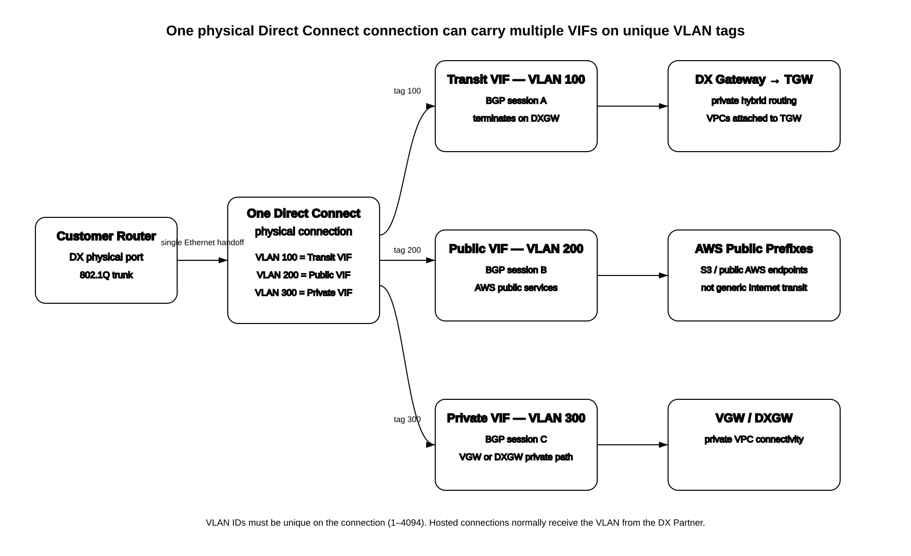
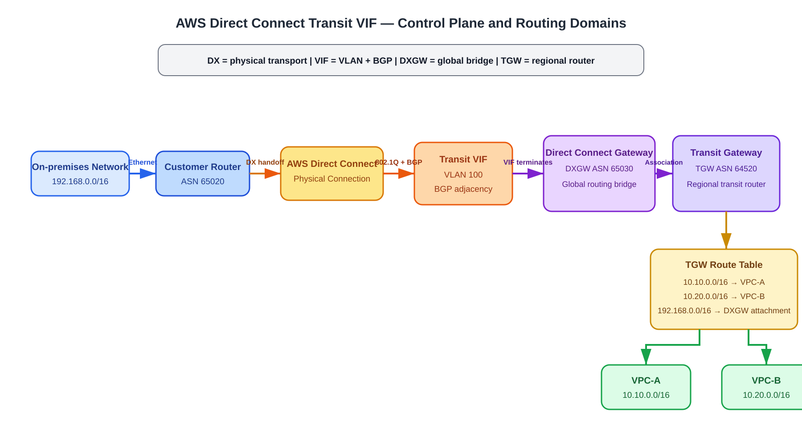
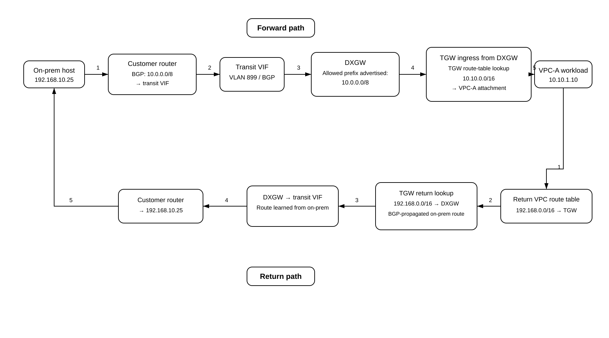
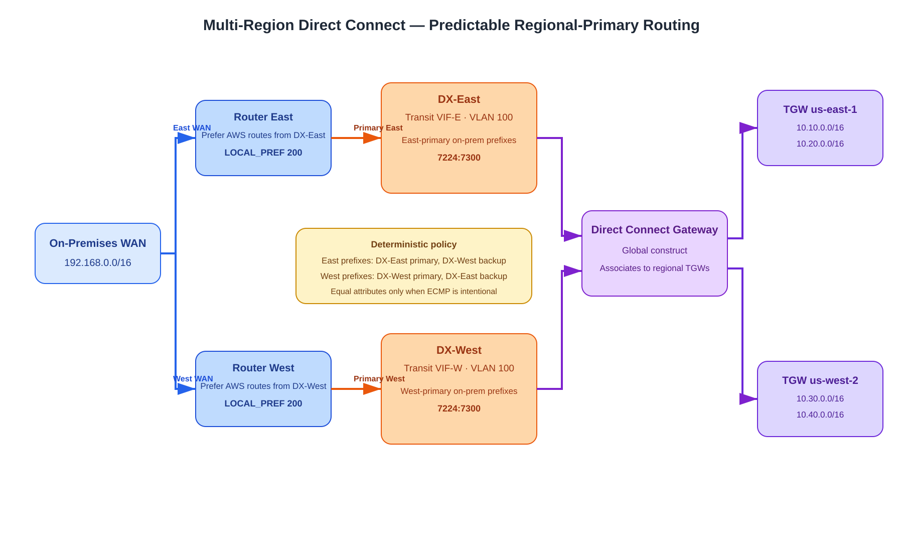
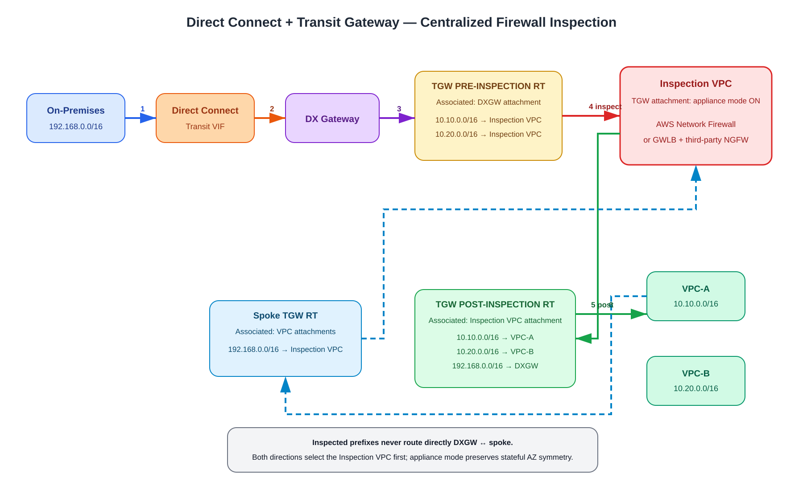

# AWS Direct Connect Transit VIF — Deep Dive

## Purpose

This guide explains the AWS Direct Connect **transit virtual interface (transit VIF)** from first principles. The goal is to make the relationship between the physical Direct Connect circuit, the transit VIF, the Direct Connect gateway (DXGW), the Transit Gateway (TGW), BGP, TGW route tables, and attached VPCs completely explicit.

The most important mental model is:

```text
Physical Direct Connect connection
        |
        v
Transit VIF = VLAN + BGP adjacency
        |
        v
Direct Connect gateway = global DX routing bridge/control object
        |
        v
Transit Gateway = regional transit router
        |
        v
TGW route tables
        |
        v
VPC / VPN attachments
```

A **transit VIF does not attach directly to a Transit Gateway**. The transit VIF terminates on a **Direct Connect gateway**, and the Direct Connect gateway is associated with one or more Transit Gateways.

---

## Table of contents

- [Purpose](#purpose)
- [Source URLs](#source-urls)
- [1. The four objects you must separate mentally](#1-the-four-objects-you-must-separate-mentally)
  - [1.1 Direct Connect connection](#11-direct-connect-connection)
  - [1.2 Transit virtual interface](#12-transit-virtual-interface)
  - [1.3 Direct Connect gateway](#13-direct-connect-gateway)
  - [1.4 Transit Gateway](#14-transit-gateway)
  - [1.5 VLANs, router subinterfaces, and multiple VIFs on one DX connection](#15-vlans-router-subinterfaces-and-multiple-vifs-on-one-dx-connection)
- [2. Why transit VIF exists](#2-why-transit-vif-exists)
- [3. Architecture](#3-architecture)
- [4. Control-plane relationships](#4-control-plane-relationships)
  - [4.1 BGP session placement](#41-bgp-session-placement)
  - [4.2 ASN behavior](#42-asn-behavior)
  - [4.3 Allowed prefixes](#43-allowed-prefixes)
- [5. On-premises to VPC packet flow](#5-on-premises-to-vpc-packet-flow)
- [6. VPC to on-premises return flow](#6-vpc-to-on-premises-return-flow)
- [7. Where each route exists](#7-where-each-route-exists)
- [8. Private VIF versus transit VIF versus public VIF](#8-private-vif-versus-transit-vif-versus-public-vif)
  - [8.1 How all three VIF types can coexist on one physical connection](#81-how-all-three-vif-types-can-coexist-on-one-physical-connection)
  - [8.2 What a public VIF does and does not provide](#82-what-a-public-vif-does-and-does-not-provide)
- [9. Multi-VPC example](#9-multi-vpc-example)
- [10. Multi-Region example](#10-multi-region-example)
- [11. Multiple Direct Connect circuits and failover](#11-multiple-direct-connect-circuits-and-failover)
  - [11.1 Predictable multi-Region design goals](#111-predictable-multi-region-design-goals)
  - [11.2 Recommended regional-primary / remote-backup design](#112-recommended-regional-primary--remote-backup-design)
  - [11.3 AWS-to-on-premises path selection](#113-aws-to-on-premises-path-selection)
  - [11.4 On-premises-to-AWS path selection](#114-on-premises-to-aws-path-selection)
  - [11.5 Failure behavior and policy matrix](#115-failure-behavior-and-policy-matrix)
  - [11.6 Firewall interception and inspection with DXGW + TGW](#116-firewall-interception-and-inspection-with-dxgw--tgw)
  - [11.7 TGW route-table design for mandatory inspection](#117-tgw-route-table-design-for-mandatory-inspection)
  - [11.8 Forward and return packet walk through the firewall](#118-forward-and-return-packet-walk-through-the-firewall)
  - [11.9 AWS Network Firewall network-function attachment alternative](#119-aws-network-firewall-network-function-attachment-alternative)
- [12. AWS CLI build example](#12-aws-cli-build-example)
  - [12.0 Optional: request a dedicated Direct Connect connection](#120-optional-request-a-dedicated-direct-connect-connection)
  - [12.1 Create the Direct Connect gateway](#121-create-the-direct-connect-gateway)
  - [12.2 Associate the Transit Gateway](#122-associate-the-transit-gateway)
  - [12.3 Create the transit VIF](#123-create-the-transit-vif)
  - [12.4 Enable TGW route propagation](#124-enable-tgw-route-propagation)
  - [12.5 Create a public VIF on a different VLAN](#125-create-a-public-vif-on-a-different-vlan)
  - [12.6 Create a private VIF on another VLAN](#126-create-a-private-vif-on-another-vlan)
  - [12.7 Verify all VIFs and VLAN assignments](#127-verify-all-vifs-and-vlan-assignments)
- [13. Verification](#13-verification)
- [14. Troubleshooting by symptom](#14-troubleshooting-by-symptom)
- [15. Common mistakes](#15-common-mistakes)
- [16. One-page mental model](#16-one-page-mental-model)
- [Sources](#sources)

---

## Source URLs

### AWS Direct Connect
- https://docs.aws.amazon.com/directconnect/latest/UserGuide/WorkingWithVirtualInterfaces.html
- https://docs.aws.amazon.com/directconnect/latest/UserGuide/direct-connect-gateways.html
- https://docs.aws.amazon.com/directconnect/latest/UserGuide/direct-connect-transit-gateways.html
- https://docs.aws.amazon.com/directconnect/latest/UserGuide/create-transit-vif-for-gateway.html
- https://docs.aws.amazon.com/directconnect/latest/UserGuide/allowed-to-prefixes.html
- https://docs.aws.amazon.com/directconnect/latest/UserGuide/associate-tgw-with-direct-connect-gateway.html
- https://docs.aws.amazon.com/directconnect/latest/UserGuide/create-public-vif.html
- https://docs.aws.amazon.com/directconnect/latest/UserGuide/create-private-vif.html

### AWS Transit Gateway
- https://docs.aws.amazon.com/vpc/latest/tgw/tgw-dcg-attachments.html
- https://docs.aws.amazon.com/vpc/latest/tgw/tgw-route-tables.html
- https://docs.aws.amazon.com/vpc/latest/tgw/how-transit-gateways-work.html
- https://docs.aws.amazon.com/vpc/latest/tgw/enable-tgw-route-propagation.html

### AWS CLI
- https://docs.aws.amazon.com/cli/latest/reference/directconnect/create-direct-connect-gateway.html
- https://docs.aws.amazon.com/cli/latest/reference/directconnect/create-transit-virtual-interface.html
- https://docs.aws.amazon.com/cli/latest/reference/directconnect/create-public-virtual-interface.html
- https://docs.aws.amazon.com/cli/latest/reference/directconnect/create-private-virtual-interface.html
- https://docs.aws.amazon.com/cli/latest/reference/directconnect/create-connection.html
- https://docs.aws.amazon.com/cli/latest/reference/directconnect/describe-direct-connect-gateway-associations.html
- https://docs.aws.amazon.com/cli/latest/reference/ec2/search-transit-gateway-routes.html

---

# 1. The four objects you must separate mentally

## 1.1 Direct Connect connection

The **Direct Connect connection** is the physical or hosted Ethernet connectivity into an AWS Direct Connect location.

It gives you Layer 2 transport to AWS, but by itself it does not tell AWS which routing domain you want to reach.

Think of it as:

```text
Direct Connect connection = physical pipe
```

A single Direct Connect connection can carry multiple virtual interfaces using different VLAN IDs.

## 1.2 Transit virtual interface

A **transit VIF** is a logical Layer 3 service riding over the physical Direct Connect connection.

It contains the important routing attributes for the Direct Connect side:

- VLAN ID;
- customer BGP ASN;
- Amazon-side BGP peer;
- customer-side BGP peer;
- optional BGP authentication;
- IPv4 or IPv6 address family;
- MTU;
- the Direct Connect gateway ID to which the transit VIF connects.

Think of it as:

```text
Transit VIF = VLAN + point-to-point IPs + BGP adjacency
```

The transit VIF is the BGP path that carries routes between your on-premises router and the Direct Connect gateway.

## 1.3 Direct Connect gateway

A **Direct Connect gateway (DXGW)** is a global AWS routing construct that sits between Direct Connect virtual interfaces and downstream AWS gateway constructs.

For a transit VIF design:

```text
Transit VIF -> Direct Connect gateway -> Transit Gateway
```

The DXGW is not a VPC router and it does not replace TGW route tables. Its role is to connect the Direct Connect BGP domain to one or more associated Transit Gateways.

## 1.4 Transit Gateway

A **Transit Gateway** is a regional transit router that connects VPCs, VPNs, Direct Connect gateway attachments, Connect attachments, and other supported attachment types.

TGW route tables decide which attachment should receive a packet.

Mental model:

```text
DXGW gets you from Direct Connect into TGW.
TGW route tables decide where inside the AWS transit domain the packet goes next.
```

---

## 1.5 VLANs, router subinterfaces, and multiple VIFs on one DX connection

A Direct Connect physical connection is an Ethernet handoff. AWS multiplexes logical services across that Ethernet link with **IEEE 802.1Q VLAN tags**. Each VIF uses one VLAN ID that is unique on that Direct Connect connection. AWS allows VLAN IDs from `1` through `4094`; once a VIF is created, its VLAN ID cannot be changed. For a hosted connection, the Direct Connect Partner normally supplies the VLAN value.

Think of the customer router port as a trunk:

```text
Customer router physical DX port
        |
        |-- VLAN 100 -> Transit VIF -> DXGW -> TGW
        |-- VLAN 200 -> Public VIF  -> AWS public service prefixes
        |-- VLAN 300 -> Private VIF -> VGW or DXGW
        |
        +-- all carried over the SAME physical Direct Connect connection
```

A Cisco-like router mental model is:

```text
Ethernet1/1       = physical DX port
Ethernet1/1.100   = 802.1Q tag 100 -> transit-VIF BGP session
Ethernet1/1.200   = 802.1Q tag 200 -> public-VIF BGP session
Ethernet1/1.300   = 802.1Q tag 300 -> private-VIF BGP session
```

The exact router syntax is vendor-specific, but the service separation is the same: **one physical port, multiple tagged logical Layer-3 interfaces, one BGP context per VIF/address family**.



[Editable draw.io](images/09-08-26_aws_dx_multi_vif_vlan_trunk.drawio)

**What this image shows:** one customer-router Ethernet handoff carrying three independent VIFs using VLAN IDs 100, 200, and 300.

**What matters:** VLAN 100, 200, and 300 are tags on the same physical connection, not three separate Direct Connect circuits. Each VIF has its own BGP peering and its own AWS destination construct.

**What to verify:** the VLAN is unique on the connection, your router subinterface uses the same tag AWS assigned/configured, each VIF has the correct BGP peer addresses/ASN, and the VIF type points to the intended AWS routing domain.

A useful mnemonic is:

```text
DX port = trunk
VLAN = service lane
VIF = Layer-3/BGP service on that lane
```

---

# 2. Why transit VIF exists

A private VIF is primarily the model used for private connectivity through a virtual private gateway / Direct Connect gateway path to VPCs.

A **transit VIF** exists specifically so one Direct Connect BGP connection can reach **one or more Transit Gateways associated with a Direct Connect gateway**.

AWS documents transit VIF as the VIF type to use when accessing one or more Transit Gateways through a Direct Connect gateway.

This lets one on-premises BGP domain reach many VPCs behind TGW without creating a separate VIF for every VPC.

---

# 3. Architecture



[Editable draw.io](images/09-08-26_aws_dx_transit_vif_architecture.drawio)

**What this image shows:** the exact ownership and adjacency boundaries between the on-premises router, Direct Connect connection, transit VIF, Direct Connect gateway, Transit Gateway, TGW route table, and attached VPCs.

**What matters:** the transit VIF terminates on the Direct Connect gateway, not directly on the Transit Gateway.

**What to verify:** BGP is established on the transit VIF, the DXGW is associated to the intended TGW, the Direct Connect gateway attachment is propagated into the correct TGW route table, and workload subnet route tables point hybrid destinations toward TGW.

A representative topology:

```text
On-premises
192.168.0.0/16
     |
     | customer ASN 65020
     v
Customer router
     |
     | Direct Connect circuit
     | VLAN 899
     | BGP
     v
Transit VIF
     |
     v
DXGW ASN 65030
     |
     | DXGW <-> TGW association
     v
TGW ASN 64520
     |
     +----------------------+----------------------+
     |                      |                      |
     v                      v                      v
VPC-A                   VPC-B                   VPN
10.10.0.0/16            10.20.0.0/16
```

---

# 4. Control-plane relationships

## 4.1 BGP session placement

The BGP session associated with the transit VIF is between:

```text
your on-premises router
        <--- BGP --->
AWS Direct Connect side / Direct Connect gateway service
```

The TGW is downstream of the DXGW association.

You do **not** build a separate BGP adjacency from your customer router directly to the Transit Gateway for this path.

## 4.2 ASN behavior

AWS requires the Transit Gateway ASN and Direct Connect gateway ASN to be different when the TGW is associated with the DXGW.

Example:

```text
Customer router ASN: 65020
DXGW ASN:           65030
TGW ASN:            64520
```

AWS also documents an important behavior: the Transit Gateway ASN is not exposed in the AS_PATH advertised to your on-premises router through the transit VIF. The Direct Connect gateway replaces the path with its own ASN on the Direct Connect-facing advertisement.

So on-premises should conceptually see AWS prefixes as originating through the DXGW ASN, not the TGW ASN.

## 4.3 Allowed prefixes

This is one of the most misunderstood parts of Transit VIF + DXGW + TGW.

For a **Transit Gateway association**, the prefixes configured in the DXGW association are not merely a filter on existing VPC CIDRs. AWS directly advertises the configured allowed prefixes toward on-premises.

Example:

```text
VPC-A = 10.10.0.0/16
VPC-B = 10.20.0.0/16

DXGW/TGW allowed prefix:
10.0.0.0/8
```

On-premises can receive:

```text
10.0.0.0/8 via transit VIF
```

rather than individual VPC CIDRs.

This is different from DXGW associations with virtual private gateways, where allowed prefixes behave as a filter.

Important consequence:

```text
Allowed prefix on a TGW association
!= TGW route-table entry
!= automatic reachability to every destination inside that aggregate
```

The TGW route table still needs actual routes to the attachments that contain the destination workloads.

---

# 5. On-premises to VPC packet flow



[Editable draw.io](images/09-08-26_aws_dx_transit_vif_route_flow.drawio)

**What this image shows:** route advertisement and packet forwarding for an on-premises host reaching a workload in VPC-A.

**What matters:** the DXGW advertisement gets the traffic into the TGW attachment; the TGW route table then performs a separate lookup to select the destination VPC attachment.

**What to verify:** the on-prem router has the AWS prefix, the DXGW association is active, the DXGW attachment is associated/propagated in TGW as intended, TGW has the VPC route, and the destination VPC subnet has a return route to TGW.

Example:

```text
On-prem host:      192.168.10.25
VPC-A workload:    10.10.1.10
AWS aggregate:     10.0.0.0/8
```

Forward path:

1. On-premises host sends a packet to `10.10.1.10`.
2. The on-premises router has learned `10.0.0.0/8` over the transit VIF BGP session.
3. The router forwards the packet over the Direct Connect connection on the transit VIF VLAN.
4. The Direct Connect service hands the packet to the Direct Connect gateway.
5. The DXGW association forwards the packet into the associated TGW as a Direct Connect gateway attachment.
6. The TGW evaluates the route table associated with the DXGW attachment.
7. The TGW route table finds `10.10.0.0/16 -> VPC-A attachment`.
8. TGW forwards the packet to the VPC-A attachment.
9. VPC routing delivers the packet to `10.10.1.10`.

The key separation is:

```text
On-prem route lookup:
10.10.1.10 -> 10.0.0.0/8 -> transit VIF

TGW route lookup:
10.10.1.10 -> 10.10.0.0/16 -> VPC-A attachment
```

Those are two different routing tables in two different routing domains.

---

# 6. VPC to on-premises return flow

The return path needs both VPC routing and TGW routing.

Assume the VPC subnet route table contains:

```text
Destination        Target
192.168.0.0/16     tgw-0123456789abcdef0
```

Return path:

1. `10.10.1.10` responds to `192.168.10.25`.
2. The VPC subnet route table sends `192.168.0.0/16` to TGW.
3. The VPC attachment enters the TGW.
4. TGW evaluates the route table associated with the VPC-A attachment.
5. The TGW route table has `192.168.0.0/16 -> Direct Connect gateway attachment`, normally learned through BGP propagation from the DXGW attachment.
6. TGW forwards the packet to the DXGW attachment.
7. DXGW forwards it over the transit VIF.
8. The Direct Connect connection delivers it to the customer router.
9. The customer router forwards the packet into the on-premises LAN.

For stateful firewalls or centralized inspection, both directions must still be deliberately routed through the inspection path; the existence of a transit VIF does not automatically enforce firewall insertion.

---

# 7. Where each route exists

This table is the most useful troubleshooting reference.

| Route / prefix | Where it exists | Why |
|---|---|---|
| `10.0.0.0/8` AWS aggregate | On-prem BGP table | Learned from DXGW over transit VIF |
| `192.168.0.0/16` | DXGW/TGW Direct Connect gateway attachment control plane | Learned from on-prem BGP |
| `192.168.0.0/16 -> DXGW attachment` | TGW route table(s) where DXGW propagation is enabled | Sends VPC-originated hybrid traffic toward Direct Connect |
| `10.10.0.0/16 -> VPC-A attachment` | TGW route table | Selects VPC-A for inbound hybrid traffic |
| `10.20.0.0/16 -> VPC-B attachment` | TGW route table | Selects VPC-B for inbound hybrid traffic |
| `192.168.0.0/16 -> TGW` | VPC subnet route table | Sends return traffic from VPC to TGW |

Mental model:

```text
DXGW allowed prefixes answer:
"What AWS prefixes should on-premises learn?"

TGW route tables answer:
"Once traffic reaches TGW, which attachment should receive it?"

VPC route tables answer:
"Should this subnet send the packet to TGW at all?"
```

---

# 8. Private VIF versus transit VIF versus public VIF

| VIF type | Main purpose | Typical AWS destination | Example VLAN |
|---|---|---|---:|
| Private VIF | Private VPC connectivity | VGW or DXGW private path | 300 |
| Transit VIF | Multi-VPC/VPN connectivity through TGW | DXGW associated with TGW | 100 |
| Public VIF | Reach AWS public service prefixes over DX | AWS public services/public AWS endpoints | 200 |

For a Transit Gateway-centric hybrid architecture, the transit VIF is normally the relevant private-routing choice, but that does **not** prevent the same physical DX connection from also carrying a public VIF or private VIF on different VLAN tags.

## 8.1 How all three VIF types can coexist on one physical connection

Example:

```text
Physical DX connection dxcon-EXAMPLE

VLAN 100
  -> transit VIF
  -> customer ASN 65020
  -> BGP session
  -> Direct Connect gateway
  -> Transit Gateway

VLAN 200
  -> public VIF
  -> separate BGP session
  -> AWS public prefixes

VLAN 300
  -> private VIF
  -> separate BGP session
  -> VGW or Direct Connect gateway
```

The VLAN tags are local Layer-2 demultiplexing identifiers on the Direct Connect Ethernet service. They do **not** mean that VLAN 100 can reach VLAN 200 or VLAN 300. Routing exchange is controlled independently by the VIF type and its BGP session.

Because all VIFs share the same parent physical connection, a physical circuit failure affects all VIFs riding that connection. Using multiple VLANs is service separation, **not physical redundancy**.

## 8.2 What a public VIF does and does not provide

A public VIF is for reaching AWS services through their **public IP prefixes** over Direct Connect, such as Amazon S3 public endpoints and other AWS public services. AWS advertises appropriate Amazon public prefixes to you over the public-VIF BGP session.

A public VIF is **not a general-purpose Internet transit service**. Do not treat it as a replacement for an ISP default route.

For IPv4 public VIFs, AWS requires public BGP peer addresses and route prefixes that you are authorized to advertise. AWS validates public-VIF information, and AWS documentation notes that approval can take up to 72 business hours.

This gives you three separate routing intents:

```text
Transit VIF
= private hybrid routing through TGW

Private VIF
= private VPC routing through VGW/DXGW

Public VIF
= AWS public-service reachability over DX
```

---

# 9. Multi-VPC example

Topology:

```text
On-prem 192.168.0.0/16
       |
       v
Transit VIF
       |
       v
DXGW
       |
       v
TGW
       |
       +-- VPC-A 10.10.0.0/16
       +-- VPC-B 10.20.0.0/16
       +-- VPC-C 10.30.0.0/16
```

DXGW allowed prefix:

```text
10.0.0.0/8
```

On-prem learns one summary:

```text
10.0.0.0/8 via BGP
```

TGW still needs individual attachment routes such as:

```text
10.10.0.0/16 -> VPC-A
10.20.0.0/16 -> VPC-B
10.30.0.0/16 -> VPC-C
```

This is why the DXGW aggregate is not a substitute for TGW routing.

---

# 10. Multi-Region example

A Direct Connect gateway is global and can be associated with Transit Gateways in supported Regions.

Example:

```text
DX connection in New York
        |
        v
Transit VIF
        |
        v
DXGW
        |
        +--> TGW us-east-1 --> VPCs
        |
        +--> TGW us-west-2 --> VPCs
```

If multiple TGWs are associated with the same DXGW, AWS requires unique non-overlapping allowed-prefix sets for those associations.

For example:

```text
TGW us-east-1 association allowed prefixes:
10.10.0.0/16
10.20.0.0/16

TGW us-west-2 association allowed prefixes:
10.30.0.0/16
10.40.0.0/16
```

Do not configure an overlapping `0.0.0.0/0` association when other TGW allowed-prefix associations overlap that space; AWS rejects overlapping allowed-prefix sets across multiple TGW associations on the same DXGW.

---

# 11. Multiple Direct Connect circuits and failover

For production hybrid connectivity, use redundant Direct Connect circuits / locations according to AWS resiliency guidance.

A common design is:

```text
Customer router A
   |
DX connection A
   |
Transit VIF A
   |
   +------ DXGW ------+
                      |
Customer router B     v
   |                 TGW
DX connection B       |
   |                 VPCs
Transit VIF B
   |
   +------ DXGW ------+
```

Both transit VIFs can advertise the same AWS allowed prefixes toward on-premises, while on-premises advertises its routes to AWS over both BGP sessions.

Path preference is then controlled through supported BGP policy attributes and the physical resiliency design.

Do not assume BGP convergence alone guarantees stateful-firewall session survival. Routing failover and firewall session HA are separate problems.


## 11.1 Predictable multi-Region design goals

When you have Direct Connect connections in different AWS Regions, the first design decision is whether you want **active/active ECMP** or **regional-primary / remote-backup**. Do not leave this accidental.

For stateful firewalls and deterministic troubleshooting, a regional-primary model is usually easier to reason about:

```text
East AWS/on-prem traffic
  primary = DX-East
  backup  = DX-West

West AWS/on-prem traffic
  primary = DX-West
  backup  = DX-East
```

AWS Direct Connect evaluates private/transit VIF paths using longest-prefix match first, then Direct Connect local preference, then AS_PATH, then MED. AWS explicitly recommends its Direct Connect local-preference BGP communities for active/passive path control and does not recommend relying on MED as the primary mechanism.

The important supported communities for **routes you advertise from on-premises toward AWS** are:

```text
7224:7300 = High Direct Connect local preference
7224:7200 = Medium
7224:7100 = Low
```

These influence the **AWS-to-on-premises return path** for the advertised prefix.



[Editable draw.io](images/09-08-26_aws_dx_multi_region_deterministic_routing.drawio)

**What this image shows:** two Direct Connect locations in different Regions, one global DXGW, separate regional TGWs, and explicit preference policy for east and west traffic.

**What matters:** AWS-side path preference and customer-router path preference are independent decisions. Configure both directions deliberately.

**What to verify:** the same prefix is not accidentally receiving equal attributes on every VIF unless ECMP is intentional; customer routers prefer the intended regional DX for AWS prefixes; AWS sees the intended high/low Direct Connect community on on-premises prefixes.

---

## 11.2 Recommended regional-primary / remote-backup design

Example:

```text
DX-East location / transit VIF-E
DX-West location / transit VIF-W
DXGW = global
TGW-East = us-east-1
TGW-West = us-west-2

East VPCs:
10.10.0.0/16
10.20.0.0/16

West VPCs:
10.30.0.0/16
10.40.0.0/16

On-prem East site:
192.168.10.0/24

On-prem West site:
192.168.20.0/24
```

A predictable policy is:

| Prefix | Primary DX | Backup DX | AWS return-path community on primary | AWS return-path community on backup |
|---|---|---|---|---|
| `192.168.10.0/24` East on-prem | DX-East | DX-West | `7224:7300` | `7224:7100` |
| `192.168.20.0/24` West on-prem | DX-West | DX-East | `7224:7300` | `7224:7100` |

On the customer side, configure BGP import policy so AWS prefixes learned from the local DX receive a higher **customer LOCAL_PREF** than the remote DX. For example:

```text
Routes learned from DX-East at East WAN edge:
LOCAL_PREF 200

Same AWS routes learned from DX-West at East WAN edge:
LOCAL_PREF 100
```

That customer LOCAL_PREF is your own BGP policy and is different from AWS Direct Connect community `7224:7300` / `7224:7100`.

Mental model:

```text
AWS DX community
= tells AWS which DX to use toward on-prem

Customer LOCAL_PREF
= tells your WAN which DX to use toward AWS
```

Do not rely only on the geographic "home Region" preference. AWS does have Region-affinity behavior when no Direct Connect local-preference community is applied, but explicit policy is easier to audit and survives architectural changes more predictably.

---

## 11.3 AWS-to-on-premises path selection

For prefixes advertised by your routers over multiple private/transit VIFs, AWS evaluates:

1. longest prefix length;
2. Direct Connect local preference;
3. AS_PATH length;
4. MED when the higher-priority attributes are equal.

For active/passive connectivity with equal prefix lengths, use the Direct Connect local-preference communities.

Example for East on-premises prefix `192.168.10.0/24`:

```text
DX-East advertisement:
192.168.10.0/24 community 7224:7300

DX-West advertisement:
192.168.10.0/24 community 7224:7100
```

AWS prefers DX-East while it is available. If the DX-East BGP route disappears, DX-West remains as the backup.

If you advertise identical prefixes with identical attributes across multiple transit VIFs, AWS can use ECMP. That is useful for active/active designs but is intentionally avoided in this regional-primary example.

---

## 11.4 On-premises-to-AWS path selection

The reverse decision happens in your customer routing domain.

The DXGW can advertise the same allowed AWS prefix over both transit VIFs. Your routers therefore need a deterministic import policy.

Example:

```text
10.10.0.0/16 learned from DX-East
  -> customer LOCAL_PREF 200

10.10.0.0/16 learned from DX-West
  -> customer LOCAL_PREF 100
```

For West prefixes, reverse the preference.

This avoids a common mistake: configuring AWS-side Direct Connect communities correctly but leaving the customer routers with equal preference, producing a different forward path than return path.

For stateful inspection, that asymmetry can cause session failure even when BGP itself is healthy.

---

## 11.5 Failure behavior and policy matrix

| Failure | Expected result in regional-primary design | What changes |
|---|---|---|
| Primary transit VIF BGP down | Backup DX wins | BGP route withdrawal removes primary path |
| Primary physical DX down | All VIFs on that circuit fail | Backup circuit/VIF becomes usable |
| One regional TGW unavailable | That Region's TGW destinations are unavailable unless another supported inter-Region architecture exists | DX alone does not replace TGW reachability |
| Primary firewall path unhealthy | Depends on firewall/GWLB/Network Firewall health and TGW inspection routing | BGP path can remain healthy while inspection fails |
| Equal BGP attributes accidentally configured | ECMP can occur | Flows may use multiple DX paths |

Do not treat Direct Connect BGP health as firewall health. Route availability, firewall health, and state synchronization are separate failure domains.

---

## 11.6 Firewall interception and inspection with DXGW + TGW

A transit VIF does **not** inspect traffic. It only provides BGP connectivity into the DXGW/TGW routing domain.

Firewall insertion is performed by **Transit Gateway route-table steering** (or by a TGW network-function attachment), not by the transit VIF itself.

A classic centralized inspection design is:

```text
On-prem
  -> Direct Connect
  -> transit VIF
  -> DXGW attachment into TGW
  -> PRE-INSPECTION TGW route table
  -> Inspection VPC attachment
  -> firewall
  -> POST-INSPECTION TGW route table
  -> destination VPC
```

Return:

```text
Destination VPC
  -> spoke TGW route table
  -> Inspection VPC
  -> same stateful inspection path
  -> POST-INSPECTION TGW route table
  -> DXGW attachment
  -> transit VIF
  -> on-prem
```



[Editable draw.io](images/09-08-26_aws_dx_tgw_firewall_inspection.drawio)

**What this image shows:** separate PRE and POST TGW route domains forcing DX-originated and VPC-originated traffic through an Inspection VPC.

**What matters:** for an inspected prefix, the DXGW attachment route table must point to the inspection attachment rather than directly to the workload VPC. Likewise, the spoke return route table must point on-premises prefixes to the inspection attachment, not directly to DXGW.

**What to verify:** appliance mode is enabled on the Inspection VPC attachment, forward and return TGW route tables both select inspection, and the post-inspection route table contains the actual workload and DXGW destinations.

AWS supports centralized inspection with either **AWS Network Firewall** or **Gateway Load Balancer plus third-party appliances** in an inspection VPC. For stateful appliances, enable Transit Gateway **appliance mode** on the inspection VPC attachment so TGW preserves the same Availability Zone for the lifetime of a flow.

---

## 11.7 TGW route-table design for mandatory inspection

Use three logical TGW route domains:

### DX PRE-INSPECTION route table

**Associated attachment:** DXGW attachment.

Example routes:

```text
10.10.0.0/16 -> Inspection VPC attachment
10.20.0.0/16 -> Inspection VPC attachment
10.30.0.0/16 -> Inspection VPC attachment
10.40.0.0/16 -> Inspection VPC attachment
```

Do **not** propagate spoke VPC routes directly into this route table if doing so would create a more-specific bypass route around inspection.

### Spoke PRE-INSPECTION route table

**Associated attachments:** workload VPC attachments.

Example:

```text
192.168.0.0/16 -> Inspection VPC attachment
```

You can also steer east-west VPC prefixes to inspection here when required.

### POST-INSPECTION route table

**Associated attachment:** Inspection VPC attachment.

Example:

```text
10.10.0.0/16 -> VPC-A attachment
10.20.0.0/16 -> VPC-B attachment
10.30.0.0/16 -> VPC-C attachment
10.40.0.0/16 -> VPC-D attachment
192.168.0.0/16 -> DXGW attachment
```

This table is allowed to know the real destinations because traffic has already passed through the firewall.

The core invariant is:

```text
PRE route tables
= point TO inspection

POST route table
= point TO final destination
```

That is the same PRE/POST mental model used in other TGW service-insertion architectures.

---

## 11.8 Forward and return packet walk through the firewall

Assume:

```text
On-prem host: 192.168.10.25
AWS workload: 10.10.1.10
```

Forward:

1. Customer router chooses the preferred Direct Connect path for `10.10.1.10`.
2. Packet crosses the transit VIF and DXGW.
3. Packet enters TGW on the DXGW attachment.
4. TGW uses the route table associated with the DXGW attachment.
5. `10.10.0.0/16` points to the Inspection VPC attachment.
6. TGW sends the flow into the Inspection VPC.
7. The inspection VPC route tables/GWLB/AWS Network Firewall endpoint path delivers it to the stateful firewall.
8. The firewall allows the session.
9. Traffic returns to TGW from the Inspection VPC attachment.
10. TGW now uses the POST-INSPECTION route table associated with the Inspection VPC attachment.
11. `10.10.0.0/16` points to VPC-A.
12. VPC-A receives the packet.

Return:

1. VPC-A subnet route sends `192.168.10.25` toward TGW.
2. TGW uses the route table associated with VPC-A.
3. `192.168.0.0/16` points to the Inspection VPC attachment.
4. Appliance mode keeps the flow on the same inspection-AZ path for the lifetime of the session.
5. Firewall sees the reverse direction of the existing stateful session.
6. Traffic returns to TGW from the Inspection VPC attachment.
7. POST-INSPECTION route table selects `192.168.0.0/16 -> DXGW attachment`.
8. DXGW selects the preferred transit VIF according to Direct Connect BGP policy.
9. Packet returns to on-premises.

If step 3 on the return path instead says:

```text
192.168.0.0/16 -> DXGW attachment
```

then the return packet bypasses the firewall. That is an asymmetric stateful design.

---

## 11.9 AWS Network Firewall network-function attachment alternative

AWS Transit Gateway also supports a **network function attachment** for AWS Network Firewall. This lets TGW connect directly to AWS Network Firewall without requiring you to build a traditional inspection VPC attachment for the TGW-facing service-insertion hop.

For this attachment type, TGW routes traffic to the firewall using **static TGW routes**.

Example documented CLI pattern:

```cli
aws ec2 create-transit-gateway-route \
  --transit-gateway-route-table-id tgw-rtb-PREINSPECTION \
  --destination-cidr-block 10.10.0.0/16 \
  --transit-gateway-attachment-id tgw-attach-NETWORK-FUNCTION
```

The route target is the Network Firewall network-function attachment.

Use this model when you want AWS-managed TGW-to-Network-Firewall attachment semantics. Use an Inspection VPC + GWLB when you need third-party NGFW appliances or more customized service chains.

For either model, the Direct Connect path-selection rules remain separate from firewall insertion:

```text
BGP / transit VIF / DXGW
= choose hybrid path

TGW route tables / network-function attachment
= choose inspection path
```

---

# 12. AWS CLI build example

The following examples use placeholder resource IDs and addresses. Replace them with values from your environment. The example VLAN plan is:

```text
VLAN 100 = transit VIF
VLAN 200 = public VIF
VLAN 300 = private VIF
```

## 12.0 Optional: request a dedicated Direct Connect connection

First list available Direct Connect locations:

```cli
aws directconnect describe-locations
```

For a dedicated connection, AWS CLI supports creating a connection request such as:

```cli
aws directconnect create-connection \
  --location TIVIT \
  --bandwidth 1Gbps \
  --connection-name corp-dx-1
```

**Expected successful state:** the returned `connectionState` initially reflects the provisioning/request workflow; after physical provisioning and cross-connect completion, verify that the connection reaches an available/up operational state with `describe-connections`.

```cli
aws directconnect describe-connections \
  --connection-id dxcon-EXAMPLE
```

A hosted Direct Connect connection is normally provisioned through a Direct Connect Partner instead of directly creating the physical hosted connection with this command.

## 12.1 Create the Direct Connect gateway

```cli
aws directconnect create-direct-connect-gateway \
  --direct-connect-gateway-name corp-dxgw \
  --amazon-side-asn 65030
```

**Expected successful state:** `directConnectGatewayState` becomes `available`.

Verify:

```cli
aws directconnect describe-direct-connect-gateways
```

## 12.2 Associate the Transit Gateway

For same-account ownership, create the association directly and include the TGW allowed prefixes:

```cli
aws directconnect create-direct-connect-gateway-association \
  --direct-connect-gateway-id DXGW_ID \
  --gateway-id tgw-0123456789abcdef0 \
  --add-allowed-prefixes-to-direct-connect-gateway cidr=10.0.0.0/8
```

**What this does:** it associates the TGW with the DXGW and tells the DXGW to advertise `10.0.0.0/8` toward on-premises for this TGW association. It does **not** create `10.0.0.0/8` as a TGW forwarding route; TGW still needs routes to the actual destination attachments.

Across accounts, AWS uses an association proposal workflow: the TGW owner creates the proposal and the DXGW owner accepts it.

Verify the final association:

```cli
aws directconnect describe-direct-connect-gateway-associations \
  --direct-connect-gateway-id DXGW_ID
```

**Success criteria:** the TGW appears as an associated gateway and the association state is `associated`.

## 12.3 Create the transit VIF

AWS CLI example pattern:

```cli
aws directconnect create-transit-virtual-interface \
  --connection-id dxcon-EXAMPLE \
  --new-transit-virtual-interface \
'virtualInterfaceName=corp-transit-vif,vlan=899,asn=65020,mtu=1500,amazonAddress=169.254.100.1/30,customerAddress=169.254.100.2/30,addressFamily=ipv4,directConnectGatewayId=DXGW_ID'
```

AWS supports MTU 1500 or 8500 for a transit VIF.

Do not copy the example link-local addresses if AWS or your provider has assigned a different BGP peer range.

Verify:

```cli
aws directconnect describe-virtual-interfaces
```

**Success criteria:** the transit VIF is available and the BGP peer is up.

## 12.4 Enable TGW route propagation

The Direct Connect gateway appears to TGW as an attachment type that can propagate BGP-learned on-premises routes into TGW route tables.

Enable propagation into the desired TGW route table:

```cli
aws ec2 enable-transit-gateway-route-table-propagation \
  --transit-gateway-route-table-id tgw-rtb-EXAMPLE \
  --transit-gateway-attachment-id tgw-attach-DXGWEXAMPLE
```

Verify:

```cli
aws ec2 get-transit-gateway-route-table-propagations \
  --transit-gateway-route-table-id tgw-rtb-EXAMPLE
```

**Success criteria:** the Direct Connect gateway resource type appears with propagation state `enabled`.


## 12.5 Create a public VIF on a different VLAN

The public VIF can use the **same physical Direct Connect connection** as the transit VIF, but it must use a different VLAN ID. This example uses VLAN `200`.

For IPv4, replace the example documentation addresses with public BGP peer addresses and advertised prefixes that you own/control and that AWS accepts for the public VIF:

```cli
aws directconnect create-public-virtual-interface \
  --connection-id dxcon-EXAMPLE \
  --new-public-virtual-interface \
'virtualInterfaceName=corp-public-vif,vlan=200,asn=65020,amazonAddress=203.0.113.1/30,customerAddress=203.0.113.2/30,addressFamily=ipv4,routeFilterPrefixes=[{cidr=203.0.113.0/30},{cidr=203.0.113.4/30}]'
```

The `203.0.113.0/24` space above is documentation space and must **not** be copied into production. The AWS CLI example is shown only to make the object relationships and required fields concrete.

Important fields:

- `vlan=200` — unique 802.1Q tag on this DX connection;
- `asn=65020` — your customer BGP ASN;
- `amazonAddress` / `customerAddress` — public IPv4 BGP peer addresses for an IPv4 public VIF;
- `routeFilterPrefixes` — public prefixes you intend to advertise to AWS over this public VIF.

Verify:

```cli
aws directconnect describe-virtual-interfaces \
  --query 'virtualInterfaces[?virtualInterfaceType==`public`].[virtualInterfaceId,virtualInterfaceName,vlan,virtualInterfaceState,customerAddress,amazonAddress]' \
  --output table
```

**Success criteria:** the public VIF progresses through AWS validation and reaches an available state, and the BGP peer becomes established after router configuration.

## 12.6 Create a private VIF on another VLAN

A private VIF can terminate on either a VGW or a Direct Connect gateway. The following example uses the same DX connection but VLAN `300` and points to a Direct Connect gateway:

```cli
aws directconnect create-private-virtual-interface \
  --connection-id dxcon-EXAMPLE \
  --new-private-virtual-interface \
'virtualInterfaceName=corp-private-vif,vlan=300,asn=65020,mtu=1500,amazonAddress=169.254.101.1/30,customerAddress=169.254.101.2/30,addressFamily=ipv4,directConnectGatewayId=DXGW_ID'
```

If you instead want the private VIF to terminate directly on a Virtual Private Gateway, specify `virtualGatewayId=vgw-...` instead of `directConnectGatewayId=...`.

Verify:

```cli
aws directconnect describe-virtual-interfaces \
  --query 'virtualInterfaces[?virtualInterfaceType==`private`].[virtualInterfaceId,virtualInterfaceName,vlan,virtualInterfaceState,directConnectGatewayId,virtualGatewayId]' \
  --output table
```

## 12.7 Verify all VIFs and VLAN assignments

List all VIFs on the parent physical connection:

```cli
aws directconnect describe-virtual-interfaces \
  --connection-id dxcon-EXAMPLE \
  --query 'virtualInterfaces[].{Name:virtualInterfaceName,Type:virtualInterfaceType,VLAN:vlan,State:virtualInterfaceState,CustomerASN:asn,DXGW:directConnectGatewayId,VGW:virtualGatewayId}' \
  --output table
```

For the example design, you should expect the logical mapping to be:

```text
corp-transit-vif  -> transit -> VLAN 100
corp-public-vif   -> public  -> VLAN 200
corp-private-vif  -> private -> VLAN 300
```

Do not expect those exact names or state values unless you configured them. The success criteria are that every VIF has a unique VLAN on the connection, the VIF type is correct, and its BGP peer is operational.

On the customer router, verify that the physical DX port is carrying all expected tags and that the corresponding subinterfaces/BGP neighbors are up.

---

# 13. Verification

## Verify Direct Connect gateway

```cli
aws directconnect describe-direct-connect-gateways
```

Check:

- DXGW ID;
- Amazon-side ASN;
- state `available`.

## Verify DXGW ↔ TGW association

```cli
aws directconnect describe-direct-connect-gateway-associations \
  --direct-connect-gateway-id DXGW_ID
```

Check:

- associated TGW ID;
- association state;
- allowed prefixes.

## Verify transit VIF and BGP

```cli
aws directconnect describe-virtual-interfaces
```

Check:

- VIF type is transit;
- VLAN;
- BGP peer addresses;
- customer ASN;
- DXGW ID;
- BGP peer state.

## Verify TGW propagation

```cli
aws ec2 get-transit-gateway-route-table-propagations \
  --transit-gateway-route-table-id tgw-rtb-EXAMPLE
```

Check that the Direct Connect gateway attachment propagation is enabled.

## Verify actual TGW routes

```cli
aws ec2 search-transit-gateway-routes \
  --transit-gateway-route-table-id tgw-rtb-EXAMPLE \
  --filters Name=state,Values=active
```

Look for:

```text
192.168.0.0/16 -> Direct Connect gateway attachment
10.10.0.0/16   -> VPC-A attachment
10.20.0.0/16   -> VPC-B attachment
```

## Verify VPC subnet routes

For VPC workloads that need hybrid connectivity, verify the subnet route table has the appropriate on-premises route pointing to TGW.

---

# 14. Troubleshooting by symptom

## On-premises does not learn AWS prefixes

**Where:** transit VIF / DXGW association.

**Check:**

- BGP session is established;
- correct DXGW is referenced by the transit VIF;
- TGW association state is `associated`;
- allowed prefixes are configured correctly.

**What failure means:** the Direct Connect control plane is not advertising a usable AWS prefix toward the customer router.

**Next action:** fix BGP or DXGW/TGW association state before troubleshooting TGW route tables.

## On-premises learns the AWS prefix but cannot reach the VPC

**Where:** TGW route table.

**Check:**

```cli
aws ec2 search-transit-gateway-routes \
  --transit-gateway-route-table-id tgw-rtb-EXAMPLE \
  --filters Name=route-search.exact-match,Values=10.10.0.0/16
```

**What it tests:** whether TGW knows which VPC attachment owns the destination.

**Failure meaning:** DXGW got the packet into TGW, but TGW has no correct next-hop attachment.

**Next action:** enable VPC route propagation or add the intended TGW static route.

## VPC can receive traffic but cannot return to on-premises

**Where:** VPC subnet route table and TGW route table.

**Check:**

1. VPC subnet has `192.168.0.0/16 -> TGW`.
2. TGW route table associated with the VPC attachment has `192.168.0.0/16 -> DXGW attachment`.
3. DXGW attachment propagation is enabled in that route table.

**Failure meaning:** forward and return routing domains are not symmetric.

## TGW association fails

**Where:** ASN configuration.

**Check:** TGW ASN and DXGW ASN must be different.

**Failure meaning:** AWS rejects the association if both use the same ASN.

## One TGW association cannot accept `0.0.0.0/0`

**Where:** DXGW allowed prefixes.

**Check:** whether another TGW association on the same DXGW already has an overlapping allowed-prefix range.

**Failure meaning:** AWS does not allow overlapping allowed-prefix sets across multiple TGW associations on the same DXGW.

---

# 15. Common mistakes

1. **Thinking the transit VIF attaches directly to TGW.** It attaches to a Direct Connect gateway.
2. **Treating the Direct Connect gateway as the TGW route table.** DXGW and TGW routing are separate layers.
3. **Assuming allowed prefixes are the same thing as VPC routes.** They control what DXGW advertises toward on-premises for a TGW association.
4. **Forgetting TGW route-table association.** The route table associated with the ingress attachment is the table TGW looks up first.
5. **Forgetting propagation of the DXGW attachment.** Without propagation, on-prem BGP routes do not automatically appear in every TGW route table.
6. **Forgetting the VPC subnet return route to TGW.** TGW can know the on-prem route while the workload subnet still sends traffic elsewhere.
7. **Using the same ASN for TGW and DXGW.** AWS rejects that association.
8. **Assuming the TGW ASN appears in the transit-VIF AS_PATH.** AWS documents that DXGW substitutes its own ASN toward the on-premises router.
9. **Confusing private VIF and transit VIF.** Transit VIF is specifically for TGW connectivity through DXGW.
10. **Thinking redundant BGP paths automatically preserve firewall sessions.** Routing HA and firewall session HA are distinct.

---

# 16. One-page mental model

```text
DIRECT CONNECT CONNECTION
= the physical pipe

TRANSIT VIF
= VLAN + BGP session over the pipe

DIRECT CONNECT GATEWAY
= global bridge between transit VIF and TGW

TRANSIT GATEWAY
= regional transit router

TGW ROUTE TABLE
= chooses which attachment receives the packet

VPC ROUTE TABLE
= decides whether workload traffic enters TGW
```

End-to-end:

```text
On-prem
   |
   | route learned by BGP
   v
Transit VIF
   |
   v
DXGW
   |
   v
TGW attachment
   |
   | TGW route-table lookup
   v
VPC attachment
   |
   | VPC routing
   v
Workload
```

The shortest mnemonic is:

```text
DX = PIPE
VIF = BGP
DXGW = BRIDGE
TGW = ROUTER
TGW RT = FORWARDING POLICY
```

---

# Sources

- AWS Direct Connect virtual interfaces: https://docs.aws.amazon.com/directconnect/latest/UserGuide/WorkingWithVirtualInterfaces.html
- Direct Connect gateways: https://docs.aws.amazon.com/directconnect/latest/UserGuide/direct-connect-gateways.html
- DXGW and Transit Gateway associations: https://docs.aws.amazon.com/directconnect/latest/UserGuide/direct-connect-transit-gateways.html
- Create transit VIF to DXGW: https://docs.aws.amazon.com/directconnect/latest/UserGuide/create-transit-vif-for-gateway.html
- Allowed prefixes behavior: https://docs.aws.amazon.com/directconnect/latest/UserGuide/allowed-to-prefixes.html
- Associate TGW with DXGW: https://docs.aws.amazon.com/directconnect/latest/UserGuide/associate-tgw-with-direct-connect-gateway.html
- Transit Gateway Direct Connect gateway attachments: https://docs.aws.amazon.com/vpc/latest/tgw/tgw-dcg-attachments.html
- TGW route tables: https://docs.aws.amazon.com/vpc/latest/tgw/tgw-route-tables.html
- TGW route propagation: https://docs.aws.amazon.com/vpc/latest/tgw/enable-tgw-route-propagation.html
- AWS CLI create DXGW: https://docs.aws.amazon.com/cli/latest/reference/directconnect/create-direct-connect-gateway.html
- AWS CLI create transit VIF: https://docs.aws.amazon.com/cli/latest/reference/directconnect/create-transit-virtual-interface.html
- AWS CLI search TGW routes: https://docs.aws.amazon.com/cli/latest/reference/ec2/search-transit-gateway-routes.html
