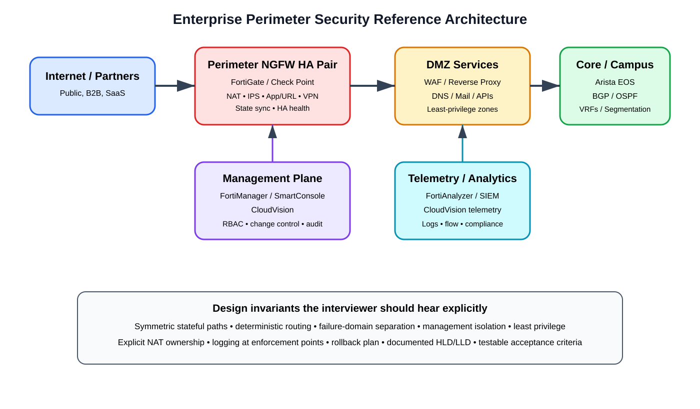
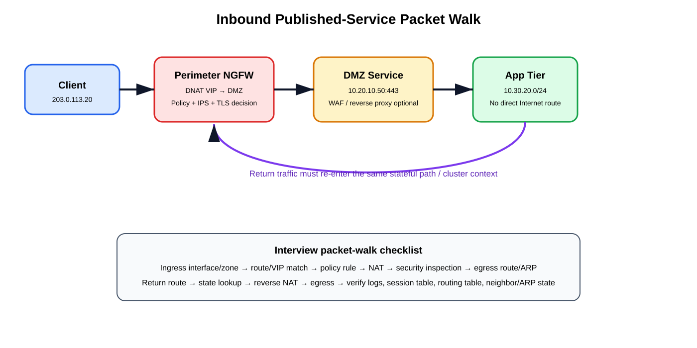
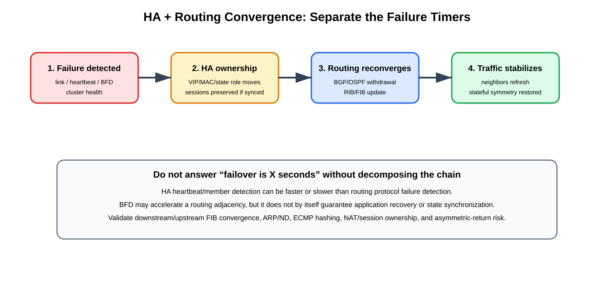

# Perimeter Design Engineer Interview Study Guide

**Created:** 2026-09-10 07:33 Pacific  
**Scope source:** Email agenda for a Perimeter Design Engineer discussion. The requested skills include Fortinet (FortiGate, FortiManager, FortiAnalyzer, Security Fabric), Check Point, Arista CloudVision, BGP/OSPF, SD-WAN, DMZ design, Zero Trust, HLD/LLD development, security governance, segmentation, and perimeter architecture.

## Table of contents

1. [Sources and evidence model](#sources-and-evidence-model)
2. [Role ownership and design method](#role-ownership-and-design-method)
3. [Reference perimeter architecture](#reference-perimeter-architecture)
4. [HLD versus LLD](#hld-versus-lld)
5. [Fortinet design](#fortinet-design)
6. [Check Point design](#check-point-design)
7. [Arista CloudVision and routed underlay](#arista-cloudvision-and-routed-underlay)
8. [BGP and OSPF](#bgp-and-ospf)
9. [DMZ design](#dmz-design)
10. [SD-WAN coexistence](#sd-wan-coexistence)
11. [Zero Trust and segmentation](#zero-trust-and-segmentation)
12. [Packet/session flow](#packetsession-flow)
13. [HA and convergence](#ha-and-convergence)
14. [Governance and change control](#governance-and-change-control)
15. [Verification workbook](#verification-workbook)
16. [Troubleshooting](#troubleshooting)
17. [Interview scenarios](#interview-scenarios)
18. [Sources](#sources)

## Sources and evidence model

### Supplied source information

The source email is the authoritative scope. It identifies the role as **Perimeter Design Engineer** and explicitly calls out Fortinet, Check Point, Arista CloudVision, BGP/OSPF, SD-WAN, DMZ design, Zero Trust, HLD/LLD ownership, security governance, routing, segmentation, and perimeter architecture.

### Supporting URLs

- [Fortinet Security Fabric — FortiOS 7.6.6](https://docs.fortinet.com/document/fortigate/7.6.6/administration-guide/286973/fortinet-security-fabric)
- [FortiManager 7.6.6 — Managing policies](https://docs.fortinet.com/document/fortimanager/7.6.6/administration-guide/951881/managing-policies)
- [FortiManager 7.6.5 — Creating policy packages](https://docs.fortinet.com/document/fortimanager/7.6.5/administration-guide/763337/creating-policy-packages)
- [FortiAnalyzer 7.6.6 — Logs](https://docs.fortinet.com/document/fortianalyzer/7.6.6/administration-guide/381919/logs)
- [Check Point R82 — Installing the Access Control Policy](https://sc1.checkpoint.com/documents/R82/WebAdminGuides/EN/CP_R82_SecurityManagement_AdminGuide/Content/Topics-SECMG/Installing-the-Access-Control-Policy.htm)
- [Check Point R82 — High Availability Mode](https://sc1.checkpoint.com/documents/R82/WebAdminGuides/EN/CP_R82_ClusterXL_AdminGuide/Content/Topics-CXLG/ClusterXL-Modes-High-Availability.htm)
- [Check Point R82 — Management High Availability](https://sc1.checkpoint.com/documents/R82/WebAdminGuides/EN/CP_R82_SecurityManagement_AdminGuide/Content/Topics-SECMG/Overview-Management-High-Availability.htm)
- [Arista EOS CloudVision](https://www.arista.com/en/products/eos/eos-cloudvision)
- [Arista CloudVision 2025.2 — Studios provisioning](https://www.arista.com/en/support/toi/cvp-2025-2-0)
- [Arista CloudVision white paper](https://www.arista.com/assets/data/pdf/Whitepapers/CloudVision_WP.pdf)
- [NIST SP 800-207 — Zero Trust Architecture](https://csrc.nist.gov/pubs/sp/800/207/final)

### Evidence labels

- **Source information** — explicitly documented in the source email or cited vendor/NIST material.
- **Additional explanation** — engineering context connecting source facts to design decisions.
- **Reasonable inference** — a design conclusion that depends on topology, platform, release, or organizational requirements and must be validated before production use.

> **Version rule:** Fortinet facts are oriented to the FortiOS/FortiManager/FortiAnalyzer 7.6 documentation family, Check Point to R82, and Arista to current CloudVision concepts. Verify the exact target release before implementation.

## Role ownership and design method

A perimeter designer is not merely a firewall-rule author. The job is to define the **security boundaries and forwarding invariants** that make policy enforceable, supportable, testable, and resilient.

A strong design answer should identify:

- Internet, partner, branch, remote-user, cloud, and data-center ingress/egress points.
- Trust zones and resource classes.
- Ownership of routing, NAT, VPN termination, TLS inspection, IPS, URL/application control, and logging.
- Which flows must cross a stateful firewall and which paths must never bypass it.
- Return-path symmetry requirements.
- Routing boundaries: static, OSPF, eBGP, or a deliberate combination.
- Failure domains: appliance, link, switch, power, rack, site, carrier, management, and analytics.
- Policy authoring, approval, deployment, rollback, and audit workflow.
- Acceptance criteria and telemetry proving the design works.

**Additional explanation:** In an interview, state assumptions first. Example: “I am assuming two diverse ISPs, a stateful HA firewall pair, dual core switches, dynamic routing internally, and a requirement that public services terminate in a DMZ before reaching application tiers.” This prevents hidden assumptions from masquerading as architecture.

## Reference perimeter architecture



[Editable draw.io](images/09-10-26-07-33_perimeter_reference_architecture.drawio)

**What this image shows:** Internet/partner connectivity, a stateful NGFW HA pair, DMZ services, routed core/campus, centralized management, and telemetry/analytics.

**What matters:** keep data, control, management, and telemetry functions conceptually separate. FortiManager/SmartConsole/CloudVision manage intent and change; FortiGate/Check Point gateways forward and inspect; FortiAnalyzer/SIEM/CloudVision provide observability.

**What to verify:** redundant paths, HA synchronization, routing adjacency placement, default-route ownership, DMZ route ownership, NAT ownership, management reachability during failures, log delivery, and any alternate path that might bypass inspection.

### Four planes

1. **Data plane** — interfaces, VLANs/VRFs, routes, NAT, sessions, VPN, inspection, forwarding.
2. **Control plane** — BGP/OSPF, SD-WAN path state, HA election/health.
3. **Management plane** — policy authoring, object lifecycle, deployment, software management, RBAC, backups.
4. **Telemetry plane** — traffic/threat/event logs, flow records, configuration compliance, routing state.

A design becomes fragile when public forwarding, device administration, and HA synchronization share unnecessary dependencies.

## HLD versus LLD

### High-Level Design (HLD)

The HLD explains **why the architecture exists and how major components interact**. Include business/security requirements, trust zones, sites/clouds/partners, platform roles, routing domains, HA model, north-south/east-west policy, logging strategy, capacity assumptions, dependencies, risks, migration approach, and rollback strategy.

### Low-Level Design (LLD)

The LLD makes the HLD **implementable**. Include exact interface mappings, VLAN IDs, VRFs/VDOMs/virtual systems where used, IP addressing, BGP ASNs/neighbors, OSPF areas, route maps/prefix lists, NAT objects, security zones, HA links, management addresses, AAA/NTP/DNS/PKI dependencies, SD-WAN members/health checks, policy-package placement, logging destinations, naming conventions, and acceptance tests.

A good LLD lets a second engineer implement the design without reconstructing intent from a diagram.

## Fortinet design

### FortiGate

**Source information:** FortiGate is the enforcement point in this design domain. Depending on platform/licensing it can combine stateful policy, NAT, VPN, routing, SD-WAN, and security profiles.

**Additional explanation:** Treat policy matching as only one stage of the flow. Failure can occur at ingress classification, reverse-path validation, VIP/DNAT, route lookup, central/local SNAT, SSL inspection, security-profile action, IPsec selector, or return routing.

A useful mental model:

```text
interfaces/zones
  -> routing / SD-WAN
    -> objects
      -> VIP/DNAT + SNAT strategy
        -> firewall policy
          -> security profiles
            -> session table
              -> logging / FortiAnalyzer
```

### FortiManager

**Source information:** Current FortiManager documentation organizes policies in policy packages within ADOMs and documents several managed policy types. Global policy packages have specific constraints; the cited documentation notes that NGFW policy mode is not supported for global policy packages.

Design decisions should cover ADOM ownership/version alignment, common versus site-specific objects, package assignment, install targets, revision/backups, diff/preview review, administrator profiles, approval process, and rollback.

**Interview framing:** “I centralize reusable standards without introducing hidden coupling. Shared controls belong centrally; site-specific exceptions remain explicit and reviewable.”

### FortiAnalyzer

**Source information:** FortiAnalyzer 7.6 documentation distinguishes real-time, Archive, and Analytics/historical log phases; sending devices must be registered/authorized appropriately.

Design retention from use cases backward: recent searchable analytics for operations and incident response, plus longer archive retention where compliance requires it. Verify traffic allow/deny, threat, VPN, admin, HA, routing/SD-WAN, and configuration-change visibility.

A firewall deployment is not complete merely because traffic passes. Logs should expose enough original/translated addressing, policy identity, action, security-profile result, and time synchronization to reconstruct a flow.

### Security Fabric

**Source information:** Fortinet describes Security Fabric as an integrated architecture with topology views, Security Rating, Fabric connectors, and trigger/action automation. Current 7.6.6 documentation also contains model-specific constraints and recommends a maximum of 35 downstream FortiGates.

**Additional explanation:** Security Fabric is not synonymous with “all packets hairpin through the root.” It is primarily integration, visibility, and automation; packet forwarding still follows the actual topology, routing, and policy.

### FortiGate verification patterns

```cli
get system status
get system ha status
get router info routing-table all
get router info bgp summary
get router info ospf neighbor
diagnose sys session filter clear
diagnose sys session filter src <IP_ADDRESS>
diagnose sys session list
diagnose debug flow filter addr <IP_ADDRESS>
diagnose debug flow trace start <PACKET_COUNT>
diagnose debug enable
```

Stop debugging:

```cli
diagnose debug disable
diagnose debug reset
```

Verify intended HA role, route/next hop, established routing adjacencies, expected session/NAT tuple, policy match, and packet forwarding.

## Check Point design

A traditional Check Point architecture separates the **Security Management Server / SmartConsole** management plane from **Security Gateway / ClusterXL** enforcement.

**Source information:** R82 documentation describes verifying Access Control Policy, publishing the administrator session, selecting targets, and installing policy. Management HA is a separate capability from gateway HA.

### ClusterXL

**Source information:** R82 ClusterXL High Availability uses active/standby processing with state synchronization so a standby can assume forwarding when the active member fails.

**Additional explanation:** State synchronization does not replace routing design. Adjacent devices must still forward to the effective cluster identity after failover. Test member failure, outside-link failure, inside-link failure, routing-neighbor failure, and sync failure separately.

Useful operational patterns:

```cli
cphaprob stat
cphaprob -a if
fw stat
fw ctl pstat
fw tab -t connections -s
show route all
```

Use `tcpdump`, `fw monitor`, and other packet tools only with syntax verified for the target release and topology.

### Publish versus install

Publishing saves management database changes. Installing policy distributes enforcement policy to selected gateways. A successful publish does not prove the gateway has the new enforcement state; a successful install still does not prove end-to-end routing/NAT/application behavior.

## Arista CloudVision and routed underlay

Perimeter firewalls often attach to Arista routed leaf/spine, collapsed core, border-leaf, or campus-core infrastructure.

**Source information:** Arista describes CloudVision as a multi-domain management platform with network-wide state, automation, telemetry, configuration workflow, compliance, and change-control capabilities. Current CloudVision material emphasizes Studios and controlled provisioning workflows.

**Additional explanation:** For a perimeter engineer, CloudVision is valuable for correlating switch-interface, route, MLAG, configuration, and telemetry changes with firewall events. It does not replace firewall policy or routing design.

A safe cross-platform deployment sequence can be:

```text
HLD/LLD approved
 -> prepare VLAN/VRF and routed underlay
 -> build firewall interfaces/HA
 -> configure policy/NAT/logging
 -> establish but filter routing
 -> validate state
 -> enable advertisements / service publication
 -> verify end-to-end
 -> retain rollback checkpoints
```

EOS verification patterns:

```cli
show interfaces status
show interfaces counters errors
show port-channel summary
show ip route vrf <VRF_NAME>
show ip bgp summary vrf <VRF_NAME>
show ip ospf neighbor
show arp vrf <VRF_NAME>
show lldp neighbors
```

Verify exact syntax for the deployed EOS release.

## BGP and OSPF

### BGP

Use BGP where explicit routing policy, multiple external peers, Internet routing, administrative boundaries, or controlled redistribution are required.

Design controls include inbound/outbound prefix filters, maximum-prefix protection, local preference, deliberate AS-path prepending/provider communities, MED only when comparison semantics are understood, BFD only when validated, deterministic ECMP behavior, and controlled route redistribution.

Do not assume a firewall should carry a full Internet table merely because it can run BGP. Validate FIB/memory scale, convergence, HA behavior, operational ownership, and interaction with security inspection. Dedicated edge routers may retain full-table complexity while firewalls receive defaults/summaries.

### OSPF

Use OSPF as an interior link-state protocol when the enterprise design benefits from area hierarchy and internal convergence. At a firewall boundary, clarify area placement, ABR/ASBR role, default/external origination, redistribution controls, passive interfaces, route tags/filters, authentication, and ECMP behavior.

### Strong comparison

Do not say one is universally better. A common pattern is **OSPF for intra-domain reachability and BGP for policy-rich administrative boundaries**, but operational standards and failure requirements determine the correct choice.

## DMZ design

A Demilitarized Zone (DMZ) is a security boundary for systems that communicate with less-trusted networks while remaining isolated from internal tiers.

Recommended principles:

- Internet traffic reaches only explicitly published services.
- Public-facing systems are segmented by function/risk where warranted.
- Management interfaces live on protected management networks.
- DNAT/VIP and egress rules are explicit.
- HTTP/S services use a WAF/reverse proxy when application-layer protection is required.
- DMZ-to-inside flows are limited to named backends and exact services.
- DNS/NTP/repository dependencies are deliberate.
- Logging exists on each meaningful boundary.
- Source-IP preservation through proxies/load balancers is documented.

| Source | Destination | Example | Default stance |
|---|---|---|---|
| Internet | Public-DMZ | HTTPS to VIP | deny except published services |
| Public-DMZ | App | API/HTTPS to named backend | deny except dependency |
| App | Database | DB protocol to named cluster | deny except dependency |
| DMZ | Management | normally none | deny |
| Management | DMZ | admin from jump/bastion | tightly controlled |

## SD-WAN coexistence

SD-WAN adds a second path-selection system next to ordinary routing. Define precedence explicitly.

Questions to answer:

- Is SD-WAN integrated into the firewall or on a separate edge?
- Are Internet links both underlay transports and local breakout paths?
- Which flows must remain centralized through perimeter inspection?
- Does SD-WAN steering happen before or after a routing lookup on the platform?
- What health mechanism removes a path?
- Can failover produce asymmetric return traffic and state/RPF drops?
- Does the public NAT identity change by transport?

**Reasonable inference:** A separate SD-WAN appliance in front of a stateful firewall can create asymmetry unless steering, NAT, and return routing are deterministic. Validate with the actual products and topology.

## Zero Trust and segmentation

**Source information:** NIST SP 800-207 describes Zero Trust Architecture around protecting resources rather than granting implicit trust based on network location. Authentication and authorization are explicit, and location alone does not establish trust.

A perimeter firewall remains useful, but “inside” should not mean “trusted.” Add identity, device posture, application context, workload identity, resource sensitivity, east-west segmentation, and continuous telemetry where appropriate.

| Zero-trust principle | Network implementation |
|---|---|
| No implicit trust by location | avoid broad inside-to-any rules |
| Explicit verification | identity-aware policy, MFA, device posture, certificates |
| Least privilege | exact source/destination/application/service scopes |
| Assume breach | east-west segmentation and management isolation |
| Continuous evaluation | telemetry, posture/risk signals, automation |

Micro-segmentation may use VRFs/VLANs plus firewalls, host/workload agents, cloud controls, or identity-aware policy. The key is preventing routing convenience from bypassing security intent.

## Packet/session flow



[Editable draw.io](images/09-10-26-07-33_inbound_packet_walk.drawio)

**What this image shows:** an inbound HTTPS session to a public VIP, DNAT to a DMZ service, and an optional second controlled hop to an application tier.

**What matters:** stateful inspection binds forward and reverse directions. NAT, routing, policy, and HA ownership must agree.

**What to verify:** ingress interface/zone, route/VIP match, policy, security inspection, translated tuple, egress adjacency/ARP, return route, reverse NAT, and final log/session state.

Example packet walk:

1. Client sends to public service IP.
2. Packet arrives on Internet-facing firewall interface.
3. DNAT/VIP lookup maps the public destination to the DMZ server.
4. Access policy evaluates the relevant tuple according to platform NAT/policy order.
5. Security profiles inspect permitted traffic.
6. Route lookup selects the DMZ egress.
7. Session/NAT state is created.
8. DMZ service receives the request.
9. Any DMZ-to-App dependency requires a separate least-privilege rule.
10. Return traffic must traverse a compatible stateful path for session match and reverse NAT.

## HA and convergence



[Editable draw.io](images/09-10-26-07-33_ha_routing_convergence.drawio)

**What this image shows:** four separate recovery phases: failure detection, HA ownership/state transition, routing reconvergence, and forwarding stabilization.

**What matters:** “failover time” is not one timer. HA may react before routing, or routing may react before session state/application recovery.

**What to verify:** member state, monitored interfaces, session synchronization, BGP/OSPF neighbors, RIB/FIB changes, ARP/ND movement, ECMP/hash behavior, NAT ownership, and application transaction recovery.

| Failure | Expected behavior | Observe |
|---|---|---|
| Active firewall power loss | standby becomes active | HA state, cluster identity, sessions, routes |
| Outside link loss | surviving path used if design allows | BGP/SD-WAN, NAT IP, return path |
| Inside link loss | alternate core path used | LAG/MLAG, adjacency, FIB |
| State-sync failure | platform-specific degraded condition | HA alarms; do not assume sync remains healthy |
| Management loss | existing forwarding normally continues | distinguish management from data plane |
| Analyzer/SIEM loss | forwarding normally independent | queue/buffer/drop behavior for logs |

If asked how to make BGP fail over faster, decompose link detection, BGP timers, BFD, next-hop tracking, withdrawal, best-path selection, FIB programming, downstream propagation, firewall state, and application retry. Lower timers only after platform/load testing.

## Governance and change control

Required artifacts normally include HLD, LLD, rule/object naming standards, source-of-truth ownership, change request, peer review, backups/revisions, deployment sequencing, rollback criteria, acceptance tests, and a post-change monitoring window.

For each firewall rule ask:

- Can source/destination be narrowed?
- Is application/service scope correct?
- Is identity/device context required?
- Is the rule shadowed, redundant, or overly broad?
- Is logging useful and appropriately placed?
- Does NAT affect how the rule should be interpreted?
- Does the rule have an owner, justification, review date, and expiry where appropriate?

Management security should include protected management networks/VRFs, centralized AAA, MFA where supported, RBAC, restricted admin sources, trusted certificates, NTP, backups, and audit logging.

## Verification workbook

These are **command patterns, not fabricated output**. Validate syntax for the exact release.

### FortiGate

```cli
get system status
get system ha status
get router info routing-table all
get router info bgp summary
get router info ospf neighbor
diagnose sys session filter dst <IP_ADDRESS>
diagnose sys session list
diagnose sniffer packet <INTERFACE_NAME> 'host <IP_ADDRESS> and port <PORT>' 4 0 l
```

**Success:** correct active member, intended route/next hop, established peer, matching session, expected ingress/egress packets.

**Failure:** no ingress packet points upstream; ingress with no session points to firewall processing; session without egress suggests route/adjacency/policy/inspection; egress without return shifts focus downstream and to reverse routing.

### Check Point

```cli
cphaprob stat
cphaprob -a if
fw stat
show route all
fw ctl pstat
```

**Success:** correct cluster role, healthy monitored interfaces, intended policy installed, valid forward/return routing.

### Arista EOS

```cli
show interfaces status
show port-channel summary
show ip route vrf <VRF_NAME>
show ip bgp summary vrf <VRF_NAME>
show ip ospf neighbor
show arp vrf <VRF_NAME>
```

**Success:** physical/LAG state, installed route, healthy control-plane adjacency, and valid next-hop resolution.

### End-to-end evidence chain

```text
client test
 -> edge/core route
 -> firewall ingress capture
 -> firewall session/NAT/policy log
 -> firewall egress capture
 -> DMZ/server capture or app log
 -> return-path evidence
```

## Troubleshooting

### Inbound VIP unreachable

**Check routing to the public IP.**  
Where: upstream edge and firewall.  
Tests: whether the public prefix reaches the active firewall.  
Success: expected route/neighbor.  
Failure means: advertisement/provider/HA ownership issue.  
Next action: fix routing before firewall policy.

**Check packet arrival.**  
Where: firewall outside interface.  
Tests: physical/VLAN/routing delivery.  
Success: SYN visible.  
Failure means: upstream path issue.  
Next action: inspect switch/edge route, VLAN, LAG/MLAG, provider handoff.

**Check DNAT/VIP and policy.**  
Tests: translation and access control.  
Success: intended translated destination and accepting policy/session.  
Failure means: wrong VIP, binding, object, service, policy order, or NAT stage.  
Next action: correct the smallest mismatch.

**Check return route.**  
Tests: stateful symmetry.  
Success: response returns through expected firewall and reverse NAT occurs.  
Failure means: asymmetric return or alternate gateway.  
Next action: correct routing rather than adding permissive rules.

### BGP neighbor down

Check interface/IP reachability, local/peer ASN, TCP/179 path, authentication, VRF, TTL/eBGP multihop requirements, local-in/ACL controls, source interface, HA ownership, and BFD state if configured.

### OSPF neighbor not FULL

Check subnet/mask, area ID/type, authentication, hello/dead timers, MTU, network type, duplicate router ID, passive interface, multicast reachability, and HA adjacency behavior.

### Works on one firewall member but fails after HA

Check state synchronization, interface monitors, switch MAC/GARP/ND behavior, routing adjacency per member, static next hops, SD-WAN state, ECMP hashing, and stale upstream forwarding toward the failed path.

### Policy install succeeds but traffic fails

A successful management deployment proves configuration delivery, not end-to-end reachability. Verify correct device/VDOM/cluster target, installed policy version, route table, NAT, security profiles, local-in policy, sessions, and captures.

### Logs missing in FortiAnalyzer/SIEM

Check device registration/authorization, route to analyzer, encryption/certificate compatibility, NTP/time, ADOM/device mapping, storage state, filtering, and whether the firewall generates the expected log type.

## Interview scenarios

### Dual-ISP perimeter

Clarify whether the enterprise owns PI space and runs eBGP, full routes versus defaults, active/active versus active/standby, NAT/public-IP behavior per ISP, inbound traffic engineering, failure domains, HA/state behavior, and how each link/device/peer failure is tested. Do not say “BGP handles failover” without discussing NAT, sessions, DNS, route propagation, and application recovery.

### Check Point-to-FortiGate migration

Discover current behavior before translating rules. Export objects/rules/NAT/VPN/routing/usage; classify obsolete or risky rules; map policy-layer semantics; map NAT order; preserve logs/compliance; build routing and HA first; stage cutover; capture pre/post evidence; maintain rapid rollback. Migration tooling accelerates conversion but does not replace design validation.

### Arista core + FortiGate perimeter

Use explicit VRF placement and routed links/VLANs. Choose OSPF or eBGP deliberately, filter advertisements, prevent redistribution loops, document default-route propagation, preserve deterministic HA routing identity, and sequence CloudVision and FortiManager changes with pre/post validation.

### “How would you secure a DMZ?”

Discuss tier separation, published-service path, source preservation, WAF/reverse proxy, outbound dependencies, east-west limits, management isolation, DNS/NTP, EDR, vulnerability management, certificates/secrets, SIEM logging, backup/recovery, and exact application flows.

### “What is Zero Trust at the perimeter?”

The perimeter remains an enforcement point, but location does not establish trust. Add identity, device posture, resource context, least privilege, segmentation, strong admin controls, and continuous telemetry.

### “How do you prove an HLD/LLD is good?”

Another engineer can implement it, operations can monitor it, security can audit it, and the business can survive its failure modes. Tie every requirement to an architecture element and every architecture element to an acceptance test.

## Final validation checklist

- [x] Email technical agenda incorporated; meeting logistics excluded from technical scope.
- [x] Current Fortinet 7.6-family, Check Point R82, Arista CloudVision, and NIST sources recorded.
- [x] Version-dependent facts labeled.
- [x] Architecture, control/data/management planes, routing, NAT/state, DMZ, SD-WAN, HA, governance, and Zero Trust covered.
- [x] HLD and LLD responsibilities separated.
- [x] Verification commands are labeled as patterns; no fabricated vendor output is presented.
- [x] Symptom-based troubleshooting includes test, success, failure meaning, and next action.
- [x] Three diagrams have matching SVG and editable draw.io assets under `images/`.
- [x] No base64, sandbox, local, signed-session, tracking, or expiring links are used in GitHub Markdown.

## Sources

- [Fortinet Security Fabric — FortiOS 7.6.6](https://docs.fortinet.com/document/fortigate/7.6.6/administration-guide/286973/fortinet-security-fabric)
- [FortiManager 7.6.6 — Managing policies](https://docs.fortinet.com/document/fortimanager/7.6.6/administration-guide/951881/managing-policies)
- [FortiManager 7.6.5 — Creating policy packages](https://docs.fortinet.com/document/fortimanager/7.6.5/administration-guide/763337/creating-policy-packages)
- [FortiAnalyzer 7.6.6 — Logs](https://docs.fortinet.com/document/fortianalyzer/7.6.6/administration-guide/381919/logs)
- [Check Point R82 — Installing the Access Control Policy](https://sc1.checkpoint.com/documents/R82/WebAdminGuides/EN/CP_R82_SecurityManagement_AdminGuide/Content/Topics-SECMG/Installing-the-Access-Control-Policy.htm)
- [Check Point R82 — High Availability Mode](https://sc1.checkpoint.com/documents/R82/WebAdminGuides/EN/CP_R82_ClusterXL_AdminGuide/Content/Topics-CXLG/ClusterXL-Modes-High-Availability.htm)
- [Check Point R82 — Management High Availability](https://sc1.checkpoint.com/documents/R82/WebAdminGuides/EN/CP_R82_SecurityManagement_AdminGuide/Content/Topics-SECMG/Overview-Management-High-Availability.htm)
- [Arista EOS CloudVision](https://www.arista.com/en/products/eos/eos-cloudvision)
- [Arista CloudVision 2025.2 — Studios provisioning](https://www.arista.com/en/support/toi/cvp-2025-2-0)
- [Arista CloudVision white paper](https://www.arista.com/assets/data/pdf/Whitepapers/CloudVision_WP.pdf)
- [NIST SP 800-207 — Zero Trust Architecture](https://csrc.nist.gov/pubs/sp/800/207/final)
