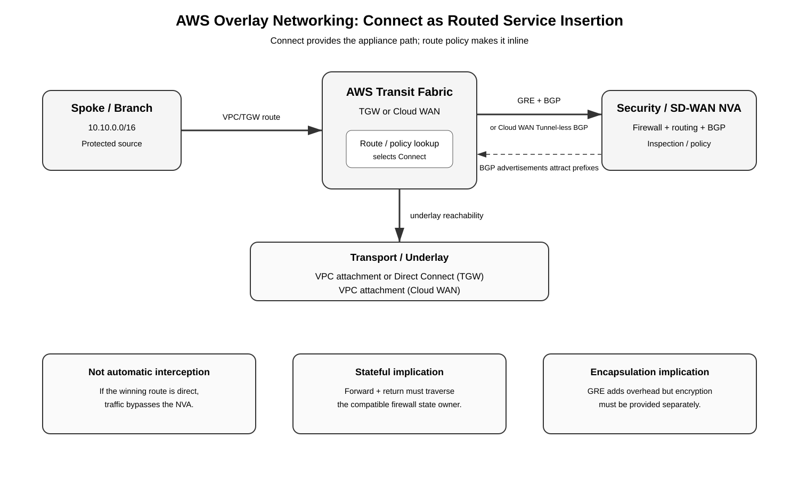

# AWS Overlay Networking with Transit Gateway Connect and Cloud WAN Connect — Service Insertion Deep Dive

## Purpose

AWS **Connect attachments** provide a BGP-based way to attach third-party routers, SD-WAN appliances, and other network virtual appliances (NVAs) to AWS transit fabrics. In the right design, a security-capable NVA can advertise routes that make selected traffic traverse the appliance.

The critical distinction is:

> **Connect provides connectivity to the appliance; routing policy makes the appliance inline.**

Therefore, Transit Gateway Connect or Cloud WAN Connect should be treated as a **qualified service-insertion/interception method**, not as an automatic firewall chain like a Gateway Load Balancer Endpoint (GWLBE) route or an AWS Network Firewall endpoint.

This guide explains the overlay/underlay model, exact forwarding logic, how BGP advertisements can attract traffic, Direct Connect integration, Cloud WAN Tunnel-less Connect, stateful-firewall implications, route-bypass risks, MTU and throughput considerations, HA/ECMP behavior, verification, and when to choose Connect instead of GWLB, VPC Route Server, or native AWS Network Firewall.

For the routing foundation independent of firewall insertion, see [AWS Overlay Routing — Underlay, BGP, Transit Gateway Connect, Cloud WAN Connect, SD-WAN, ECMP, and Failure Domains](09-10-26-17-20_AWS_Overlay_Routing_Underlay_BGP_TGW_Cloud_WAN_Connect_Deep_Dive.md).

## Table of contents

1. [Where this fits in the AWS firewall-insertion taxonomy](#1-where-this-fits-in-the-aws-firewall-insertion-taxonomy)
2. [Underlay versus overlay](#2-underlay-versus-overlay)
3. [Transit Gateway Connect architecture](#3-transit-gateway-connect-architecture)
4. [How Connect becomes an interception path](#4-how-connect-becomes-an-interception-path)
5. [Packet walk: spoke to security NVA to destination](#5-packet-walk-spoke-to-security-nva-to-destination)
6. [BGP control-plane behavior](#6-bgp-control-plane-behavior)
7. [Direct Connect as the underlay](#7-direct-connect-as-the-underlay)
8. [Cloud WAN Connect and Tunnel-less Connect](#8-cloud-wan-connect-and-tunnel-less-connect)
9. [Stateful firewall and symmetry implications](#9-stateful-firewall-and-symmetry-implications)
10. [Encryption and confidentiality implications](#10-encryption-and-confidentiality-implications)
11. [MTU, fragmentation, throughput, and ECMP](#11-mtu-fragmentation-throughput-and-ecmp)
12. [Failure and convergence behavior](#12-failure-and-convergence-behavior)
13. [Route leaks and bypass risks](#13-route-leaks-and-bypass-risks)
14. [Comparison with other AWS insertion methods](#14-comparison-with-other-aws-insertion-methods)
15. [Design patterns](#15-design-patterns)
16. [AWS CLI skeleton](#16-aws-cli-skeleton)
17. [Verification and troubleshooting](#17-verification-and-troubleshooting)
18. [Exam and design takeaways](#18-exam-and-design-takeaways)
19. [References](#19-references)

---

## 1. Where this fits in the AWS firewall-insertion taxonomy

The existing AWS insertion methods fall into several families:

| Method | What makes the device inline? | Typical use |
|---|---|---|
| AWS Network Firewall endpoint | VPC/TGW route to firewall endpoint/attachment | AWS-managed stateful inspection |
| GWLBE + GWLB | VPC/TGW route to GWLBE | Transparent third-party appliance insertion |
| Legacy TGW + direct NVA VPC | TGW route + VPC ENI route | Direct routed appliance insertion |
| VPC Route Server + NVA | NVA BGP advertisements program VPC/IGW routes | Dynamic same-VPC/ingress insertion |
| Cloud WAN NFG | Core-network policy send-via/send-to | Policy-driven global service insertion |
| **TGW/Cloud WAN Connect + NVA** | **BGP route selection toward Connect attachment/appliance** | **Dynamic routed overlay through SD-WAN/security NVA** |

Connect is different from GWLB.

With GWLB:

~~~text
Route -> GWLBE -> GWLB -> appliance
~~~

The service chain itself delivers the flow to an appliance.

With Connect:

~~~text
Route selection -> Connect attachment -> GRE/BGP or native BGP -> NVA
~~~

The NVA is reached because the transit fabric believes that the desired destination or service prefix is reachable **through the NVA**.

That means a firewall-capable SD-WAN appliance can be in the forwarding path, but the architecture is fundamentally **routed service insertion**, not transparent bump-in-the-wire insertion.

[Editable draw.io source](images/09-10-26-17-10_aws_overlay_connect_service_insertion.drawio)

---

## 2. Underlay versus overlay

A useful mental model is:

~~~text
                     OVERLAY
        GRE + BGP / native BGP adjacency
                    routes
                      |
                      v
              Security/SD-WAN NVA
                      |
----------------------|----------------------
                      |
                   UNDERLAY
        VPC attachment / Direct Connect
        AWS VPC routing / AWS backbone
~~~

### Underlay

The underlay provides reachability between the AWS transit fabric and the appliance's outer/transport address.

For Transit Gateway Connect, the transport attachment can be:

- a VPC attachment; or
- a Direct Connect attachment.

For Cloud WAN Connect, the transport is a VPC attachment.

### Overlay

Transit Gateway Connect uses:

- GRE for data-plane encapsulation;
- BGP for route exchange and health signaling.

Cloud WAN Connect supports:

- GRE + BGP; or
- Tunnel-less Connect using native BGP without GRE.

The underlay answers:

> Can the appliance and AWS Connect endpoint reach each other?

The overlay answers:

> Which prefixes should be routed through this appliance?

---

## 3. Transit Gateway Connect architecture

A typical Transit Gateway Connect deployment is:

~~~text
                            AWS Transit Gateway
                         +----------------------+
                         |                      |
Spoke VPC A ------------>| TGW route table     |-------------- Spoke VPC B
                         |                      |
                         | Connect attachment   |
                         +----------+-----------+
                                    |
                                  GRE
                                    |
                                   BGP
                                    |
                         +----------v-----------+
                         | Security / SD-WAN NVA|
                         | EC2 / vendor appliance|
                         +----------+-----------+
                                    |
                         Transport VPC attachment
~~~

AWS calls the underlying VPC or Direct Connect attachment the **transport attachment**.

The Connect attachment is layered on that transport attachment.

### Connect peer components

A Connect peer includes:

- appliance GRE outer address;
- TGW GRE outer address from a TGW CIDR block;
- IPv4 BGP inside CIDR, normally a /29 from 169.254.0.0/16;
- optional IPv6 inside CIDR;
- peer ASN;
- two AWS-side BGP peering sessions for routing-plane redundancy.

Do not collapse these into one concept:

~~~text
Transport attachment = underlay path
Connect attachment   = logical AWS attachment
Connect peer         = GRE tunnel + BGP peerings
BGP advertisements   = route-control mechanism
~~~

---

## 4. How Connect becomes an interception path

A Connect attachment by itself does **not** say:

> Send all traffic through the firewall.

It says:

> These prefixes are reachable through this Connect attachment/appliance.

The interception effect occurs when route selection causes the protected flow to choose those advertised prefixes.

### Example

Suppose:

~~~text
Spoke-A       10.10.0.0/16
Spoke-B       10.20.0.0/16
Security NVA  attached through TGW Connect
~~~

If the NVA advertises:

~~~text
10.20.0.0/16
~~~

into the TGW routing domain used by Spoke-A, TGW can select the Connect attachment for traffic from 10.10.0.0/16 to 10.20.0.0/16.

But then the NVA must know how to forward the traffic onward after inspection. This often means the NVA maintains another route/VRF/path toward the real destination.

A service-insertion design therefore needs two logical routing states:

~~~text
PRE-INSPECTION
10.20.0.0/16 -> Connect/security NVA

POST-INSPECTION
10.20.0.0/16 -> real destination path
~~~

If the NVA simply advertises the destination back into the same routing domain without a post-inspection separation mechanism, you can create:

- routing loops;
- repeated inspection;
- direct bypass;
- blackholes.

This is why Connect is best understood as **dynamic routed insertion**.

---

## 5. Packet walk: spoke to security NVA to destination

Assume the design provides a valid post-inspection path.

### Forward direction

~~~text
Client 10.10.1.10
   |
   | destination 10.20.2.20
   v
Spoke-A subnet route -> TGW
   |
   v
TGW route lookup
   |
   | 10.20.0.0/16 -> Connect attachment
   v
TGW Connect
   |
   | GRE encapsulation
   v
Security NVA
   |
   | decapsulate
   | security policy / IPS / URL / application controls
   | route after inspection
   v
real destination path
   |
   v
10.20.2.20
~~~

Conceptually, while traversing GRE:

~~~text
Outer IP:
  src = TGW GRE address
  dst = appliance GRE address

GRE

Inner customer packet:
  src = 10.10.1.10
  dst = 10.20.2.20
~~~

The appliance makes its security decision on the inner/customer flow.

### Return direction

For a stateful firewall, the return flow must be engineered to traverse the same logical firewall/session owner:

~~~text
10.20.2.20
   |
   v
post-inspection routing
   |
   v
Security NVA
   |
   | existing state
   v
TGW Connect
   |
   v
TGW
   |
   v
Spoke-A
   |
   v
10.10.1.10
~~~

If the return route chooses a direct TGW attachment rather than the Connect attachment, the return traffic bypasses the firewall and the session can fail.

---

## 6. BGP control-plane behavior

Transit Gateway Connect requires BGP for dynamic route updates and health checks. Static routes are not supported on the Connect attachment.

### eBGP

With a different appliance ASN:

~~~text
Security NVA ASN 65010
       |
       | eBGP multihop TTL 2
       |
TGW ASN 64512
~~~

AWS requires eBGP multihop TTL 2 for this model.

### iBGP

iBGP is supported, but its route-installation behavior is more restrictive. AWS documents that TGW does not install ordinary routes learned from an iBGP appliance unless they were originated by an eBGP peer and the appropriate next-hop behavior is configured.

For most service-insertion designs, eBGP is the easier mental model.

### Route propagation

Routes learned through a TGW Connect attachment are propagated into a TGW route table by default.

That is powerful, but it is also the main security-design danger:

> Dynamic propagation can accidentally create a route that bypasses the intended inspection domain.

Always inspect the final TGW route table, not merely the BGP RIB on the appliance.

---

## 7. Direct Connect as the underlay

One of the most useful overlay designs uses Direct Connect only as transport.

~~~text
On-prem / branch SD-WAN
        |
        | private transport
        v
Direct Connect
        |
        v
DXGW / TGW integration
        |
        | transport attachment
        v
TGW Connect
        |
        | GRE + BGP overlay
        v
Security / SD-WAN appliance
~~~

This separates two jobs:

~~~text
Direct Connect = transport / underlay
Connect         = logical overlay adjacency
BGP             = route/control plane
Security NVA    = policy enforcement
~~~

### Security implication

Do not infer that Direct Connect traffic is inspected just because the Connect attachment exists.

The relevant TGW routing domain must select the Connect attachment for the protected destinations.

### Design implication

The underlay can remain stable while overlay routes change dynamically.

For example:

- Direct Connect remains up;
- BGP to one firewall appliance fails;
- its advertised inspection prefixes disappear;
- another Connect peer advertises the same prefixes;
- TGW converges toward the remaining path.

That is one of the major advantages over manually replacing static ENI routes.

---

## 8. Cloud WAN Connect and Tunnel-less Connect

Cloud WAN has two Connect modes relevant to this topic:

### GRE Connect

~~~text
Cloud WAN Core Network Edge
        |
       GRE
        |
       BGP
        |
Third-party appliance
~~~

### Tunnel-less Connect

~~~text
Cloud WAN Core Network Edge
        |
     native BGP
        |
Third-party appliance
~~~

Tunnel-less Connect removes GRE encapsulation and its associated overhead. The appliance still participates dynamically through BGP.

Cloud WAN documentation recommends locating the third-party appliance in the same subnet as the transport VPC attachment where practical.

### How it relates to service insertion

Cloud WAN adds an additional policy construct that Transit Gateway does not have: **Network Function Groups (NFGs)** with service-insertion actions.

A security appliance attachment can participate in an NFG, and Cloud WAN policy can use:

~~~text
send-via = east-west service insertion
send-to  = north-south service insertion
~~~

Therefore, Cloud WAN can combine:

~~~text
Connect attachment / BGP reachability
                +
Network Function Group
                +
send-via / send-to
                =
policy-driven inspection through an NVA
~~~

This is cleaner than trying to reproduce pre/post routing entirely through TGW route propagation.

### Important distinction

Tunnel-less Connect is **not encryption**.

It merely removes the GRE encapsulation layer.

---

## 9. Stateful firewall and symmetry implications

A stateful firewall tracks a flow such as:

~~~text
10.10.1.10:51000 -> 10.20.2.20:443
~~~

The reverse packet must normally return to the same state owner.

With multiple Connect peers and ECMP, ask two separate questions:

1. Does AWS keep the forward and return flow on a compatible path?
2. If another firewall instance is selected after a failure, does it have synchronized session state?

BGP convergence can preserve **reachability** without preserving **sessions**.

That distinction is essential.

### Active/active

Multiple Connect peers can advertise the same prefixes and use ECMP.

Advantages:

- aggregate bandwidth;
- active/active use;
- fast path removal when BGP goes down.

Risks:

- session ownership;
- hashing changes after path failure;
- firewall state synchronization requirements;
- asymmetric return advertisements.

### Active/standby

A common design uses:

- equal prefixes with AS-path prepending;
- MED or vendor-specific routing preference;
- selective advertisements;
- BGP withdrawal on health failure.

This can simplify state ownership but reduces active bandwidth.

---

## 10. Encryption and confidentiality implications

GRE provides encapsulation, not encryption.

Therefore:

~~~text
GRE != IPsec
~~~

If traffic crosses infrastructure where encryption is required, use an architecture that supplies encryption independently, such as:

- IPsec in the SD-WAN overlay;
- MACsec on supported Direct Connect links where applicable;
- application-layer TLS;
- another encrypted transport layer.

Do not write a security design that says:

> TGW Connect encrypts the packet.

It does not.

Cloud WAN Tunnel-less Connect also does not add encryption merely because it eliminates GRE.

---

## 11. MTU, fragmentation, throughput, and ECMP

### GRE MTU

AWS explicitly recommends accounting for GRE overhead.

For a 1500-byte outer interface:

~~~text
1500
- 20 bytes IPv4 outer header
-  4 bytes GRE header
---------------------------
1476-byte GRE tunnel MTU
~~~

Additional encapsulations used by an SD-WAN vendor can reduce the practical inner MTU further.

Symptoms of MTU problems include:

- TCP handshakes succeed but large transfers stall;
- PMTUD failures;
- intermittent application behavior;
- fragmentation or excessive retransmission.

### Transit Gateway Connect bandwidth

AWS currently documents:

- up to **5 Gbps per Connect peer/GRE tunnel**;
- up to **300,000 packets/s per Connect peer**;
- up to **4 Connect peers per Connect attachment**;
- up to **20 Gbps aggregate per Connect attachment**, subject to underlay capacity;
- ECMP can scale across multiple peers/attachments.

The two AWS BGP sessions associated with a single Connect peer are for routing-plane redundancy; they are not two independent ECMP data paths for that peer.

### Cloud WAN Tunnel-less Connect

Cloud WAN Tunnel-less Connect can use substantially more of the VPC attachment's native capacity because there is no GRE tunnel bottleneck. AWS documentation currently describes up to **100 Gbps per Availability Zone** for a tunnel-less Connect peer, subject to service/attachment limits.

This makes Tunnel-less Connect especially relevant when a high-throughput SD-WAN/security appliance can support the required forwarding rate.

---

## 12. Failure and convergence behavior

Separate failure detection into layers.

### Layer 1 — underlay

Examples:

- ENI/subnet failure;
- VPC attachment issue;
- Direct Connect failure;
- route to GRE outer endpoint lost.

### Layer 2 — overlay

Examples:

- GRE peer unreachable;
- BGP adjacency failure;
- route withdrawal;
- one Connect peer failure.

### Layer 3 — security application

Examples:

- firewall process unhealthy while BGP remains established;
- inspection engine overloaded;
- policy engine failure;
- vendor HA state-sync failure.

This produces an important operational rule:

> **BGP health is useful only when it tracks the actual forwarding/security health of the appliance.**

If the firewall keeps advertising routes while its inspection engine is broken, AWS can continue sending traffic to a nonfunctional service.

Use vendor-supported health tracking to withdraw the routes when the security/data plane should no longer receive traffic.

---

## 13. Route leaks and bypass risks

Dynamic routing makes this design flexible, but route-control mistakes can create security bypass.

### Risk 1 — direct route wins

~~~text
Protected prefix:
10.20.0.0/16 -> security Connect

Accidental more-specific:
10.20.10.0/24 -> direct Spoke-B
~~~

Traffic to 10.20.10.0/24 bypasses the firewall because longest-prefix match wins.

### Risk 2 — propagated route appears in PRE

If the real destination attachment propagates directly into the same TGW route table used by uninspected sources, that route can defeat the intended interception design.

### Risk 3 — NVA advertises too broadly

Advertising:

~~~text
0.0.0.0/0
~~~

can attract all Internet-bound traffic.

That may be intended, but an outage or route leak can create a very large blast radius.

### Risk 4 — post-inspection route loops back

If the NVA sends the inspected packet back to a routing domain that still resolves the destination through the same Connect attachment:

~~~text
TGW -> NVA -> TGW -> NVA -> ...
~~~

you have an inspection loop.

### Risk 5 — asymmetric advertisements

If only one direction has an inspection route, a stateful firewall sees half the session.

---

## 14. Comparison with other AWS insertion methods

| Capability | TGW/Cloud WAN Connect + NVA | GWLB/GWLBE | VPC Route Server + NVA | Cloud WAN NFG | AWS Network Firewall |
|---|---|---|---|---|---|
| Routing model | BGP overlay | Route to endpoint | BGP programs VPC routes | Policy-driven | Route to managed endpoint |
| Transparent bump-in-wire | No | Yes | No | Depends on attached function | Effectively managed service hop |
| Third-party appliance | Yes | Yes | Yes | Yes | No |
| Appliance must run routing/BGP | Yes | Usually not for service chain | Yes | Depends | No |
| Dynamic advertisement | Yes | No | Yes | Policy + attachment routing | Not appliance BGP |
| Best scope | TGW/Cloud WAN transit | VPC/TGW transparent service chain | VPC/IGW routing | Global Cloud WAN | AWS-native inspection |
| Encapsulation | GRE on TGW Connect; GRE or none on Cloud WAN Connect | GENEVE | Native IP | Depends | AWS-managed |
| Native encryption | No | No | No | Depends | Service path is AWS managed, not a VPN |
| HA control | BGP/ECMP + vendor HA | GWLB target health/stickiness | BGP/BFD + vendor HA | Cloud WAN policy + function | AWS managed |

### When Connect is a strong fit

Use Connect when:

- the appliance already participates in SD-WAN/BGP;
- you want route advertisements to control reachability dynamically;
- Direct Connect is the preferred underlay;
- the firewall is also a router/SD-WAN headend;
- you need dynamic failover between multiple appliance paths.

### When GWLB is usually cleaner

Use GWLB/GWLBE when:

- the appliance should be transparent;
- you do not want the firewall advertising workload routes;
- you want managed appliance health/load distribution;
- the security fleet should be shared across many consumers;
- the vendor has a mature GWLB integration.

### When VPC Route Server is cleaner

Use VPC Route Server when the dynamic next-hop problem is specifically inside a VPC or IGW routing domain rather than at TGW/Cloud WAN transit.

---

## 15. Design patterns

### Pattern A — SD-WAN firewall hub attached to TGW

~~~text
Branches
   |
SD-WAN encrypted overlay
   |
Security/SD-WAN EC2 appliance
   |
GRE + BGP
   |
TGW Connect
   |
AWS VPCs
~~~

The branch overlay may already be encrypted. TGW Connect then supplies the AWS-side routed attachment.

### Pattern B — Direct Connect underlay + Connect overlay

~~~text
On-prem SD-WAN router
   |
Direct Connect
   |
TGW transport attachment
   |
TGW Connect
   |
GRE/BGP
   |
AWS-hosted security/SD-WAN appliance
~~~

The private circuit provides deterministic transport while BGP controls which prefixes use the security appliance.

### Pattern C — Cloud WAN high-throughput Tunnel-less Connect

~~~text
Cloud WAN core
   |
native BGP
   |
Tunnel-less Connect
   |
Security/SD-WAN appliance
   |
VPC
~~~

Use Cloud WAN policy/NFG constructs when the appliance is intended as a global service function.

### Pattern D — Connect used only for reachability, not inspection

~~~text
TGW Connect
   |
SD-WAN router
   |
branch prefixes
~~~

This is **not** firewall insertion unless traffic that needs inspection is actually routed through a security function.

---

## 16. AWS CLI skeleton

The commands below are intentionally a skeleton. Replace IDs, addresses, and ASNs with your environment values.

### 16.1 Create a TGW Connect attachment

~~~bash
aws ec2 create-transit-gateway-connect \
  --transport-transit-gateway-attachment-id tgw-attach-TRANSPORT \
  --options Protocol=gre
~~~

### 16.2 Create a Connect peer

~~~bash
aws ec2 create-transit-gateway-connect-peer \
  --transit-gateway-attachment-id tgw-attach-CONNECT \
  --peer-address 10.100.1.10 \
  --transit-gateway-address 10.255.0.1 \
  --inside-cidr-blocks 169.254.100.0/29 \
  --bgp-options PeerAsn=65010
~~~

### 16.3 Inspect Connect attachments

~~~bash
aws ec2 describe-transit-gateway-connects \
  --output table
~~~

### 16.4 Inspect Connect peers

~~~bash
aws ec2 describe-transit-gateway-connect-peers \
  --output json
~~~

### 16.5 Inspect propagated TGW routes

~~~bash
aws ec2 search-transit-gateway-routes \
  --transit-gateway-route-table-id tgw-rtb-EXAMPLE \
  --filters Name=state,Values=active \
  --output table
~~~

The last command is critical: it proves what TGW will actually forward, which is more important than merely proving that BGP is Established.

---

## 17. Verification and troubleshooting

### 17.1 Verify the underlay first

Check:

- transport VPC attachment is available;
- appliance can reach the TGW GRE outer address;
- subnet route table contains the TGW CIDR/required transport route;
- security groups/NACLs/vendor policy do not block the needed traffic;
- Direct Connect path is stable if used as transport.

### 17.2 Verify GRE

On the appliance, confirm:

- tunnel interface is up;
- outer source address is correct;
- TGW outer address matches the Connect peer;
- tunnel MTU is correct.

### 17.3 Verify BGP

Confirm:

- both AWS BGP peerings are established where supported/recommended;
- expected prefixes are advertised;
- AWS-advertised prefixes are received;
- AS path and next-hop values are as designed;
- failover peer advertisements have intended preference.

### 17.4 Verify the TGW/Cloud WAN routing table

For every protected destination, ask:

~~~text
What exact route wins?
Why does it win?
Which attachment does it select?
Could a more-specific route bypass inspection?
~~~

### 17.5 Verify the firewall sees both directions

Use:

- firewall traffic logs/session table;
- VPC Flow Logs;
- TGW Flow Logs where enabled;
- packet capture on the appliance;
- Cloud WAN/TGW route state;
- application-level tests, not ping alone.

### Symptom: BGP is established but traffic bypasses firewall

Likely causes:

- destination route is more specific through another attachment;
- source attachment uses a different TGW route table;
- dynamic route propagation places a direct destination route into PRE;
- Cloud WAN attachment mapped to the wrong segment/NFG.

### Symptom: Firewall sees SYN but not SYN-ACK

Likely causes:

- return routing bypasses Connect;
- ECMP selected a different state owner;
- post-inspection routing is wrong;
- destination has a more-specific direct route.

### Symptom: Small packets work, large transfers fail

Check:

- GRE tunnel MTU;
- PMTUD/ICMP handling;
- SD-WAN encapsulation overhead;
- TCP MSS clamping where vendor-supported and appropriate.

### Symptom: Existing sessions fail during BGP failover

Reachability may have converged to a second Connect peer, but firewall session state may not have moved. Verify vendor HA/session synchronization.

---

## 18. Exam and design takeaways

Memorize these distinctions:

~~~text
TGW Connect
  = GRE + BGP to a third-party appliance
  = VPC or Direct Connect transport attachment underneath
  = dynamic routes
  != automatic firewall insertion
  != encryption
~~~

~~~text
Cloud WAN Connect
  = GRE + BGP OR Tunnel-less/native BGP
  = VPC transport
  = can participate in Cloud WAN policy/NFG designs
~~~

~~~text
GWLB/GWLBE
  = transparent GENEVE service insertion
  = route explicitly targets GWLBE
~~~

~~~text
VPC Route Server
  = BGP control plane for supported VPC/IGW route tables
  = not a packet-forwarding hop
~~~

The most important design sentence is:

> **A Connect attachment becomes an inspection mechanism only when route selection intentionally attracts the protected traffic to a security-capable appliance and an equally deliberate post-inspection/return path prevents bypass, loops, and asymmetry.**

---

## 19. References

Official AWS documentation:

- Transit Gateway Connect attachments and peers: https://docs.aws.amazon.com/vpc/latest/tgw/tgw-connect.html
- Create a Transit Gateway Connect attachment: https://docs.aws.amazon.com/vpc/latest/tgw/create-tgw-connect-attachment.html
- Create a Transit Gateway Connect peer: https://docs.aws.amazon.com/vpc/latest/tgw/create-tgw-connect-peer.html
- Transit Gateway quotas and Connect bandwidth: https://docs.aws.amazon.com/vpc/latest/tgw/transit-gateway-quotas.html
- AWS Transit Gateway + SD-WAN connectivity options: https://docs.aws.amazon.com/whitepapers/latest/aws-vpc-connectivity-options/aws-transit-gateway-sd-wan.html
- Cloud WAN Connect attachments and peers: https://docs.aws.amazon.com/network-manager/latest/cloudwan/cloudwan-connect-attachment.html
- Create a Cloud WAN Connect attachment: https://docs.aws.amazon.com/network-manager/latest/cloudwan/cloudwan-connect-attachment-add.html
- Cloud WAN core network policy, Network Function Groups, and segment actions: https://docs.aws.amazon.com/network-manager/latest/cloudwan/cloudwan-create-policy-version.html
- Cloud WAN Tunnel-less Connect reference architecture: https://docs.aws.amazon.com/reference-architecture-diagrams/latest/sd-wan-solutions/sdwan-cloudwan-tunnelless.html

Related knowledgebase guides:

- [AWS Firewall Insertion Summary](09-07-26_AWS_Firewall_Insertion_Summary.md)
- [AWS Cloud WAN Service Insertion — Deep Dive](09-06-26-17-01_AWS_Cloud_WAN_Service_Insertion_Deep_Dive.md)
- [AWS VPC Route Server + NVA — Dynamic Service Insertion Deep Dive](09-06-26-17-01_AWS_VPC_Route_Server_NVA_Dynamic_Service_Insertion_Deep_Dive.md)
- [Legacy AWS Transit Gateway + Direct NVA VPC Attachment — Deep Dive](09-06-26-16-41_Legacy_TGW_NVA_VPC_Attachment_Deep_Dive.md)
- [AWS Direct Connect Transit VIF — Deep Dive](09-08-26_AWS_Direct_Connect_Transit_VIF_Deep_Dive.md)
