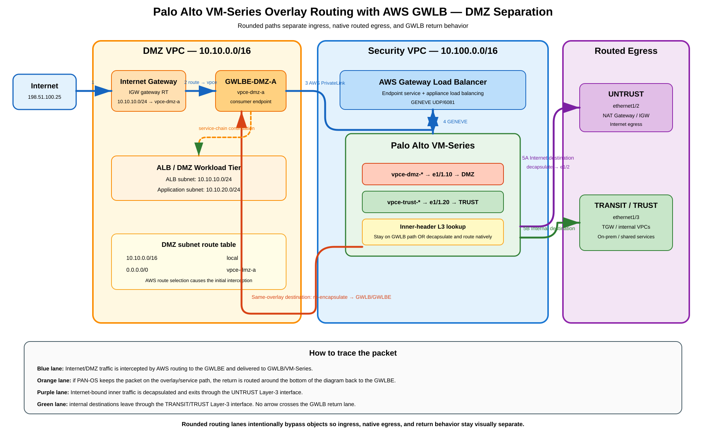
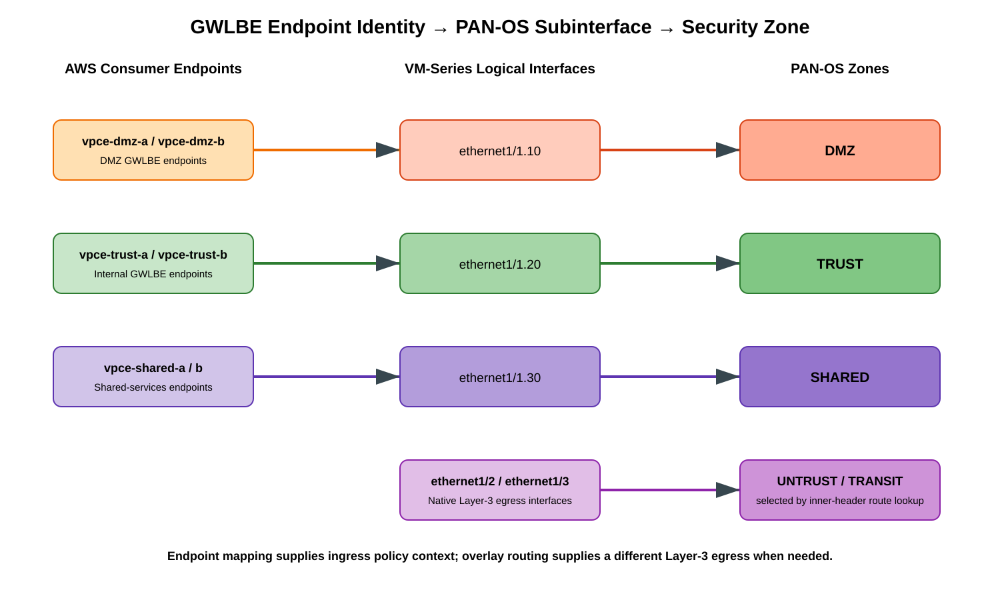
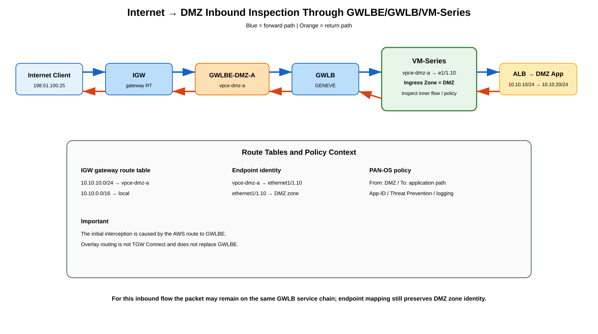
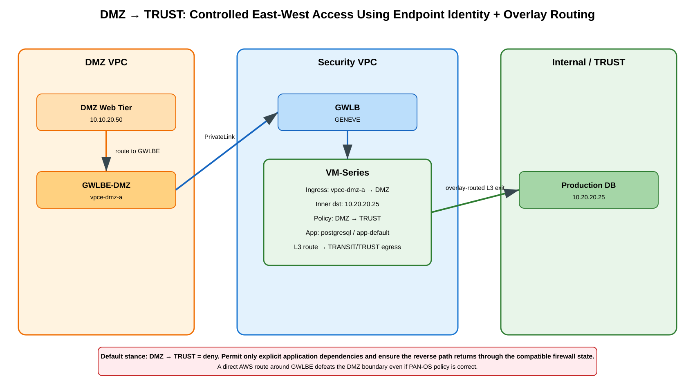
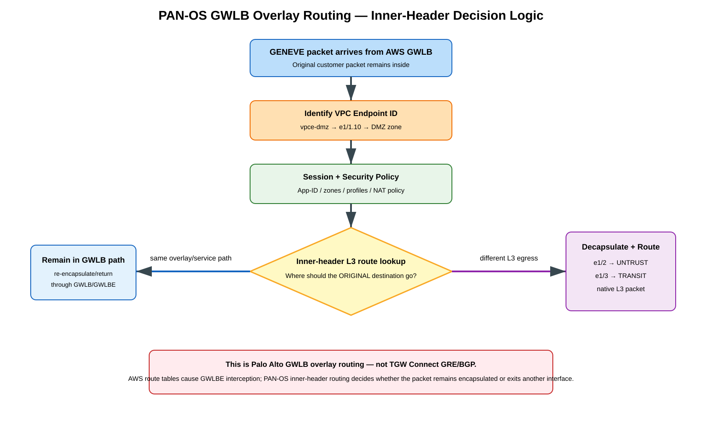

# Palo Alto VM-Series Overlay Routing with AWS GWLB — DMZ Separation, VPC Endpoint-to-Zone Mapping, and Detailed Traffic Flows

## Purpose

> **Scope note:** In this guide, *overlay routing* means the Palo Alto Networks VM-Series feature used with AWS GWLB/GWLBE and GENEVE inner-header routing. It does **not** mean AWS Transit Gateway Connect or Cloud WAN Connect.

This guide explains how to use **Palo Alto Networks VM-Series overlay routing with AWS Gateway Load Balancer (GWLB)** to keep **DMZ traffic separate from internal/trust traffic**.

This is the Palo Alto Networks **GWLB overlay-routing feature**. It is **not** AWS Transit Gateway Connect, GRE+BGP overlay routing, or Cloud WAN Connect.

Three different mechanisms work together:

1. **AWS route tables** select a **Gateway Load Balancer Endpoint (GWLBE)** as the traffic-interception next hop.
2. **GWLB** transports the original packet to VM-Series using **GENEVE**.
3. **PAN-OS overlay routing** can inspect the **inner packet header**, associate the ingress VPC endpoint with a firewall interface/subinterface and security zone, and perform a Layer-3 route lookup so the packet can leave through a different firewall interface when required.

The result can preserve the classic firewall model:

~~~text
                    INTERNET
                       |
                   [ UNTRUST ]
                       |
                +------v------+
                |  VM-Series  |
                |             |
       [ DMZ ]--|             |--[ TRUST ]
                +-------------+
~~~

even though DMZ and internal traffic initially enter the firewall through GWLB.

## Table of contents

1. What Palo Alto overlay routing means
2. DMZ design goal
3. Reference architecture
4. VPC endpoint to PAN-OS zone mapping
5. Recommended security zones and interfaces
6. Inbound Internet to DMZ packet flow
7. DMZ to Internet packet flow
8. DMZ to internal/trust packet flow
9. Internal/trust to DMZ packet flow
10. Why separate GWLBE endpoints matter
11. PAN-OS overlay-routing packet processing
12. PAN-OS configuration workflow
13. AWS route-table design
14. Security policy design
15. NAT placement
16. Symmetry and state
17. Multi-AZ design
18. DMZ isolation controls
19. Common failure modes
20. Verification and troubleshooting
21. Overlay routing versus normal GWLB mode
22. What this is not
23. Design checklist
24. References

---

## 1. What Palo Alto overlay routing means

Palo Alto Networks documents **overlay routing for VM-Series integrated with AWS GWLB** as the ability to use **two-zone policy** and allow packets to leave the VM-Series firewall through a different interface from the one on which they arrived.

With overlay routing enabled, PAN-OS performs a **Layer-3 route lookup on the original packet's inner header**.

~~~text
AWS route table
      |
      v
GWLBE
      |
      v
GWLB
      |
      | GENEVE
      v
VM-Series
      |
      | inspect inner src/dst
      | identify mapped endpoint/interface/zone
      | security policy
      | L3 route lookup
      |
      +---- same overlay path ----> return through GWLB/GWLBE
      |
      +---- different egress -----> decapsulate -> L3 interface
~~~

If the destination is reachable through the same overlay path, the session continues through the GWLB service chain.

If the destination should leave through another Layer-3 interface, PAN-OS can decapsulate the packet and forward it out that interface. Palo Alto specifically documents outbound routing toward an **Internet Gateway or NAT Gateway** as an overlay-routing use case.

Palo Alto documents overlay routing for **PAN-OS 10.0.5 or later**.

---

## 2. DMZ design goal

The design goal is to preserve distinct security contexts:

~~~text
UNTRUST
   |
   v
 DMZ
   |
   v
TRUST
~~~

The key Palo Alto feature is **VPC endpoint-to-interface association**.

Example:

~~~text
vpce-dmz-a
    |
    v
ethernet1/1.10
    |
    v
zone DMZ
~~~

~~~text
vpce-trust-a
    |
    v
ethernet1/1.20
    |
    v
zone TRUST
~~~

This creates the useful abstraction:

> **AWS GWLBE identity becomes PAN-OS logical interface/zone identity.**

That is what prevents DMZ-originated traffic from being treated as generic trust traffic.

---

## 3. Reference architecture

[Editable draw.io source](images/09-10-26-17-20_aws_overlay_routing_control_data_plane.drawio)

### How to read the overview diagram

The overview diagram is intentionally limited to **Internet ↔ DMZ** so the forward and reverse directions remain unambiguous:

- **Blue arrows, steps 1–5** = inbound/forward flow from Internet to the DMZ application.
- **Orange arrows, steps R1–R5** = reverse flow from the DMZ application back to the Internet client.
- Forward and reverse connectors use separate rounded routing lanes and do not share junctions.
- **DMZ → Internet native Layer-3 egress** is covered in its own flow section.
- **DMZ → TRUST/internal** is covered in a separate diagram and section.
- The main overview therefore does not branch into UNTRUST or TRANSIT paths, which avoids overlapping arrows and makes stateful symmetry easier to trace.

Example topology:

~~~text
                              INTERNET
                                  |
                                  v
                                IGW
                                  |
                       IGW gateway route table
                                  |
                    DMZ subnet -> GWLBE-DMZ
                                  |
                                  v
                        +-------------------+
                        |     DMZ VPC       |
                        |                   |
                        |  GWLBE-DMZ-A      |
                        +---------+---------+
                                  |
                           AWS PrivateLink
                                  |
                                  v
                    +---------------------------+
                    |       SECURITY VPC        |
                    |                           |
                    |          GWLB             |
                    |            |              |
                    |        VM-Series          |
                    |                           |
                    | DMZ VPCE -> e1/1.10 DMZ  |
                    | TRUST VPCE -> e1/1.20    |
                    |               TRUST       |
                    | e1/2 -> UNTRUST           |
                    | e1/3 -> TRANSIT           |
                    +------+-------------+------+
                           |             |
                           v             v
                     NAT/IGW        TGW/Internal
~~~

**Important:** the DMZ security identity comes from the **GWLBE/VPC endpoint mapping**. Overlay routing is what allows the firewall, after inspecting the inner packet, to select a **different egress interface**.

---

## 4. VPC endpoint to PAN-OS zone mapping

[Editable draw.io source](images/09-10-26-17-20_aws_overlay_endpoint_zone_mapping.drawio)

A possible mapping is:

| AWS endpoint | PAN-OS interface | Zone | Purpose |
|---|---|---|---|
| vpce-dmz-a | ethernet1/1.10 | DMZ | DMZ inspection |
| vpce-dmz-b | ethernet1/1.10 | DMZ | DMZ inspection in AZ-B |
| vpce-trust-a | ethernet1/1.20 | TRUST | Internal workload inspection |
| vpce-trust-b | ethernet1/1.20 | TRUST | Internal workload inspection in AZ-B |
| vpce-shared-a | ethernet1/1.30 | SHARED | Shared services |
| Routed ENI | ethernet1/2 | UNTRUST | Internet egress |
| Routed ENI | ethernet1/3 | TRANSIT | TGW/internal routed egress |

Palo Alto documents this association command:

~~~text
request plugins vm_series aws gwlb associate vpc-endpoint <vpce-id> interface <subinterface>
~~~

Example:

~~~text
request plugins vm_series aws gwlb associate vpc-endpoint vpce-02c4e6g8ha97h7e39 interface ethernet1/1.10
~~~

Verification:

~~~text
show plugins vm_series aws gwlb
~~~

---

## 5. Recommended security zones and interfaces

~~~text
ZONE          ROLE
--------------------------------------------------------
UNTRUST       Internet-facing routed interface
DMZ           Public-facing application tier
TRUST         Internal application/workload tier
SHARED        DNS, AD, PKI, logging, shared services
TRANSIT       TGW/on-prem routed path when used
MGMT          Firewall management only
~~~

Recommended interface concept:

~~~text
ethernet1/1
  |
  +-- ethernet1/1.10 -> DMZ
  |      associated with vpce-dmz-*
  |
  +-- ethernet1/1.20 -> TRUST
  |      associated with vpce-trust-*
  |
  +-- ethernet1/1.30 -> SHARED
         associated with vpce-shared-*

ethernet1/2 -> UNTRUST
ethernet1/3 -> TRANSIT
~~~

If DMZ and internal traffic use the same endpoint mapping and the same PAN-OS zone, you lose much of the value of the DMZ boundary.

---

## 6. Inbound Internet to DMZ packet flow

[Editable draw.io source](images/09-10-26-17-20_aws_overlay_inbound_dmz_flow.drawio)

Example:

~~~text
Client public IP:        198.51.100.25
DMZ VPC:                 10.10.0.0/16
ALB subnet:              10.10.10.0/24
DMZ app subnet:          10.10.20.0/24
DMZ GWLBE:               vpce-dmz-a
Mapped interface:        ethernet1/1.10
PAN-OS zone:             DMZ
~~~

Forward path:

~~~text
1 Internet client
      |
      v
2 Internet Gateway
      |
      | IGW gateway RT:
      | 10.10.10.0/24 -> vpce-dmz-a
      v
3 GWLBE-DMZ-A
      |
      v
4 GWLB
      |
      | GENEVE
      v
5 VM-Series
      |
      | endpoint = vpce-dmz-a
      | mapped subinterface = ethernet1/1.10
      | zone = DMZ
      |
      | security inspection
      v
6 GWLB/GWLBE return
      |
      v
7 ALB
      |
      v
8 DMZ application
~~~

For this flow, overlay routing does **not necessarily mean the packet exits another physical interface**. If the destination remains on the original GWLB service-chain path, PAN-OS continues normal GWLB forwarding.

The endpoint mapping is still valuable because the firewall knows that this session belongs to the **DMZ policy domain**.

### Forward versus reverse path in the overview

The diagram deliberately shows the two directions as separate numbered sequences:

~~~text
FORWARD / INBOUND — BLUE

Internet
  -> IGW
  -> GWLBE-DMZ
  -> GWLB
  -> VM-Series
  -> DMZ ALB / application
~~~

~~~text
REVERSE — ORANGE

DMZ application
  -> GWLBE-DMZ
  -> GWLB / same VM-Series session
  -> IGW
  -> Internet client
~~~

This separation is important for troubleshooting stateful inspection. Do not infer that the orange path is an alternate forward route; it is the reverse direction of the same inspected session.

---

## 7. DMZ to Internet packet flow

This is the strongest overlay-routing use case.

~~~text
DMZ server 10.10.20.50
       |
       | default route -> GWLBE-DMZ
       v
GWLBE-DMZ
       |
       v
GWLB
       |
       | GENEVE
       v
VM-Series
       |
       | vpce-dmz -> DMZ zone
       | inspect inner destination
       |
       | L3 route:
       | 0.0.0.0/0 -> ethernet1/2
       v
PAN-OS decapsulates
       |
       v
ethernet1/2 / UNTRUST
       |
       v
NAT Gateway or IGW path
       |
       v
Internet
~~~

Return:

~~~text
Internet
   |
NAT/IGW
   |
UNTRUST / ethernet1/2
   |
VM-Series session lookup
   |
PAN-OS reapplies required encapsulation
   |
GWLB
   |
GWLBE-DMZ
   |
DMZ server
~~~

Palo Alto explicitly documents that an outbound packet can be decapsulated and forwarded toward an IGW or NAT Gateway and that the firewall reapplies the encapsulation when return traffic arrives.

---

## 8. DMZ to internal/trust packet flow

[Editable draw.io source](images/09-10-26-17-20_aws_overlay_dmz_trust_flow.drawio)

Example:

~~~text
DMZ web server:  10.10.20.50
Internal DB:     10.20.20.25
DMZ endpoint:    vpce-dmz-a -> DMZ
TRUST endpoint:  vpce-trust-a -> TRUST
~~~

Concept:

~~~text
DMZ web server
10.10.20.50
      |
      v
GWLBE-DMZ
      |
GWLB
      |
VM-Series
      |
source zone = DMZ
destination route = internal/TGW/appropriate trust path
      |
security policy:
DMZ -> TRUST
application = postgresql
service = application-default
      |
      v
Internal DB
10.20.20.25
~~~

Recommended policy:

~~~text
Name: DMZ-Web-to-DB
From: DMZ
To: TRUST
Source: dmz-web-tier
Destination: prod-db-tier
Application: postgresql
Service: application-default
Action: allow
Security Profiles: strict
Log at Session End: yes
~~~

Then deny all other DMZ-to-TRUST flows.

Do not use a broad DMZ-to-TRUST allow rule.

---

## 9. Internal/trust to DMZ packet flow

Internal traffic should enter the firewall using a **TRUST-associated GWLBE**, not the DMZ endpoint.

~~~text
Internal client
10.20.10.25
      |
      | route -> GWLBE-TRUST
      v
GWLBE-TRUST
      |
GWLB
      |
VM-Series
      |
vpce-trust -> ethernet1/1.20
      |
source zone = TRUST
destination zone/path = DMZ
      |
security policy
      |
DMZ application
~~~

This makes policy directional:

~~~text
TRUST -> DMZ
is not the same policy as
DMZ -> TRUST
~~~

which is a basic requirement of a real DMZ design.

---

## 10. Why separate GWLBE endpoints matter

A GWLBE is not merely transport in this Palo Alto design.

The endpoint ID can provide policy context:

~~~text
                        VM-Series
                            |
          +-----------------+-----------------+
          |                                   |
     vpce-dmz-a                         vpce-trust-a
          |                                   |
  ethernet1/1.10                       ethernet1/1.20
          |                                   |
         DMZ                                 TRUST
~~~

Without endpoint association:

~~~text
many GWLB flows -> generic interface -> generic zone
~~~

With endpoint association:

~~~text
DMZ endpoint     -> DMZ zone
TRUST endpoint   -> TRUST zone
SHARED endpoint  -> SHARED zone
~~~

Palo Alto describes this as a way to use different subinterfaces/security zones for differentiated policy enforcement.

---

## 11. PAN-OS overlay-routing packet processing

[Editable draw.io source](images/09-10-26-17-20_aws_overlay_route_selection_failover.drawio)

~~~text
GENEVE packet from GWLB
          |
          v
Identify GWLBE/VPC endpoint
          |
          v
Map endpoint -> PAN-OS subinterface -> ingress zone
          |
          v
Read inner packet header
          |
          v
Session/security policy processing
          |
          v
L3 lookup of inner destination
          |
          +---------------------------+
          |                           |
          v                           v
Same overlay destination        Different L3 egress
          |                           |
Return through GWLB             Decapsulate
          |                           |
          v                           v
GWLBE/service path        UNTRUST / TRANSIT / other
~~~

This is why the Palo Alto term **overlay routing** must not be interpreted as TGW Connect BGP routing.

---

## 12. PAN-OS configuration workflow

### Step 1 — integrate VM-Series with GWLB

Create GWLB, its endpoint service, GWLBE consumers, and VM-Series targets.

### Step 2 — configure subinterfaces and zones

Example:

~~~text
ethernet1/1.10 -> DMZ
ethernet1/1.20 -> TRUST
ethernet1/1.30 -> SHARED
~~~

Palo Alto's documented workflow uses Layer 3 subinterfaces, a virtual router, a security zone, and DHCP Client addressing.

### Step 3 — associate VPC endpoints

~~~text
request plugins vm_series aws gwlb associate vpc-endpoint vpce-DMZ-A interface ethernet1/1.10

request plugins vm_series aws gwlb associate vpc-endpoint vpce-TRUST-A interface ethernet1/1.20
~~~

### Step 4 — enable overlay routing

~~~text
request plugins vm_series aws gwlb overlay-routing enable yes
~~~

Palo Alto also documents bootstrap plugin operation commands such as:

~~~text
aws-gwlb-inspect:enable
aws-gwlb-associate-vpce:<vpce-id>@ethernet<subinterface>
aws-gwlb-overlay-routing:enable
~~~

### Step 5 — follow Palo Alto trust-interface routing guidance

Palo Alto instructs administrators to disable automatic creation of the DHCP-provided default route on the trust/ingress interface used by the overlay-routing design.

### Step 6 — configure L3 egress

Example:

~~~text
ethernet1/2
Type: Layer3
Zone: UNTRUST
Virtual Router: default
~~~

Then install the intended default or internal route.

---

## 13. AWS route-table design

AWS controls **which traffic first enters GWLBE**.

### IGW gateway route table

Example inbound DMZ steering:

~~~text
Destination       Target
--------------------------------
10.10.10.0/24     vpce-dmz-a
10.10.0.0/16      local
~~~

AWS supports GWLBE as a target in an IGW-associated gateway route table.

### DMZ application subnet route table

Example outbound inspection:

~~~text
Destination       Target
--------------------------------
10.10.0.0/16      local
0.0.0.0/0         vpce-dmz-a
~~~

### GWLBE subnet route table

In a standard AWS GWLB ingress/egress pattern:

~~~text
Destination       Target
--------------------------------
10.10.0.0/16      local
0.0.0.0/0         igw-xxxx
~~~

Palo Alto overlay-routed egress changes what the **firewall itself** can do after receiving the GENEVE packet, but the initial interception still comes from AWS route-table steering to the endpoint.

---

## 14. Security policy design

Recommended conceptual policy matrix:

| From | To | Policy |
|---|---|---|
| UNTRUST | DMZ | Only published applications |
| DMZ | UNTRUST | Restricted outbound access |
| DMZ | TRUST | Explicit application dependencies only |
| TRUST | DMZ | Approved management/user/application access |
| DMZ | SHARED | DNS/NTP/PKI/logging only |
| UNTRUST | TRUST | Deny unless explicitly required |
| DMZ | MGMT | Deny |

Examples:

~~~text
UNTRUST -> DMZ
Destination: dmz-public-app
Application: ssl
Service: application-default
Action: allow
Threat Prevention: strict
~~~

~~~text
DMZ -> TRUST
Source: dmz-web-tier
Destination: prod-db-tier
Application: postgresql
Service: application-default
Action: allow
~~~

Every other DMZ-to-TRUST flow should hit a deny rule.

---

## 15. NAT placement

NAT is separate from endpoint-based inspection.

Possible DMZ egress:

~~~text
DMZ
 -> GWLBE
 -> GWLB
 -> VM-Series overlay route
 -> UNTRUST
 -> NAT Gateway
 -> IGW
~~~

or a vendor-supported design in which VM-Series performs SNAT before public egress.

NAT placement changes:

- source identity visible in logs;
- return path;
- public IP ownership;
- scale;
- failure behavior.

For Internet ingress through ALB, remember that ALB is a Layer-7 proxy, so that architecture is not equivalent to a classic firewall DNAT design.

---

## 16. Symmetry and state

GWLB provides flow affinity to an appliance, but the full design still needs valid stateful return routing.

~~~text
DMZ -> GWLBE -> GWLB -> FW-A -> UNTRUST -> Internet
~~~

Return must be compatible with:

~~~text
Internet -> FW-A -> encapsulation/GWLB return -> GWLBE -> DMZ
~~~

If failover sends the reverse session to another VM-Series without synchronized state, an established flow can reset.

GWLB target health is not the same thing as PAN-OS session synchronization.

---

## 17. Multi-AZ design

Use zonal endpoints in each participating AZ.

~~~text
AZ-A
  DMZ subnet A
  GWLBE-DMZ-A

AZ-B
  DMZ subnet B
  GWLBE-DMZ-B
~~~

Maintain consistent mappings:

~~~text
vpce-dmz-a   -> DMZ
vpce-dmz-b   -> DMZ

vpce-trust-a -> TRUST
vpce-trust-b -> TRUST
~~~

The endpoint IDs differ, but their logical firewall zone can be the same.

---

## 18. DMZ isolation controls

Do not rely only on PAN-OS zones.

Also enforce:

- separate DMZ and internal route tables;
- dedicated GWLBE endpoints;
- security groups;
- NACLs where useful;
- restricted TGW route propagation/association;
- explicit DMZ-to-internal routes only where required;
- no accidental direct peering/bypass path;
- separate load-balancer and application subnets;
- least-privilege IAM and management access.

The design principle is:

> **AWS routing prevents bypass; GWLBE identity provides policy context; PAN-OS enforces the zone boundary.**

---

## 19. Common failure modes

### DMZ traffic shows as TRUST

Check:

- wrong endpoint association;
- DMZ and TRUST endpoints mapped to same subinterface;
- wrong zone assigned to subinterface.

### DMZ bypasses VM-Series

Check:

- DMZ subnet route;
- IGW gateway route;
- more-specific direct route;
- route-table association;
- endpoint availability.

### Firewall sees packet but Internet egress fails

Check:

- overlay routing enabled;
- L3 default route;
- egress interface/zone;
- trust/untrust subnet design;
- automatic DHCP default route setting;
- NAT/IGW route.

### DMZ-to-TRUST only works one direction

Check:

- reverse routing;
- state owner;
- security policy in reverse direction;
- alternate direct route bypassing GWLB.

---

## 20. Verification and troubleshooting

### Verify GWLB plugin and endpoint mappings

~~~text
show plugins vm_series aws gwlb
~~~

Expected concept:

~~~text
GWLB enabled:     True
Overlay Routing:  True

VPC endpoint        Interface
----------------------------------
vpce-dmz-a          ethernet1/1.10
vpce-trust-a        ethernet1/1.20
~~~

### Verify PAN-OS route selection

~~~text
show routing route
~~~

Confirm Internet or internal destinations resolve to the intended routed interface.

### Verify session classification

~~~text
show session all filter source <ip>
~~~

Check:

- ingress interface;
- ingress zone;
- egress interface;
- egress zone;
- NAT;
- application;
- state.

### Verify AWS

Inspect:

- IGW gateway route table;
- DMZ subnet route table;
- GWLBE subnet route table;
- TGW routes if internal routing uses TGW;
- GWLBE state;
- GWLB target health.

### Packet capture

Capture on both:

- GWLB-facing interface/subinterface;
- routed egress interface.

You want to prove:

~~~text
GENEVE ingress
   ->
endpoint/zone identity
   ->
inner-header L3 lookup
   ->
native routed egress
~~~

---

## 21. Overlay routing versus normal GWLB mode

Normal GWLB service insertion:

~~~text
GWLBE
  |
GWLB
  |
VM-Series
  |
GWLB
  |
GWLBE
~~~

Palo Alto overlay routing:

~~~text
GWLBE
  |
GWLB
  |
VM-Series
  |
inner-header L3 lookup
  |
  +-> same GWLB path
  |
  +-> different L3 interface
        |
        +-> UNTRUST
        +-> TRANSIT/TRUST path
~~~

The ability to use **two-zone policy plus another egress interface** is what makes this especially useful for DMZ separation.

---

## 22. What this is not

This is not:

~~~text
AWS Transit Gateway Connect
   GRE + BGP
~~~

and not:

~~~text
AWS Cloud WAN Connect
   GRE/native BGP
~~~

Those services connect BGP-speaking routers/SD-WAN appliances to AWS transit fabrics.

This article is about:

~~~text
AWS GWLBE
   +
AWS GWLB
   +
GENEVE
   +
Palo Alto endpoint-to-interface mapping
   +
PAN-OS inner-header L3 routing
~~~

No TGW Connect BGP overlay is required.

---

## 23. Design checklist

- [ ] Dedicated DMZ GWLBE endpoints.
- [ ] Dedicated TRUST GWLBE endpoints where endpoint-based zone distinction is needed.
- [ ] Endpoint IDs mapped to correct VM-Series subinterfaces.
- [ ] DMZ and TRUST use different security zones.
- [ ] PAN-OS overlay routing enabled.
- [ ] PAN-OS 10.0.5 or later.
- [ ] Separate trust and untrust subnets as required by Palo Alto guidance.
- [ ] DHCP-created default route disabled where Palo Alto specifies.
- [ ] L3 UNTRUST/TRANSIT egress interfaces correctly routed.
- [ ] IGW gateway route sends inbound DMZ traffic to DMZ GWLBE.
- [ ] DMZ subnet routes required outbound traffic to DMZ GWLBE.
- [ ] No more-specific AWS route bypasses inspection.
- [ ] DMZ-to-TRUST policy is least privilege.
- [ ] Return path preserves firewall state.
- [ ] Multi-AZ endpoint mappings are consistent.
- [ ] GWLB targets healthy.
- [ ] PAN-OS session table proves expected ingress/egress zones.
- [ ] VPC/TGW flow logs prove no bypass.

---

## 24. References

### Palo Alto Networks

- Enable Overlay Routing for the VM-Series on AWS:
  https://docs.paloaltonetworks.com/vm-series/deployment/public-cloud/set-up-the-vm-series-firewall-on-aws/vm-series-integration-with-gateway-load-balancer/enable-overlay-routing-for-the-vm-series-on-aws

- Associate a VPC Endpoint with a VM-Series Interface:
  https://docs.paloaltonetworks.com/vm-series/deployment/public-cloud/set-up-the-vm-series-firewall-on-aws/vm-series-integration-with-gateway-load-balancer/associate-a-vpc-endpoint-with-a-vm-series-interface

- VM-Series Integration with an AWS Gateway Load Balancer:
  https://docs.paloaltonetworks.com/vm-series/deployment/public-cloud/set-up-the-vm-series-firewall-on-aws/vm-series-integration-with-gateway-load-balancer

- VM-Series bootstrap configuration and GWLB plugin commands:
  https://docs.paloaltonetworks.com/vm-series/getting-started/bootstrap-the-vm-series-firewall/create-bootstrap-configuration-files

### AWS

- Access virtual appliances through AWS PrivateLink:
  https://docs.aws.amazon.com/vpc/latest/privatelink/vpce-gateway-load-balancer.html

- Gateway Load Balancer overview:
  https://docs.aws.amazon.com/elasticloadbalancing/latest/gateway/introduction.html

- Gateway Load Balancer getting started and routing:
  https://docs.aws.amazon.com/elasticloadbalancing/latest/gateway/getting-started.html

- VPC gateway route tables:
  https://docs.aws.amazon.com/vpc/latest/userguide/gateway-route-tables.html

### Related knowledgebase articles

- [AWS Firewall Insertion Summary](09-07-26_AWS_Firewall_Insertion_Summary.md)
- [Distributed GWLBE with a Centralized Third-Party Firewall Fleet](09-06-26-15-23_Distributed_GWLBE_Centralized_Third_Party_Firewall_Fleet_Deep_Dive.md)
- [AWS ALB/NLB + Inline Firewall Endpoint — GWLB/GWLBE Deep Dive](09-06-26-16-42_AWS_ALB_NLB_Inline_Firewall_Endpoint_GWLBE_Deep_Dive.md)
