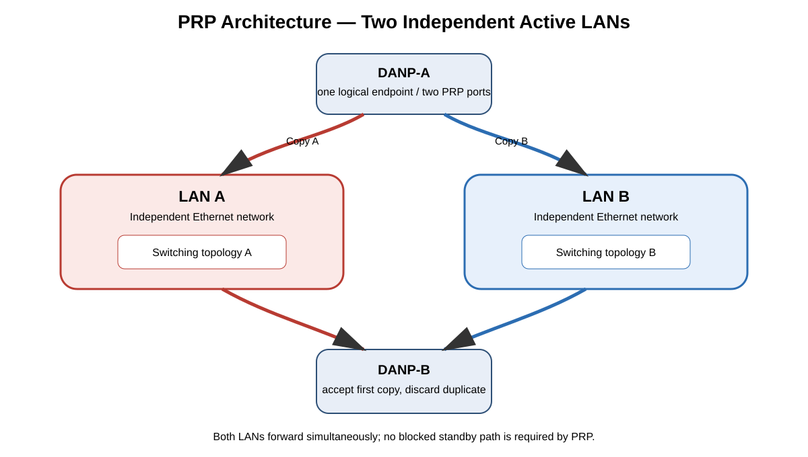
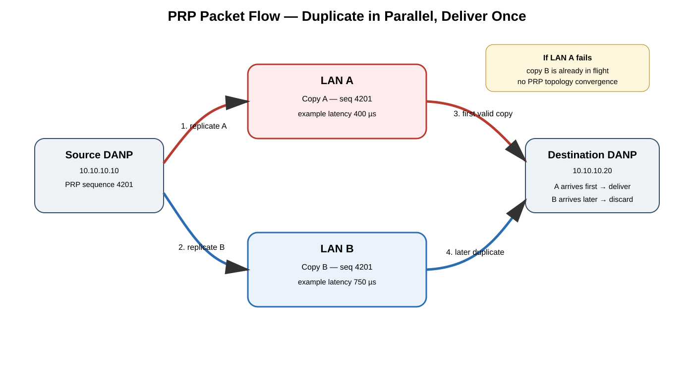
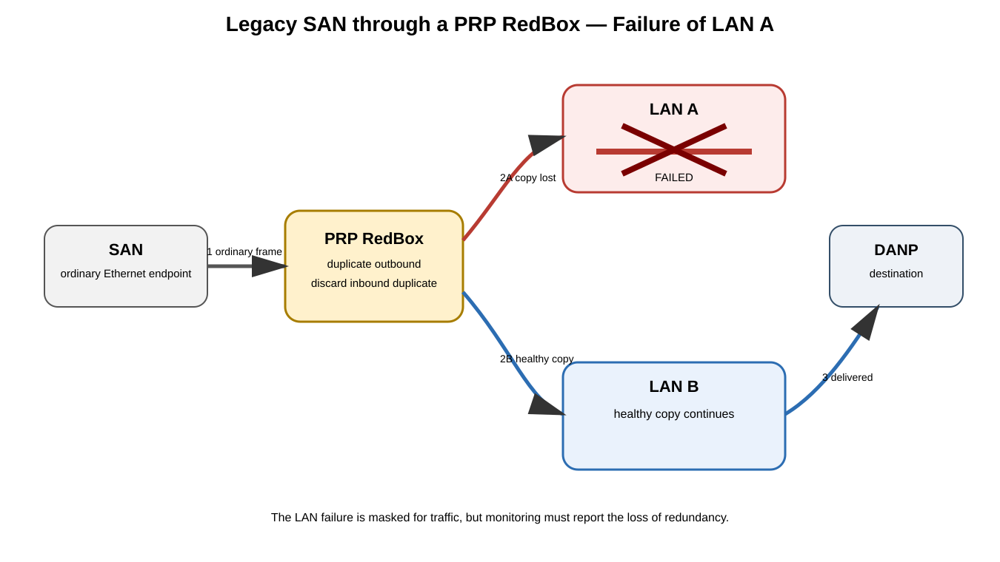

# Parallel Redundancy Protocol (PRP) — IEC 62439-3 Comprehensive Study Guide

## Source URLs

- https://webstore.iec.ch/en/publication/64423 — IEC 62439-3:2021, Edition 4.0
- https://webstore.iec.ch/en/publication/76473 — IEC 62439-3:2021/COR1:2023
- https://www.cisco.com/c/en/us/td/docs/switches/lan/cisco_ie9300/software/17_7/redundancy-protocol-config-ie93xx/m-prp.html
- https://www.cisco.com/c/en/us/td/docs/switches/lan/industrial/software/configuration/guide/b_prp_ie4k_5k.html
- https://cache.industry.siemens.com/dl/files/945/78790945/att_1297003/v3/78790945_RNA_DOC_V3_0_en.pdf

> **Source information:** PRP is standardized by IEC 62439-3 and is designed to provide seamless switchover with zero recovery time by transmitting duplicated information over two independent LANs.
>
> **Additional explanation:** PRP achieves this by moving redundancy into the end-node/RedBox adaptation layer instead of waiting for the Ethernet topology to reconverge.
>
> **Reasonable inference:** In a well-designed PRP deployment, application interruption caused solely by one LAN path failing should normally be avoided, but availability still depends on endpoints, RedBoxes, power, shared physical risks, and application behavior.

---

## Table of Contents

1. [What PRP Is](#1-what-prp-is)
2. [Why PRP Exists](#2-why-prp-exists)
3. [Core Architecture and Terminology](#3-core-architecture-and-terminology)
4. [PRP Frame Processing](#4-prp-frame-processing)
5. [End-to-End Packet Flow](#5-end-to-end-packet-flow)
6. [Duplicate Detection and Discard](#6-duplicate-detection-and-discard)
7. [Supervision Frames and Node Tables](#7-supervision-frames-and-node-tables)
8. [LAN A and LAN B Design](#8-lan-a-and-lan-b-design)
9. [DANP, SAN, VDAN, and RedBox Behavior](#9-danp-san-vdan-and-redbox-behavior)
10. [Failure Scenarios](#10-failure-scenarios)
11. [PRP vs HSR vs RSTP/MRP/REP](#11-prp-vs-hsr-vs-rstpmrprep)
12. [PRP and Precision Time Protocol](#12-prp-and-precision-time-protocol)
13. [Cisco Industrial Ethernet Configuration Example](#13-cisco-industrial-ethernet-configuration-example)
14. [Verification](#14-verification)
15. [Troubleshooting by Symptom](#15-troubleshooting-by-symptom)
16. [Design Caveats and Common Mistakes](#16-design-caveats-and-common-mistakes)
17. [Study Notes / Exam Memory Model](#17-study-notes--exam-memory-model)
18. [Sources](#18-sources)

---

# 1. What PRP Is

**Parallel Redundancy Protocol (PRP)** is a Layer-2 high-availability protocol defined by **IEC 62439-3**. Its central goal is unusually strict: a single failure of a network path should require **no recovery or reconvergence interval** from the application point of view.

A PRP-capable endpoint sends the same Ethernet payload through two logically and physically independent networks:

- **LAN A**
- **LAN B**

The destination receives two copies. It accepts the first acceptable copy and discards the later duplicate.

This is fundamentally different from a topology-recovery protocol. With Rapid Spanning Tree Protocol (RSTP), Media Redundancy Protocol (MRP), Resilient Ethernet Protocol (REP), or similar technologies, the network detects the failure and then changes forwarding state. PRP keeps both paths active continuously, so there is normally nothing to unblock or recompute when one path fails.



[Editable draw.io source](images/09-11-26-17-51_prp_architecture.drawio)

**What this image shows:** A doubly attached PRP node connected simultaneously to two independent Ethernet LANs and a receiving PRP node connected to both.

**What matters:** Both copies exist at the same time. The standby path is not idle.

**What to verify:** LAN A and LAN B are genuinely independent enough that one physical or logical fault cannot remove both copies.

---

# 2. Why PRP Exists

Industrial automation, electrical substations, protection systems, process control, transportation, and similar operational-technology environments can have traffic whose interruption budget is much smaller than ordinary enterprise Ethernet convergence.

PRP solves the problem by **duplication rather than convergence**.

Traditional model:

```text
Failure
  -> detection
  -> topology recalculation
  -> blocked path opened / route changed
  -> forwarding resumes
```

PRP model:

```text
Normal:
  frame copy A -> LAN A -> destination
  frame copy B -> LAN B -> destination

Failure of LAN A:
  copy A is lost
  copy B was already in flight
  destination processes copy B
```

There is no requirement to wait for a spanning-tree state transition before a usable copy can arrive.

## Availability consequence

PRP protects against failures that affect only one redundant path. It does **not** magically protect against every failure. Examples that can still cause interruption include:

- endpoint CPU/software failure;
- both endpoint NICs sharing a failed internal component;
- common power failure;
- both LANs crossing the same failed fiber tray or switch;
- incorrect VLAN provisioning on both paths;
- an upstream non-PRP dependency;
- a RedBox failure when singly attached nodes rely on only one RedBox;
- application or transport-layer failures unrelated to the Ethernet path.

---

# 3. Core Architecture and Terminology

## 3.1 DANP — Doubly Attached Node implementing PRP

A **DANP** is a node that natively participates in PRP and connects to both LAN A and LAN B.

The key concept is that the upper protocol stack should see one logical communications endpoint while the PRP adaptation function handles duplication and elimination below it.

Typical DANP responsibilities:

1. receive one frame from the upper stack;
2. create the two PRP transmissions;
3. send one through LAN A and one through LAN B;
4. receive duplicates from remote PRP nodes;
5. identify matching copies;
6. pass only one copy upward.

## 3.2 SAN — Singly Attached Node

A **SAN** is an ordinary Ethernet endpoint attached to only one LAN. It does not natively perform PRP duplicate transmission or duplicate discard.

A SAN can coexist in a PRP environment, but its resiliency is limited by how it is connected.

## 3.3 RedBox — Redundancy Box

A **RedBox** integrates non-PRP equipment into a PRP domain. From the PRP side, it can act as the redundancy-aware participant that duplicates traffic from attached SANs and suppresses duplicates returning toward those SANs.

## 3.4 VDAN — Virtual Doubly Attached Node

When a SAN is represented through a RedBox, implementations may track it as a **VDAN**. This lets other PRP participants learn that a non-PRP MAC is reachable through the redundancy function.

## 3.5 LAN A / LAN B

PRP's two LANs are intended to be separate parallel networks. They can each have their own Ethernet topology; the critical rule is that they remain separate enough to provide real fault independence.

---

# 4. PRP Frame Processing

PRP is transparent to upper-layer protocols because the redundancy behavior occurs at Layer 2.

A simplified transmission path is:

```text
Application
  -> TCP/UDP/other payload
  -> IP
  -> Ethernet frame
  -> PRP adaptation
      -> copy A for LAN A
      -> copy B for LAN B
```

The copies carry enough PRP information for the receiver to recognize that they are two instances of the same original transmission.

## 4.1 Redundancy Control Trailer (RCT)

Classic PRP operation appends a **Redundancy Control Trailer (RCT)** to the Ethernet frame. The trailer provides information used for duplicate recognition and LAN identification.

Conceptually:

```text
+----------------------+------------------+-------------------+
| Ethernet frame data  | PRP information  | Ethernet FCS      |
+----------------------+------------------+-------------------+
```

The important operational concepts are:

- a **sequence number** associates the A and B copies;
- a **LAN identifier** indicates which LAN carried the copy;
- length/suffix information helps the receiver validate PRP formatting.

The exact wire encoding is defined by IEC 62439-3; do not substitute guessed field sizes or bit positions for the normative standard when doing protocol-level implementation work.

## 4.2 Same upper-layer identity

PRP is designed so that applications and Layer-3 protocols do not need two IP sessions merely because two Ethernet paths exist. The redundancy layer hides the dual transmission from the upper stack.

---

# 5. End-to-End Packet Flow

Consider:

- DANP-A MAC: `00:11:22:33:44:55`
- DANP-B MAC: `00:11:22:33:44:66`
- source IP: `10.10.10.10`
- destination IP: `10.10.10.20`
- LAN A and LAN B both provide Layer-2 reachability.



[Editable draw.io source](images/09-11-26-17-51_prp_packet_flow.drawio)

**What this image shows:** The same logical Ethernet transmission leaving the source through both PRP ports and arriving independently at the destination.

**What matters:** Whichever valid copy arrives first is delivered upward. The later duplicate is discarded.

**What to verify:** Sequence/duplicate counters are incrementing as expected and both LAN paths carry traffic during normal operation.

## 5.1 Source processing

1. The application generates data.
2. The normal protocol stack constructs the Ethernet frame.
3. The PRP adaptation layer assigns redundancy information, including a sequence identity.
4. Copy A is emitted toward LAN A.
5. Copy B is emitted toward LAN B.

The two copies represent the same higher-layer packet.

## 5.2 Transit through the LANs

LAN A and LAN B forward independently. Their latency does not need to be identical.

For example:

```text
LAN A latency = 400 microseconds
LAN B latency = 750 microseconds
```

The receiver can accept the A copy at ~400 µs and discard B when it appears later.

If LAN A fails:

```text
LAN A copy = lost
LAN B copy = arrives at ~750 microseconds
```

The receiver still receives a valid copy without waiting for a topology recovery operation.

## 5.3 Destination processing

The destination's PRP logic:

1. receives a copy;
2. checks whether an equivalent sequence has already been accepted;
3. if not, passes it to the upper protocol stack;
4. when the counterpart arrives, discards it as a duplicate.

---

# 6. Duplicate Detection and Discard

Duplicate elimination is the core of PRP.

Without duplicate elimination, TCP/IP hosts would see two copies of every Ethernet frame, causing unnecessary duplicate packets and potentially harmful behavior in non-idempotent industrial protocols.

A conceptual duplicate table might contain:

| Source MAC | Sequence | First LAN | State |
|---|---:|---|---|
| 00:11:22:33:44:55 | 4201 | A | delivered |
| 00:11:22:33:44:55 | 4202 | B | delivered |

When another frame arrives from the same source with the same redundancy sequence, the PRP layer can identify it as the duplicate.

## Important distinction: first arrival is not permanently “primary”

LAN A is not necessarily preferred for application traffic. A frame can arrive first on A for one transmission and first on B for another. The protocol is based on **first valid arrival**, not an active/standby forwarding state.

This makes PRP fundamentally **active/active at the transmission level**.

---

# 7. Supervision Frames and Node Tables

PRP implementations use supervision traffic to help nodes discover and monitor PRP participants and their connectivity.

Cisco industrial-switch documentation describes PRP node tables, VDAN tables, supervision frames, and LAN-A/LAN-B failure detection behavior.

Operationally, supervision frames help answer questions such as:

- Is a particular PRP node visible through LAN A?
- Is it visible through LAN B?
- Is a node behind a RedBox?
- Has one side of the redundant connectivity disappeared?
- Are unexpected singly attached devices appearing?

## Node table

A node table can track redundancy-aware devices and their reachability characteristics.

## VDAN table

A VDAN table can track non-PRP endpoints represented through a RedBox.

## Why this matters

Application traffic can continue even if one LAN is broken, which is good for availability but can hide a latent failure. Supervision and counters expose the fact that the design has degraded from redundant operation to single-path operation.

A PRP network should therefore alert on **loss of redundancy even when application traffic still works**.

---

# 8. LAN A and LAN B Design

The most important physical design rule is independence.

## 8.1 Good separation

Prefer separate:

- switches;
- switch stacks/chassis where feasible;
- power feeds;
- fiber paths;
- patch panels;
- conduits;
- line cards;
- management failure domains.

## 8.2 Hidden common-mode failure

This design is poor:

```text
DANP
 |A                 |B
 +------ Switch 1 ---+
```

Two NICs connected to the same switch are not equivalent to two independent PRP LANs.

Likewise, two access switches that share a single upstream aggregation switch may still have a large common failure domain.

## 8.3 VLANs

LAN A and LAN B can use VLANs internally, but do not turn the pair into one bridged Layer-2 domain. The separation between the LANs is part of the redundancy architecture.

## 8.4 Bandwidth

Because the source transmits duplicate data, the network must carry roughly twice the replicated endpoint traffic across the two infrastructures considered together.

Each individual LAN should be capable of carrying the required traffic when the other LAN is unavailable.

---

# 9. DANP, SAN, VDAN, and RedBox Behavior



[Editable draw.io source](images/09-11-26-17-51_prp_redbox_failure.drawio)

**What this image shows:** A non-PRP SAN connected through a RedBox to both PRP LANs, plus the degraded state when LAN A fails.

**What matters:** The RedBox performs the PRP-aware duplication/elimination function on behalf of the SAN.

**What to verify:** The RedBox itself is not an unprotected single point of failure for a critical legacy endpoint.

## 9.1 SAN attached directly to LAN A only

A SAN on LAN A can communicate with nodes reachable on LAN A, but it does not receive PRP protection from a LAN-A failure.

## 9.2 SAN behind a RedBox

For SAN -> PRP destination:

1. SAN sends one ordinary Ethernet frame to RedBox.
2. RedBox performs PRP adaptation.
3. RedBox sends a copy on LAN A.
4. RedBox sends a copy on LAN B.
5. destination DANP eliminates the later duplicate.

For PRP source -> SAN:

1. DANP sends copies through A and B.
2. RedBox receives both.
3. RedBox passes one ordinary Ethernet frame to the SAN.
4. duplicate is discarded.

## 9.3 RedBox redundancy

If one critical SAN depends on exactly one RedBox, the network paths may be redundant while the RedBox remains a single point of failure.

High-availability designs therefore need to consider:

- redundant RedBoxes where supported;
- dual-homed legacy systems;
- independent power;
- device-specific failover semantics.

---

# 10. Failure Scenarios

## 10.1 Single access link on LAN A fails

```text
A copy -> lost
B copy -> delivered
Recovery time -> no topology recovery required by PRP
```

The important event is **loss of redundancy**, not loss of service.

## 10.2 Entire LAN A switch fails

If LAN B is independent:

```text
LAN A copies -> unavailable
LAN B copies -> continue
```

Again, supervision should report degraded redundancy.

## 10.3 LAN A becomes slower but remains operational

If B arrives first, B becomes the accepted copy for affected transmissions. A's later copy is discarded.

This is a useful mental model: PRP naturally tolerates differing path delays.

## 10.4 One LAN drops selected multicast traffic

This can be harder to notice because the other LAN can mask the problem. Examine per-LAN receive counters, supervision state, VLAN membership, multicast filtering, and storm-control behavior.

## 10.5 Both LANs share a failed upstream device

PRP cannot protect against a common component that removes both parallel paths.

## 10.6 Endpoint loses its PRP function

If a DANP's PRP adaptation process fails or both local interfaces fail, the redundancy of the external LANs cannot save it.

---

# 11. PRP vs HSR vs RSTP/MRP/REP

IEC 62439-3 standardizes both **PRP** and **High-availability Seamless Redundancy (HSR)**.

| Characteristic | PRP | HSR | RSTP / MRP / REP family |
|---|---|---|---|
| Basic method | Duplicate across 2 LANs | Duplicate in 2 directions around ring/mesh | Reconfigure forwarding topology |
| Recovery model | No switchover needed for single path failure | No switchover needed for single path failure | Detect + reconverge |
| Separate LANs | Yes | Typically one redundant ring/mesh | Depends |
| End-node awareness | PRP node or RedBox | HSR-aware node or RedBox | Usually endpoints unaware |
| Duplicate elimination | Yes | Yes | Not normally |
| Infrastructure cost | Higher because networks are duplicated | Lower physical duplication than PRP in many cases | Varies |
| Typical attraction | Maximum path independence | Seamless redundancy with ring-style topology | General enterprise/industrial redundancy |

Siemens documentation summarizes the practical difference well: PRP uses two physically separated networks, while HSR transmits duplicated frames in both directions of a ring.

---

# 12. PRP and Precision Time Protocol

**Precision Time Protocol (PTP)** is especially important in industrial and power environments.

Do not assume ordinary PRP duplication rules apply unchanged to every PTP frame.

Cisco documentation explicitly notes special handling for **PTP over PRP**. It explains that some PTP traffic and transparent-clock behavior create complications for the PRP RCT and duplicate/discard processing. Supported implementations therefore use specific IEC 62439-3 behavior and platform-dependent clock/profile support.

Before enabling PTP over PRP, verify:

- switch model;
- software release;
- PTP profile;
- boundary-clock (BC) or transparent-clock (TC) mode;
- peer-to-peer (P2P) versus end-to-end (E2E) delay mechanism;
- whether the exact combination is supported on both PRP LANs.

Do not assume that “PTP works on Ethernet” implies that every PTP/PRP combination is supported.

---

# 13. Cisco Industrial Ethernet Configuration Example

> **Important:** Syntax and feature availability vary by Cisco Industrial Ethernet platform and IOS/IOS XE release. Use the configuration guide for the exact model and release.

Cisco documents PRP as a **channel/group** consisting of the two participating interfaces.

A representative configuration pattern from Cisco Industrial Ethernet documentation is:

```cli
configure terminal
 interface range GigabitEthernet1/1 - 2
  no switchport
 exit

 prp channel-group 1
  channel-interface GigabitEthernet1/1
  channel-interface GigabitEthernet1/2
 exit
end
```

Treat this as a pattern, not universal syntax. Platform guides differ.

## Configuration order to validate

1. Confirm the switch/model actually supports PRP.
2. Confirm software release support.
3. Reserve the two interfaces that will form the PRP pair.
4. Confirm which interface becomes LAN A and which becomes LAN B according to the platform rules.
5. Create the PRP channel/group.
6. Apply supported Layer-2/VLAN settings to the logical PRP construct as required by the platform.
7. Configure supervision-frame behavior if needed.
8. Configure PTP only using a supported profile/mode combination.
9. Validate both node-table and per-LAN status before placing the service into production.

## Why interface assignment matters

Operations teams must be able to identify **which physical interface is LAN A and which is LAN B**. Cabling those interfaces into the wrong physical network can defeat fault isolation or produce misleading supervision state.

---

# 14. Verification

Exact command names vary by platform. Cisco industrial documentation provides PRP verification commands and node/VDAN table views.

Use verification to prove four independent things:

1. the PRP logical channel is operational;
2. LAN A is operational;
3. LAN B is operational;
4. duplicates are being recognized rather than delivered twice.

## 14.1 Verify configuration state

**Where:** PRP-capable switch/RedBox.

**Command/tool:** platform PRP show command from the product configuration guide.

**What it tests:** Whether the logical PRP channel and member interfaces are operational.

**Expected state:** Both member interfaces present; PRP channel enabled; no LAN-side failure indication.

**Failure meaning:** One member is missing, administratively disabled, physically down, or incorrectly assigned.

**Next action:** Validate interface state, transceiver/fiber, VLAN settings, and PRP group membership.

## 14.2 Verify node table

**What it tests:** Whether remote PRP nodes are learned and visible through expected LANs.

**Expected state:** Critical remote DANPs show healthy dual-LAN reachability.

**Failure meaning:** A remote node appearing only through A or B indicates degraded redundancy or a cabling/configuration fault.

**Next action:** Trace that specific LAN independently.

## 14.3 Verify VDAN table

**What it tests:** Legacy SAN reachability behind RedBoxes.

**Expected state:** Expected SAN MAC addresses are represented through the intended RedBox.

**Failure meaning:** Missing or unstable VDAN entries can indicate RedBox forwarding, learning, or topology issues.

## 14.4 Packet capture

On a diagnostic capture point, validate that:

- the same higher-layer packet can be observed on both LANs;
- each copy is associated with the appropriate PRP LAN identity;
- sequence identities match as expected;
- only one copy is delivered above the destination PRP layer.

Do not bridge LAN A and LAN B merely to simplify packet capture.

---

# 15. Troubleshooting by Symptom

## Symptom: Application works but redundancy alarm is active

**Where:** PRP node/RedBox, both LAN switch paths.

**What it tests:** Whether one LAN has silently failed while the other is masking the outage.

**Important fields:** LAN A/B status, supervision counters, learned node visibility, interface errors.

**What failure means:** You may be operating with zero remaining network-path redundancy.

**Next action:** Repair the failed LAN before another fault occurs.

---

## Symptom: Duplicate application packets are visible

**Where:** Destination host capture and PRP endpoint.

**What it tests:** Whether duplicate discard is functioning.

**Likely causes:**

- destination is not actually PRP-aware;
- RedBox is bypassed;
- frames reach a SAN from both LANs through unintended bridging;
- incompatible PRP implementation/version;
- malformed/missing PRP redundancy information.

**Next action:** Confirm that only a DANP or RedBox merges the two LANs.

---

## Symptom: Communication fails when LAN A is disconnected

**Where:** LAN B path.

**Command/tool:** physical-interface status, MAC table, VLAN state, PRP node-table visibility, packet capture.

**What it tests:** Whether LAN B was ever carrying valid traffic.

**Expected state:** LAN B should already be active before LAN A is disconnected.

**Failure meaning:** The design may look redundant physically but LAN B is misconfigured.

**Next action:** Test each LAN separately during commissioning.

---

## Symptom: Nodes appear only on one LAN

**Where:** node table and supervision counters.

**What it tests:** Dual attachment.

**Possible causes:**

- wrong cable;
- one PRP member interface down;
- VLAN missing on one LAN;
- switch ACL/filtering;
- multicast supervision frame filtering;
- one NIC administratively disabled.

---

## Symptom: PRP fails after adding a conventional switch link between LANs

**Cause:** LAN A and LAN B are no longer independent parallel domains.

**Next action:** Remove the inter-LAN bridge unless the exact architecture is explicitly supported by the standard/vendor design.

---

## Symptom: PTP loses synchronization after a PRP-side failure

**Where:** PTP profile/mode configuration and PRP release support.

**What it tests:** Whether the platform supports PTP redundantly over PRP for that specific clock mode.

**Next action:** Compare the platform's PTP-over-PRP support matrix against the configured profile and clock mode.

---

# 16. Design Caveats and Common Mistakes

## Mistake 1 — Calling PRP an active/standby protocol

It is better understood as **parallel active transmission plus duplicate elimination**.

## Mistake 2 — Expecting spanning tree to provide the zero-time behavior

Spanning tree and PRP solve different problems. PRP's availability comes from the fact that the second copy already exists.

## Mistake 3 — Connecting both PRP ports to the same switch

That creates two links, not two independent LANs.

## Mistake 4 — Ignoring degraded redundancy because applications still work

PRP is specifically capable of hiding a single network failure. Monitoring must expose that hidden degradation.

## Mistake 5 — Assuming a legacy SAN is protected merely because it sits near a PRP network

The SAN must either be redundantly integrated through a RedBox architecture or accept single-attachment availability.

## Mistake 6 — Forgetting the RedBox as a failure domain

One RedBox can become the very single point of failure PRP was intended to remove.

## Mistake 7 — Treating LAN A as primary

First arrival wins. Either LAN can deliver first.

## Mistake 8 — Assuming PRP protects Layer 3 routing failures

PRP duplicates Ethernet delivery. A common upstream router, gateway, firewall, DNS server, or application dependency can still fail.

## Mistake 9 — Underestimating duplicate traffic

Capacity planning must account for simultaneous transmissions across both LANs.

---

# 17. Study Notes / Exam Memory Model

A useful memory phrase is:

> **PRP = Send twice, receive once.**

Remember these roles:

- **DANP** = native PRP endpoint, dual attached.
- **SAN** = ordinary singly attached endpoint.
- **RedBox** = provides PRP adaptation for non-PRP equipment.
- **VDAN** = virtual representation of a SAN behind a RedBox.
- **LAN A / LAN B** = independent parallel Ethernet networks.
- **RCT** = redundancy metadata/trailer used for PRP identification and duplicate handling.
- **Supervision frames** = operational visibility into nodes and redundancy health.

And the most important behavioral rule:

```text
Normal state:
A arrives -> deliver
B arrives -> discard duplicate

A fails:
B arrives -> deliver
No topology reconvergence required by PRP
```

---

# 18. Sources

1. IEC, **IEC 62439-3:2021 — Industrial communication networks - High availability automation networks - Part 3: Parallel Redundancy Protocol (PRP) and High-availability Seamless Redundancy (HSR)**  
   https://webstore.iec.ch/en/publication/64423

2. IEC, **IEC 62439-3:2021/COR1:2023**  
   https://webstore.iec.ch/en/publication/76473

3. Cisco, **Parallel Redundancy Protocol — Catalyst IE9300 Rugged Series**  
   https://www.cisco.com/c/en/us/td/docs/switches/lan/cisco_ie9300/software/17_7/redundancy-protocol-config-ie93xx/m-prp.html

4. Cisco, **Parallel Redundancy Protocol for IE 4000, IE 4010, and IE 5000**  
   https://www.cisco.com/c/en/us/td/docs/switches/lan/industrial/software/configuration/guide/b_prp_ie4k_5k.html

5. Siemens, **Setup and Configuration of Redundancy Using PRP and HSR**, Version 3.0, 08/2024  
   https://cache.industry.siemens.com/dl/files/945/78790945/att_1297003/v3/78790945_RNA_DOC_V3_0_en.pdf

---

## Final engineering takeaway

PRP's defining property is not merely “two NICs.” It is the coordinated behavior of a redundancy-aware endpoint or RedBox that **replicates each transmission onto two independent Layer-2 networks and eliminates the duplicate at the receiving side**. Because both copies are already in flight, the failure of one LAN does not require the destination to wait for a new topology to converge. That gives PRP its characteristic seamless, zero-recovery-time behavior for a qualifying single network failure.
