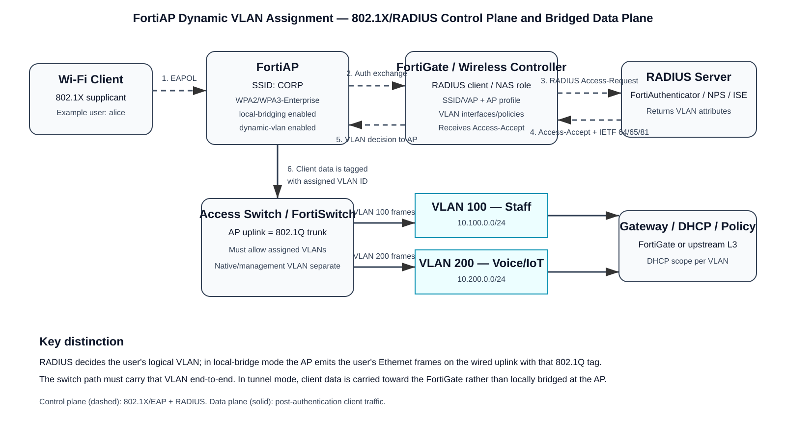

# FortiAP Dynamic User VLAN Assignment — Deep Dive

**Target documentation:** FortiAP / FortiWiFi 7.6.4  
**Primary feature:** Dynamic user VLAN assignment for wireless clients  
**Focus:** RADIUS VLAN overrides, VLAN name tags, FortiAP-group VLAN mapping, VLAN pooling, bridge vs tunnel behavior, wired trunk requirements, packet flow, configuration, verification, and troubleshooting.

## Source URLs

- https://docs.fortinet.com/document/fortiap/7.6.4/fortiwifi-and-fortiap-configuration-guide/376326/configuring-dynamic-user-vlan-assignment
- https://docs.fortinet.com/document/fortiap/7.6.0/fortiwifi-and-fortiap-configuration-guide/685372/vlan-assignment-by-radius
- https://docs.fortinet.com/document/fortiap/7.6.3/fortiwifi-and-fortiap-configuration-guide/458849/vlan-assignment-by-name-tag
- https://docs.fortinet.com/document/fortiap/7.6.3/fortiwifi-and-fortiap-configuration-guide/153336/vlan-assignment-by-fortiap-group
- https://docs.fortinet.com/document/fortiap/7.0.4/fortiwifi-and-fortiap-configuration-guide/84238/vlan-assignment-by-vlan-pool
- https://community.fortinet.com/t5/FortiGate/Technical-Tip-Dynamic-VLAN-assignment-for-SSID-clients-in-bridge/ta-p/141278
- https://community.fortinet.com/t5/FortiAP/Technical-Tip-FortiGate-WiFi-WPA2-Enterprise-dynamic-VLANs/ta-p/94631

> **Version note:** The 7.6.4 overview states that RADIUS-based dynamic VLAN assignment and VLAN pooling are alternative methods and cannot be used at the same time. Fortinet 8.0.0 documentation describes a newer precedence model in which a RADIUS VLAN can override a VLAN-pool result. Do **not** assume the 8.0 behavior applies to 7.6.4 without validating the exact FortiOS/FortiAP build.

## Table of contents

1. [What dynamic VLAN assignment solves](#1-what-dynamic-vlan-assignment-solves)
2. [The four assignment methods](#2-the-four-assignment-methods)
3. [Architecture and control/data planes](#3-architecture-and-controldata-planes)
4. [RADIUS VLAN assignment in depth](#4-radius-vlan-assignment-in-depth)
5. [Name-tag assignment](#5-name-tag-assignment)
6. [FortiAP-group assignment](#6-fortiap-group-assignment)
7. [VLAN pooling and load balancing](#7-vlan-pooling-and-load-balancing)
8. [Bridge mode versus tunnel mode](#8-bridge-mode-versus-tunnel-mode)
9. [End-to-end configuration example](#9-end-to-end-configuration-example)
10. [Exact packet flow](#10-exact-packet-flow)
11. [DHCP, routing, policy, and NAT implications](#11-dhcp-routing-policy-and-nat-implications)
12. [Roaming and VLAN continuity](#12-roaming-and-vlan-continuity)
13. [Verification](#13-verification)
14. [Troubleshooting by symptom](#14-troubleshooting-by-symptom)
15. [Common mistakes](#15-common-mistakes)
16. [Design recommendations](#16-design-recommendations)
17. [Sources](#17-sources)

---

## 1. What dynamic VLAN assignment solves

A traditional enterprise WLAN often creates one Service Set Identifier (SSID) per security zone: for example, `CORP-STAFF`, `CORP-VOICE`, `CORP-IOT`, and `CORP-CONTRACTOR`. Dynamic VLAN assignment lets one enterprise SSID authenticate users or endpoints and then place them into different Layer-2 broadcast domains.

Example:

| Identity/device class | SSID | Assigned VLAN | Result |
|---|---|---:|---|
| Employee | CORP | 100 | Staff subnet/policy |
| Voice handset | CORP | 200 | Voice subnet/QoS policy |
| Contractor | CORP | 300 | Restricted Internet-only policy |
| Printer | CORP | 400 | Printer services policy |

**Source information:** Fortinet documents that a RADIUS server can return the VLAN assignment for each user. The wireless controller then places the station into the corresponding VLAN.

**Additional explanation:** The SSID is therefore the RF/authentication entry point; the VLAN becomes the post-authentication forwarding context. This reduces SSID count while still preserving network segmentation.

---

## 2. The four assignment methods

FortiAP/FortiWiFi 7.6.x documentation identifies four methods:

| Method | Decision source | Typical purpose | Key limitation |
|---|---|---|---|
| **RADIUS** | RADIUS Access-Accept | Per-user/per-device policy | RADIUS must return supported tunnel attributes |
| **Name Tag** | Text value in `Tunnel-Private-Group-ID` mapped locally | Decouple RADIUS policy names from VLAN numbers | Local `vlan-name` mapping must be maintained |
| **FortiAP group** | AP membership/group | Location-based VLAN placement | One AP belongs to one FortiAP group |
| **VLAN pool** | Local SSID VLAN pool | Scale/load-balance clients among subnets | Load-balancing mode is documented for tunnel-mode SSIDs |

### Method-selection mental model

- Use **RADIUS VLAN assignment** when identity should determine segmentation.
- Use **Name Tags** when RADIUS should return a business label such as `staff`, `voice`, or `contractor` instead of a hard-coded VLAN ID.
- Use **FortiAP groups** when physical location determines the subnet while keeping one SSID.
- Use a **VLAN pool** when the goal is to spread clients across several VLANs/subnets rather than distinguish authorization policy.

---

## 3. Architecture and control/data planes



[Editable draw.io source](images/09-11-26-18-23_fortiap_dynamic_vlan_radius_flow.drawio)

**What this image shows:** the 802.1X/RADIUS control plane that selects a VLAN and the local-bridge data plane that subsequently emits tagged client frames onto the AP's wired uplink.

**What matters:** the VLAN decision alone is not enough. In bridge mode, every dynamically assignable VLAN must exist across the Layer-2 path from the AP uplink to the VLAN gateway/DHCP service.

**What to verify:** RADIUS attributes, SSID `dynamic-vlan` state, AP profile, switch trunk allowed VLAN list, VLAN gateway/DHCP, and firewall policy.

### Control plane

For WPA2/WPA3 Enterprise, the station runs an Extensible Authentication Protocol (EAP) method. The FortiAP carries the wireless authentication exchange toward the FortiGate wireless-controller context; the FortiGate uses the configured RADIUS server.

Conceptually:

```text
Supplicant
  -> 802.1X/EAPOL
FortiAP
  -> wireless-controller authentication exchange
FortiGate
  -> RADIUS Access-Request
RADIUS server
  -> RADIUS Access-Accept + VLAN attributes
FortiGate/FortiAP
  -> station authorized in selected VLAN
```

### Data plane

After successful authentication:

- **Local bridge mode:** client Ethernet traffic is bridged locally by the AP onto the wired LAN. When dynamic VLAN is used, the AP forwards the station's traffic using the selected IEEE 802.1Q VLAN tag.
- **Tunnel mode:** wireless client traffic is transported back toward the FortiGate over the FortiAP data path, and the FortiGate provides centralized forwarding/policy behavior.

**Reasonable inference:** Because a local-bridge AP is performing the Layer-2 handoff, failure to permit the dynamically selected VLAN on the AP's switch uplink produces the classic symptom “authentication succeeds but DHCP fails.”

---

## 4. RADIUS VLAN assignment in depth

Fortinet documents the standard IETF tunnel attributes below.

| RADIUS attribute | Number | Expected value | Meaning |
|---|---:|---|---|
| `Tunnel-Type` | IETF 64 | 13 / VLAN | Tunnel type is VLAN |
| `Tunnel-Medium-Type` | IETF 65 | 6 / IEEE-802 | Layer-2 medium is IEEE 802 |
| `Tunnel-Private-Group-ID` | IETF 81 | VLAN ID or supported text mapping | Selected VLAN |

A typical RADIUS Access-Accept therefore contains the semantic equivalent of:

```text
Tunnel-Type = VLAN
Tunnel-Medium-Type = IEEE-802
Tunnel-Private-Group-ID = 100
```

Do not treat this block as a packet capture; it illustrates the attribute set.

### What happens if attribute 81 is missing?

Fortinet's 7.6 RADIUS-assignment documentation states that if a user's RADIUS record does not specify a VLAN ID, the user is assigned to the default VLAN for the SSID.

That fallback is important. It means a successful authentication with an incomplete RADIUS authorization profile can silently place the user into the SSID's default VLAN instead of failing authentication.

### VLAN range

Fortinet's documentation describes `Tunnel-Private-Group-ID` values in the VLAN range 1–4094, subject to reserved-VLAN behavior and the practical requirement that the VLAN be valid and usable in your topology.

### Authentication versus authorization

A useful way to read the exchange is:

1. **Authentication:** “Is this user/device allowed to authenticate?”
2. **Authorization:** “Which VLAN should this accepted session use?”

The VLAN attributes are carried in the Access-Accept and therefore act as authorization information after RADIUS has accepted the request.

### RADIUS server options

Fortinet's feature does not inherently require FortiAuthenticator. Any RADIUS server capable of returning the required attributes can be used, including common enterprise RADIUS/NAC systems such as Microsoft NPS or Cisco ISE, provided the FortiGate is configured as a valid RADIUS client and the correct attributes are returned.

---

## 5. Name-tag assignment

Name Tag assignment solves a management problem: embedding VLAN numbers in RADIUS policy couples the AAA policy to the site's local VLAN numbering.

Instead, the RADIUS server can return a string in `Tunnel-Private-Group-ID`, and the SSID's `vlan-name` table maps that string to one or more VLAN IDs.

Example business-policy mapping:

```text
RADIUS returns "voice"  -> FortiGate maps to VLAN 100
RADIUS returns "data"   -> FortiGate maps to VLANs 200, 201, 202
```

Fortinet documents that a name can map to a single VLAN or multiple VLAN IDs, with up to eight VLAN IDs for a name. When multiple VLANs are assigned to a name, Fortinet describes round-robin selection.

Conceptual configuration:

```cli
config wireless-controller vap
    edit "CORP"
        set dynamic-vlan enable
        config vlan-name
            edit "voice"
                set vlan-id 100
            next
            edit "data"
                set vlan-id 200 201 202
            next
        end
    next
end
```

### Why Name Tags are useful

Suppose Site A uses staff VLAN 100 while Site B uses staff VLAN 310. The NAC policy can continue returning `staff`; each site's FortiGate can map `staff` to the local VLAN number. That keeps identity policy stable while allowing site-local Layer-2 numbering.

---

## 6. FortiAP-group assignment

FortiAP groups allow APs to be grouped by location such as building, floor, wing, or department. Fortinet documents that an AP can belong to only one group.

Example:

```text
SSID: CORP

AP group "Floor-1" -> VLAN 101
AP group "Floor-2" -> VLAN 102
AP group "Floor-3" -> VLAN 103
```

A user can therefore roam among APs broadcasting the same SSID yet be placed into a location-specific VLAN according to the group of the AP they join.

Documented configuration pattern:

```cli
config wireless-controller vap
    edit "CORP"
        set vlan-pooling wtp-group
        config vlan-pool
            edit 101
                set wtp-group "Floor-1"
            next
            edit 102
                set wtp-group "Floor-2"
            next
            edit 103
                set wtp-group "Floor-3"
            next
        end
    next
end
```

### Design effect

This can intentionally break a very large wireless broadcast domain into smaller location-specific subnets without creating different SSIDs.

The tradeoff is mobility. If a client changes AP groups and therefore changes VLAN/subnet, it may need a new IP address and existing Layer-3 sessions may not survive unless a separate mobility mechanism preserves them.

---

## 7. VLAN pooling and load balancing

A VLAN pool lets the SSID choose among multiple VLANs. Fortinet documents two load-balancing approaches for tunnel-mode SSIDs:

- **Round robin:** clients are distributed sequentially among VLANs.
- **Hash:** a deterministic client-derived result keeps the same client mapped consistently where possible.

Fortinet also documents AP-group mapping under the VLAN-pooling framework.

### Why use a VLAN pool?

The goal is usually subnet scale rather than authorization. For example, instead of putting 3,000 clients into one /20 broadcast domain, a WLAN may spread clients across several smaller VLANs/subnets.

### Important mode restriction

Fortinet documentation states that VLAN-pool load balancing is available only for tunnel-mode SSIDs. Do not assume round-robin/hash pool balancing works the same way for local bridge mode.

### Zone behavior

Fortinet documentation for VLAN pooling states that load-balancing VLANs are automatically associated with a zone based on the SSID, with the zone name derived from the SSID interface. Network and DHCP settings are still required for each VLAN.

---

## 8. Bridge mode versus tunnel mode

This distinction is central to troubleshooting.

### 8.1 Local bridge mode

```text
Client
  -> radio
FortiAP
  -> 802.1Q VLAN tag on AP Ethernet uplink
Access switch
  -> trunk carries VLAN
Distribution/L3 gateway
  -> DHCP / routing / policy
```

Requirements:

- SSID local bridging enabled.
- AP switch port carries the required user VLANs.
- Every intermediate trunk allows those VLANs.
- VLAN exists at the intended Layer-3 gateway.
- DHCP is local to the VLAN or DHCP relay is configured.
- The return path reaches the same VLAN/subnet correctly.

### 8.2 Tunnel mode

```text
Client
  -> radio
FortiAP
  -> FortiAP data tunnel toward FortiGate
FortiGate
  -> SSID/VLAN forwarding context
  -> firewall policy / route lookup / NAT as configured
Destination
```

Tunnel mode centralizes forwarding and makes FortiGate the key enforcement point. The AP access-switch port does not need to trunk every wireless user VLAN in the same way as a bridge deployment because client traffic is being carried through the AP/FortiGate tunnel rather than locally emitted onto each user VLAN at the AP uplink.

### Bridge vs tunnel summary

| Question | Bridge mode | Tunnel mode |
|---|---|---|
| Where does client traffic leave the AP? | Local wired LAN | Toward FortiGate data tunnel |
| Must AP switch uplink carry user VLANs? | Yes, for locally bridged dynamic VLANs | Not in the same per-user-VLAN trunking sense |
| Where is central firewall policy easiest? | At routed gateway / enforcement point | FortiGate |
| VLAN-pool load balancing | Not the documented target | Supported/documented |
| Failure symptom from missing switch VLAN | Auth succeeds, DHCP/data fails | Less likely to be caused by AP access-port VLAN list |

---

## 9. End-to-end configuration example

The following topology is intentionally explicit:

```text
SSID: CORP
Security: WPA2-Enterprise
RADIUS: FortiAuthenticator at 10.10.10.50
AP mode: local bridge
AP management VLAN: 10
Staff VLAN: 100, 10.100.0.0/24
Contractor VLAN: 300, 10.300.0.0/24
Internet uplink: wan1

RADIUS:
  staff users      -> VLAN 100
  contractor users -> VLAN 300
```

### 9.1 Configure the RADIUS server object

```cli
config user radius
    edit "FAC"
        set server "10.10.10.50"
        set secret <shared-secret>
    next
end
```

**Source information:** Fortinet documents configuring a RADIUS server under **User & Authentication > RADIUS Servers** with server address/name and shared secret.

**Do not copy secrets into documentation or tickets.**

### 9.2 Configure the enterprise SSID

A Fortinet-supported pattern is:

```cli
config wireless-controller vap
    edit "CORP"
        set ssid "CORP"
        set security wpa2-only-enterprise
        set auth radius
        set radius-server "FAC"
        set local-bridging enable
        set dynamic-vlan enable
        set schedule "always"
    next
end
```

Important fields:

- `security wpa2-only-enterprise`: 802.1X enterprise authentication.
- `auth radius`: use RADIUS rather than local-only authentication.
- `radius-server "FAC"`: AAA server object.
- `local-bridging enable`: client data leaves at the AP's local Ethernet path.
- `dynamic-vlan enable`: accept dynamic VLAN assignment.
- `schedule "always"`: SSID availability schedule.

### 9.3 Add the SSID to the FortiAP profile

```cli
config wireless-controller wtp-profile
    edit "FAP-PROFILE"
        config radio-1
            set vap-all manual
            set vaps "CORP"
        end
        config radio-2
            set vap-all manual
            set vaps "CORP"
        end
    next
end
```

### 9.4 Apply the profile to the AP

```cli
config wireless-controller wtp
    edit "<FortiAP-serial>"
        set admin enable
        set wtp-profile "FAP-PROFILE"
    next
end
```

The exact radio fields vary by FortiAP model and profile. Preserve platform-appropriate radio configuration rather than blindly copying a profile from a different model.

### 9.5 Permit VLANs on the AP uplink

For a FortiSwitch-managed AP port, the port must allow every VLAN that the RADIUS policy may select.

Conceptually:

```text
AP switch port
  native/untagged: AP management VLAN (design-dependent)
  tagged allowed: VLAN 100, VLAN 300
```

**Source information:** Fortinet's bridge-mode dynamic VLAN technical guidance explicitly calls out configuring the FortiAP-connected switch interface to allow the required VLANs.

### 9.6 Configure VLAN gateways and DHCP

If FortiGate is also the Layer-3 gateway, create a VLAN interface and DHCP server per user VLAN on the appropriate parent interface/trunk.

Conceptual pattern:

```cli
config system interface
    edit "STAFF-V100"
        set interface "<LAN-trunk>"
        set vlanid 100
        set ip 10.100.0.1 255.255.255.0
    next
    edit "CONTRACTOR-V300"
        set interface "<LAN-trunk>"
        set vlanid 300
        set ip 10.300.0.1 255.255.255.0
    next
end
```

DHCP configuration is topology-specific; use the correct interface and ranges for your design.

### 9.7 Create firewall policies

Example intent:

```text
VLAN 100 Staff -> internal apps + Internet
VLAN 300 Contractor -> Internet only
```

The security policy must reference the actual VLAN interface/zone where the client traffic arrives. Dynamic VLAN assignment does not automatically grant inter-VLAN or Internet access.

---

## 10. Exact packet flow

### 10.1 Authentication and VLAN selection

Assume Alice connects to `CORP` and RADIUS assigns VLAN 100.

1. Alice associates to the CORP BSSID on the FortiAP.
2. 802.1X/EAP authentication begins.
3. The FortiGate wireless-controller context sends the RADIUS authentication exchange to the configured RADIUS server.
4. RADIUS evaluates Alice's identity/device/posture policy.
5. RADIUS returns Access-Accept with the VLAN attributes, including `Tunnel-Private-Group-ID = 100`.
6. FortiGate/FortiAP installs the accepted station with VLAN 100 as its forwarding context.
7. Alice's subsequent DHCP and application traffic is handled in VLAN 100.

### 10.2 Bridge-mode DHCP flow

Before assignment, the client has no IP address.

```text
Client DHCPDISCOVER
  src MAC = client
  dst MAC = ff:ff:ff:ff:ff:ff
  IP 0.0.0.0:68 -> 255.255.255.255:67
        |
        v
FortiAP
  station context says VLAN 100
  adds/emits 802.1Q VLAN tag 100 on wired uplink
        |
        v
Access switch trunk
  forwards VLAN 100
        |
        v
DHCP server or VLAN-100 gateway/relay
        |
        v
DHCPOFFER returns in VLAN 100
        |
        v
FortiAP
  maps VLAN-100 frame back to wireless station
        |
        v
Client receives 10.100.0.x/24
```

The user's IP subnet follows the VLAN, not the SSID name.

### 10.3 Routed Internet flow

Example:

```text
10.100.0.25:51500 -> 8.8.8.8:443
```

1. Client sends frame toward VLAN-100 default gateway.
2. FortiAP bridges the frame into VLAN 100.
3. Switch forwards it to the VLAN-100 gateway.
4. Gateway performs route lookup.
5. Firewall policy is evaluated.
6. If Internet NAT is configured, source NAT changes `10.100.0.25` to the egress translated address.
7. Return traffic is reverse-NATed and routed back to VLAN 100.
8. AP transmits the frame over Wi-Fi to the client.

Dynamic VLAN assignment itself does not perform NAT. NAT is a separate Layer-3/security-policy decision.

---

## 11. DHCP, routing, policy, and NAT implications

### DHCP

Every dynamically assignable VLAN needs a working address-assignment design:

- local DHCP server on the FortiGate,
- upstream DHCP server on the VLAN,
- or DHCP relay from the VLAN gateway.

A successful 802.1X authentication followed by `169.254.x.x` on the client strongly suggests a post-authentication Layer-2/DHCP problem, not necessarily a RADIUS problem.

### Routing

Each VLAN subnet must be routable to allowed destinations. Confirm:

- connected route exists at the gateway,
- return routes exist for remote networks,
- no policy route/SD-WAN rule sends return traffic asymmetrically,
- no upstream ACL blocks the VLAN.

### Firewall policy

VLAN separation only creates Layer-2/Layer-3 segmentation. Security policy still decides which destinations/ports are allowed.

### NAT

For Internet-bound traffic, source NAT is normally applied at the Internet egress firewall/gateway according to the configured policy. Internal inter-VLAN traffic generally should not be NATed unless the design explicitly requires it.

---

## 12. Roaming and VLAN continuity

### Same VLAN across APs

If the user's RADIUS result remains VLAN 100 and VLAN 100 is available on each AP's bridge path, the station can remain in the same IP subnet as it roams.

### Different VLAN by AP group

If location-based AP-group assignment changes the user's VLAN, the client effectively changes Layer-3 attachment. A new DHCP exchange/IP address may be required.

### Design consequence

For voice or latency-sensitive roaming, avoid accidentally coupling AP location to a changing IP subnet unless the mobility design explicitly supports that behavior.

---

## 13. Verification

Exact CLI availability can vary by FortiOS/FortiAP release. The commands below are common FortiGate verification starting points; validate command syntax against the running build before automation.

### 13.1 Verify the RADIUS server object

```cli
show user radius
```

**What it tests:** configured AAA server address and object references.

**Success criteria:** expected server object exists and points to the intended RADIUS server.

**Failure indicators:** wrong address, wrong server object referenced by the SSID, stale server definition.

**Next action:** correct the server object, then test authentication again.

### 13.2 Verify SSID/VAP configuration

```cli
show wireless-controller vap
```

Look for:

```text
set auth radius
set radius-server "FAC"
set local-bridging enable
set dynamic-vlan enable
```

**Success criteria:** the production VAP contains the intended enterprise security and dynamic-VLAN settings.

### 13.3 Verify AP profile and AP assignment

```cli
show wireless-controller wtp-profile
show wireless-controller wtp
```

**What it tests:** whether the SSID is actually present on the AP profile and whether the target AP uses that profile.

### 13.4 Verify the RADIUS exchange

Use a RADIUS debug or packet capture appropriate for the FortiOS version and RADIUS path.

A packet capture filter can focus on the standard RADIUS authentication UDP port if that is what your deployment uses:

```cli
diagnose sniffer packet any 'host 10.10.10.50 and udp port 1812' 4 0 l
```

**What it tests:** whether requests leave FortiGate and responses return.

**Success criteria:** bidirectional Access-Request/response traffic during an authentication attempt.

**Failure indicators:**
- requests with no responses,
- traffic to the wrong server,
- routing path failure.

**Important:** a packet sniffer does not decode the full RADIUS authorization semantics as conveniently as a RADIUS-server log or dedicated protocol analyzer; inspect the RADIUS server's authentication record for returned attributes.

### 13.5 Verify the VLAN on the wired path

On the FortiSwitch/access switch, check:

- AP port is up,
- expected VLANs are tagged/allowed,
- VLAN exists globally,
- uplinks continue carrying the VLAN,
- MAC address of the client appears in the expected VLAN after traffic is generated.

**Success criteria:** client MAC is learned in the VLAN assigned by RADIUS.

### 13.6 Verify DHCP

Capture DHCP on the expected VLAN:

```cli
diagnose sniffer packet any 'port 67 or port 68' 4 0 l
```

**Success pattern:**

```text
DISCOVER -> OFFER -> REQUEST -> ACK
```

This is the expected message sequence, not literal FortiGate output.

### 13.7 Verify routing and policy

Check the route for the destination from the VLAN gateway and confirm the intended firewall policy is matching traffic. If the client obtains an address but cannot reach the Internet, the issue has moved beyond dynamic VLAN selection into routing/policy/NAT.

---

## 14. Troubleshooting by symptom

### Symptom A — Authentication fails before the client receives a VLAN

**Where:** FortiGate, RADIUS server, client supplicant.

**What to check:**
- shared secret,
- RADIUS client/NAS definition,
- EAP method/certificate trust,
- username/device identity,
- Access-Reject reason,
- FortiGate route to RADIUS.

**What failure means:** dynamic VLAN processing never starts because authorization was not accepted.

**Next action:** solve 802.1X/RADIUS authentication first.

---

### Symptom B — Authentication succeeds, but client lands in the default SSID VLAN

**Where:** RADIUS Access-Accept / authorization profile.

**What it tests:** whether VLAN attributes were actually returned.

**Expected state:**

```text
Tunnel-Type = VLAN
Tunnel-Medium-Type = IEEE-802
Tunnel-Private-Group-ID = <intended VLAN or mapped name>
```

**Failure meanings:**
- attribute 81 missing,
- wrong policy matched on RADIUS,
- unsupported/misspelled name tag,
- `dynamic-vlan` not enabled.

**Next action:** inspect the RADIUS server's successful-authentication log and returned attributes.

---

### Symptom C — Authentication succeeds and correct VLAN is selected, but no DHCP address

**Where:** AP port, switch trunks, VLAN gateway, DHCP service.

**What it tests:** post-authentication Layer-2 reachability.

**Common causes:**
- assigned VLAN not allowed on AP uplink,
- VLAN pruned on an intermediate trunk,
- VLAN does not exist on switch,
- DHCP scope missing/exhausted,
- relay/helper absent or incorrect,
- bridge SSID mapped incorrectly.

**Next action:** trace the client MAC and DHCPDISCOVER hop by hop in the selected VLAN.

---

### Symptom D — Client gets an IP address but cannot reach Internet

**Where:** gateway routing table, firewall policy, NAT, upstream routing.

**Expected state:**
- default/target route exists,
- policy from VLAN interface/zone matches,
- source NAT is applied if required,
- reverse route points back to the client subnet.

**Next action:** session/policy debug rather than changing the RADIUS policy.

---

### Symptom E — One user gets correct VLAN; another gets wrong VLAN

**Where:** RADIUS authorization rules.

**What it tests:** rule order, group membership, device profiling/posture, and returned attributes.

**Next action:** compare both RADIUS Access-Accept records. The WLAN may be functioning correctly while AAA policy differs.

---

### Symptom F — Name Tag is returned, but client falls back or cannot pass traffic

**Where:** SSID `config vlan-name`.

**What it tests:** exact text-to-VLAN mapping.

**Common causes:**
- capitalization/string mismatch,
- mapping missing,
- mapped VLAN not present on the local bridge path,
- invalid VLAN in the list.

**Next action:** verify the exact value returned in attribute 81 and compare it to the configured tag.

---

### Symptom G — Works on some APs but not others

**Where:** AP profile, FortiAP group, switch port, upstream trunk.

**Likely causes:**
- different AP profile,
- missing VLAN on one switch path,
- wrong FortiAP-group membership,
- AP uplink configured as access instead of trunk,
- inconsistent intermediate-switch VLAN allowance.

**Next action:** compare a working AP path and failing AP path from AP profile through every switch hop.

---

### Symptom H — Roaming causes IP loss/session loss

**Where:** assignment method and VLAN continuity.

**What it tests:** whether the new AP assigns the same VLAN.

**Failure meaning:** AP-group/location design may intentionally move the station into a different subnet.

**Next action:** keep mobility-sensitive users in a common VLAN, or adopt a mobility design that preserves Layer-3 continuity.

---

## 15. Common mistakes

1. **Assuming the VLAN exists because RADIUS returned it.** RADIUS returns authorization metadata; it does not create VLANs or switch trunks.
2. **Forgetting the AP uplink trunk in bridge mode.** This is one of the most important differences between bridge and tunnel deployment.
3. **Treating successful authentication as proof that data forwarding works.** AAA success validates the control plane, not DHCP/routing/policy.
4. **Returning only `Tunnel-Private-Group-ID` without validating the complete supported attribute set.**
5. **Hard-coding VLAN numbers in NAC when sites use different numbering.** Name Tags can be cleaner.
6. **Using FortiAP-group VLANs without considering roaming across groups.**
7. **Confusing VLAN pooling with identity authorization.** Pooling is primarily a subnet-distribution/scaling tool.
8. **Copying an 8.0 precedence behavior into a 7.6.4 design.** Validate version-specific semantics.
9. **Assuming dynamic VLAN assignment performs firewalling.** It selects a forwarding segment; policies are separate.
10. **Assuming dynamic VLAN assignment performs NAT.** NAT happens at the routing/security edge if configured.
11. **Creating the VLAN only on FortiGate while an intermediate switch prunes it.**
12. **Ignoring DHCP relay.** If the DHCP server is not local to the selected VLAN, relay must be correct.
13. **Using a VLAN name that does not exactly match the returned RADIUS string.**
14. **Forgetting that the default SSID VLAN can become the fallback when RADIUS does not return a VLAN ID.**

---

## 16. Design recommendations

### Identity-driven enterprise WLAN

For most enterprise user/device segmentation, a strong design is:

```text
One enterprise SSID
  -> 802.1X / certificate or credential authentication
  -> RADIUS/NAC authorization
  -> VLAN or Name Tag
  -> dedicated VLAN gateway/policy
```

Prefer Name Tags when multiple sites use different VLAN numbers for the same logical role.

### Bridge-mode campus design

Use bridge mode when local forwarding is desired, but treat the AP uplink exactly like a dynamic edge trunk: every possible assigned VLAN must be carried to the local gateway.

### Tunnel-mode centralized-security design

Use tunnel mode when centralized firewall enforcement and simplified edge switching are more important than local breakout. Evaluate VLAN pooling if very large client populations need to be spread across several address domains.

### Operational model

Document the mapping in one table:

| RADIUS role/tag | VLAN | Subnet | Gateway | DHCP source | Allowed destinations | AP scope |
|---|---:|---|---|---|---|---|
| staff | 100 | 10.100.0.0/24 | 10.100.0.1 | FortiGate | Corp + Internet | All |
| contractor | 300 | 10.300.0.0/24 | 10.300.0.1 | FortiGate | Internet only | All |
| voice | 200 | 10.200.0.0/24 | 10.200.0.1 | DHCP server | UC services | Selected APs |

That table becomes the fastest way to correlate AAA, switching, DHCP, routing, and firewall policy during an incident.

---

## 17. Sources

### Fortinet documentation

- FortiAP/FortiWiFi 7.6.4 — Dynamic user VLAN assignment  
  https://docs.fortinet.com/document/fortiap/7.6.4/fortiwifi-and-fortiap-configuration-guide/376326/configuring-dynamic-user-vlan-assignment
- FortiAP/FortiWiFi 7.6.x — VLAN assignment by RADIUS  
  https://docs.fortinet.com/document/fortiap/7.6.0/fortiwifi-and-fortiap-configuration-guide/685372/vlan-assignment-by-radius
- FortiAP/FortiWiFi — VLAN assignment by Name Tag  
  https://docs.fortinet.com/document/fortiap/7.6.3/fortiwifi-and-fortiap-configuration-guide/458849/vlan-assignment-by-name-tag
- FortiAP/FortiWiFi — VLAN assignment by FortiAP group  
  https://docs.fortinet.com/document/fortiap/7.6.3/fortiwifi-and-fortiap-configuration-guide/153336/vlan-assignment-by-fortiap-group
- FortiAP/FortiWiFi — VLAN assignment by VLAN pool  
  https://docs.fortinet.com/document/fortiap/7.0.4/fortiwifi-and-fortiap-configuration-guide/84238/vlan-assignment-by-vlan-pool
- FortiAP/FortiWiFi 7.6.4 — FortiAP groups  
  https://docs.fortinet.com/document/fortiap/7.6.4/fortiwifi-and-fortiap-configuration-guide/174136/fortiap-groups

### Fortinet Community

- Dynamic VLAN assignment for SSID clients in bridge and tunnel mode using RADIUS/FortiAuthenticator  
  https://community.fortinet.com/t5/FortiGate/Technical-Tip-Dynamic-VLAN-assignment-for-SSID-clients-in-bridge/ta-p/141278
- FortiGate WiFi WPA2-Enterprise dynamic VLAN assignment  
  https://community.fortinet.com/t5/FortiAP/Technical-Tip-FortiGate-WiFi-WPA2-Enterprise-dynamic-VLANs/ta-p/94631

---

## Final mental model

Dynamic VLAN assignment has two completely separate jobs:

```text
CONTROL PLANE
Who is the station?
What VLAN should it receive?
        |
        v
RADIUS Access-Accept / local VLAN-selection logic

DATA PLANE
Can frames in that VLAN actually reach DHCP, gateway, policy, and destination?
        |
        v
AP forwarding mode + switch trunk/tunnel + L3 gateway + firewall
```

If **authentication fails**, troubleshoot 802.1X/RADIUS.  
If **authentication succeeds but DHCP fails**, troubleshoot VLAN transport and DHCP.  
If **DHCP succeeds but applications fail**, troubleshoot routing, firewall policy, NAT, DNS, and the return path.
