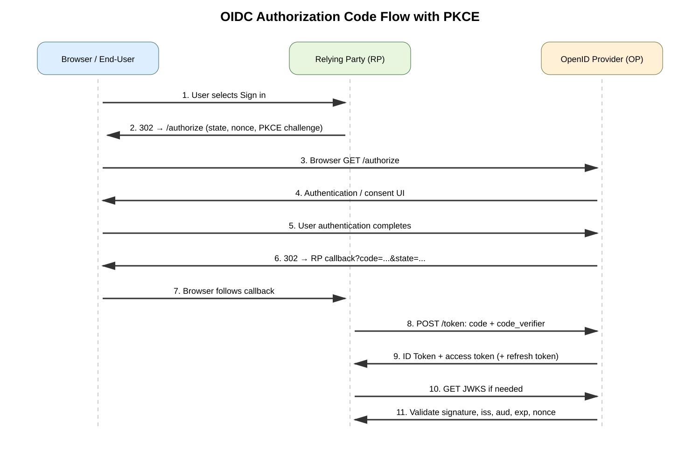
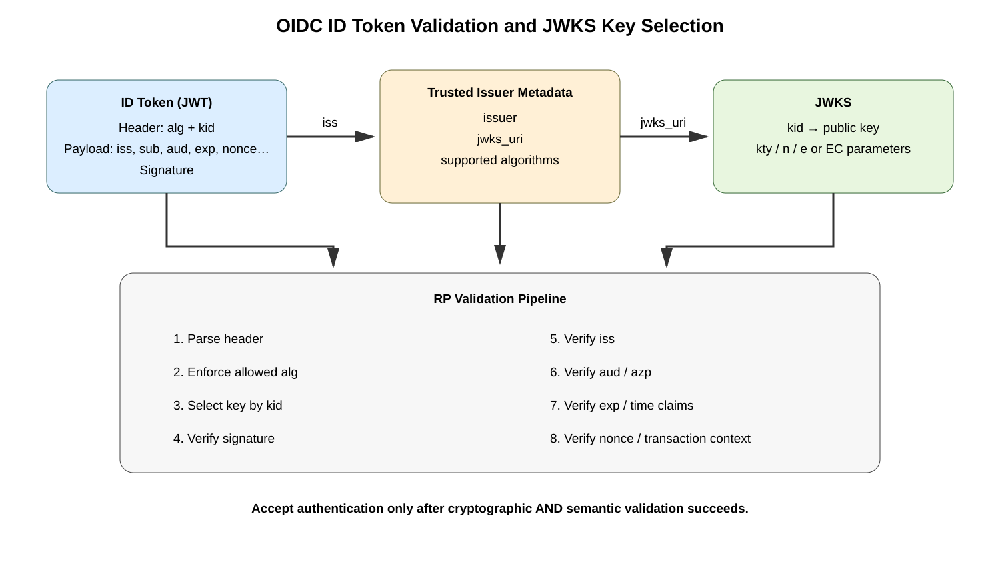

# OpenID Connect (OIDC) — Comprehensive Authentication, Token, PKCE, JWKS, and Troubleshooting Study Guide

## Purpose

OpenID Connect (OIDC) is an **identity layer built on OAuth 2.0**. OAuth 2.0 by itself is primarily an authorization framework: it lets a client obtain delegated access to protected resources. OIDC adds standardized authentication semantics so a client can determine **who authenticated**, **which issuer authenticated the subject**, **which client the authentication was intended for**, and selected identity attributes called **claims**.

This guide focuses on the protocol mechanics rather than vendor-specific GUI steps.

## URLs reviewed

- OpenID Foundation — AB/Connect specifications: https://openid.net/wg/connect/specifications/
- OpenID Foundation — OpenID Connect working group: https://openid.net/wg/connect/
- OpenID Foundation — specification catalog: https://openid.net/developers/specs/
- OpenID Connect Core 1.0 (current errata line is listed by the OpenID Foundation): https://openid.net/specs/openid-connect-core-1_0.html
- OpenID Connect Discovery 1.0: https://openid.net/specs/openid-connect-discovery-1_0.html
- OAuth 2.0 Authorization Framework (RFC 6749): https://www.rfc-editor.org/rfc/rfc6749
- PKCE (RFC 7636): https://www.rfc-editor.org/rfc/rfc7636
- OAuth 2.0 Authorization Server Issuer Identification (RFC 9207): https://www.rfc-editor.org/rfc/rfc9207
- JWT (RFC 7519): https://www.rfc-editor.org/rfc/rfc7519
- JWK (RFC 7517): https://www.rfc-editor.org/rfc/rfc7517

---

## Table of contents

1. [OIDC in one sentence](#1-oidc-in-one-sentence)
2. [OIDC vs OAuth 2.0](#2-oidc-vs-oauth-20)
3. [Core actors and endpoints](#3-core-actors-and-endpoints)
4. [Authorization Code Flow with PKCE](#4-authorization-code-flow-with-pkce)
5. [Detailed message flow](#5-detailed-message-flow)
6. [ID Token anatomy](#6-id-token-anatomy)
7. [Access Token vs ID Token](#7-access-token-vs-id-token)
8. [Scopes and claims](#8-scopes-and-claims)
9. [Discovery and metadata](#9-discovery-and-metadata)
10. [JWKS and signature verification](#10-jwks-and-signature-verification)
11. [Nonce, state, PKCE, and redirect URI protections](#11-nonce-state-pkce-and-redirect-uri-protections)
12. [Refresh tokens and sessions](#12-refresh-tokens-and-sessions)
13. [UserInfo endpoint](#13-userinfo-endpoint)
14. [Logout](#14-logout)
15. [Confidential, public, SPA, and native clients](#15-confidential-public-spa-and-native-clients)
16. [Reverse proxy and API architecture](#16-reverse-proxy-and-api-architecture)
17. [Security validation checklist](#17-security-validation-checklist)
18. [Packet and protocol perspective](#18-packet-and-protocol-perspective)
19. [Verification](#19-verification)
20. [Troubleshooting by symptom](#20-troubleshooting-by-symptom)
21. [Common mistakes](#21-common-mistakes)
22. [Interview and certification takeaways](#22-interview-and-certification-takeaways)
23. [Sources](#23-sources)

---

## 1. OIDC in one sentence

OIDC lets a client authenticate a user through an **OpenID Provider (OP)** and receive a cryptographically protected **ID Token** containing standardized claims about the authentication event and subject.

The defining signal that an OAuth authorization request is also an OIDC request is the presence of the **`openid` scope**.

---

## 2. OIDC vs OAuth 2.0

| Question | OAuth 2.0 | OpenID Connect |
|---|---|---|
| Primary purpose | Delegated authorization | Authentication + identity claims |
| Main token consumed by | Resource server/API | Client/Relying Party |
| Identity token defined? | No | Yes: ID Token |
| `openid` scope | Not defined as identity trigger | Required for OIDC |
| Standard identity claims | Not the central objective | Yes |
| Discovery metadata | Separate ecosystem/extensions | Standard OIDC Discovery |
| UserInfo endpoint | Not core OAuth | Standard OIDC endpoint |

### Important mental model

A common mistake is to treat an OAuth access token as proof that a user authenticated to the application. That is unsafe as a general rule.

An **access token** is intended for a protected resource. Its audience may be an API, not the client application. The client should use the **ID Token** for the OIDC authentication result and should validate it according to the protocol.

**Source information:** OpenID Connect Core defines authentication on top of OAuth 2.0 and uses claims to communicate information about the end user.

**Additional explanation:** OAuth and OIDC often share the same authorization endpoint and token endpoint, so they look almost identical on the wire until you inspect the scopes, returned token set, and validation rules.

---

## 3. Core actors and endpoints

### Actors

- **End-User** — the person authenticating.
- **User Agent** — usually the browser.
- **Relying Party (RP)** — the OIDC client/application.
- **OpenID Provider (OP)** — the identity provider/authorization server that authenticates the user and issues the ID Token.
- **Resource Server** — API that accepts access tokens.

### Common endpoints

| Endpoint | Purpose |
|---|---|
| Authorization endpoint | Front-channel redirect to authenticate/authorize |
| Token endpoint | Back-channel code exchange for tokens |
| UserInfo endpoint | Optional claims retrieval using an access token |
| JWKS URI | Publishes public verification keys |
| End-session endpoint | Provider-specific/metadata-advertised logout function where supported |
| Discovery document | Publishes issuer metadata and endpoint locations |

OIDC endpoints normally use HTTPS.

---

## 4. Authorization Code Flow with PKCE

For modern browser-based and native application designs, the **Authorization Code Flow** is the key flow to understand. PKCE (Proof Key for Code Exchange) binds the authorization code to the client instance that initiated the request.



[Editable draw.io source](images/09-11-26-19-26_oidc_authorization_code_pkce_flow.drawio)

**What this image shows**

The forward sequence from RP to authorization endpoint, user authentication at the OP, the authorization-code redirect, the back-channel token exchange, JWKS retrieval, ID Token validation, and API use of the access token.

**What matters**

The authorization code travels through the browser, but tokens are obtained from the token endpoint. PKCE protects the code exchange by requiring the matching `code_verifier`.

**What to verify**

Check the issuer, redirect URI, `state`, `nonce`, PKCE challenge method, token endpoint response, `kid`, JWKS key, signature, `aud`, and token lifetime.

---

## 5. Detailed message flow

Assume:

- RP: `https://app.example.com`
- Redirect URI: `https://app.example.com/callback`
- OP issuer: `https://idp.example.net`
- API: `https://api.example.com`

### Step 1 — Discovery

The RP can retrieve:

```text
GET https://idp.example.net/.well-known/openid-configuration
```

The metadata identifies values such as:

- `issuer`
- `authorization_endpoint`
- `token_endpoint`
- `userinfo_endpoint`
- `jwks_uri`
- supported signing algorithms
- supported scopes and response types

The exact advertised fields depend on the provider and metadata specification.

### Step 2 — RP creates transaction state

The RP generates high-entropy values:

- `state` — binds the authorization response to the browser transaction.
- `nonce` — binds the ID Token to the authentication request.
- `code_verifier` — PKCE secret generated by the client.
- `code_challenge` — derived from the verifier, normally using S256.

Conceptual transformation:

```text
code_challenge = BASE64URL(SHA256(code_verifier))
```

### Step 3 — Browser is redirected to authorization endpoint

Illustrative request:

```text
GET /authorize?
  response_type=code&
  client_id=client-123&
  redirect_uri=https%3A%2F%2Fapp.example.com%2Fcallback&
  scope=openid%20profile%20email&
  state=<random-state>&
  nonce=<random-nonce>&
  code_challenge=<challenge>&
  code_challenge_method=S256
Host: idp.example.net
```

This is an **illustrative request**, not copied vendor output.

### Step 4 — OP authenticates user

The authentication method is provider policy. It may include:

- password
- passkey/WebAuthn
- certificate
- OTP
- push MFA
- federation to another identity system

OIDC does not force one particular end-user authentication factor.

### Step 5 — Authorization response returns a code

The OP redirects the browser:

```text
HTTP/1.1 302 Found
Location: https://app.example.com/callback?code=<authorization-code>&state=<original-state>
```

The RP MUST correlate the returned `state` to the transaction it created.

### Step 6 — RP exchanges code at token endpoint

Illustrative request:

```text
POST /token HTTP/1.1
Host: idp.example.net
Content-Type: application/x-www-form-urlencoded

grant_type=authorization_code&
code=<authorization-code>&
redirect_uri=https%3A%2F%2Fapp.example.com%2Fcallback&
client_id=client-123&
code_verifier=<original-verifier>
```

A confidential client may also authenticate itself at the token endpoint according to its registered method.

### Step 7 — Token response

Conceptual result:

```json
{
  "access_token": "<opaque-or-JWT-access-token>",
  "token_type": "Bearer",
  "expires_in": 3600,
  "id_token": "<signed-JWT>",
  "refresh_token": "<if-issued>"
}
```

This is **simulated output**. Providers vary.

### Step 8 — RP validates ID Token

The RP validates the ID Token before creating an authenticated application session.

Typical checks include:

1. correct issuer (`iss`)
2. correct audience (`aud`)
3. signature valid using an approved key/algorithm
4. token not expired (`exp`)
5. `iat` reasonable for local policy
6. `nonce` matches the original request when used
7. other context-dependent validation required by OIDC Core

### Step 9 — RP creates its own session

A secure design usually does **not** force the browser to carry the raw ID Token indefinitely. The RP can establish an application session using an appropriately protected cookie.

### Step 10 — Access token is used toward API

```text
GET /orders
Host: api.example.com
Authorization: Bearer <access_token>
```

The API validates the access token according to the authorization server/resource-server contract.

---

## 6. ID Token anatomy

An ID Token is a JWT (JSON Web Token) containing claims about the authentication event and end user.

Conceptual decoded payload:

```json
{
  "iss": "https://idp.example.net",
  "sub": "248289761001",
  "aud": "client-123",
  "exp": 1789180800,
  "iat": 1789177200,
  "nonce": "n-0S6_WzA2Mj",
  "auth_time": 1789177155
}
```

This is **simulated content**.

### Critical claims

| Claim | Meaning |
|---|---|
| `iss` | Issuer identifier |
| `sub` | Subject identifier at that issuer |
| `aud` | Intended audience/client |
| `exp` | Expiration time |
| `iat` | Issued-at time |
| `nonce` | Transaction binding value when requested |
| `auth_time` | Time of end-user authentication when supplied/required |
| `azp` | Authorized party in cases defined by OIDC |

### Subject identity

Treat **`iss` + `sub`** as the stable protocol identity pair. Email address is usually a poor primary key because addresses can be renamed, reassigned, or have different verification semantics.

---

## 7. Access Token vs ID Token

### ID Token

- Audience: RP/client.
- Purpose: convey authentication result and identity claims.
- Should be validated by the RP.
- Should not automatically be treated as an API bearer token.

### Access Token

- Audience: resource server/API.
- Purpose: authorize access to protected resources.
- Format may be JWT or opaque.
- The RP should not assume it can decode the token merely because some providers use JWT access tokens.

### Key rule

**Do not send an ID Token to an API just because it is a JWT.** Token type and audience matter more than visual format.

---

## 8. Scopes and claims

The `openid` scope requests OIDC authentication.

Common OIDC scope values include:

- `openid`
- `profile`
- `email`
- `address`
- `phone`

The provider may return claims in the ID Token and/or UserInfo response according to the request, provider policy, consent, and specification rules.

Example authorization scope:

```text
scope=openid profile email
```

### Claims vs scopes

A **scope** is a requested authorization category. A **claim** is a name/value statement.

For example:

```json
{
  "name": "Example User",
  "email": "user@example.com",
  "email_verified": true
}
```

Never assume a claim exists merely because a scope was requested. Code must handle provider behavior and the negotiated/registered profile.

---

## 9. Discovery and metadata

OIDC Discovery allows clients to learn how to interact with an issuer.

Typical location:

```text
https://<issuer>/.well-known/openid-configuration
```

Important metadata:

| Field | Why it matters |
|---|---|
| `issuer` | Must match issuer validation expectations |
| `authorization_endpoint` | Browser redirect target |
| `token_endpoint` | Code/token exchange |
| `jwks_uri` | Public signing keys |
| `userinfo_endpoint` | Optional UserInfo API |
| `response_types_supported` | Supported response patterns |
| `subject_types_supported` | Subject identifier behavior |
| `id_token_signing_alg_values_supported` | Allowed ID Token signing algorithms |

### Security point

Do not dynamically trust an arbitrary discovery URL supplied by an attacker. The application must have a trustworthy issuer/configuration boundary.

---

## 10. JWKS and signature verification

The OP signs the ID Token. The RP needs the correct public key.



[Editable draw.io source](images/09-11-26-19-26_oidc_token_validation_jwks.drawio)

**What this image shows**

How the JWT header `kid` selects a key from the issuer's JWKS, followed by cryptographic signature validation and semantic claim validation.

**What matters**

A valid JWT signature alone is insufficient. The RP also needs to verify issuer, audience, expiry, nonce and the intended algorithm/provider context.

**What to verify**

Check that the JWKS comes from the trusted issuer metadata, that the key ID resolves, that the signing algorithm is acceptable, and that claims match the current client and transaction.

### JWT header example

```json
{
  "alg": "RS256",
  "kid": "key-2026-09",
  "typ": "JWT"
}
```

### JWKS example

```json
{
  "keys": [
    {
      "kty": "RSA",
      "kid": "key-2026-09",
      "use": "sig",
      "n": "<base64url-modulus>",
      "e": "AQAB"
    }
  ]
}
```

These are **simulated examples**.

### Key rotation

The OP may rotate signing keys. Applications should use the provider's JWKS behavior rather than pinning one forever-lived public key unless the deployment explicitly requires a different trust model.

If a token arrives with an unknown `kid`:

1. confirm the token issuer
2. refresh/retrieve JWKS according to the library/provider strategy
3. retry key selection
4. fail closed if no trusted key matches

Do not accept an unsigned or algorithm-downgraded token just to avoid login failures.

---

## 11. Nonce, state, PKCE, and redirect URI protections

These values solve different problems.

| Control | Protects primarily against |
|---|---|
| `state` | Authorization response/session correlation and CSRF-style mixups |
| `nonce` | Replay/substitution of authentication result into the wrong OIDC transaction |
| PKCE | Authorization code interception/redeeming code without the verifier |
| Exact registered redirect URI handling | Redirect manipulation/code leakage |
| `iss` validation | Accepting tokens/responses from wrong issuer |
| `aud` validation | Accepting token issued for another client |

### PKCE is not a replacement for state

PKCE protects the **code redemption**. `state` protects authorization response correlation. They are complementary.

### Nonce is not a CSRF token

`nonce` binds the ID Token to the OIDC request. It does not replace all browser transaction protections.

---

## 12. Refresh tokens and sessions

A refresh token can let a client obtain new access tokens without repeating interactive authorization, subject to server policy.

Security considerations:

- store refresh tokens more carefully than short-lived access tokens
- use platform secure storage for native applications
- keep refresh tokens out of JavaScript-readable browser storage when architecture permits
- support rotation/revocation behavior when the provider offers it
- distinguish OP session lifetime, RP application session lifetime, access token lifetime, and refresh-token lifetime

These are **different clocks**.

A user can still have an OP session while an access token has expired. Conversely, an RP session may continue while a specific API token needs renewal.

---

## 13. UserInfo endpoint

The UserInfo endpoint is an OIDC protected resource. The client normally calls it with an access token:

```text
GET /userinfo HTTP/1.1
Host: idp.example.net
Authorization: Bearer <access_token>
```

Possible conceptual response:

```json
{
  "sub": "248289761001",
  "name": "Example User",
  "email": "user@example.com",
  "email_verified": true
}
```

Again, this is **simulated output**.

The `sub` returned from UserInfo must be interpreted consistently with the authenticated subject per the OIDC requirements.

---

## 14. Logout

OIDC login and application logout are not simply mirror images.

Potential layers include:

1. RP local session termination
2. OP session termination
3. refresh-token revocation
4. access-token expiration/revocation
5. front-channel or back-channel logout mechanisms depending on provider/profile

Clearing the RP cookie does not necessarily terminate the OP session. This is why a user can click **Logout**, immediately click **Login**, and get silently signed back in by the identity provider.

---

## 15. Confidential, public, SPA, and native clients

### Confidential client

A server-side application capable of protecting client credentials.

Examples:

- traditional server-rendered web app
- backend-for-frontend (BFF)

The server can perform the token exchange without exposing secrets to the browser.

### Public client

Cannot reliably keep a client secret.

Examples:

- native mobile application
- desktop application
- browser-only SPA

A hard-coded client secret inside shipped JavaScript/mobile binaries is not truly secret.

### SPA

Security guidance increasingly favors keeping sensitive OAuth tokens out of browser JavaScript when a BFF architecture is practical. Regardless of architecture, do not rely on a static client secret inside JavaScript.

### Native applications

Use system-browser based authorization and PKCE according to the applicable OAuth native-app guidance/provider support rather than embedding user credentials into the application.

---

## 16. Reverse proxy and API architecture

A useful production pattern:

```text
Browser
  |
  | HTTPS + secure app session cookie
  v
Reverse Proxy / BFF / Web App
  |
  | access token
  v
API
```

The browser does not need direct possession of every backend access token.

### Why this matters

It reduces token exposure to:

- XSS-accessible storage
- browser extensions
- front-end logs
- accidental URL fragments/query strings
- client-side error telemetry

It does **not** eliminate the need for CSRF protections, secure cookies, CSP, output encoding, dependency hygiene, or API token validation.

---

## 17. Security validation checklist

For an ID Token, verify the items required by your protocol flow/library and provider profile. At minimum, the engineer should understand these checks:

1. Token is from the expected OIDC flow.
2. JWT syntax parses correctly.
3. Signing algorithm is explicitly acceptable.
4. `kid` maps to an issuer-controlled trusted key.
5. Cryptographic signature validates.
6. `iss` equals the configured expected issuer.
7. `aud` contains the RP's client identifier as required.
8. `azp` handling is correct where applicable.
9. `exp` is in the future, within allowed clock-skew policy.
10. `iat` is reasonable.
11. `nonce` equals the stored request nonce when nonce was used.
12. Any `auth_time`, `acr`, or `amr` requirements are enforced if the application depends on them.
13. Redirect response `state` matches the initiating browser transaction.
14. Authorization code is single-use and bound to PKCE where PKCE is used.
15. Redirect URI is exactly the registered/expected URI under provider rules.

Use a well-maintained OIDC library rather than hand-writing JWT and protocol validation.

---

## 18. Packet and protocol perspective

OIDC is an application-layer protocol carried predominantly over HTTPS.

### Front channel

Before reading the flow, define the two OIDC roles:

- **RP — Relying Party:** the application that wants to sign the user in. In this guide, the RP is the web application at `https://app.example.com`.
- **OP — OpenID Provider:** the identity provider that authenticates the user and issues the OIDC tokens. Examples include Microsoft Entra ID, Okta, Auth0, Google Identity, Ping Identity, or another standards-compliant OIDC provider.

A simple way to remember the relationship is:

```text
RP = "I rely on another system to tell me who this user is."
OP = "I am the identity provider that authenticates the user."
```

The **front channel** is the part of the OIDC flow that goes through the user's browser. The browser is redirected between the RP and the OP, so these requests and redirects are visible in browser developer tools.

```text
Browser -> RP
    The user opens the application or clicks Sign in.

RP -> Browser: 302 to OP /authorize
    The RP tells the browser to go to the OpenID Provider's authorization endpoint.

Browser -> OP /authorize
    The browser follows the redirect and sends the authorization request to the OP.

OP -> Browser: authentication UI
    The OP presents its login, MFA, passkey, or other authentication experience.

OP -> Browser: 302 to RP callback?code=...&state=...
    After successful authentication, the OP redirects the browser back to the RP.
    The response normally contains a short-lived authorization code and the original state value.

Browser -> RP callback
    The browser follows the redirect back to the RP's registered callback URI.
```

In this sequence, the browser never needs to know the RP's client secret. With Authorization Code Flow, the browser carries the authorization request and authorization code, while the token exchange happens separately over the back channel.

### Back channel

The **back channel** is direct server-to-server communication. The user's browser does not carry these requests.

```text
RP -> OP token endpoint: authorization code + code_verifier
    The RP redeems the authorization code at the OP's token endpoint.
    With PKCE, it also supplies the matching code_verifier.

OP -> RP: ID Token + access token (+ optional refresh token)
    The OP returns tokens directly to the RP over HTTPS.

RP -> OP JWKS URI: GET public keys
    The RP retrieves the OP's published JSON Web Key Set when it needs signing keys.

OP -> RP: JWKS
    The OP returns public keys that the RP can use to validate the ID Token signature.

RP -> API: Authorization: Bearer <access_token>
    The RP uses the access token when calling the protected API.

API -> RP: protected data
    The API validates the access token and, if authorized, returns the requested resource.
```

The most important distinction is:

```text
Front channel = Browser participates in the exchange.
Back channel  = RP talks directly to the OP or API over HTTPS.
```

The RP trusts the OP for the authentication result only after validating the ID Token's signature and claims such as `iss`, `aud`, `exp`, and, where applicable, `nonce`.

### NAT and firewalls

OIDC generally does not require special network-layer NAT behavior beyond normal HTTPS reachability. However, enterprise controls can break the flow if:

- outbound HTTPS to OP endpoints is blocked
- TLS interception causes trust problems
- DNS cannot resolve issuer endpoints
- callback URI points to an unreachable internal name
- reverse proxy changes scheme/host and the application constructs the wrong redirect URI
- WAF blocks long authorization URLs, cookies, or callback query parameters

### Load balancers and state

If the RP stores `state`, `nonce`, or PKCE verifier only in local node memory, a load-balanced callback landing on another node can fail.

Solutions include:

- shared session store
- cryptographically protected transaction cookie/state object where appropriate
- load-balancer affinity as a tactical workaround, not always the preferred architecture

---

## 19. Verification

### 19.1 Retrieve discovery metadata

```cli
curl -sS https://idp.example.net/.well-known/openid-configuration
```

**Expected state:** JSON metadata containing the configured issuer and endpoint URIs.

**Important fields:** `issuer`, `authorization_endpoint`, `token_endpoint`, `jwks_uri`.

**Failure indicators:** TLS error, DNS error, HTTP 404, issuer mismatch, missing required metadata.

**Next action:** validate issuer URL, DNS, proxy/firewall path, TLS trust, and provider tenant configuration.

### 19.2 Retrieve JWKS

First read `jwks_uri` from discovery, then query that exact URI:

```cli
curl -sS https://idp.example.net/<provider-advertised-jwks-path>
```

Do not assume every provider uses the same JWKS path.

**Expected state:** JSON with a `keys` array.

**Important fields:** `kid`, `kty`, optional `use`, and algorithm/key parameters.

**Failure indicators:** no key matching ID Token `kid`, inaccessible URI, stale proxy cache.

**Next action:** confirm the token's `iss`, refresh issuer metadata/JWKS, investigate rotation/caching.

### 19.3 Observe browser redirect

Use browser developer tools **Network** panel.

**Success criteria:**

- request reaches authorization endpoint
- callback returns to the exact registered URI
- callback contains expected response parameters
- `state` correlates

**Failure indicators:**

- redirect loop
- `redirect_uri_mismatch`
- provider error page
- callback blocked by WAF/reverse proxy

### 19.4 Inspect server logs

Log safe protocol metadata, not raw long-lived secrets.

Useful fields:

- correlation ID
- issuer
- client ID
- redirect URI
- requested scopes
- returned OAuth/OIDC error code
- token validation stage
- `kid`
- audience mismatch details without logging token content unnecessarily

Avoid logging:

- client secrets
- authorization codes
- access tokens
- refresh tokens
- session cookies

---

## 20. Troubleshooting by symptom

### Symptom: `redirect_uri_mismatch`

**Where:** authorization request / OP registration.

**What it tests:** redirect URI equality/registration.

**Expected:** URI sent by RP matches a provider-registered redirect URI according to provider rules.

**Failure means:** scheme, host, port, path, trailing slash, proxy rewrite, or environment is wrong.

**Next action:** compare the actual browser request byte-for-byte with registration.

---

### Symptom: `invalid_grant` during token exchange

**Where:** token endpoint.

**What it tests:** code validity and token request binding.

Possible causes:

- code already used
- code expired
- wrong redirect URI
- wrong PKCE verifier
- code issued to a different client
- incorrect client authentication

**Next action:** correlate the authorization request and token request using a transaction ID; never reuse a captured code.

---

### Symptom: nonce validation failed

**Where:** RP ID Token validation.

**What it tests:** token belongs to the initiating authentication transaction.

**Failure means:** transaction state was lost, wrong callback hit, stale browser tab, replay, or multi-node session storage problem.

**Next action:** verify where the nonce is stored and how it survives load balancing.

---

### Symptom: unknown `kid`

**Where:** RP JWT verification.

**What it tests:** token's signing key exists in trusted issuer JWKS.

**Expected:** token header `kid` selects a key in current JWKS.

**Failure means:** key rotation, stale cache, wrong issuer, forged token, or provider misconfiguration.

**Next action:** refresh trusted JWKS and re-check `iss`; never disable signature verification.

---

### Symptom: issuer mismatch

**Where:** ID Token validation.

**Expected:** token `iss` exactly matches configured issuer semantics.

**Failure means:** wrong tenant/realm, incorrect discovery base URL, multi-issuer confusion, or malicious token.

**Next action:** trace which authorization endpoint/token endpoint issued the token.

---

### Symptom: audience mismatch

**Where:** ID Token validation.

**Expected:** RP client ID is the intended audience.

**Failure means:** token was issued for another client or environment.

**Next action:** check client ID in authorization request, provider app registration, and token.

---

### Symptom: login works on one node but fails behind load balancer

**Where:** RP transaction/session storage.

**What it tests:** `state`, `nonce`, and PKCE verifier continuity.

**Failure means:** callback cannot access state created before redirect.

**Next action:** use shared session storage or a stateless protected transaction design.

---

### Symptom: user logs out but is immediately logged back in

**Where:** RP + OP session layers.

**What it tests:** whether only local app session was removed.

**Failure means:** OP SSO session is still active.

**Next action:** determine whether provider-supported RP-initiated/session logout is required and whether tokens need revocation.

---

## 21. Common mistakes

1. **Calling OIDC "OAuth authentication" without distinguishing the protocols.**
2. **Using an access token as the application's user identity token.**
3. **Sending an ID Token to an API as an access token.**
4. **Validating only the JWT signature but not `iss`, `aud`, expiry, and transaction binding.**
5. **Accepting whatever algorithm the JWT header requests.**
6. **Treating email address as the immutable user identifier.**
7. **Hard-coding a client secret into an SPA/mobile binary and calling it confidential.**
8. **Using PKCE but forgetting `state`.**
9. **Using `state` but forgetting `nonce` where the OIDC flow/library expects it.**
10. **Caching JWKS forever and breaking at key rotation.**
11. **Refreshing JWKS from an attacker-controlled issuer.**
12. **Logging access tokens, refresh tokens, or authorization codes.**
13. **Failing to account for reverse proxies when constructing external redirect URIs.**
14. **Keeping transaction state only on one web node behind a non-sticky load balancer.**
15. **Assuming clearing the local cookie logs the user out of the OP.**

---

## 22. Interview and certification takeaways

Be able to explain this cleanly:

> OAuth 2.0 answers "what is this client allowed to access?" OIDC adds an authentication layer that lets the client establish "who authenticated?" using an ID Token and standardized claims.

Also know:

- `openid` turns the authorization request into an OIDC request.
- Authorization Code Flow returns a code through the browser and exchanges it at the token endpoint.
- PKCE binds the code to the client transaction.
- `state` and `nonce` solve different problems.
- The ID Token is for the client; the access token is for the API.
- The RP validates signature + semantic claims.
- Discovery tells the RP where endpoints and JWKS are.
- `kid` helps select the verification key from JWKS.
- Key rotation requires sane JWKS caching/refresh behavior.
- `iss` + `sub` is the strongest protocol-level identity key pair.
- Logout has separate RP and OP session concerns.

---

## 23. Sources

### OpenID Foundation

- https://openid.net/wg/connect/specifications/
- https://openid.net/wg/connect/
- https://openid.net/developers/specs/
- https://openid.net/specs/openid-connect-core-1_0.html
- https://openid.net/specs/openid-connect-discovery-1_0.html

### IETF / RFC Editor

- OAuth 2.0 — RFC 6749: https://www.rfc-editor.org/rfc/rfc6749
- JWT — RFC 7519: https://www.rfc-editor.org/rfc/rfc7519
- JWK — RFC 7517: https://www.rfc-editor.org/rfc/rfc7517
- PKCE — RFC 7636: https://www.rfc-editor.org/rfc/rfc7636
- OAuth 2.0 Authorization Server Issuer Identification — RFC 9207: https://www.rfc-editor.org/rfc/rfc9207

---

## Information classification

**Source information:** Protocol roles, ID Token concept, claims, discovery, endpoints, and OIDC-over-OAuth relationship are based on the OpenID Foundation specifications and referenced RFCs.

**Additional explanation:** Architecture guidance, reverse-proxy behavior, operational verification, load-balancer session considerations, and troubleshooting sequences connect the protocol requirements to common production deployments.

**Reasonable inference:** Where a specific identity provider is not named, implementation examples are intentionally generic. Exact token lifetimes, endpoint paths beyond Discovery, supported signing algorithms, logout behavior, MFA method, claim release policy, and refresh-token policy must be verified against that provider.
