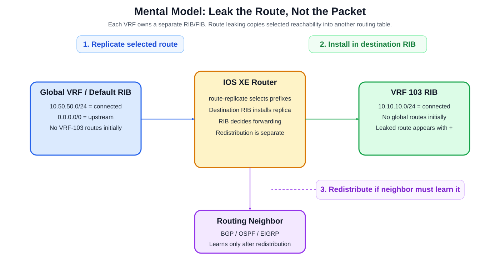
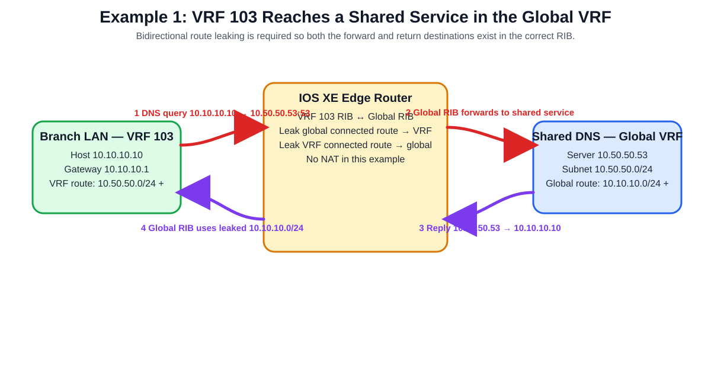
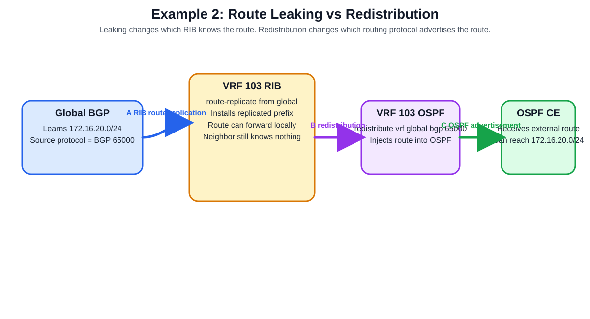
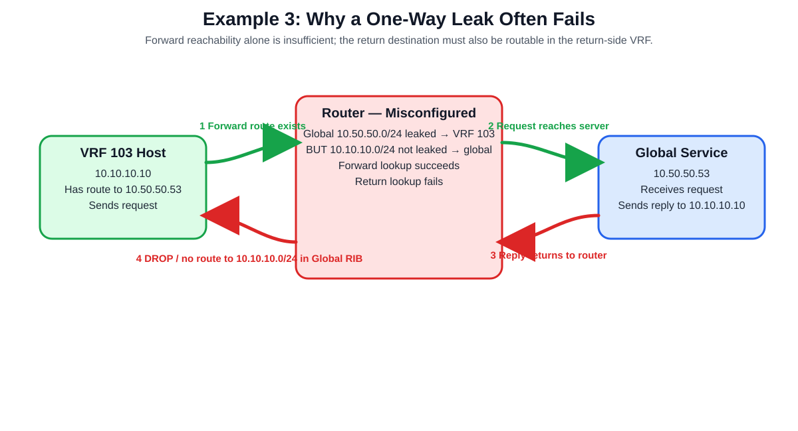

# Cisco IOS XE Route Leaking and Redistribution — Visual Deep Dive

> A visual, example-driven study guide for understanding the Cisco IOS XE concepts in **Configuring Route Leaking and Redistribution**.

## Source URLs

- Cisco IOS XE 17.x — Configuring Route Leaking and Redistribution:  
  https://www.cisco.com/c/en/us/td/docs/routers/ios/config/17-x/ip-routing/b-ip-routing/m-configure-route-leaking-and-redistribution.html
- Cisco Support — Configure VRF Leaks on IOS XE:  
  https://www.cisco.com/c/en/us/support/docs/ip/ip-routing/216541-vrf-configuration-examples-on-ios-xe.html

## Table of Contents

1. [The shortest possible mental model](#1-the-shortest-possible-mental-model)
2. [VRF, RIB, FIB, leaking, and redistribution](#2-vrf-rib-fib-leaking-and-redistribution)
3. [Example 1 — shared service in the global VRF](#3-example-1--shared-service-in-the-global-vrf)
4. [Example 2 — leaking versus redistribution](#4-example-2--leaking-versus-redistribution)
5. [Example 3 — the one-way-leak failure](#5-example-3--the-one-way-leak-failure)
6. [Cisco IOS XE route-replicate configuration](#6-cisco-ios-xe-route-replicate-configuration)
7. [Filtering leaked routes](#7-filtering-leaked-routes)
8. [VRF-to-VRF route leaking](#8-vrf-to-vrf-route-leaking)
9. [Route preference and loop prevention](#9-route-preference-and-loop-prevention)
10. [Verification](#10-verification)
11. [Troubleshooting by symptom](#11-troubleshooting-by-symptom)
12. [Common mistakes](#12-common-mistakes)
13. [Versions, limitations, and support boundaries](#13-versions-limitations-and-support-boundaries)
14. [Sources](#14-sources)

---

## 1. The shortest possible mental model

A **Virtual Routing and Forwarding (VRF)** instance is a separate routing universe inside the same router.

If a router has:

- the **global/default VRF**, and
- **VRF 103**,

then it has separate routing tables. A route present in one table is **not automatically usable by the other**.

**Route leaking** deliberately copies selected reachability from one routing table into another.

**Redistribution** is different: it takes routes known to one routing source/protocol and injects them into another routing protocol so that routing neighbors can learn them.

Think of it this way:

| Operation | Primary question it answers |
|---|---|
| Route leaking / route replication | **Does this VRF's own routing table know the destination?** |
| Redistribution | **Should a routing protocol advertise that route to other routers?** |
| Packet forwarding | **Given the selected route in the FIB, where does the packet go next?** |

Cisco states that the IOS XE feature in the supplied chapter performs route leaking through the **Routing Information Base (RIB)**. The route is replicated between the global VRF and a service VPN/VRF. Redistribution is then optional and is used when the leaked route must be advertised to routing neighbors.



[Editable draw.io source](images/09-13-26-09-27_route_leaking_mental_model_v2.drawio)

**What this image shows:** the difference between putting a route into another RIB and advertising that route through BGP/OSPF/EIGRP.

**What matters:** a packet does not literally "jump through a route leak." The router performs a normal route lookup in the packet's VRF. Route leaking makes the needed prefix available in that lookup table.

**What to verify:** first verify the leaked prefix exists in the destination VRF RIB; only then troubleshoot protocol redistribution.

---

## 2. VRF, RIB, FIB, leaking, and redistribution

### 2.1 VRF

A VRF creates an independent Layer-3 routing domain. Interfaces assigned to a VRF perform route lookup against that VRF rather than the default table.

### 2.2 RIB

The **Routing Information Base (RIB)** is the control-plane routing table. It contains routes learned from connected networks, static routes, BGP, OSPF, EIGRP, and other sources.

### 2.3 FIB

The **Forwarding Information Base (FIB)** is the forwarding-plane structure programmed from selected RIB entries. Packets use the forwarding result, not a routing protocol directly.

### 2.4 Route leaking

In the supplied IOS XE feature, `route-replicate` selects routes from a source VRF and replicates them into the destination VRF's RIB.

Cisco's IOS XE 17.x documentation supports these route sources for the feature:

- connected
- static
- BGP
- OSPF
- EIGRP, with restrictions discussed later

### 2.5 Redistribution

Redistribution takes routing information from one source and introduces it into another protocol process. For example:

```cli
router bgp 100
 address-family ipv4 vrf 103
  redistribute vrf global bgp 100 route-map test2
```

The important distinction is that **a route can be present in the VRF RIB without being advertised to an attached routing neighbor**.

---

## 3. Example 1 — shared service in the global VRF

This is the cleanest way to understand why route leaking exists.

### 3.1 Topology

Assume:

- VRF 103 branch LAN: `10.10.10.0/24`
- Branch host: `10.10.10.10`
- Global-VRF shared-services LAN: `10.50.50.0/24`
- DNS server: `10.50.50.53`

Initially:

**VRF 103 RIB**

```text
10.10.10.0/24  connected
```

**Global RIB**

```text
10.50.50.0/24  connected
```

The tables are intentionally separate.

### 3.2 Desired result

VRF 103 must learn how to reach the global shared-service prefix, while the global VRF must learn how to return traffic to the VRF 103 client prefix.



[Editable draw.io source](images/09-13-26-09-27_global_vrf_shared_service_packet_flow.drawio)

**What this image shows:** both the forward and return route requirements.

**What matters:** this is **bidirectional routing**, not NAT. The original source and destination IP addresses can remain unchanged; the key requirement is that each routing context has a route for the remote prefix.

**What to verify:** VRF 103 should contain `10.50.50.0/24`, and the global table should contain `10.10.10.0/24`.

### 3.3 IOS XE example

A conceptually equivalent configuration using connected routes is:

```cli
vrf definition 103
 address-family ipv4
  route-replicate from vrf global unicast connected
 exit-address-family

global-address-family ipv4
 route-replicate from vrf 103 unicast connected
exit-address-family
```

This pattern is directly aligned with Cisco's documented example for leaking connected routes bidirectionally between the global VRF and VRF 103.

### 3.4 Forward packet

Packet before forwarding:

```text
Source IP:      10.10.10.10
Destination IP: 10.50.50.53
Protocol:       UDP
Destination:    53
Ingress VRF:    103
```

1. Host sends the DNS request to its default gateway.
2. The router receives the packet on an interface associated with VRF 103.
3. The router performs a lookup in the **VRF 103 RIB/FIB**.
4. Because `10.50.50.0/24` was replicated from the global VRF, VRF 103 has usable reachability.
5. The packet is forwarded toward the shared-service network.

### 3.5 Return packet

```text
Source IP:      10.50.50.53
Destination IP: 10.10.10.10
Protocol:       UDP
Source:         53
Return VRF:     global/default
```

The return path works only if the global table has a route to `10.10.10.0/24`. That is why the reverse route leak is critical in a bidirectional conversation.

---

## 4. Example 2 — leaking versus redistribution

Now add a routing neighbor.

Assume the global VRF learns `172.16.20.0/24` through BGP, and an OSPF-speaking CE router is connected inside VRF 103.



[Editable draw.io source](images/09-13-26-09-27_leak_then_redistribute.drawio)

**What this image shows:** route replication and routing-protocol redistribution are two separate control-plane stages.

**What matters:** after the route is replicated into VRF 103, the IOS XE router itself can use that route for VRF-103 forwarding. The OSPF CE still needs the route to be injected into OSPF before it can learn the prefix dynamically.

**What to verify:** confirm the prefix in the VRF RIB first, then confirm it in the destination protocol database/neighbor.

### 4.1 Stage A — route leaking

Source:

```text
Global RIB:
BGP 172.16.20.0/24
```

Destination after replication:

```text
VRF 103 RIB:
replicated 172.16.20.0/24
```

### 4.2 Stage B — redistribution

If an OSPF neighbor in VRF 103 must learn the route, the leaked route must be injected into the VRF's OSPF process using the syntax supported for the desired source protocol.

Cisco documents this general pattern:

```cli
vrf definition <vrf-name>
 address-family ipv4
  route-replicate from vrf global unicast <source-protocol> [instance-id] [route-map <name>]

router ospf <ospf-process> vrf <vrf-name>
 redistribute vrf global <source-protocol> [instance-id] [route-map <name>]
```

The exact source protocol and instance must match the source route you intend to leak.

---

## 5. Example 3 — the one-way-leak failure

A common failure is configuring only the route needed for the forward direction.



[Editable draw.io source](images/09-13-26-09-27_one_way_leak_failure.drawio)

**What this image shows:** the request succeeds until the return lookup reaches a routing table that does not know the client prefix.

**What matters:** stateful applications require return reachability. A working forward lookup does not prove the design is complete.

**What to verify:** use a route lookup in both contexts for both endpoint addresses.

The diagnostic thought process should be:

```text
Forward:
VRF 103 -> destination 10.50.50.53
Does VRF 103 know 10.50.50.0/24?

Return:
Global -> destination 10.10.10.10
Does global know 10.10.10.0/24?
```

If the answer to the second question is no, the response reaches the router and stops there.

---

## 6. Cisco IOS XE route-replicate configuration

### 6.1 Service VRF into global VRF

Cisco documents this pattern for leaking a route from a service VRF into the global VRF and optionally redistributing it into global BGP:

```cli
configure terminal
 global-address-family ipv4 unicast
  route-replicate from vrf <src-vrf-name> unicast <src-protocol> [src-protocol-id] [route-map <route-map-name>]

 router bgp <router-instance-id>
  address-family ipv4
   redistribute vrf <src-vrf-name> <src-protocol> [src-protocol-id] [route-map <route-map-name>]
```

### 6.2 Global VRF into service VRF

Cisco documents this pattern:

```cli
configure terminal
 vrf definition <vrf-name>
  address-family ipv4
   route-replicate from vrf global unicast <src-protocol> [src-protocol-id] [route-map <route-map-name>]

 router bgp <router-instance-id>
  address-family ipv4 vrf <vrf-name>
   redistribute vrf global <src-protocol> [src-protocol-id] [route-map <route-map-name>]
```

For OSPF, Cisco documents the corresponding VRF OSPF form:

```cli
router ospf <router-instance-id> vrf <vrf-name>
 redistribute vrf global <src-protocol> [src-protocol-id] [route-map <route-map-name>]
```

Cisco notes that the protocol instance identifier is not needed for static or connected routes, but is applicable to protocols such as BGP, OSPF, and EIGRP.

### 6.3 Cisco's connected-route example

Cisco provides this simple bidirectional example:

```cli
vrf definition 103
 address-family ipv4
  route-replicate from vrf global unicast connected

global-address-family ipv4
 route-replicate from vrf 103 unicast connected
 exit-address-family
```

This is useful for learning because it removes routing-protocol complexity. It lets you observe route replication itself.

---

## 7. Filtering leaked routes

Route leaking should normally be selective.

If the goal is only to expose shared DNS and NTP services, leaking every route is broader than necessary.

Conceptual policy:

```text
Permit:
10.50.50.53/32  DNS
10.50.50.123/32 NTP

Deny:
all other global routes
```

Apply a route map to `route-replicate` according to the documented syntax:

```cli
route-replicate from vrf global unicast <protocol> [instance] route-map <name>
```

For the specific global/service-VRF `route-replicate` feature in the supplied IOS XE guide, Cisco documents route-map matching restrictions: only **prefix-lists, tags, communities, and metrics** can be matched for filtering leaked routes.

This is an important design boundary: do not assume every route-map match condition available elsewhere in IOS XE is valid here.

---

## 8. VRF-to-VRF route leaking

The supplied IOS XE chapter is specifically about **global/default VRF ↔ service VPN/VRF** leaking.

Cisco's separate support document also demonstrates VRF-to-VRF leaking using import/export mechanisms and route targets.

That is a related but distinct configuration model.

Example conceptual requirement:

```text
VRF A:
  172.16.10.10/32

VRF B:
  192.168.11.11/32

Requirement:
  A must reach B
  B must reach A
```

Cisco's support example uses route targets such as:

```cli
vrf definition A
 rd 1:2
 address-family ipv4
  route-target export 1:2
  route-target import 2:2

vrf definition B
 rd 2:2
 address-family ipv4
  route-target import 1:2
  route-target export 2:2
```

The route target is effectively the import/export membership signal: a VRF imports routes carrying a route target it has been configured to import.

Do not mix this mentally with `route-replicate`:

- `route-replicate`: direct RIB replication used by the supplied global/service-VRF feature.
- route-target import/export: MP-BGP/VRF-style route import/export mechanism used in other VRF leaking designs.

---

## 9. Route preference and loop prevention

Cisco documents route preference behavior for replicated routes.

A particularly important rule is that when a device has both a non-replicated and replicated route from the same source VRF, the **non-replicated route is preferred**.

When that special case does not apply, Cisco documents comparison criteria including:

1. lower administrative distance;
2. lower default administrative distance;
3. non-replicated over replicated;
4. original VRF name comparison;
5. original sub-address-family preference;
6. oldest route.

### 9.1 Avoid `unicast all`

Cisco explicitly warns against this form under the global address family:

```cli
global-address-family ipv4
 route-replicate from vrf <vrf> unicast all
```

The documentation says to specify a protocol instead, for example:

```cli
global-address-family ipv4
 route-replicate from vrf <vrf> unicast connected
```

The reason is route-loop prevention. Route leaking and redistribution can easily create feedback if routes are reintroduced without carefully constraining origin and direction.

---

## 10. Verification

### 10.1 Check the global RIB

```cli
show ip route
```

**What it tests:** whether the global/default VRF has the expected original and leaked prefixes.

**Important field:** Cisco documents that a leaked/replicated route is marked with a **`+`** in route-code output.

**Success criteria:** the required service-VRF prefix appears in the global table with the expected source/replicated indication and valid next-hop information.

**Failure indicator:** no remote prefix, unexpected next hop, or a different route wins.

**Next action:** inspect the `route-replicate` source protocol and route-map.

### 10.2 Check the service VRF RIB

```cli
show ip route vrf 103
```

**What it tests:** whether the destination prefix actually exists in VRF 103.

**Success criteria:** the expected global prefix appears in VRF 103.

**Failure indicator:** the source prefix exists globally but is absent from VRF 103.

**Next action:** check the VRF's `address-family ipv4` and its `route-replicate from vrf global ...` statement.

### 10.3 Check both endpoint directions

For the shared-service example, verify:

```text
VRF 103 RIB:
10.50.50.0/24 must exist

Global RIB:
10.10.10.0/24 must exist
```

This is one of the fastest ways to identify a one-way leak.

### 10.4 Verify redistribution separately

If a downstream BGP/OSPF/EIGRP peer must learn the route:

1. Confirm the route is present in the destination VRF RIB.
2. Confirm the redistribution statement references the correct source VRF and source protocol.
3. Confirm the route map permits the prefix.
4. Confirm the destination routing protocol contains/advertises it.
5. Confirm the neighbor installs it.

Do not start by troubleshooting the neighbor if the route never reached the destination RIB.

---

## 11. Troubleshooting by symptom

### Symptom: Router can reach the destination, downstream CE cannot

**Where:** destination VRF on the leaking router.

**Tool:**
```cli
show ip route vrf <vrf>
```

**What it tests:** whether leaking succeeded locally.

**Likely meaning:** route leaking is working, but redistribution/advertisement to the CE is missing or filtered.

**Next action:** inspect destination routing protocol redistribution and neighbor advertisements.

### Symptom: Request reaches the service but no reply returns

**Where:** return-side routing table.

**Tool:**
```cli
show ip route
```
or
```cli
show ip route vrf <vrf>
```

**What it tests:** whether the return destination exists in the correct routing context.

**Likely meaning:** one-way route leak, missing route advertisement, or wrong return routing.

**Next action:** add/repair the reverse route leak or routing advertisement; do not attempt to hide the problem with NAT unless NAT is actually part of the design.

### Symptom: Too many routes are leaking

**Where:** `route-replicate` policy.

**What it tests:** route-map filtering scope.

**Failure meaning:** policy is too broad or the source protocol selection is too broad.

**Next action:** constrain prefixes with supported route-map match criteria.

### Symptom: Route is present but the wrong path wins

**Where:** RIB selection.

**What it tests:** administrative distance, source/origin, and replicated-vs-native preference.

**Next action:** compare competing routes and apply Cisco's documented preference rules before changing metrics blindly.

### Symptom: Routes appear to feed back or churn

**Where:** both leak directions plus redistribution points.

**What it tests:** route feedback.

**Failure meaning:** a learned route may be redistributed and then leaked back toward its origin.

**Next action:** use explicit source protocols, route maps, tags/communities, and avoid `unicast all` where Cisco warns against it.

---

## 12. Common mistakes

| Mistake | Why it is wrong |
|---|---|
| "Route leaking moves the packet into another VRF." | Route leaking replicates routing information; forwarding still follows the installed route/FIB. |
| "If the forward route is leaked, the application should work." | Bidirectional sessions need return reachability. |
| "Leaking and redistribution are the same thing." | Leaking places reachability into another RIB; redistribution injects routes into a routing protocol. |
| "A leaked route is automatically advertised to every neighbor." | Neighbor advertisement depends on the destination protocol and redistribution/policy. |
| "I can safely leak everything." | Broad leaks increase blast radius and can contribute to loops or unintended connectivity. |
| "The supplied chapter supports service-VRF-to-service-VRF route-replicate." | Cisco's supplied feature documentation says this specific feature is global-VRF ↔ service-VRF only. |
| "IPv6 works because IPv4 does." | Cisco documents IPv6 as unsupported for this specific feature. |
| "NAT is required for route leaking." | Route leaking is a routing-control-plane operation; NAT is separate. Cisco also documents service-side NAT as unsupported with this feature. |

---

## 13. Versions, limitations, and support boundaries

### 13.1 Release introduction

Cisco's feature table states:

| Feature | Release |
|---|---|
| Route leaking between global VRF and service VPNs | IOS XE 17.3.1a |
| Redistribution of replicated BGP routes to OSPF/EIGRP | IOS XE 17.5.1a |
| Redistribution of replicated routes into BGP | IOS XE 17.6.1 |

Always verify platform/software-image support with Cisco Feature Navigator and the release notes for the exact device.

### 13.2 Documented restrictions for the supplied feature

Cisco documents these important restrictions:

- service-side NAT is not supported with route leaking between global VRF and service VPNs;
- the feature is global-VRF ↔ service-VRF and does not support service-VRF ↔ service-VRF route leaking through this mechanism;
- IPv6 is not supported;
- EIGRP has direction/use restrictions in this feature;
- route-map filtering for leaked routes supports only documented match categories;
- avoid `unicast all` in the documented case because of route-loop risk.

### 13.3 Source information vs explanation vs inference

**Source information:** command syntax, supported protocols, documented restrictions, release introduction, route preference behavior, and the `+` replicated-route notation are taken from Cisco documentation listed below.

**Additional explanation:** the DNS/shared-service examples, packet walks, and mental models in this guide are teaching examples constructed to illustrate Cisco's documented behavior.

**Reasonable inference:** if a return-side RIB lacks the return destination, ordinary IP forwarding cannot deliver the reply through that table. This follows standard routing behavior, but the exact drop/debug message can vary by platform and release.

---

## 14. Sources

1. Cisco IOS XE 17.x — Configuring Route Leaking and Redistribution  
   https://www.cisco.com/c/en/us/td/docs/routers/ios/config/17-x/ip-routing/b-ip-routing/m-configure-route-leaking-and-redistribution.html

2. Cisco Support — Configure VRF Leaks on IOS XE  
   https://www.cisco.com/c/en/us/support/docs/ip/ip-routing/216541-vrf-configuration-examples-on-ios-xe.html
