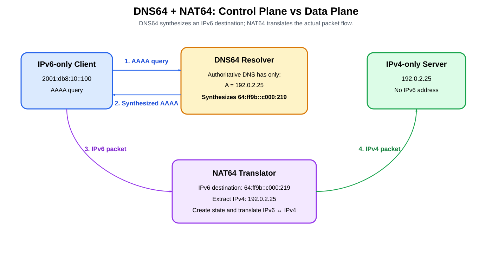
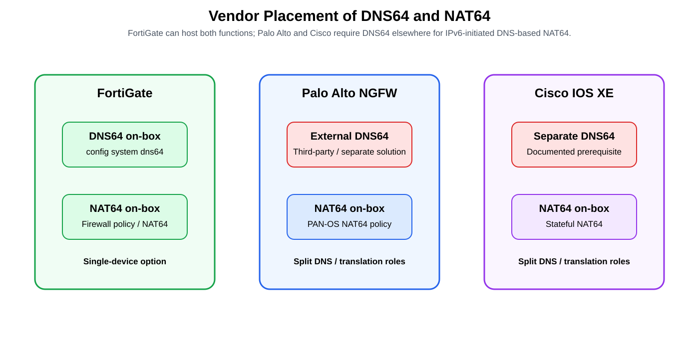
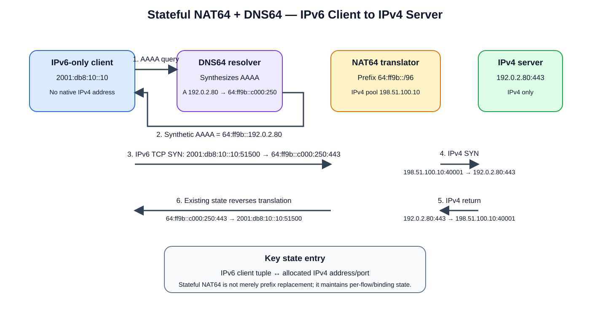
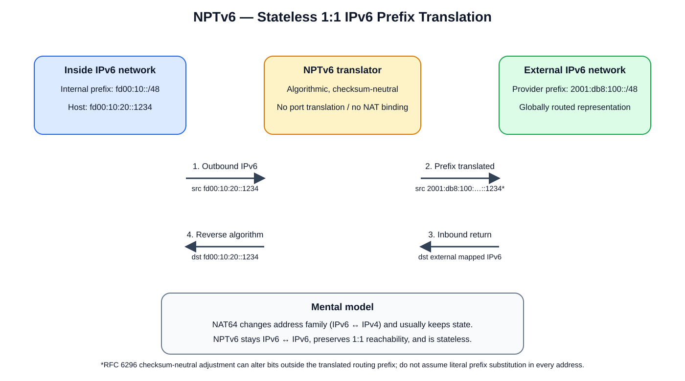

# DNS64 and NAT64 Across Fortinet, Palo Alto Networks, and Cisco — Deep Dive

## COPY/PASTE — Palo Alto Set Commands

### NPTv6 — complete set block

```cli
configure

set address NPTV6-INSIDE ip-netmask fd00:10:10::/64
set address NPTV6-OUTSIDE ip-netmask 2001:db8:100:10::/64

set rulebase nat rules NPTV6-OUT nat-type nptv6
set rulebase nat rules NPTV6-OUT from Trust-v6
set rulebase nat rules NPTV6-OUT to Untrust-v6
set rulebase nat rules NPTV6-OUT source NPTV6-INSIDE
set rulebase nat rules NPTV6-OUT destination any
set rulebase nat rules NPTV6-OUT service any
set rulebase nat rules NPTV6-OUT source-translation static-ip translated-address NPTV6-OUTSIDE
set rulebase nat rules NPTV6-OUT source-translation static-ip bi-directional yes

set rulebase security rules NPTV6-OUT-ALLOW from Trust-v6
set rulebase security rules NPTV6-OUT-ALLOW to Untrust-v6
set rulebase security rules NPTV6-OUT-ALLOW source NPTV6-INSIDE
set rulebase security rules NPTV6-OUT-ALLOW destination any
set rulebase security rules NPTV6-OUT-ALLOW application any
set rulebase security rules NPTV6-OUT-ALLOW service application-default
set rulebase security rules NPTV6-OUT-ALLOW action allow

commit
```

### NAT64 — complete set block

```cli
configure

set address IPV6-CLIENTS ip-netmask 2001:db8:10::/64
set address NAT64-PREFIX ip-netmask 64:ff9b::/96
set address NAT64-IPV4-SNAT ip-netmask 203.0.113.10/32

set rulebase nat rules NAT64-V6-OUT nat-type nat64
set rulebase nat rules NAT64-V6-OUT from Trust-v6
set rulebase nat rules NAT64-V6-OUT to Untrust-v4
set rulebase nat rules NAT64-V6-OUT source IPV6-CLIENTS
set rulebase nat rules NAT64-V6-OUT destination NAT64-PREFIX
set rulebase nat rules NAT64-V6-OUT service any
set rulebase nat rules NAT64-V6-OUT source-translation dynamic-ip-and-port translated-address NAT64-IPV4-SNAT

set rulebase security rules NAT64-V6-OUT-ALLOW from Trust-v6
set rulebase security rules NAT64-V6-OUT-ALLOW to Untrust-v4
set rulebase security rules NAT64-V6-OUT-ALLOW source IPV6-CLIENTS
set rulebase security rules NAT64-V6-OUT-ALLOW destination NAT64-PREFIX
set rulebase security rules NAT64-V6-OUT-ALLOW application any
set rulebase security rules NAT64-V6-OUT-ALLOW service application-default
set rulebase security rules NAT64-V6-OUT-ALLOW action allow

commit
```

> **PAN-OS version note:** These are PAN-OS 11.2-style local firewall CLI commands. Validate the exact hierarchy on your target release before pasting, especially PAN-OS 12.1 and later.

---

## Source URLs

- Fortinet FortiGate — NAT64 policy and DNS64 (DNS proxy)  
  https://docs.fortinet.com/document/fortigate/latest/administration-guide/443324/nat64-policy-and-dns64-dns-proxy
- Fortinet FortiGate — NAT66, NAT46, NAT64, and DNS64  
  https://docs.fortinet.com/document/fortigate/7.4.10/administration-guide/627219/nat66-nat46-nat64-and-dns64
- Palo Alto Networks — NAT64  
  https://docs.paloaltonetworks.com/ngfw/networking/nat64
- Palo Alto Networks — DNS64 Server  
  https://docs.paloaltonetworks.com/pan-os/10-1/pan-os-networking-admin/nat64/path-mtu-discovery
- Cisco IOS XE 17.x — Stateful NAT64  
  https://www.cisco.com/c/en/us/td/docs/routers/ios/config/17-x/ip-addressing/b-ip-addressing/m_iadnat-stateful-nat64.html

## Table of Contents

1. [Core mental model](#1-core-mental-model)
2. [Vendor comparison](#2-vendor-comparison)
3. [DNS64 packet flow](#3-dns64-packet-flow)
4. [FortiGate](#4-fortigate)
5. [Palo Alto Networks](#5-palo-alto-networks)
6. [Cisco IOS XE](#6-cisco-ios-xe)
7. [Palo Alto NPTv6 and NAT64 set-CLI examples](#7-palo-alto-nptv6-and-nat64-set-cli-examples)
8. [Operational caveats](#8-operational-caveats)
9. [Verification and troubleshooting](#9-verification-and-troubleshooting)
10. [Common mistakes](#10-common-mistakes)
11. [Sources](#11-sources)

---

## 1. Core mental model

**DNS64 and NAT64 are different functions.**

- **DNS64** is a DNS synthesis function. It creates an IPv6 AAAA response from an IPv4 A record when an IPv6-only client needs to reach an IPv4-only destination.
- **NAT64** is a packet-translation function. It translates the actual IPv6 flow into IPv4 and maintains the required state for the return traffic.

A common prefix is the RFC 6052 Well-Known Prefix:

```text
64:ff9b::/96
```

If DNS returns:

```text
A = 192.0.2.25
```

DNS64 can synthesize:

```text
AAAA = 64:ff9b::c000:219
```

The final 32 bits encode the IPv4 address.



[Editable draw.io source](images/09-13-26-10-00_dns64_nat64_control_data_plane.drawio)

**What this image shows:** DNS64 creates the destination IPv6 address before the application opens a connection. NAT64 translates the subsequent data packets.

**What matters:** a NAT64 device does not inherently need to be the DNS64 server. The two functions can be colocated or separated.

**What to verify:** the DNS64 prefix and the NAT64 translation prefix must match.

---

## 2. Vendor comparison

| Vendor / platform | NAT64 on device | DNS64 on device | Practical design |
|---|---:|---:|---|
| **Fortinet FortiGate / FortiOS** | Yes | **Yes** | One FortiGate can provide DNS64 plus NAT64 |
| **Palo Alto Networks NGFW / PAN-OS** | Yes | **No native DNS64 synthesis for this workflow** | Use a separate/third-party DNS64 solution |
| **Cisco IOS XE** | Yes | **No integrated DNS64 prerequisite replacement documented** | Cisco explicitly requires a separate working DNS64 installation for DNS-based NAT64 |



[Editable draw.io source](images/09-13-26-10-00_dns64_nat64_vendor_placement.drawio)

**What this image shows:** FortiGate can colocate DNS64 and NAT64, while Palo Alto and Cisco separate name synthesis from translation.

**What matters:** the external DNS64 server is not forwarding the user data through itself. It only synthesizes the AAAA record. The NAT64 device remains the data-plane translator.

**What to verify:** confirm the external DNS64 server uses the exact NAT64 prefix expected by the firewall/router.

---

## 3. DNS64 packet flow

Assume:

- IPv6-only client: `2001:db8:10::100`
- IPv4-only server: `192.0.2.25`
- NAT64 prefix: `64:ff9b::/96`

### 3.1 DNS stage

1. Client sends a DNS AAAA query for the target hostname.
2. The resolver/DNS64 function checks for an AAAA record.
3. If only an A record exists, DNS64 obtains `192.0.2.25`.
4. DNS64 synthesizes `64:ff9b::c000:219`.
5. The client believes it is connecting to an IPv6 destination.

### 3.2 Data-plane stage

Original IPv6 packet:

```text
Source:      2001:db8:10::100
Destination: 64:ff9b::c000:219
Protocol:    TCP/UDP/ICMP as supported
```

The NAT64 translator recognizes the configured prefix, extracts the embedded IPv4 address, creates/uses translation state, and forwards an IPv4 packet toward:

```text
Destination: 192.0.2.25
```

The return IPv4 packet matches the NAT64 session and is translated back to IPv6.

---

## 4. FortiGate

Fortinet documents native DNS64 on FortiGate in addition to NAT64.

### 4.1 DNS64 configuration

Fortinet documents:

```cli
config system dns64
    set status enable
    set dns64-prefix 64:ff9b::/96
    set always-synthesize-aaaa-record enable
end
```

The default `dns64-prefix` is documented as `64:ff9b::/96`.

FortiGate must also provide DNS service on the relevant IPv6-facing interface so that the client actually sends its DNS queries to the FortiGate.

### 4.2 Synthesis behavior

Fortinet documents two behaviors controlled by:

```cli
set always-synthesize-aaaa-record {enable | disable}
```

With the documented default enabled, DNS64 synthesis is performed according to that mode. If disabled, the DNS proxy first attempts to obtain a real AAAA record and synthesizes an address from the A record when an AAAA record is unavailable.

### 4.3 NAT64 data plane

Fortinet uses NAT64 policy processing to translate the IPv6 packet to IPv4.

Recent FortiOS architecture also uses a per-VDOM NAT46/NAT64 forwarding interface:

```text
naf.<vdom>
```

Fortinet documents that when NAT64 is used with central NAT, policy evaluation can occur in two stages:

```text
IPv6 policy:
srcintf -> naf

translation

IPv4 policy:
naf -> dstintf
```

That policy behavior is important because administrators must ensure the address matching is sufficiently constrained.

### 4.4 Design advantage

FortiGate can own:

```text
DNS64 synthesis
+
NAT64 translation
+
firewall policy
```

on one appliance.

That reduces the number of places where the NAT64 prefix must be synchronized.

---

## 5. Palo Alto Networks

PAN-OS supports NAT64 on the firewall.

Palo Alto documents stateful NAT64 for IPv6-initiated communication and states that a **third-party DNS64 server or other DNS64 solution** must be used when DNS is required for this workflow.

### 5.1 Architecture

```text
IPv6 Client
    |
    | DNS AAAA query
    v
External DNS64
    |
    | synthesized IPv6 destination
    v
IPv6 Client
    |
    | IPv6 packet
    v
Palo Alto NGFW
    |
    | NAT64
    v
IPv4 Server
```

### 5.2 Supported prefixes

Palo Alto documents support for RFC 6052-style IPv4-embedded IPv6 prefixes with these lengths:

```text
/32
/40
/48
/56
/64
/96
```

The prefix can be:

- the Well-Known Prefix `64:ff9b::/96`, or
- a Network-Specific Prefix (NSP).

### 5.3 Important exception

Palo Alto also supports **IPv4-initiated** access to IPv6 servers using static NAT64 mappings.

That use case does **not** require DNS64 because the client starts with an IPv4 destination and the firewall performs the static IPv4-to-IPv6 mapping.

So the statement "Palo Alto requires DNS64" is specifically about the common **IPv6-initiated, DNS-based NAT64 workflow**.

---

## 6. Cisco IOS XE

Cisco IOS XE supports Stateful NAT64.

Cisco's IOS XE 17.x documentation explicitly states:

```text
For DNS traffic to work, you must have a separate working installation of DNS64.
```

Therefore the typical design is:

```text
IPv6 Client
    |
    +---- DNS ----> Separate DNS64
    |
    +---- Data ---> Cisco IOS XE Stateful NAT64 ---> IPv4 Server
```

### 6.1 Data-plane role

IOS XE performs stateful IPv6/IPv4 translation using a configured NAT64 stateful prefix.

The router is therefore responsible for:

- recognizing the NAT64 prefix;
- translating IPv6 source/destination information to IPv4;
- creating translation state;
- forwarding the translated packet;
- translating the return flow back to IPv6.

### 6.2 Cisco restrictions

Cisco documents platform/release-specific restrictions for Stateful NAT64. Depending on platform and IOS XE release these can include:

- application issues where no required ALG exists;
- multicast restrictions;
- restrictions on IPv4 options and IPv6 extension headers;
- VRF-aware NAT64 support differences by platform/release;
- prefix and source-address restrictions to avoid translation loops.

Always check the exact platform's IOS XE configuration guide rather than assuming all IOS XE devices have identical NAT64 capabilities.

---

## 7. Palo Alto NPTv6 and NAT64 set-CLI examples

> **Version note:** The examples below use PAN-OS 11.2-style local firewall `set` syntax. Palo Alto documents direct `set rulebase nat ...` commands in PAN-OS 11.2, while PAN-OS 12.1 lists that command family among removed set commands. Validate the command hierarchy on the target release before pasting.

### 7.1 NPTv6 — IPv6 prefix-to-prefix translation

Example goal:

```text
Internal ULA:       fd00:10:10::/64
Translated GUA:     2001:db8:100:10::/64
Internal host:      fd00:10:10::1234
External identity:  2001:db8:100:10::1234
```


[Editable draw.io](images/09-13-26-10-35_palo_alto_nptv6_configuration.drawio)

**What this image shows:** PAN-OS translates the IPv6 network prefix while preserving the host/interface identifier.

**What matters:** NPTv6 is IPv6-to-IPv6 and stateless; it does not perform IPv6-to-IPv4 translation.

**What to verify:** the translated GUA prefix is routed back toward the firewall and an explicit Security policy allows the traffic.

#### Address objects

```cli
configure

set address NPTV6-INSIDE ip-netmask fd00:10:10::/64
set address NPTV6-OUTSIDE ip-netmask 2001:db8:100:10::/64
```

#### NPTv6 NAT rule

```cli
set rulebase nat rules NPTV6-OUT nat-type nptv6
set rulebase nat rules NPTV6-OUT from Trust-v6
set rulebase nat rules NPTV6-OUT to Untrust-v6
set rulebase nat rules NPTV6-OUT source NPTV6-INSIDE
set rulebase nat rules NPTV6-OUT destination any
set rulebase nat rules NPTV6-OUT service any
set rulebase nat rules NPTV6-OUT source-translation static-ip translated-address NPTV6-OUTSIDE
set rulebase nat rules NPTV6-OUT source-translation static-ip bi-directional yes
```

#### NPTv6 security rule

```cli
set rulebase security rules NPTV6-OUT-ALLOW from Trust-v6
set rulebase security rules NPTV6-OUT-ALLOW to Untrust-v6
set rulebase security rules NPTV6-OUT-ALLOW source NPTV6-INSIDE
set rulebase security rules NPTV6-OUT-ALLOW destination any
set rulebase security rules NPTV6-OUT-ALLOW application any
set rulebase security rules NPTV6-OUT-ALLOW service application-default
set rulebase security rules NPTV6-OUT-ALLOW action allow
```

Packet transformation:

```text
Before:
SRC fd00:10:10::1234
DST 2001:db8:ffff::80

After:
SRC 2001:db8:100:10::1234
DST 2001:db8:ffff::80
```

### 7.2 NAT64 — IPv6 client to IPv4-only server

Example goal:

```text
IPv6 client:            2001:db8:10::100
NAT64 prefix:           64:ff9b::/96
IPv4-only server:       192.0.2.25
DNS64 synthesized AAAA: 64:ff9b::c000:219
IPv4 SNAT address:      203.0.113.10
```


[Editable draw.io](images/09-13-26-10-35_palo_alto_nat64_configuration.drawio)

**What this image shows:** external DNS64 synthesizes the IPv6 destination and PAN-OS performs the stateful IPv6-to-IPv4 translation.

**What matters:** for this IPv6-initiated workflow, PAN-OS extracts the embedded IPv4 destination from the NAT64 address; no destination-translation command is added to the NAT64 rule.

**What to verify:** DNS64 synthesis prefix, NAT64 match prefix, IPv4 source translation, IPv4 routing, and return-path symmetry all agree.

#### Address objects

```cli
configure

set address IPV6-CLIENTS ip-netmask 2001:db8:10::/64
set address NAT64-PREFIX ip-netmask 64:ff9b::/96
set address NAT64-IPV4-SNAT ip-netmask 203.0.113.10/32
```

#### NAT64 NAT rule

```cli
set rulebase nat rules NAT64-V6-OUT nat-type nat64
set rulebase nat rules NAT64-V6-OUT from Trust-v6
set rulebase nat rules NAT64-V6-OUT to Untrust-v4
set rulebase nat rules NAT64-V6-OUT source IPV6-CLIENTS
set rulebase nat rules NAT64-V6-OUT destination NAT64-PREFIX
set rulebase nat rules NAT64-V6-OUT service any
set rulebase nat rules NAT64-V6-OUT source-translation dynamic-ip-and-port translated-address NAT64-IPV4-SNAT
```

#### NAT64 security rule

Palo Alto security policy evaluates **pre-NAT source/destination IP addresses** but uses the **post-NAT destination zone**.

```cli
set rulebase security rules NAT64-V6-OUT-ALLOW from Trust-v6
set rulebase security rules NAT64-V6-OUT-ALLOW to Untrust-v4
set rulebase security rules NAT64-V6-OUT-ALLOW source IPV6-CLIENTS
set rulebase security rules NAT64-V6-OUT-ALLOW destination NAT64-PREFIX
set rulebase security rules NAT64-V6-OUT-ALLOW application any
set rulebase security rules NAT64-V6-OUT-ALLOW service application-default
set rulebase security rules NAT64-V6-OUT-ALLOW action allow
```

Packet transformation:

```text
Before NAT64:
SRC 2001:db8:10::100
DST 64:ff9b::c000:219

After NAT64:
SRC 203.0.113.10
DST 192.0.2.25
```

#### Commit and verify

```cli
commit
```

```cli
> set cli config-output-format set
> configure
# show rulebase nat
```

For NAT64 session verification:

```cli
> show session all filter source 2001:db8:10::100
> show session id <session-id>
```

---

## 8. Operational caveats

### 7.1 DNS64 and NAT64 prefixes must agree

If DNS64 synthesizes:

```text
64:ff9b::/96
```

but NAT64 expects:

```text
2001:db8:64::/96
```

the translator will not recognize the synthesized destination as belonging to its NAT64 domain.

### 7.2 Real AAAA records

If a hostname already has a reachable native AAAA record, a DNS64 implementation can prefer the real IPv6 path rather than synthesizing one, depending on product configuration.

This is why FortiGate's `always-synthesize-aaaa-record` behavior matters operationally.

### 7.3 DNSSEC

DNS64 changes DNS answers by synthesizing AAAA data from A records. DNSSEC validation therefore requires careful architecture because synthesis and validation points interact.

Do not assume arbitrary end-to-end DNSSEC validation will work unchanged through a DNS64 design. Use the DNS64 implementation's documented DNSSEC guidance.

### 7.4 Literal IPv4 addresses

DNS64 helps only when the application performs DNS resolution.

If an IPv6-only application is hard-coded to connect to:

```text
192.0.2.25
```

DNS64 never participates.

The application or operating system needs another mechanism such as address synthesis at the host, application changes, or an explicit IPv6-mapped destination strategy appropriate to the environment.

### 7.5 Stateful symmetry

Stateful NAT64 maintains connection state. Return traffic must reach the same translation state or an HA mechanism that synchronizes that state if the platform supports it.

---

## 9. Verification and troubleshooting

### Symptom: AAAA lookup returns no usable address

**Where:** DNS64 service.

**What to test:**

```text
AAAA query for an IPv4-only destination
```

**Expected:** a synthesized AAAA record containing the configured NAT64 prefix.

**Failure meaning:** DNS64 is not enabled, the client is not using the DNS64 server, upstream DNS resolution failed, or synthesis policy prevented synthesis.

**Next action:** verify the resolver path and prefix configuration.

### Symptom: Synthesized AAAA exists but connection fails immediately

**Where:** NAT64 translator.

**What to test:** confirm the destination prefix received by the translator matches its configured NAT64 prefix.

**Expected:**

```text
DNS64 prefix == NAT64 translation prefix
```

**Failure meaning:** prefix mismatch or traffic bypassing the translator.

### Symptom: Forward packet translates but return traffic fails

**Where:** IPv4 routing and NAT64 session state.

**What to test:**

- IPv4 route toward the server;
- return route toward the translator;
- state/session table;
- HA symmetry;
- firewall/security policy.

**Failure meaning:** asymmetric path, missing route, policy denial, or lost translation state.

### FortiGate-specific checks

Verify:

- DNS service is enabled on the correct IPv6-facing interface;
- `config system dns64` is enabled;
- the configured DNS64 prefix matches NAT64;
- the NAT64 firewall policy is correct;
- if central NAT is used, both pre- and post-translation policy stages match intentionally.

### Palo Alto-specific checks

Verify:

- the external DNS64 server returns an address from the NAT64 prefix;
- the PAN-OS NAT64 rule uses that prefix;
- the traffic matches the correct security and NAT policy;
- the session table shows the translated flow.

### Cisco-specific checks

Verify:

- DNS is actually pointed at a working DNS64 implementation;
- the stateful NAT64 prefix matches the DNS64 synthesis prefix;
- the NAT64 mapping/state exists;
- IPv4 and IPv6 routing both lead through the translator.

---

## 10. Common mistakes

| Mistake | Correction |
|---|---|
| "NAT64 automatically performs DNS64." | They are separate functions. Some products colocate them; others do not. |
| "Palo Alto has NAT64, therefore it also answers DNS64 queries." | PAN-OS requires a separate/third-party DNS64 solution for the common IPv6-initiated DNS workflow. |
| "Cisco IOS XE NAT64 replaces the DNS64 server." | Cisco explicitly documents separate DNS64 as a prerequisite for DNS traffic. |
| "FortiGate always needs an external DNS64 appliance." | FortiGate has native DNS64 through its DNS proxy. |
| "DNS64 carries the application packets." | DNS64 only provides the synthesized DNS response. NAT64 carries/translates the data flow. |
| "Any IPv6 prefix can be used without coordination." | DNS64 and NAT64 must use compatible, matching translation prefixes. |
| "If DNS works, NAT64 must work." | DNS synthesis and packet translation are independent operational stages. |

---

## 11. Sources

1. Fortinet — NAT64 policy and DNS64 (DNS proxy)  
   https://docs.fortinet.com/document/fortigate/latest/administration-guide/443324/nat64-policy-and-dns64-dns-proxy

2. Fortinet — NAT66, NAT46, NAT64, and DNS64  
   https://docs.fortinet.com/document/fortigate/7.4.10/administration-guide/627219/nat66-nat46-nat64-and-dns64

3. Palo Alto Networks — NAT64  
   https://docs.paloaltonetworks.com/ngfw/networking/nat64

4. Palo Alto Networks — DNS64 Server  
   https://docs.paloaltonetworks.com/pan-os/10-1/pan-os-networking-admin/nat64/path-mtu-discovery

5. Cisco IOS XE 17.x — Stateful Network Address Translation 64  
   https://www.cisco.com/c/en/us/td/docs/routers/ios/config/17-x/ip-addressing/b-ip-addressing/m_iadnat-stateful-nat64.html

---

## 12. Expanded NAT64 and NPTv6 vendor implementation

This section consolidates the unique technical material from the former standalone NAT64/NPTv6 and Palo Alto CLI articles so this file remains the single canonical guide.

### 12.1 NAT64 vs NPTv6 mental model

| Property | NAT64 | NPTv6 |
|---|---|---|
| Address families | IPv6 ↔ IPv4 | IPv6 ↔ IPv6 |
| Primary use | IPv6-only ↔ IPv4-only interoperability | Provider-prefix independence, renumbering, multihoming |
| Typical state | Stateful in common enterprise implementations | Stateless by design |
| Port translation | Often yes with PAT/DIPP | No |
| DNS dependency | DNS64 commonly required for name-based IPv6→IPv4 access | None inherent |
| Address mapping | Many IPv6 clients can share one/few IPv4 addresses | Algorithmic 1:1 |
| Security function | No | No |

> **Mnemonic:** NAT64 changes the address family. NPTv6 keeps IPv6 and changes the prefix.

### 12.2 NAT64 packet-flow example



[Editable draw.io source](images/13-09-26-09-54_nat64_packet_flow.drawio)

**What this image shows:** an IPv6-only client resolves an IPv4-only server through DNS64, sends to an IPv4-embedded IPv6 destination, and the NAT64 device creates the corresponding IPv4 flow.

**What matters:** an address such as `64:ff9b::c000:250` encodes IPv4 `192.0.2.80`; it is not an IPv6 address configured on the IPv4 server.

**What to verify:** route the NAT64 prefix toward the translator, keep the DNS64 and NAT64 prefixes identical, and ensure the translated IPv4 source pool is routable back to the translator.

Example:

```text
IPv6 client:       2001:db8:10::10
IPv4 server:       192.0.2.80:443
NAT64 prefix:      64:ff9b::/96
NAT64 IPv4 pool:   198.51.100.10
```

Forward translation:

```text
Before
2001:db8:10::10:51500 -> 64:ff9b::c000:250:443

After
198.51.100.10:40001 -> 192.0.2.80:443
```

The return packet is matched against the existing NAT64 state and translated back to the original IPv6 client.

### 12.3 NPTv6 packet flow and checksum neutrality



[Editable draw.io source](images/13-09-26-09-54_nptv6_packet_flow.drawio)

**What this image shows:** an inside IPv6 prefix is algorithmically represented by an outside IPv6 prefix.

**What matters:** NPTv6 is deterministic and 1:1; it does not create a many-to-one port mapping.

**What to verify:** upstream routing must return the translated external prefix to the NPTv6 device.

RFC 6296 requires checksum-neutral translation. TCP and UDP checksums include an IPv6 pseudo-header containing source and destination addresses, so the translation algorithm must preserve the checksum contribution. As a result, the mapped address is not always a simplistic visible prefix replacement; a compensating 16-bit adjustment can occur.

Because the mapping is algorithmic and stateless, multiple translators configured with the same inside/outside prefixes can independently calculate the same address mapping. A stateful firewall can still keep **firewall session state**; “stateless NPTv6” refers to the translation mapping itself.

### 12.4 Cisco IOS XE implementation

#### Stateful NAT64

Cisco IOS XE documents Stateful NAT64 with a stateful prefix, an IPv4 pool, and optional overload/PAT.

```cli
ipv6 unicast-routing
!
interface GigabitEthernet0/0/0
 description IPv6-facing
 ipv6 enable
 ipv6 address 2001:DB8:10::1/64
 nat64 enable
!
interface GigabitEthernet0/0/1
 description IPv4-facing
 ip address 198.51.100.1 255.255.255.0
 nat64 enable
!
ipv6 access-list NAT64-V6
 permit ipv6 2001:DB8:10::/64 any
!
nat64 prefix stateful 64:FF9B::/96
nat64 v4 pool V4POOL 198.51.100.10 198.51.100.10
nat64 v6v4 list NAT64-V6 pool V4POOL overload
```

Verification:

```cli
show nat64 translations
show nat64 pools
show nat64 prefix stateful global
show nat64 statistics
show nat64 timeouts
show ipv6 route 64:FF9B::/96
show ip route 198.51.100.10
```

Cisco documents a separate working DNS64 installation as a prerequisite for DNS-based Stateful NAT64.

#### Cisco NPTv6

Cisco exposes NPTv6 through **NAT66** CLI terminology:

```cli
interface GigabitEthernet0/0/0
 nat66 inside
!
interface GigabitEthernet0/0/1
 nat66 outside
!
nat66 prefix inside 2001:DB8:10::/48 outside 2001:DB8:200::/48
```

Verification:

```cli
show nat66 prefix
show nat66 statistics
show platform hardware qfp active feature nat66 datapath prefix
show platform hardware qfp active feature nat66 datapath statistics
```

### 12.5 Palo Alto Networks implementation

The complete PAN-OS NPTv6 and NAT64 `set` command blocks are already consolidated earlier in this guide under **COPY/PASTE — Palo Alto Set Commands** and the detailed Palo Alto configuration section.

Additional operational points from the former standalone article are retained here:

- PAN-OS NAT64 is stateful for IPv6-initiated communication.
- PAN-OS requires a third-party/other DNS64 solution for the common IPv6-initiated DNS-based workflow.
- Security policy is separate from NAT.
- Security policy matches the **original/pre-NAT addresses** while using the **post-NAT destination zone**.
- PAN-OS NPTv6 is stateless translation even though the firewall itself can maintain session state.
- NPTv6 policy fields support IPv6 prefix lengths documented from **/32 through /112**.
- Beginning with PAN-OS 11.1.5, Palo Alto documents source NPTv6 using dynamically assigned IPv6 prefixes from DHCPv6, PPPoEv6, or cellular/5G interfaces.
- NDP Proxy may be required when the translated prefix must be represented as on-link.
- Palo Alto documents the `test nptv6` CLI for applicable checksum-neutral mapping validation scenarios.

Useful verification:

```cli
show session all filter source <ipv6-address>
show session all filter destination <ipv6-address>
show routing route
show neighbor interface all
```

### 12.6 FortiGate implementation

#### NAT64 + DNS64

FortiGate can provide both the DNS64/DNS-proxy function and NAT64 packet translation.

Example objects from Fortinet documentation:

```cli
config system dns-server
    edit "port10"
        set mode forward-only
    next
end

config firewall vip6
    edit "vip6"
        set extip 64:ff9b::-64:ff9b::ffff:ffff
        set embedded-ipv4-address enable
    next
end

config firewall address6
    edit "internal-net6"
        set ip6 2001:db8:1::/48
    next
end
```

With Central NAT, Fortinet documents a two-stage policy evaluation around the NAT64 processing path. Address matching must therefore be designed carefully to avoid unintended policy hits.

Verification:

```cli
get router info6 routing-table all
get router info routing-table all
diagnose sys session filter clear
diagnose sys session list
diagnose debug flow filter clear
diagnose debug flow show function-name enable
diagnose debug enable
diagnose debug flow trace start 20
```

Stop debug after collection:

```cli
diagnose debug disable
```

#### FortiGate NPTv6

Fortinet added documented partial RFC 6296 NPTv6 support in FortiOS 7.6.0.

```cli
config firewall ippool6
    edit "NPTV6-POOL"
        set type nptv6
        set internal-prefix 2001:db8:10::/64
        set external-prefix 2001:db8:200::/64
    next
end
```

Verification:

```cli
show firewall ippool6
show firewall policy
diagnose sys session list
diagnose debug flow filter addr6 <ipv6-address>
diagnose debug flow show function-name enable
diagnose debug enable
diagnose debug flow trace start 20
```

### 12.7 Routing, HA, and design implications

**NAT64 routing:** the IPv6 side must route the NAT64 prefix to the translator, and the IPv4 side must route the translated source pool/address back to it.

**NPTv6 routing:** the external translated prefix must be routed toward the NPTv6 device. NPTv6 does not advertise that prefix automatically.

**HA:** Stateful NAT64 may require session/binding synchronization for hitless failover. NPTv6 translation mappings themselves are algorithmic and do not require per-flow translation state, though firewall session state may still need HA synchronization.

**MTU/PMTUD:** preserve ICMPv6 Packet Too Big and the relevant translated ICMP behavior; otherwise an apparent application problem can actually be Path MTU Discovery failure.

### 12.8 Additional common mistakes

1. Calling NPTv6 “NAT64 for IPv6.”
2. Assuming DNS64 translates packets.
3. Routing `64:ff9b::/96` toward the public Internet instead of toward the NAT64 translator.
4. Expecting dynamic NAT64 PAT to accept unsolicited IPv4-initiated connections without static bindings.
5. Assuming NPTv6 translates ports.
6. Treating NPTv6 or NAT64 as a security policy.
7. Ignoring return routing for the translated NPTv6 prefix.
8. Assuming checksum-neutral NPTv6 is always a literal textual prefix swap.
9. Assuming “stateless NPTv6” means a firewall keeps no sessions.
10. Skipping platform/release validation.

### 12.9 Additional source URLs

#### IETF

- https://www.rfc-editor.org/rfc/rfc6052.html
- https://www.rfc-editor.org/rfc/rfc6146.html
- https://www.rfc-editor.org/rfc/rfc6296.html

#### Cisco

- https://www.cisco.com/c/en/us/td/docs/routers/ios/config/17-x/ip-addressing/b-ip-addressing/m_iadnat-stateful-nat64.html
- https://www.cisco.com/c/en/us/td/docs/routers/ios/config/17-x/ip-addressing/b-ip-addressing/m_iadnat-asr1k-nptv6.html

#### Palo Alto Networks

- https://docs.paloaltonetworks.com/ngfw/networking/nat64
- https://docs.paloaltonetworks.com/ngfw/networking/nat64/configure-nat64-for-ipv6-initiated-communication
- https://docs.paloaltonetworks.com/ngfw/networking/nptv6/how-nptv6-works
- https://docs.paloaltonetworks.com/ngfw/networking/nptv6/create-an-nptv6-policy

#### Fortinet

- https://docs.fortinet.com/document/fortigate/latest/administration-guide/443324/nat64-policy-and-dns64-dns-proxy
- https://docs.fortinet.com/document/fortigate/7.6.0/new-features/625228/nptv6-protocol-for-ipv6-address-translation
