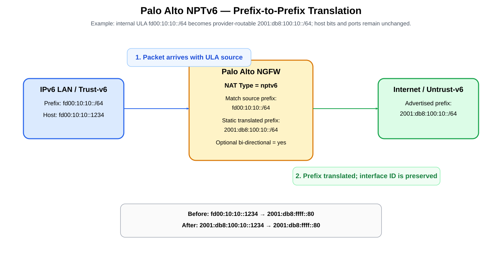
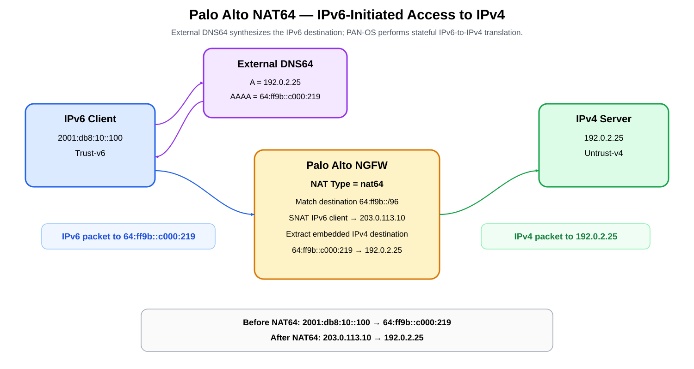

# Palo Alto Networks NPTv6 and NAT64 — Set-CLI Configuration Deep Dive

## COPY/PASTE — Palo Alto Set Commands

### NPTv6 — complete set block

```cli
configure

set address NPTV6-INSIDE ip-netmask fd00:10:10::/64
set address NPTV6-OUTSIDE ip-netmask 2001:db8:100:10::/64

set rulebase nat rules NPTV6-OUT nat-type nptv6
set rulebase nat rules NPTV6-OUT from Trust-v6
set rulebase nat rules NPTV6-OUT to Untrust-v6
set rulebase nat rules NPTV6-OUT source NPTV6-INSIDE
set rulebase nat rules NPTV6-OUT destination any
set rulebase nat rules NPTV6-OUT service any
set rulebase nat rules NPTV6-OUT source-translation static-ip translated-address NPTV6-OUTSIDE
set rulebase nat rules NPTV6-OUT source-translation static-ip bi-directional yes

set rulebase security rules NPTV6-OUT-ALLOW from Trust-v6
set rulebase security rules NPTV6-OUT-ALLOW to Untrust-v6
set rulebase security rules NPTV6-OUT-ALLOW source NPTV6-INSIDE
set rulebase security rules NPTV6-OUT-ALLOW destination any
set rulebase security rules NPTV6-OUT-ALLOW application any
set rulebase security rules NPTV6-OUT-ALLOW service application-default
set rulebase security rules NPTV6-OUT-ALLOW action allow

commit
```

### NAT64 — complete set block

```cli
configure

set address IPV6-CLIENTS ip-netmask 2001:db8:10::/64
set address NAT64-PREFIX ip-netmask 64:ff9b::/96
set address NAT64-IPV4-SNAT ip-netmask 203.0.113.10/32

set rulebase nat rules NAT64-V6-OUT nat-type nat64
set rulebase nat rules NAT64-V6-OUT from Trust-v6
set rulebase nat rules NAT64-V6-OUT to Untrust-v4
set rulebase nat rules NAT64-V6-OUT source IPV6-CLIENTS
set rulebase nat rules NAT64-V6-OUT destination NAT64-PREFIX
set rulebase nat rules NAT64-V6-OUT service any
set rulebase nat rules NAT64-V6-OUT source-translation dynamic-ip-and-port translated-address NAT64-IPV4-SNAT

set rulebase security rules NAT64-V6-OUT-ALLOW from Trust-v6
set rulebase security rules NAT64-V6-OUT-ALLOW to Untrust-v4
set rulebase security rules NAT64-V6-OUT-ALLOW source IPV6-CLIENTS
set rulebase security rules NAT64-V6-OUT-ALLOW destination NAT64-PREFIX
set rulebase security rules NAT64-V6-OUT-ALLOW application any
set rulebase security rules NAT64-V6-OUT-ALLOW service application-default
set rulebase security rules NAT64-V6-OUT-ALLOW action allow

commit
```

> **PAN-OS version note:** These are PAN-OS 11.2-style local firewall CLI commands. Validate the exact hierarchy on your target release before pasting, especially PAN-OS 12.1 and later.

---

## Scope and version note

This guide provides **PAN-OS 11.2-style local firewall `set` commands** for NPTv6 and NAT64. Palo Alto's PAN-OS 11.2 CLI hierarchy explicitly includes:

```cli
set rulebase nat rules <name> nat-type <ipv4|nat64|nptv6>
```

Palo Alto's PAN-OS 12.1 documentation lists the direct `set rulebase nat ...` command family among commands removed in 12.1. Therefore, do **not** assume these exact local-firewall commands apply unchanged to PAN-OS 12.1. On any target firewall, validate the hierarchy interactively and/or display the committed configuration in set format:

```cli
> set cli config-output-format set
> configure
# show rulebase nat
```

## Sources

- NPTv6 overview: https://docs.paloaltonetworks.com/ngfw/networking/nptv6
- Create NPTv6 policy: https://docs.paloaltonetworks.com/ngfw/networking/nptv6/create-an-nptv6-policy
- NAT64 overview: https://docs.paloaltonetworks.com/ngfw/networking/nat64
- IPv6-initiated NAT64: https://docs.paloaltonetworks.com/ngfw/networking/nat64/configure-nat64-for-ipv6-initiated-communication
- IPv4-initiated NAT64: https://docs.paloaltonetworks.com/ngfw/networking/nat64/configure-nat64-for-ipv4-initiated-communication
- PAN-OS 11.2 configure CLI hierarchy: https://docs.paloaltonetworks.com/ngfw/pan-os-cli-quick-start/cli-command-hierarchy/pan-os-11-2-configure-cli-command-hierarchy
- PAN-OS 12.1 removed set commands: https://docs.paloaltonetworks.com/ngfw/pan-os-cli-quick-start/cli-changes/deleted-set-commands-12-1
- NAT policy processing: https://docs.paloaltonetworks.com/ngfw/networking/nat/nat-policy-rules

## Table of Contents

1. [NPTv6 versus NAT64](#1-nptv6-versus-nat64)
2. [NPTv6 example topology](#2-nptv6-example-topology)
3. [NPTv6 complete set configuration](#3-nptv6-complete-set-configuration)
4. [NPTv6 packet transformation](#4-nptv6-packet-transformation)
5. [NAT64 example topology](#5-nat64-example-topology)
6. [NAT64 complete set configuration](#6-nat64-complete-set-configuration)
7. [NAT64 packet transformation](#7-nat64-packet-transformation)
8. [Security-policy behavior](#8-security-policy-behavior)
9. [Verification](#9-verification)
10. [Common mistakes](#10-common-mistakes)

---

## 1. NPTv6 versus NAT64

| Feature | NPTv6 | NAT64 |
|---|---|---|
| Address families | IPv6 → IPv6 | IPv6 ↔ IPv4 |
| Main function | Translate one IPv6 prefix to another | Translate between IPv6 and IPv4 |
| Stateful? | Stateless prefix translation | Stateful for IPv6-initiated communication |
| Ports changed? | No | Can use source NAT/DIPP semantics |
| DNS64 needed? | No | Usually yes for IPv6-only clients using DNS to reach IPv4-only names |
| Example | ULA → provider GUA | 64:ff9b::c000:219 → 192.0.2.25 |

Palo Alto describes NPTv6 as **stateless, static IPv6 prefix translation**; host/interface bits are preserved and port numbers are not changed.

---

## 2. NPTv6 example topology

Example addressing:

```text
Trust-v6 internal prefix:     fd00:10:10::/64
Translated external prefix:   2001:db8:100:10::/64
Internal host:                fd00:10:10::1234
External identity:            2001:db8:100:10::1234
```



[Editable draw.io](images/09-13-26-10-35_palo_alto_nptv6_configuration.drawio)

**What this image shows:** an internal ULA source prefix being translated to a provider-routable GUA prefix.

**What matters:** NPTv6 changes the network prefix while preserving the host portion. It does not translate IPv6 to IPv4.

**What to verify:** the translated prefix must be routed back toward the firewall, and security policy must explicitly allow the traffic because NPTv6 itself is not a security policy.

---

## 3. NPTv6 complete set configuration

### 3.1 Address objects

```cli
configure

set address NPTV6-INSIDE ip-netmask fd00:10:10::/64
set address NPTV6-OUTSIDE ip-netmask 2001:db8:100:10::/64
```

### 3.2 NAT rule

```cli
set rulebase nat rules NPTV6-OUT nat-type nptv6
set rulebase nat rules NPTV6-OUT from Trust-v6
set rulebase nat rules NPTV6-OUT to Untrust-v6
set rulebase nat rules NPTV6-OUT source NPTV6-INSIDE
set rulebase nat rules NPTV6-OUT destination any
set rulebase nat rules NPTV6-OUT service any
set rulebase nat rules NPTV6-OUT source-translation static-ip translated-address NPTV6-OUTSIDE
set rulebase nat rules NPTV6-OUT source-translation static-ip bi-directional yes
```

The important line is:

```cli
set rulebase nat rules NPTV6-OUT nat-type nptv6
```

The source match is the **original internal IPv6 prefix**, while the source translation is the **external IPv6 prefix**.

Palo Alto requires NPTv6 prefixes to be IPv6 network prefixes rather than host addresses; documented prefix lengths are **/32 through /112**. Source and destination cannot both be `any`.

### 3.3 Outbound security policy

```cli
set rulebase security rules NPTV6-OUT-ALLOW from Trust-v6
set rulebase security rules NPTV6-OUT-ALLOW to Untrust-v6
set rulebase security rules NPTV6-OUT-ALLOW source NPTV6-INSIDE
set rulebase security rules NPTV6-OUT-ALLOW destination any
set rulebase security rules NPTV6-OUT-ALLOW application any
set rulebase security rules NPTV6-OUT-ALLOW service application-default
set rulebase security rules NPTV6-OUT-ALLOW action allow
```

### 3.4 Optional inbound security policy for bi-directional NPTv6

Bi-directional translation creates the reverse translation capability; it does **not** automatically allow inbound sessions.

```cli
set rulebase security rules NPTV6-IN-ALLOW from Untrust-v6
set rulebase security rules NPTV6-IN-ALLOW to Trust-v6
set rulebase security rules NPTV6-IN-ALLOW source any
set rulebase security rules NPTV6-IN-ALLOW destination NPTV6-OUTSIDE
set rulebase security rules NPTV6-IN-ALLOW application any
set rulebase security rules NPTV6-IN-ALLOW service application-default
set rulebase security rules NPTV6-IN-ALLOW action allow
```

Restrict source, application, and service in production.

### 3.5 Commit

```cli
commit
```

---

## 4. NPTv6 packet transformation

Outbound example:

```text
Before NPTv6
SRC = fd00:10:10::1234
DST = 2001:db8:ffff::80

After NPTv6
SRC = 2001:db8:100:10::1234
DST = 2001:db8:ffff::80
```

The host/interface identifier `::1234` is preserved.

The reverse flow, with bi-directional translation enabled, maps:

```text
DST 2001:db8:100:10::1234
        ↓
DST fd00:10:10::1234
```

---

## 5. NAT64 example topology

Example:

```text
IPv6 client:              2001:db8:10::100
DNS64/NAT64 prefix:       64:ff9b::/96
IPv4-only server:         192.0.2.25
Synthesized AAAA:         64:ff9b::c000:219
IPv4 SNAT pool/address:   203.0.113.10
```



[Editable draw.io](images/09-13-26-10-35_palo_alto_nat64_configuration.drawio)

**What this image shows:** external DNS64 creates the IPv4-embedded IPv6 destination; the Palo Alto firewall then performs the stateful translation.

**What matters:** PAN-OS does not provide the DNS64 synthesis step in this design. DNS64 must produce a destination using the same prefix that the NAT64 policy matches.

**What to verify:** the synthesized AAAA address, NAT64 destination prefix, IPv4 source translation address, and IPv4 routing must all agree.

---

## 6. NAT64 complete set configuration

### 6.1 Address objects

```cli
configure

set address IPV6-CLIENTS ip-netmask 2001:db8:10::/64
set address NAT64-PREFIX ip-netmask 64:ff9b::/96
set address NAT64-IPV4-SNAT ip-netmask 203.0.113.10/32
```

### 6.2 NAT64 policy

For IPv6-initiated communication, Palo Alto documents NAT Type **nat64** and source translation using Dynamic IP and Port (DIPP). Destination Translation is left unselected; PAN-OS extracts the embedded IPv4 destination from the NAT64 IPv6 address.

```cli
set rulebase nat rules NAT64-V6-OUT nat-type nat64
set rulebase nat rules NAT64-V6-OUT from Trust-v6
set rulebase nat rules NAT64-V6-OUT to Untrust-v4
set rulebase nat rules NAT64-V6-OUT source IPV6-CLIENTS
set rulebase nat rules NAT64-V6-OUT destination NAT64-PREFIX
set rulebase nat rules NAT64-V6-OUT service any
set rulebase nat rules NAT64-V6-OUT source-translation dynamic-ip-and-port translated-address NAT64-IPV4-SNAT
```

There is intentionally **no**:

```cli
set rulebase nat rules NAT64-V6-OUT destination-translation ...
```

for this IPv6-initiated example.

PAN-OS derives the IPv4 destination from the IPv4-embedded IPv6 destination.

### 6.3 Security policy

Palo Alto security policy uses the **post-NAT destination zone** but the **original/pre-NAT IP addresses**.

Therefore:

```cli
set rulebase security rules NAT64-V6-OUT-ALLOW from Trust-v6
set rulebase security rules NAT64-V6-OUT-ALLOW to Untrust-v4
set rulebase security rules NAT64-V6-OUT-ALLOW source IPV6-CLIENTS
set rulebase security rules NAT64-V6-OUT-ALLOW destination NAT64-PREFIX
set rulebase security rules NAT64-V6-OUT-ALLOW application any
set rulebase security rules NAT64-V6-OUT-ALLOW service application-default
set rulebase security rules NAT64-V6-OUT-ALLOW action allow
```

### 6.4 Commit

```cli
commit
```

---

## 7. NAT64 packet transformation

DNS64 sees:

```text
A = 192.0.2.25
```

and synthesizes:

```text
AAAA = 64:ff9b::c000:219
```

The IPv6 client sends:

```text
SRC = 2001:db8:10::100
DST = 64:ff9b::c000:219
```

PAN-OS NAT64 translates this to an IPv4 flow:

```text
SRC = 203.0.113.10
DST = 192.0.2.25
```

The firewall maintains state so the return IPv4 flow is mapped back to the original IPv6 session.

---

## 8. Security-policy behavior

This is one of the most important Palo Alto NAT concepts.

For security policy:

- **Source/destination address:** match the **original pre-NAT address**.
- **Destination zone:** use the **post-NAT destination zone**.

For the NAT64 example:

```text
Original destination address:
64:ff9b::c000:219

Post-NAT destination:
192.0.2.25

Security-policy destination address:
NAT64-PREFIX / original IPv6 address

Security-policy destination zone:
Untrust-v4
```

This behavior is directly documented by Palo Alto and is a frequent source of configuration mistakes.

---

## 9. Verification

### 9.1 Display the NAT rules

```cli
> set cli config-output-format set
> configure
# show rulebase nat
```

Use this to confirm the firewall actually stores the desired `nat-type`, zones, match criteria, and translation.

### 9.2 Verify session translation

Palo Alto documents session inspection as a primary NAT verification method:

```cli
> show session all filter source 2001:db8:10::100
```

Then inspect a specific session:

```cli
> show session id <session-id>
```

For NAT64, verify that the session contains both the IPv6 original flow and corresponding IPv4 translated addresses.

### 9.3 NPTv6 checks

Verify:

```text
Original prefix:   fd00:10:10::/64
Translated prefix: 2001:db8:100:10::/64
Host bits:         preserved
Ports:             unchanged
Return route:      translated prefix points back to the firewall
```

### 9.4 NAT64 checks

Verify:

```text
DNS64 AAAA:        inside 64:ff9b::/96
NAT rule type:     nat64
IPv6 client route: reaches firewall
IPv4 destination: routable from firewall
IPv4 SNAT:         203.0.113.10
Return traffic:    routes back to firewall
```

---

## 10. Common mistakes

| Mistake | Why it fails |
|---|---|
| Using NPTv6 to reach IPv4 servers | NPTv6 is IPv6-to-IPv6 only. |
| Expecting NPTv6 to provide security | Palo Alto explicitly requires Security policy; NPTv6 is translation, not authorization. |
| Using a host address instead of an IPv6 prefix in NPTv6 | NPTv6 requires network prefixes and supports documented prefix lengths /32 through /112. |
| Expecting PAN-OS NAT64 to perform DNS64 | IPv6-initiated DNS-based NAT64 needs an external DNS64 solution. |
| Adding DNAT to the IPv6-initiated NAT64 rule | PAN-OS derives the IPv4 destination from the embedded IPv4 address; Palo Alto's documented workflow leaves Destination Address Translation unselected. |
| Matching post-NAT IP addresses in Security policy | Palo Alto security rules match original IP addresses but use the post-NAT destination zone. |
| Assuming PAN-OS 11.2 set syntax is identical in 12.1 | Palo Alto lists the direct rulebase set commands as removed in 12.1. Validate the target version before pasting configuration. |
