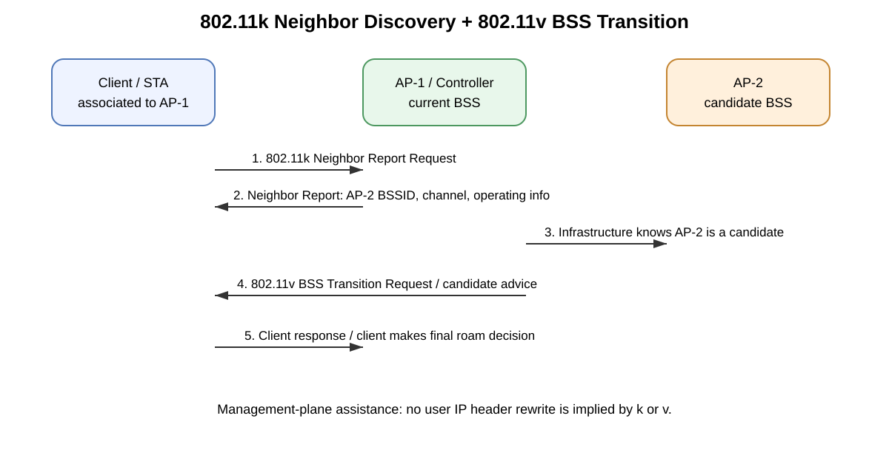
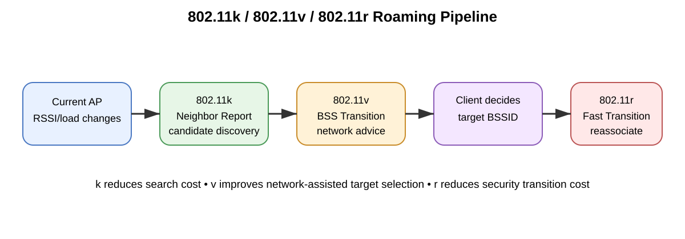
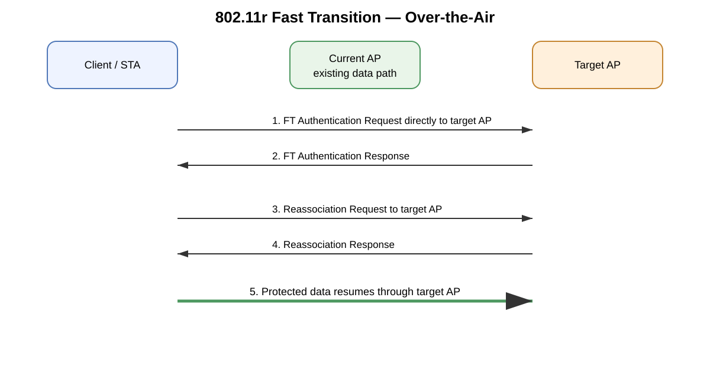
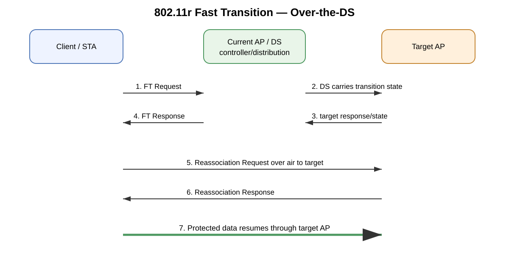

# IEEE 802.11k, 802.11v, and 802.11r — Wi-Fi Roaming Deep Dive

## Purpose

This guide explains how **IEEE 802.11k**, **802.11v**, and **802.11r** work individually and together to improve Wi-Fi roaming. The goal is to understand not only the shorthand — k = neighbors, v = transition guidance, r = fast transition — but the actual management exchanges, client/AP responsibilities, security/keying behavior, configuration dependencies, packet flow, verification, and troubleshooting.

> **Core mental model**
>
> - **802.11k** helps a station learn **where it could roam**.
> - **802.11v** lets the network suggest **where it may be better to roam**.
> - **802.11r** reduces the authentication/keying work required **when it actually roams**.
>
> In normal enterprise Wi-Fi operation, the **client still owns the final roaming decision**.

---

## Source URLs

Primary references:

- Cisco Catalyst 9800 — 802.11r Fast BSS Transition  
  https://www.cisco.com/c/en/us/td/docs/wireless/controller/9800/26-1/configuration-guide/wl-26-1-cg/fast_transition_80211r.html
- Cisco Catalyst 9800 — 802.11v  
  https://www.cisco.com/c/en/us/td/docs/wireless/controller/9800/26-1/configuration-guide/wl-26-1-cg/802-11v.html
- Cisco Catalyst 9800 Configuration Best Practices  
  https://www.cisco.com/c/en/us/td/docs/wireless/controller/9800/technical-reference/c9800-best-practices.html
- Cisco 802.11r, 802.11k, and 802.11w Deployment Guide  
  https://www.cisco.com/c/en/us/td/docs/wireless/controller/technotes/5700/software/release/ios_xe_33/11rkw_DeploymentGuide/b_802point11rkw_deployment_guide_cisco_ios_xe_release33.pdf
- Apple Platform Deployment — Wi-Fi roaming support  
  https://support.apple.com/guide/deployment/wi-fi-roaming-support-dep98f116c0f/1/web/1.0
- Apple Platform Deployment — Cisco network enhancements / Adaptive 802.11r  
  https://support.apple.com/guide/deployment/cisco-network-enhancements-dep271900868/web

### Information classification

- **Source information** — behavior directly documented by Cisco or Apple.
- **Additional explanation** — protocol explanation connecting documented behavior into a practical engineering model.
- **Reasonable inference** — an operational conclusion that follows from the behavior but is not claimed as a vendor-specific implementation guarantee.

---

# Table of Contents

1. [Roaming fundamentals](#1-roaming-fundamentals)
2. [Quick comparison](#2-quick-comparison)
3. [802.11k — Radio Resource Measurement and Neighbor Reports](#3-80211k--radio-resource-measurement-and-neighbor-reports)
4. [802.11v — BSS Transition Management](#4-80211v--bss-transition-management)
5. [802.11r — Fast BSS Transition](#5-80211r--fast-bss-transition)
6. [How k, v, and r work together](#6-how-k-v-and-r-work-together)
7. [802.11r security and key hierarchy](#7-80211r-security-and-key-hierarchy)
8. [FT Over-the-Air versus Over-the-DS](#8-ft-over-the-air-versus-over-the-ds)
9. [Enterprise 802.1X roaming](#9-enterprise-8021x-roaming)
10. [PSK, SAE, PMKID caching, and Adaptive 802.11r](#10-psk-sae-pmkid-caching-and-adaptive-80211r)
11. [Cisco Catalyst 9800 configuration](#11-cisco-catalyst-9800-configuration)
12. [Detailed frame and packet walks](#12-detailed-frame-and-packet-walks)
13. [Verification](#13-verification)
14. [Troubleshooting by symptom](#14-troubleshooting-by-symptom)
15. [Common mistakes](#15-common-mistakes)
16. [Design guidance](#16-design-guidance)
17. [Exam and interview memory map](#17-exam-and-interview-memory-map)
18. [Sources](#18-sources)

---

# 1. Roaming fundamentals

A Wi-Fi client associates to a **Basic Service Set (BSS)** represented by the AP radio's **BSSID**. In an enterprise WLAN, many APs commonly advertise the same SSID as part of one Extended Service Set, allowing a station to move from one BSSID to another without changing the logical WLAN name.

A roam normally contains several separate operations:

1. The client decides its current AP is no longer preferable.
2. The client discovers alternative BSSIDs.
3. It measures/evaluates candidates.
4. It selects a target BSSID.
5. It performs the necessary authentication and key transition.
6. It reassociates to the target AP.
7. Controller/distribution-system state and forwarding move to the new AP.
8. User traffic resumes.

**Source information:** Apple explicitly states that the Wi-Fi device is responsible for deciding when to roam and that signal strength and candidate availability are among the inputs.

**Additional explanation:** This is why enabling k/v/r does not make every client roam at the same RSSI. Different client operating systems, Wi-Fi chipsets, drivers, applications, battery states, and roaming algorithms can make different decisions on the same WLAN.

## Why roaming can be slow

Roam interruption can come from multiple places:

- scanning many channels;
- active probe exchanges;
- passive scan dwell;
- target evaluation;
- full 802.1X/EAP authentication;
- RADIUS round trips;
- key generation/installation;
- reassociation;
- controller mobility signaling;
- upstream MAC/ARP/ND movement;
- VLAN/subnet changes;
- DHCP if Layer-3 continuity is not preserved.

802.11k/v/r address different portions of this process.

---

# 2. Quick comparison

| Standard | Main feature | Primary job | Representative signaling | Does it choose the roam? |
|---|---|---|---|---|
| **802.11k** | Radio Resource Measurement / Neighbor Report | Reduce discovery and scanning work | Neighbor Report Request / Response | No |
| **802.11v** | Wireless Network Management / BSS Transition Management | Network-assisted roaming guidance | BTM Query / Request / Response | No, normally advisory |
| **802.11r** | Fast BSS Transition (FT) | Reduce authentication/keying delay during roam | FT Authentication or FT Action + Reassociation | No; it accelerates execution |

Memory aid:

- **K = Know** nearby APs.
- **V = Visit** a recommended AP.
- **R = Roam Rapidly**.

---

# 3. 802.11k — Radio Resource Measurement and Neighbor Reports

## 3.1 What problem 802.11k solves

A station searching for a better AP can spend time scanning every possible channel. In 2.4 GHz that may be manageable, but in 5 GHz and especially in multi-band designs, indiscriminate scanning can become expensive in airtime, time, and battery.

**Source information:** Cisco documents 802.11k assisted roaming as a mechanism where a capable client requests a neighbor report containing nearby APs that are potential roaming candidates. Cisco's deployment guide states that the returned list can include BSSID, channel, and operating information.

### Basic sequence

1. AP advertises Radio Resource Management capability.
2. Client sends an **802.11k Neighbor Report Request**.
3. AP/controller returns an **802.11k Neighbor Report Response**.
4. Client now has a prioritized set of BSSIDs/channels to investigate.
5. Client performs focused scanning/evaluation.
6. Client decides whether to remain or roam.

## 3.2 What the report does not do

A neighbor report is not a command. It does not mean:

> “Roam to AP-2 now.”

It means more like:

> “These BSSIDs/channels are known candidates worth checking.”

A client can ignore the list, scan elsewhere, reject candidates, or remain associated.

## 3.3 Typical neighbor information

Useful entries can identify:

- target BSSID;
- operating class;
- channel;
- PHY/operating information;
- attributes that help candidate evaluation.

The exact fields and how aggressively a client uses them depend on implementation.

## 3.4 Why it can make a real difference

Without 802.11k:

~~~text
Client decides current AP is weak
  -> scan many possible channels
  -> discover APs
  -> evaluate
  -> roam
~~~

With 802.11k:

~~~text
Client decides current AP is weak
  -> use Neighbor Report
  -> prioritize likely channels
  -> evaluate candidates
  -> roam
~~~

**Additional explanation:** 802.11k reduces the search domain. It does not eliminate the client's need to verify that the candidate is actually usable.

## 3.5 2.4, 5, and 6 GHz

Apple documents that supported devices can use neighbor information to prioritize roaming scans and separately describes 6-GHz discovery mechanisms such as Reduced Neighbor Report information elements.

Do not confuse every “neighbor report” mechanism in modern Wi-Fi with 802.11k. They can be related to discovery, but they are not all the same protocol function.

---

# 4. 802.11v — BSS Transition Management

802.11v is broader than roaming. It contains multiple Wireless Network Management enhancements. For roaming, the key feature is **BSS Transition Management (BTM)**.

Cisco documents three important BTM use cases:

1. **Solicited** — the client sends a BSS Transition Management Query asking the infrastructure for better AP options.
2. **Unsolicited load balancing** — the AP/network sends a BTM Request because the current AP is heavily loaded.
3. **Unsolicited optimized roaming** — the AP/network sends a BTM Request because client RSSI/rate no longer meets configured conditions.

## 4.1 Advisory behavior

Cisco explicitly documents the BSS Transition Management Request as a suggestion/advice that the client can follow or ignore.

This is one of the most important operational facts about 802.11v:

> **The network can recommend. The client normally decides.**

Some implementations can add **Disassociation Imminent**, making the message much stronger because the current association is expected to end after a defined interval.

That is different from ordinary advisory BTM.

## 4.2 Why v is useful when k already exists

802.11k:

> “Here are nearby candidate APs.”

802.11v:

> “Given what the network knows, these candidates may be preferable.”

The infrastructure may know information the station cannot infer from RSSI alone, for example:

- AP load;
- radio utilization;
- steering policy;
- rate/RSSI thresholds;
- maintenance state;
- network optimization policy.

## 4.3 Other 802.11v functions

Cisco's current 802.11v documentation also discusses:

- **BSS Max Idle Service**
- **Directed Multicast Service (DMS)**
- power-management related behavior.

Those are part of 802.11v, but they should not be confused with BTM itself.

## 4.4 802.11k + 802.11v signaling

[Editable draw.io source](images/09-16-26-18-03_80211k_80211v_management_exchange.drawio)

**What this image shows:** The station first receives neighbor information through 802.11k and can later receive an 802.11v BTM recommendation identifying a preferred target.

**What matters:** 802.11k improves knowledge; 802.11v improves guidance. Neither completes the FT security transition.

**What to verify:** Confirm both client and WLAN support the features, capture Neighbor Report and BTM action frames, and verify candidate BSSIDs/channels are real and reachable.

---

# 5. 802.11r — Fast BSS Transition

802.11r introduces **Fast BSS Transition (FT)** to reduce the security overhead of changing APs inside an FT mobility domain.

**Source information:** Cisco documents that 802.11r allows the client/AP to prepare the cryptographic transition so the client can move between APs without performing complete reauthentication at every AP.

## 5.1 The enterprise authentication problem

Without a fast-roaming mechanism, an enterprise roam may require another authentication transaction involving:

~~~text
Client
  |
  | 802.1X / EAP
  v
AP / Controller
  |
  | RADIUS
  v
AAA / Identity server
~~~

That may be too disruptive for voice, video, or other real-time traffic.

802.11r introduces an FT key hierarchy so security context can be derived for target APs rather than starting the entire original authentication process again.

## 5.2 What 802.11r does not do

It does not inherently decide:

- when signal quality is bad enough to roam;
- what channels to scan;
- which AP has the best RF;
- whether to obey 802.11v;
- whether the user application's upstream IP path is ready.

802.11r is primarily about the **security transition**.

---

# 6. How k, v, and r work together

[Editable draw.io source](images/09-16-26-18-03_80211k_80211v_80211r_roaming_pipeline.drawio)

**What this image shows:** A complete assisted-roaming pipeline: current AP condition changes, 802.11k provides candidates, 802.11v can recommend a target, the client decides, and 802.11r accelerates the transition.

**What matters:** The three amendments solve different latency/decision problems. They are complementary rather than redundant.

**What to verify:** When troubleshooting, identify which stage is slow. A delayed scan is not automatically an 802.11r failure, and an FT failure is not automatically an RF-neighbor problem.

A simplified end-to-end sequence:

~~~text
Current AP quality/load becomes undesirable
        |
        v
802.11k: candidate/channel knowledge
        |
        v
802.11v: candidate recommendation
        |
        v
CLIENT DECIDES
        |
        v
802.11r: FT security transition
        |
        v
Reassociation to target BSSID
        |
        v
Controller/forwarding state follows client
        |
        v
Data resumes
~~~

---

# 7. 802.11r security and key hierarchy

A practical FT mental model uses these terms:

- **PMK** — Pairwise Master Key from the original security/authentication process.
- **PMK-R0** — FT key material rooted at the R0 Key Holder level.
- **PMK-R1** — derived key material used for an R1/target context.
- **PTK** — Pairwise Transient Key protecting the station/AP data relationship.
- **R0KH** — R0 Key Holder.
- **R1KH** — R1 Key Holder.
- **MDID** — Mobility Domain Identifier.

## 7.1 Why the hierarchy exists

The goal is to avoid this for every roam:

~~~text
new AP
 -> full EAP exchange
 -> AAA/RADIUS transaction
 -> regenerate complete master context
 -> four-way/key establishment
 -> traffic
~~~

Instead, FT uses already-established authenticated context and derives target-specific key material for the roam.

## 7.2 Mobility Domain

FT-capable BSSs participating in the same mobility domain advertise a **Mobility Domain IE** containing the mobility-domain identity.

If APs that should support FT do not share compatible mobility-domain/security configuration, FT can fail even though both APs individually support 802.11r.

## 7.3 Relevant information elements

802.11r exchanges can involve:

- RSN Information Element;
- Mobility Domain IE (MDIE);
- Fast BSS Transition IE (FTIE);
- nonces;
- R0KH/R1KH identifiers;
- integrity fields used to protect the transition exchange.

---

# 8. FT Over-the-Air versus Over-the-DS

Cisco documents two FT exchange methods.

## 8.1 FT Over-the-Air

The station communicates **directly with the target AP** using the FT authentication algorithm, then reassociates.

[Editable draw.io source](images/09-16-26-18-03_80211r_ft_over_the_air.drawio)

**What this image shows:** FT Authentication Request/Response occurs directly between station and target AP, followed by Reassociation Request/Response.

**What matters:** “Over-the-Air” describes how the station reaches the target for the FT exchange. It does not imply that the controller/distribution system has no role in key/state coordination.

**What to verify:** In an OTA capture, look for FT Authentication frames directed to the target BSSID before reassociation.

Simplified:

~~~text
STA                  Current AP                 Target AP
 |                       |                         |
 |==== existing data ===>|                         |
 |                                                 |
 |----- FT Authentication Request --------------->|
 |<---- FT Authentication Response ---------------|
 |                                                 |
 |----- Reassociation Request ------------------->|
 |<---- Reassociation Response -------------------|
 |                                                 |
 |============= protected data ==================>|
~~~

## 8.2 FT Over-the-DS

The station performs the FT preparation exchange through the **current AP/distribution system**. The target state is coordinated through the DS; the station then reassociates to the target AP.

[Editable draw.io source](images/09-16-26-18-03_80211r_ft_over_the_ds.drawio)

**What this image shows:** The client sends FT request/response signaling through the current AP/DS, then performs reassociation over the air with the target AP.

**What matters:** The final move is still a radio reassociation to the target. “Over-the-DS” describes the FT preparation path.

**What to verify:** Capture FT action traffic through the current AP followed by a Reassociation Request to the target BSSID.

---

# 9. Enterprise 802.1X roaming

## 9.1 Initial authentication

The first association can still require full authentication:

~~~text
Client
 -> AP
 -> Controller
 -> AAA / RADIUS
 -> EAP authentication
 -> PMK established
 -> link keys installed
 -> user traffic
~~~

802.11r does not eliminate the need to authenticate the station initially.

## 9.2 Later FT roam

A subsequent roam inside the FT mobility domain can look conceptually like:

~~~text
Client has authenticated FT context
 -> choose target AP
 -> FT key derivation/exchange
 -> reassociation
 -> target link key active
 -> data resumes
~~~

The value is that the client does not necessarily have to run a complete new EAP/RADIUS transaction for every BSS change.

## 9.3 Layer-2 versus Layer-3 mobility

802.11r is a Wi-Fi fast-transition mechanism. It does not automatically solve arbitrary Layer-3 mobility.

If roaming causes a change in:

- VLAN;
- subnet;
- gateway;
- policy anchor;
- controller anchor;
- tunnel endpoint;

then IP continuity and forwarding can become a separate problem even if the FT radio transition itself succeeds.

---

# 10. PSK, SAE, PMKID caching, and Adaptive 802.11r

## 10.1 FT with PSK

802.11r supports FT operation with compatible pre-shared-key WLAN configurations. The WLAN and client must negotiate the FT-capable AKM.

## 10.2 FT with 802.1X

In enterprise authentication, FT's benefit is most obvious because it avoids repeating the expensive original authentication sequence for every roam.

## 10.3 FT-SAE

Current Catalyst 9800 documentation includes **Fast Transition for SAE-authenticated clients**, relevant to WPA3-Personal.

Always verify:

- controller release;
- AP model;
- WLAN security mode;
- client OS/driver;
- PMF requirements;
- documented caveats.

## 10.4 PMKID caching is different

Apple documents PMKID caching as another roaming optimization.

Conceptually:

- **PMKID caching** helps a client reuse prior master-key context when returning to a previously known BSS/security relationship.
- **802.11r** defines a mobility-domain FT protocol and key hierarchy for moving between BSSs.

They are not synonymous.

## 10.5 Adaptive 802.11r

Apple documents **Cisco Adaptive 802.11r**. Supported Apple clients and Cisco infrastructure can mutually signal FT support while legacy clients that do not support FT can still join using non-FT authentication.

This helps address a real deployment challenge: some older or embedded clients behave badly when an SSID advertises mandatory FT behavior.

---

# 11. Cisco Catalyst 9800 configuration

> Use these examples as structure, not as a substitute for checking the configuration guide for the exact IOS XE train in production.

## 11.1 802.11k assisted roaming

Cisco WLAN configuration exposes assisted-roaming support such as:

~~~cli
wlan <profile-name> <wlan-id> <ssid>
 assisted-roaming neighbor-list
~~~

Some software trains/configurations also expose dual-list behavior.

**Purpose:** Make 802.11k neighbor-list assistance available on the WLAN.

### Verify

- WLAN advertises RRM capability;
- client supports 802.11k;
- Neighbor Report Request appears;
- Neighbor Report Response contains useful target BSSIDs/channels.

## 11.2 802.11v

Cisco Catalyst 9800 documentation shows WLAN configuration using:

~~~cli
configure terminal
wlan <profile-name>
 shutdown
 bss-transition
 no shutdown
end
~~~

A stronger related behavior is:

~~~cli
bss-transition disassociation-imminent
~~~

GUI path:

**Configuration > Tags & Profiles > WLANs > Edit WLAN > Advanced > 11v BSS Transition Support**

### What the important fields mean

- **BSS Transition** — enables 802.11v BTM capability on the WLAN.
- **Disassociation Imminent** — tells a capable client that its current association is expected to end; test carefully.
- **BSS Max Idle** — helps client/AP manage long idle associations.
- **Directed Multicast Service** — allows compatible clients/APs to optimize multicast delivery.

## 11.3 802.11r

FT configuration on Catalyst 9800 depends on the WLAN's AKM/security method and can include:

- FT-802.1X;
- FT-PSK;
- supported FT-SAE behavior;
- Mobility Domain configuration;
- Over-the-Air / Over-the-DS behavior.

Do not copy old AireOS CLI blindly into IOS XE. Cisco's older deployment guide is excellent for packet-flow concepts, but configuration syntax and restrictions can differ significantly by release.

## 11.4 Change planning

Security/AKM changes can disconnect clients or require the WLAN to be disabled and re-enabled. Test on a lab SSID before changing a production enterprise WLAN.

---

# 12. Detailed frame and packet walks

## 12.1 802.11k-assisted discovery

Example topology:

- Client MAC: AA:AA:AA:AA:AA:AA
- Current BSSID: 10:10:10:10:10:10
- Current channel: 36
- Candidate BSSID: 20:20:20:20:20:20
- Candidate channel: 44
- SSID: CORP

Sequence:

1. Client is associated to current BSSID.
2. Client sends Neighbor Report Request.
3. AP/controller returns Neighbor Report containing the candidate BSSID/channel.
4. Client prioritizes channel 44 in its scan.
5. Client measures AP-2.
6. Client decides whether the candidate is sufficiently better.
7. If appropriate, it proceeds toward a roam.

No IP NAT or route rewrite is performed merely because 802.11k is used. It is a management-plane optimization.

## 12.2 802.11v-assisted steering

1. Client is associated to AP-1.
2. Infrastructure determines AP-2 may be preferable, or client sends a BTM Query.
3. AP-1 sends BTM Request.
4. Request can carry one or more candidate BSSs and preference information.
5. Client evaluates the information.
6. Client can accept, reject, ignore, or choose another target depending on its implementation.
7. If Disassociation Imminent is set, the client must account for the association ending.

Again, this is management-plane signaling, not user-packet translation.

## 12.3 802.11r FT roam

1. Client is authenticated within the FT mobility domain.
2. Client has identified the target BSSID.
3. FT exchange derives/prepares target key material.
4. Client sends Reassociation Request to target.
5. Target sends Reassociation Response.
6. New PTK/link security becomes active.
7. Controller/distribution system updates forwarding location.
8. Data resumes.

### User IP headers

If the WLAN preserves the same IP subnet and policy anchor, a user packet can remain logically unchanged:

~~~text
Before roam:
Source IP      10.20.30.50
Destination IP 10.20.40.60

After roam:
Source IP      10.20.30.50
Destination IP 10.20.40.60
~~~

The RF attachment/BSSID changed; the IP endpoints did not.

**Reasonable inference:** If the radio FT exchange is fast but application traffic pauses for seconds, investigate wired forwarding, mobility anchoring, VLAN/policy movement, ARP/ND, DHCP, or upstream security state.

---

# 13. Verification

## 13.1 Over-the-air capture

For authoritative troubleshooting, capture the roam on the relevant channels.

Look for:

### 802.11k

- RRM capability advertisement;
- Neighbor Report Request;
- Neighbor Report Response;
- candidate BSSID;
- channel / operating class.

### 802.11v

- BSS Transition Management Query;
- BSS Transition Management Request;
- BSS Transition Management Response;
- candidate list;
- Disassociation Imminent flag if used.

### 802.11r

- FT-capable AKM in RSN information;
- Mobility Domain IE;
- FTIE;
- FT Authentication Request/Response for Over-the-Air;
- FT Action exchange for Over-the-DS;
- Reassociation Request/Response.

## 13.2 Catalyst 9800 WLAN verification

Useful controller command:

~~~cli
show wlan name <wlan-name>
~~~

Inspect the actual output for:

- WLAN state;
- assisted-roaming configuration;
- BSS transition support;
- security/AKM;
- FT settings appropriate to your release.

For a connected client, use the release-appropriate detailed wireless client command, commonly:

~~~cli
show wireless client mac-address <client-mac> detail
~~~

Important things to inspect:

- current AP/BSSID;
- client capabilities;
- WLAN/profile;
- negotiated security/AKM;
- mobility state;
- roam history/reason if exposed;
- policy profile.

Do not rely on invented sample output. Compare the actual device output with Cisco's command reference for your release.

## 13.3 RF verification

A sticky client may have fully functional k/v/r but still refuse to roam because the RF environment does not create a sufficiently attractive target.

Check:

- current and target RSSI;
- SNR;
- retry rate;
- channel utilization;
- co-channel interference;
- AP transmit power;
- client transmit power;
- minimum basic rates;
- cell overlap;
- band preference;
- DFS/channel availability.

---

# 14. Troubleshooting by symptom

## Symptom 1 — Client takes too long to find another AP

**Where:** OTA capture and WLAN configuration.

**Command/tool:** Wireshark + controller WLAN config.

**What it tests:** Whether 802.11k neighbor assistance is working.

**Expected state:** Neighbor Report Request/Response; useful candidate BSSIDs/channels.

**Failure indicators:**

- no RRM capability;
- no request;
- no response;
- target AP absent;
- stale or unusable neighbor list.

**Next action:** Validate client capability, WLAN assisted-roaming configuration, and RF neighbor relationships.

---

## Symptom 2 — Controller suggests AP-2 but client stays on AP-1

**Where:** OTA capture.

**Tool:** Wireshark BTM frames.

**What it tests:** Whether 802.11v request reaches the client and how the client handles it.

**Expected state:** Client receives BTM Request and, where applicable, responds.

**Failure indicators:**

- client lacks 802.11v;
- client rejects the recommendation;
- target signal is not sufficiently better;
- client prefers current BSS.

**Next action:** Check the client's roaming behavior and target RF quality. Do not assume ordinary BTM is a forced move.

---

## Symptom 3 — Client roams but voice drops

**Where:** OTA capture plus AAA/controller logs.

**What it tests:** Whether the client is actually using FT or performing a full fresh authentication.

**Expected state:** FT exchange followed by reassociation without a complete fresh EAP conversation.

**Failure indicators:**

- target advertises incompatible AKM;
- client selected non-FT AKM;
- full EAP/RADIUS exchange restarts;
- Mobility Domain mismatch;
- FT failure followed by reconnect.

**Next action:** Validate client FT support, AKM, MDID, security settings, and controller mobility state.

---

## Symptom 4 — Older IoT clients stop joining after FT is enabled

**Where:** Association/authentication capture.

**What it tests:** Compatibility with FT RSN/AKM advertisement.

**Failure indicators:**

- association fails before DHCP;
- client rejects security advertisement;
- old firmware mishandles FT capability.

**Next action:** Use vendor-supported adaptive/mixed FT behavior when available or separate legacy devices onto a compatible WLAN.

---

## Symptom 5 — FT works between AP-1 and AP-2 but not AP-3

**Where:** Beacon/association capture plus controller mobility configuration.

**What it tests:** Whether all APs advertise compatible FT domain/security information.

**Failure indicators:**

- different WLAN/security profile;
- different MDID;
- cross-controller mobility misconfiguration;
- unsupported Flex/local-auth combination.

**Next action:** Compare RSN/MDIE from the working and failing APs and validate mobility-domain configuration.

---

## Symptom 6 — Fast roam completes but user loses network access

**Where:** Wired data plane.

**Command/tool:** Client detail, switch MAC table, ARP/ND, routes, DHCP logs, controller mobility state.

**What it tests:** Whether forwarding and Layer-3 state followed the station.

**Failure indicators:**

- MAC remains on old path;
- wrong VLAN after roam;
- DHCP starts unexpectedly;
- mobility anchor/tunnel problem;
- policy changes;
- asymmetric routing.

**Next action:** Troubleshoot Layer-2/Layer-3 mobility separately from the RF FT exchange.

---

# 15. Common mistakes

### “802.11v forces a client to roam.”

Normally false. BTM is generally advisory. Disassociation-related features can make the network's intent stronger, but that is not the same as ordinary BTM guidance.

### “802.11r finds the best AP.”

False. 802.11r accelerates the security transition after a target is chosen.

### “802.11k performs the roam.”

False. It supplies radio/neighbor information.

### “k/v/r eliminate sticky clients.”

Not guaranteed. Client roaming logic and RF design remain fundamental.

### “PMK caching and FT are the same.”

False. They are different fast-roaming mechanisms.

### “The controller owns the roam decision.”

Usually false. The station typically makes the final decision.

### “A fast reassociation guarantees application continuity.”

False. Upstream forwarding, QoS, VLAN, DHCP, and mobility state can still cause disruption.

---

# 16. Design guidance

For a modern enterprise WLAN:

- enable 802.11k neighbor assistance when supported;
- enable 802.11v BSS Transition Management when supported;
- enable 802.11r where low-latency roaming matters and client compatibility is proven;
- test mandatory FT behavior against legacy/IoT devices;
- validate WPA2/WPA3/SAE/PMF combinations on exact releases;
- test both Over-the-Air and Over-the-DS behavior only according to vendor design guidance;
- keep consistent WLAN/security/mobility-domain configuration across roaming APs;
- design RF cell overlap intentionally;
- avoid excessive transmit power that encourages sticky clients;
- validate minimum data rates;
- test real-time traffic during motion, not only static association;
- test inter-controller, local/FlexConnect, and branch scenarios if they exist.

Cisco's current Catalyst 9800 best-practices documentation recommends use of 802.11k and 802.11v BSS Transition in supported designs, while more aggressive optimized-roaming behavior should be enabled deliberately rather than assumed universally safe.

---

# 17. Exam and interview memory map

## One-sentence difference

> **802.11k tells the client about neighboring APs, 802.11v lets the network recommend a better BSS, and 802.11r reduces authentication/keying delay when the client transitions to the new AP.**

## Protocol order

~~~text
802.11k
Neighbor Report Request / Response
        |
        v
802.11v
BTM Query / Request / Response
        |
        v
Client selects target
        |
        v
802.11r
FT Authentication or FT Action exchange
        |
        v
Reassociation Request / Response
        |
        v
Data resumes
~~~

## Who decides?

**Normally the client.**

## What is the simplest mnemonic?

> **802.11k finds, 802.11v advises, 802.11r accelerates.**

---

# 18. Sources

## Cisco

1. **Cisco Catalyst 9800 Series Wireless Controller Software Configuration Guide, IOS XE 26.1.x — 802.11r BSS Fast Transition**  
   https://www.cisco.com/c/en/us/td/docs/wireless/controller/9800/26-1/configuration-guide/wl-26-1-cg/fast_transition_80211r.html

2. **Cisco Catalyst 9800 Series Wireless Controller Software Configuration Guide, IOS XE 26.1.x — 802.11v**  
   https://www.cisco.com/c/en/us/td/docs/wireless/controller/9800/26-1/configuration-guide/wl-26-1-cg/802-11v.html

3. **Cisco Catalyst 9800 Series Configuration Best Practices**  
   https://www.cisco.com/c/en/us/td/docs/wireless/controller/9800/technical-reference/c9800-best-practices.html

4. **Cisco 802.11r, 802.11k, and 802.11w Deployment Guide**  
   https://www.cisco.com/c/en/us/td/docs/wireless/controller/technotes/5700/software/release/ios_xe_33/11rkw_DeploymentGuide/b_802point11rkw_deployment_guide_cisco_ios_xe_release33.pdf

   Useful vendor figures in this PDF include the Fast BSS Transition Over-the-Air and Over-the-DS sequences and the 802.11k Assisted Roaming section.

   **Version warning:** This is an older IOS XE 3.3 deployment guide. Its packet-flow concepts remain useful, but do not treat its configuration syntax or product limitations as current Catalyst 9800 defaults.

## Apple

5. **Apple Platform Deployment — Wi-Fi roaming support in Apple devices**  
   https://support.apple.com/guide/deployment/wi-fi-roaming-support-dep98f116c0f/1/web/1.0

6. **Apple Platform Deployment — Cisco network enhancements for Apple devices**  
   https://support.apple.com/guide/deployment/cisco-network-enhancements-dep271900868/web

---

## Final comparison

| Question | 802.11k | 802.11v | 802.11r |
|---|---|---|---|
| Where can I roam? | **Primary role** | Can supplement target information | No |
| Where should I roam? | Candidate input | **Primary network-guidance role** | No |
| How can I roam securely with less delay? | No | No | **Primary role** |
| Main protocol concept | Neighbor Report | BSS Transition Management | Fast BSS Transition |
| Client remains important | Yes | Yes | Yes |
| Main latency reduced | Discovery/scanning | Decision/steering assistance | Authentication/keying |

> **802.11k finds, 802.11v advises, 802.11r accelerates.**
